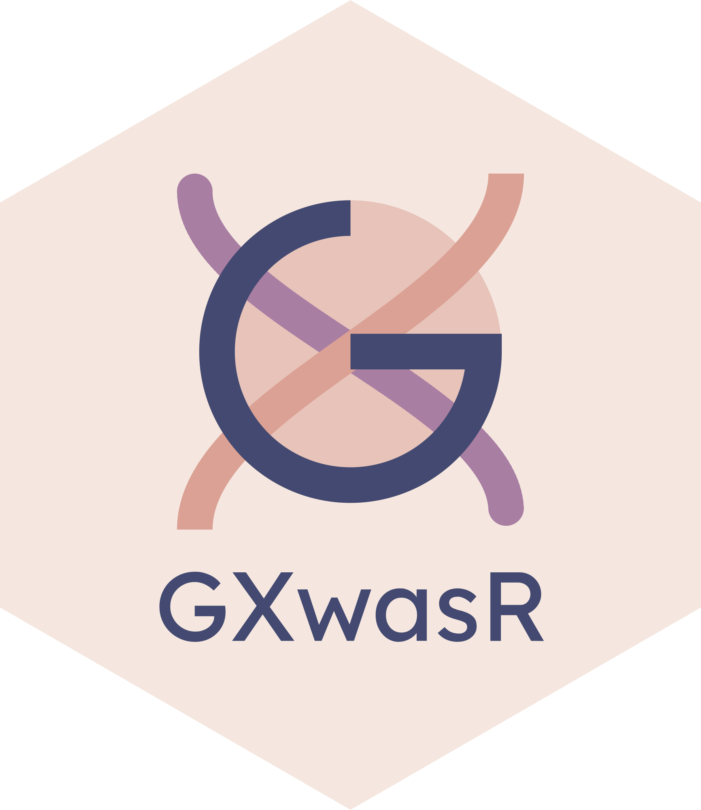
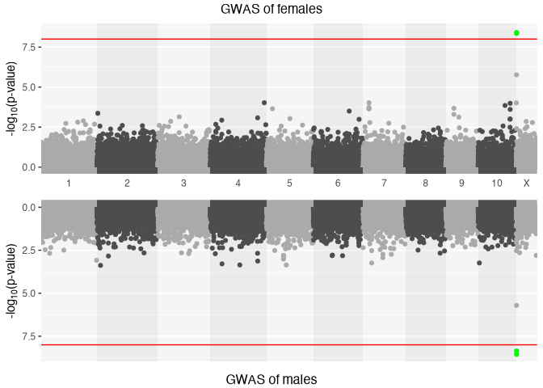
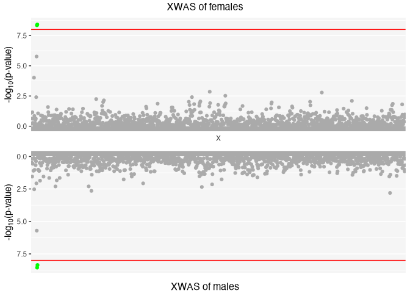
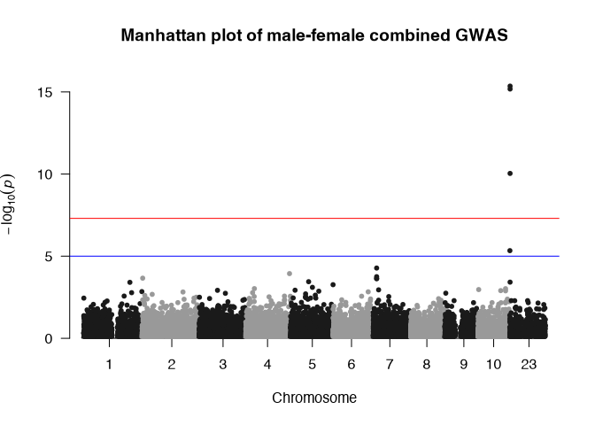
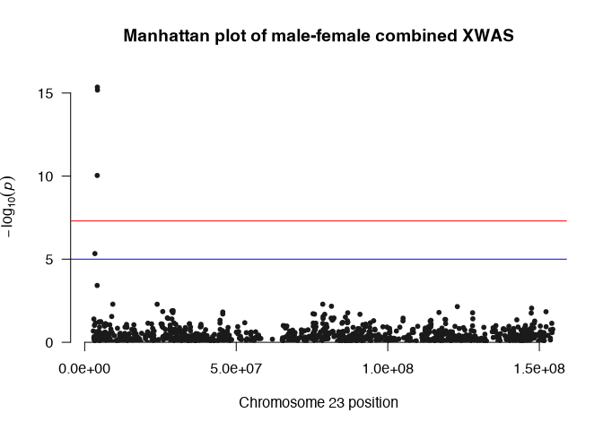
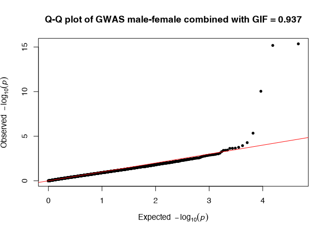
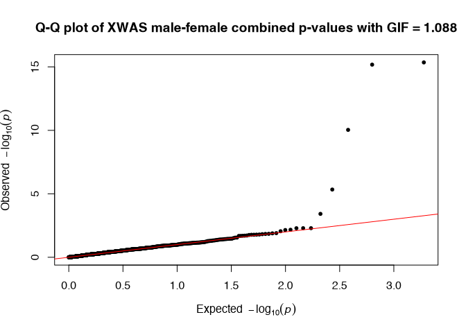

<!-- README.md is generated from README.Rmd. Please edit that file -->

# GXwasR 

A tool for conducting sex-aware quality control, association analysis,
and testing various models of sex-dependent genetic effects in complex
traits.

<!-- badges: start -->

[](https://lifecycle.r-lib.org/articles/stages.html#stable)
<!-- badges: end -->

This package implements various statistical genetics models for
Genome-Wide Association (GWA) and X-Chromosome Wide Association (XWA)
analyses in a sex-combined or sex-stratified way considering
X-Chromosome Inactivation (XCI) pattern. In addition to association
analysis, the package also enables testing for sex differences in
genetic effects, including the implementation of specific models and
applying best practices for additional quality control (QC) of genetic
data required for these tests. The package includes twenty-five
different functions in six different categories (A-F) which enable a
comprehensive pipeline for sex-aware genetic association analysis of
common variants with unrelated individuals.

**(A)Pre-imputation QC:** `QCsnp()`; `QCsample()`; `AncestryCheck()`;
`SexCheck()`

**(B)Post-imputation QC:** `QCsnp()`; `QCsample2()`; `Xhwe()`;
`MAFdiffSexControl()`; `FilterRegion()`

**(C)Sex-combined and sex-stratified GWAS with XWAS:** `GXwasR()`

**(D)Sex-differential test:** `SexDiff()`; `SexDiffZscore()`;
`DiffZeroOne()`

**(E)High level analysis:** `TestXGene()`; `MetaGWAS()`; `ComputePRS()`;
`ComputeCorrBT()`; `EstimateHerit()`

**(F)Utility Functions:** `FilterPlinkSample()`; `ComputeGeneticPC()`;
`ClumpLD()`; `GetMFPlink()`; `plinkVCF()`; `MergeRegion()`;
`FilterAllele()`; `PlinkSummary()`

## 📦 Installation

You can install the development version of GXwasR from
[GitHub](https://github.com/) with:

``` r
# install.packages("pak")
pak::pak("boseb/GXwasR")
```

### External Dependencies

This package requires PLINK and GCTA, two widely used command-line tools
for genetic data analysis:

- PLINK: A toolset for genome association and linkage analysis.
- GCTA: Genome-wide Complex Trait Analysis, used for estimating genetic
  relationships and variance components.

Please follow the instructions below to ensure both tools are installed
and available to your system before use.

#### PLINK

This package depends on the [PLINK](https://www.cog-genomics.org/plink/)
command-line tool (version 1.9). PLINK must be installed separately and
made available on your system.

PLINK is not bundled with this package and must either:

- (*preferred*) be specified via the PLINK_PATH environment variable, or
- be on your system PATH.

##### 🔧 PLINK Installation Instructions

Binaries for all major platforms can be downloaded from:

- [PLINK v1.9](https://www.cog-genomics.org/plink/1.9/)

Detailed, platform-specific setup instructions can be found in the
INSTALL file included with this package.

##### 🧭 Configuring the PLINK Path

This package will attempt to locate PLINK using:

- The `PLINK_PATH` environment variable, if set.
- The system path, via `Sys.which("plink")`.

If PLINK is not found, an error will be raised with guidance on how to
resolve it.

You can manually set the path in your R session:

``` r
Sys.setenv(PLINK_PATH = "/path/to/plink")
```

For a persistent configuration, you can add this line to your .Renviron
file:

    PLINK_PATH=/path/to/plink

To verify that PLINK is discoverable:

``` r
plink_path <- Sys.getenv("PLINK_PATH", unset = Sys.which("plink"))
if (!file.exists(plink_path) || !nzchar(plink_path)) {
  stop("PLINK binary not found. Please install PLINK and/or set the PLINK_PATH environment variable.")
}
```

#### GCTA

This package also utilizes the
[GCTA](https://yanglab.westlake.edu.cn/software/gcta/#Overview)
command-line tool (Genome-wide Complex Trait Analysis). GCTA must be
installed separately and made available on your system.

GCTA is not bundled with this package and must either:

- (*preferred*) be specified via the GCTA_PATH environment variable, or
- be on your system PATH.

##### 🔧 GCTA Installation Instructions

Binaries for all major platforms can be downloaded from the
[GCTA](https://yanglab.westlake.edu.cn/software/gcta/#Overview) website.

Detailed, platform-specific setup instructions can be found in the
INSTALL file included with this package.

##### 🧭 Configuring the GCTA Path

This package will attempt to locate GCTA using:

- The GCTA_PATH environment variable, if set.
- The system path, via `Sys.which("gcta64")`.

If GCTA is not found, an error will be raised with guidance on how to
resolve it.

You can manually set the path in your R session:

``` r
Sys.setenv(GCTA_PATH = "/path/to/gcta64")
```

For a persistent configuration, you can add this line to your .Renviron
file:

    GCTA_PATH=/path/to/gcta64

To verify that GCTA is discoverable:

``` r
gcta_path <- Sys.getenv("GCTA_PATH", unset = Sys.which("gcta64"))
if (!file.exists(gcta_path) || !nzchar(gcta_path)) {
  stop("GCTA binary not found. Please install GCTA and/or set the GCTA_PATH environment variable.")
}
```

#### ⚠️ macOS Security Warning

macOS may block these applications from launching because they were
downloaded from the internet and aren’t explicitly approved by Apple. If
you see a warning like:

    "“(PLINK/GCTA)” can’t be opened because Apple cannot check it for malicious software."

You can still run the app by following these steps:

1.  Open System Settings (or System Preferences on older macOS
    versions).
2.  Go to Privacy & Security.
3.  Scroll down to the Security section.
4.  You should see a message about the blocked app — click “Open
    Anyway”.
5.  Confirm when prompted.

For more details, see Apple’s official guide:
<https://support.apple.com/en-us/102445>

## Example Analysis

Run a genome-wide association study (GWAS) and X-chromosome-wide
association study (XWAS):

``` r
library(GXwasR)
#> 
#> GXwasR: Genome-wide and x-chromosome wide association analyses applying best practices of quality control over genetic data
#> Version 0.99.0 () installed
#> Author: c(
#>     person(given = "Banabithi",
#>            family = "Bose",
#>            role = c("cre", "aut"),
#>            email = "banabithi.bose@gmail.com",
#>            comment = c(ORCID = "0000-0003-0842-8768"))
#>            )
#> Maintainer: Banabithi Bose <banabithi.bose@gmail.com>
#> Tutorial: https://github.com
#> Use citation("GXwasR") to know how to cite this work.
ResultGXwas <- GXwas(
  DataDir = system.file("extdata", package = "GXwasR"),
  ResultDir = tempdir(), 
  finput = "GXwasR_example", 
  trait = "binary", 
  xmodel = "FMstatrified", 
  covarfile = NULL, 
  sex = TRUE, 
  xsex = FALSE, 
  combtest = "fisher.method", 
  MF.p.corr = "none",
  snp_pval = 1e-08, 
  plot.jpeg = FALSE, 
  suggestiveline = 5, 
  genomewideline = 7.3,
  MF.mc.cores = 1, 
  ncores = 0
  )
#> • Running FMstatrified model
#> Using PLINK v1.9.0-b.7.7 64-bit (22 Oct 2024)
#> • Stratified test is running
#> • Stratified test is running
#> • If you want parallel computation, please provide non-zero value for argument ncores.
#> • If you want parallel computation, please provide non-zero value for argument ncores.
#> ℹ Plots are initiated.
#> ℹ Saving plot to /var/folders/d6/gtwl3_017sj4pp14fbfcbqjh0000gp/T//Rtmp949z4L/Stratified_GWAS.png
#> This message is displayed once every 8 hours.
```



    #> ℹ Saving plot to
    #> /var/folders/d6/gtwl3_017sj4pp14fbfcbqjh0000gp/T//Rtmp949z4L/Stratified_XWAS.png



    #> • Three dataframes such as, CombinedWAS, MaleWAS and FemaleWAS are produced
    #> in/var/folders/d6/gtwl3_017sj4pp14fbfcbqjh0000gp/T//Rtmp949z4L
    ResultGXwas
    #> $CombinedWAS
    #> Key: <SNP>
    #>               SNP   CHR        BP          P
    #>            <char> <int>     <int>      <num>
    #>     1: rs10000405     4  47716881 0.97684636
    #>     2: rs10000452     4  63234460 0.69697101
    #>     3: rs10000465     4 120835814 0.53783097
    #>     4: rs10000605     4  13875675 0.72216716
    #>     5: rs10000675     4 121520624 0.82462199
    #>    ---                                      
    #> 23089:  rs9997486     4  72333579 0.50805172
    #> 23090:  rs9997787     4  37866912 0.34794418
    #> 23091:  rs9998003     4 187293933 0.06428729
    #> 23092:  rs9998694     4  59730463 0.08565972
    #> 23093:  rs9999463     4 166351966 0.42240473
    #> 
    #> $MaleWAS
    #>          CHR         SNP        BP     A1   TEST NMISS     BETA     SE     L95
    #>        <int>      <char>     <int> <char> <char> <int>    <num>  <num>   <num>
    #>     1:     1 rs143773730     73841      T    ADD   125 -0.07890 0.2643 -0.5968
    #>     2:     1 rs147281566    775125      T    ADD   125 -0.39590 1.2380 -2.8230
    #>     3:     1  rs35854196    863863      A    ADD   125  1.05000 0.8858 -0.6864
    #>     4:     1  rs12041521   1109154      A    ADD   125 -0.44510 0.3387 -1.1090
    #>     5:     1 rs148527527   1127860      G    ADD   125  1.67700 0.6864  0.3317
    #>    ---                                                                        
    #> 24135:    23 rs113460214 154103785      G    ADD   125  2.00100 1.1110 -0.1771
    #> 24136:    23   rs5945265 154196387      A    ADD   125 -0.23380 0.5514 -1.3150
    #> 24137:    23 rs191928457 154429518      C    ADD   125  1.44900 1.1690 -0.8426
    #> 24138:    24   rs9785994  16222561      T    ADD    36 -0.47000 0.9811 -2.3930
    #> 24139:    24 rs201216761  22113254      A    ADD    38 -0.09353 0.8447 -1.7490
    #>           U95    STAT       P
    #>         <num>   <num>   <num>
    #>     1: 0.4390 -0.2986 0.76530
    #>     2: 2.0310 -0.3197 0.74920
    #>     3: 2.7860  1.1850 0.23600
    #>     4: 0.2188 -1.3140 0.18890
    #>     5: 3.0220  2.4430 0.01456
    #>    ---                       
    #> 24135: 4.1790  1.8010 0.07177
    #> 24136: 0.8469 -0.4241 0.67150
    #> 24137: 3.7410  1.2390 0.21520
    #> 24138: 1.4530 -0.4791 0.63190
    #> 24139: 1.5620 -0.1107 0.91180
    #> 
    #> $FemaleWAS
    #>          CHR         SNP        BP     A1   TEST NMISS    BETA     SE     L95
    #>        <int>      <char>     <int> <char> <char> <int>   <num>  <num>   <num>
    #>     1:     1 rs143773730     73841      T    ADD   151  0.3459 0.2818 -0.2064
    #>     2:     1 rs147281566    775125      T    ADD   151  0.1568 0.9290 -1.6640
    #>     3:     1  rs35854196    863863      A    ADD   151 -0.1446 0.7282 -1.5720
    #>     4:     1 rs115490086    928969      T    ADD   151  0.5649 1.4240 -2.2270
    #>     5:     1  rs12041521   1109154      A    ADD   151 -0.6697 0.3314 -1.3190
    #>    ---                                                                       
    #> 24355:    23   rs2097214 153652198      G    ADD   151 -0.4137 0.5158 -1.4250
    #> 24356:    23 rs113519705 153715153      T    ADD   151  0.2942 0.3751 -0.4409
    #> 24357:    23 rs113460214 154103785      G    ADD   151 -0.7779 0.5943 -1.9430
    #> 24358:    23   rs5945265 154196387      A    ADD   151  0.5425 0.3360 -0.1160
    #> 24359:    23 rs191928457 154429518      C    ADD   151 -1.4460 1.0830 -3.5690
    #>             U95    STAT       P
    #>           <num>   <num>   <num>
    #>     1:  0.89820  1.2270 0.21970
    #>     2:  1.97800  0.1688 0.86590
    #>     3:  1.28300 -0.1985 0.84260
    #>     4:  3.35700  0.3966 0.69170
    #>     5: -0.02008 -2.0210 0.04332
    #>    ---                         
    #> 24355:  0.59740 -0.8019 0.42260
    #> 24356:  1.02900  0.7844 0.43280
    #> 24357:  0.38700 -1.3090 0.19060
    #> 24358:  1.20100  1.6150 0.10640
    #> 24359:  0.67610 -1.3360 0.18170

## Code of Conduct

Please note that the GXwasR project is released with a [Contributor Code
of
Conduct](https://contributor-covenant.org/version/2/1/CODE_OF_CONDUCT.html).
By contributing to this project, you agree to abide by its terms.
