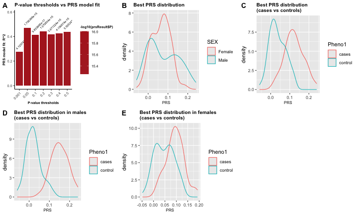
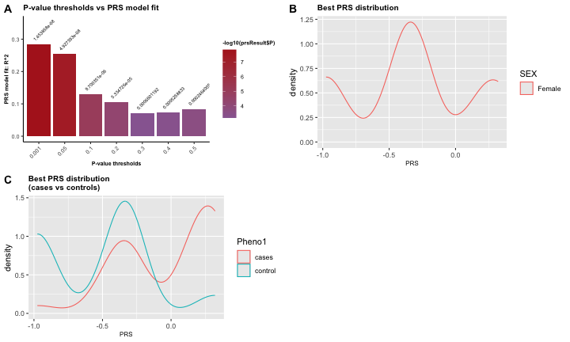
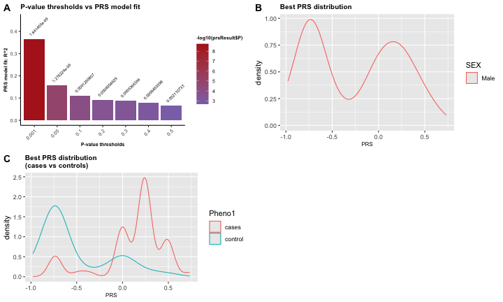

**This document provides a tutorial for computing state-of-the-art polygenic risk score and sex-aware ploygenic risk score utilizing GXwasR R package.**


``` r
## Call some libraries (Users can ignore this.)
library(printr)
#> Registered S3 method overwritten by 'printr':
#>   method                from     
#>   knit_print.data.frame rmarkdown
library(rmarkdown)
```

## Call GXwasR library and load example datasets:


``` r
## Call GXwasR library
library(GXwasR)
#> 
#> GXwasR: Genome-wide and x-chromosome wide association analyses applying best practices of quality control over genetic data
#> Version 0.99.0 () installed
#> Author: c(
#>     person(given = "Banabithi",
#>            family = "Bose",
#>            role = c("cre", "aut"),
#>            email = "banabithi.bose@gmail.com",
#>            comment = c(ORCID = "0000-0003-0842-8768"))
#>            )
#> Maintainer: Banabithi Bose <banabithi.bose@gmail.com>
#> Tutorial: https://github.com
#> Use citation("GXwasR") to know how to cite this work.
```

# Computing standard PRS using ComputePRS():

## About ComputePRS()


``` r
help(ComputePRS, package = GXwasR)
#> ComputePRS: Computing polygenic risk score (PRS)
#> 
#> Description:
#> 
#>      This function calculates the polygenic risk score, which is the
#>      total of allele counts (genotypes) weighted by estimated effect
#>      sizes from genome-wide association studies. It uses C+T filtering
#>      techniques. The users could perform clumping procedure
#>      choromosome-wise and genome-wide. Also, the function offers the
#>      choice of including several genetic principal components along
#>      with other covariates. Using this function, users have the freedom
#>      to experiment with various clumping and thresholding arrangements
#>      to test a wide range of various parameter values.
#> 
#> Usage:
#> 
#>      ComputePRS(
#>        DataDir,
#>        ResultDir = tempdir(),
#>        finput,
#>        summarystat,
#>        phenofile,
#>        covarfile = NULL,
#>        effectsize = c("BETA", "OR"),
#>        ldclump = FALSE,
#>        LDreference,
#>        clump_p1,
#>        clump_p2,
#>        clump_r2,
#>        clump_kb,
#>        byCHR = TRUE,
#>        pthreshold = c(0.001, 0.05, 0.1, 0.2, 0.3, 0.4, 0.5),
#>        highLD_regions,
#>        ld_prunning = FALSE,
#>        window_size = 50,
#>        step_size = 5,
#>        r2_threshold = 0.02,
#>        nPC = 6,
#>        pheno_type = "binary"
#>      )
#>      
#> Arguments:
#> 
#>  DataDir: A character string for the file path of the all the input
#>           files.
#> 
#> ResultDir: A character string for the file path where all output files
#>           will be stored. The default is tempdir().
#> 
#>   finput: Character string, specifying the prefix of the input PLINK
#>           binary files for the genotype data i.e., the target data
#>           based on which clumping procedure will be performed. This
#>           file needs to be in DataDir. If your target data are small
#>           (e.g. N < 500) then you can use the 1000 Genomes Project
#>           samples. Make sure to use the population that most closely
#>           reflects represents the base sample.
#> 
#> summarystat: A dataframe object with GWAS summary statistics.
#> 
#>           The mandatory column headers in this dataframe are:
#> 
#>             • 'CHR'(Chromosome code)
#> 
#>             • 'BP'(Basepair position)
#> 
#>             • 'A1' (effect allele)
#> 
#>             • 'SNP' (i.e., SNP identifier)
#> 
#>             • 'BETA' or 'OR' (i.e., effect-size or logarithm of odds
#>               ratio)
#> 
#>             • 'P' (i.e., p-values).
#> 
#>           Special Notes: The first three columns needed to be 'SNP',
#>           'A1' and 'BETA' or 'OR'.
#> 
#> phenofile: A character string, specifying the name of the mandatory
#>           phenotype file. This is a plain text file with no header
#>           line; columns family ID, individual ID and phenotype columns.
#>           For binary trait, the phenotypic value should be coded as 0
#>           or 1, then it will be recognized as a case-control study (0
#>           for controls and 1 for cases). Missing value should be
#>           represented by "-9" or "NA". The interested phenotype column
#>           should be labeled as "Pheno1". This file needs to be in
#>           'DataDir'.
#> 
#> covarfile: A character string, specifying the name of the covariate
#>           file which is a plain .text file with no header line; columns
#>           are family ID, individual ID and the covariates. The default
#>           is 'NULL'. This file needs to be in 'DataDir'.
#> 
#> effectsize: Boolean value, 'BETA' or 'OR', specifying the type of the
#>           GWAS effectsize. The default is 'BETA'.
#> 
#>  ldclump: Boolean value, 'TRUE' or 'FALSE', specifying whether to
#>           perform clumping or not.
#> 
#> LDreference: A character string, specifying the prefix of the PLINK
#>           files of the population reference panel of the same ancestry,
#>           and ideally the one that was used for imputing your target
#>           dataset. These files should be in 'DataDir'.
#> 
#> clump_p1: Numeric value, specifying the significance threshold for
#>           index SNPs if 'ldclump' was set to be 'TRUE'. The default is
#>           0.0001.
#> 
#> clump_p2: Numeric value, specifying the secondary significance
#>           threshold for clumped SNPs if 'ldclump' was set to be 'TRUE'.
#>           The default is 0.01
#> 
#> clump_r2: Numeric value, specifying the linkage disequilibrium (LD)
#>           threshold for clumping if 'ldclump' was set to be 'TRUE'. The
#>           default is 0.50.
#> 
#> clump_kb: Integer value, specifying the physical distance threshold in
#>           base-pair for clumping if 'ldclump' was set to be 'TRUE'. The
#>           default is 250.
#> 
#>    byCHR: Boolean value, 'TRUE' or 'FALSE', specifying chromosome-wise
#>           clumping procedure if 'ldclump' was set to be 'TRUE'. The
#>           default is 'TRUE'
#> 
#> pthreshold: Numeric vector, containing several p value thresholds to
#>           maximize predictive ability of the derived polygenic scores.
#> 
#> highLD_regions: Character string, specifying the .txt file name with
#>           known genomic regions with high LD. The default is 'NULL'.
#> 
#> ld_prunning: Boolean value, 'TRUE' or 'FALSE' for LD-based filtering
#>           for computing genetic PC as covariates.
#> 
#> window_size: Integer value, specifying a window size in variant count
#>           or kilobase for LD-based filtering in computing genetic PC.
#>           The default is 50.
#> 
#> step_size: Integer value, specifying a variant count to shift the
#>           window at the end of each step for LD filtering in computing
#>           genetic PCs. The default is 5.
#> 
#> r2_threshold: Numeric value between 0 to 1 of pairwise r^2 threshold
#>           for LD-based filtering in computing genetic PCs. The default
#>           is 0.02.
#> 
#>      nPC: Positive integer value, specifying the number of genetic PCs
#>           to be included as predictor in the PRS model fit. The default
#>           is 6.
#> 
#> pheno_type: Boolean value, ‘binary’ or ‘quantitative’, specifying the
#>           type of the trait. The default is ‘binary’.
#> 
#> Value:
#> 
#>      A list object containing a dataframe a numeric value, a GeneticPC
#>      plot (if requested), and a PRS plot. The dataframe,PRS, contains
#>      four mandatory columns, such as, IID (i.e., Individual ID), FID
#>      (i.e., Family ID), Pheno1 (i.e., the trait for PRS) and Score
#>      (i.e., the best PRS). Other columns of covariates could be there.
#>      The numeric value, BestP contains the threshold of of the best
#>      p-value for the best pRS model fit.
#> 
#>      Also, the function produces several plots such as p-value
#>      thresholds vs PRS model fit and PRS distribution among male and
#>      females. For case-control data, it shows PRS distribution among
#>      cases and controls and ROC curves as well.
#> 
#> Author(s):
#> 
#>      Banabithi Bose
#> 
#> Examples:
#> 
#>      data("Summary_Stat_Ex1", package = "GXwasR")
#>      data("Example_phenofile", package = "GXwasR")
#>      data("Example_covarfile", package = "GXwasR")
#>      data("Example_pthresoldfile", package = "GXwasR")
#>      data("highLD_hg19", package = "GXwasR")
#>      DataDir <- GXwasR:::GXwasR_data()
#>      ResultDir <- tempdir()
#>      finput <- "GXwasR_example"
#>      summarystat <- Summary_Stat_Ex1[, c(2, 4, 7, 1, 3, 12)]
#>      phenofile <- Example_phenofile # Cannot be NULL
#>      # The interested phenotype column should be labeled as "Pheno1".
#>      covarfile <- Example_covarfile
#>      clump_p1 <- 0.0001
#>      clump_p2 <- 0.0001
#>      clump_kb <- 500
#>      clump_r2 <- 0.5
#>      byCHR <- TRUE
#>      pthreshold <- Example_pthresoldfile$Threshold
#>      ld_prunning <- TRUE
#>      highLD_regions <- highLD_hg19
#>      window_size <- 50
#>      step_size <- 5
#>      r2_threshold <- 0.02
#>      nPC <- 6 # We can incorporate PCs into our PRS analysis to account for population stratification.
#>      pheno_type <- "binary"
#>      
#>      PRSresult <- ComputePRS(DataDir, ResultDir, finput, summarystat, phenofile, covarfile,
#>          effectsize = "BETA", LDreference = "GXwasR_example", ldclump = FALSE, clump_p1, clump_p2,
#>          clump_r2, clump_kb, byCHR = TRUE, pthreshold = pthreshold, highLD_regions = highLD_regions,
#>          ld_prunning = TRUE, window_size = 50, step_size = 5, r2_threshold = 0.02, nPC = 6,
#>          pheno_type = "binary"
#>      )
#>      
#>      ## This table shows 10 samples with phenotype, covariates and a PRS column.
#>      PRS <- PRSresult$PRS
#>      PRS[seq_len(10), ]
#>      ## The best threshold
#>      BestPvalue <- PRSresult$BestP$Threshold
#>      BestPvalue
```

## Running ComputePRS()


``` r
# Running
data(Summary_Stat_Ex1)
data(Example_phenofile)
data(Example_covarfile)
data(Example_pthresoldfile)
data(highLD_hg19)
DataDir <- GXwasR:::GXwasR_data()
ResultDir <- tempdir()
finput <- "GXwasR_example"
summarystat <- Summary_Stat_Ex1[, c(2, 4, 7, 1, 3, 12)]
phenofile <- Example_phenofile # Cannot be NULL, the interested phenotype column should be labeled as "Pheno1".
covarfile <- Example_covarfile
clump_p1 <- 0.0001
clump_p2 <- 0.0001
clump_kb <- 500
clump_r2 <- 0.5
byCHR <- TRUE
pthreshold <- Example_pthresoldfile$Threshold
ld_prunning <- TRUE
highLD_regions <- highLD_hg19
window_size <- 50
step_size <- 5
r2_threshold <- 0.02
nPC <- 6 # We can incorporate PCs into our PRS analysis to account for population stratification.
pheno_type <- "binary"
ldclump <- FALSE
pheno_type <- "binary"
PRSresult <- ComputePRS(DataDir, ResultDir, finput, summarystat, phenofile, covarfile, effectsize = "BETA", LDreference = "GXwasR_example", ldclump = FALSE, clump_p1, clump_p2, clump_r2, clump_kb, byCHR = TRUE, pthreshold = pthreshold, highLD_regions = highLD_regions, ld_prunning = TRUE, window_size = 50, step_size = 5, r2_threshold = 0.02, nPC = 6, pheno_type = "binary")
#> Using PLINK v1.9.0-b.7.7 64-bit (22 Oct 2024)
#> Warning: cannot remove file '/private/var/folders/d6/gtwl3_017sj4pp14fbfcbqjh0000gp/T/Rtmp47EYmB/temp_libpath102938d3a72d', reason 'Directory not empty'
#> 
#> ℹ 0.001
#> • Computing PRS for threshold 0.001
#> ℹ 0.05
#> • Computing PRS for threshold 0.05
#> ℹ 0.1
#> • Computing PRS for threshold 0.1
#> ℹ 0.2
#> • Computing PRS for threshold 0.2
#> ℹ 0.3
#> • Computing PRS for threshold 0.3
#> ℹ 0.4
#> • Computing PRS for threshold 0.4
#> ℹ 0.5
#> • Computing PRS for threshold 0.5
#> This message is displayed once every 8 hours.
print(PRSresult$PRS_plot)
```


``` r
## This table shows 10 samples with phenotype, covariates and a PRS column.
PRS <- PRSresult$PRS
PRS[1:10, ]
```


|FID     |IID     | Pheno1| AGE| testcovar|       PC1|        PC2|        PC3|        PC4|        PC5|        PC6|     SCORE|
|:-------|:-------|------:|---:|---------:|---------:|----------:|----------:|----------:|----------:|----------:|---------:|
|EUR_FIN |HG00171 |      1|  36|         1| 0.0964618| -0.0382514|  0.0090380| -0.0895293| -0.0252291|  0.0146543| 0.0484212|
|EUR_FIN |HG00173 |      1|  81|         1| 0.0743932| -0.0567271|  0.0396994|  0.0205343|  0.0230410| -0.0360380| 0.0293742|
|EUR_FIN |HG00174 |      1|  83|         1| 0.0645349| -0.0561035| -0.0145786| -0.0264343| -0.0018095|  0.0144521| 0.0099674|
|EUR_FIN |HG00176 |      2|  75|         0| 0.0832472| -0.0560208|  0.0302654| -0.0011077| -0.0530371| -0.0335803| 0.1042060|
|EUR_FIN |HG00177 |      1|  88|         1| 0.0775687| -0.0094644|  0.0451785| -0.0373215| -0.0617431| -0.0719951| 0.0314303|
|EUR_FIN |HG00178 |      1|  24|         1| 0.0661714| -0.0504906|  0.0248539| -0.0828066|  0.0409418|  0.0055953| 0.0722689|
|EUR_FIN |HG00179 |      2|  78|         1| 0.0806110| -0.0115409| -0.0075072| -0.0328823|  0.0355973|  0.0424512| 0.1165240|
|EUR_FIN |HG00180 |      1|  39|         1| 0.0840638|  0.0011783|  0.0128646|  0.0591540|  0.0547667| -0.0101595| 0.0617159|
|EUR_FIN |HG00182 |      1|  50|         1| 0.1029760| -0.0430046|  0.0199971| -0.0302365| -0.0901911| -0.0378515| 0.0283703|
|EUR_FIN |HG00183 |      1|  58|         0| 0.0827103| -0.0386530|  0.0509366| -0.0015378| -0.1045610|  0.0623634| 0.0386297|

``` r
## The best threshold
BestPvalue <- PRSresult$BestP$Threshold
BestPvalue
#> [1] 0.05
```

# Computing sex-aware PRS

## Datasets for computing PRS

**Discovery Data** i.e., GWAS summary statistics with mandatory columns such as "SNP"(SNP names), "A1"(effect allele), "BETA"(effect size in beta value) and "P"(p-value).


``` r
# Example discovery data is included in GXwasR
library(GXwasR)
data(Summary_Stat_Ex1)
summarystat <- Summary_Stat_Ex1[, c(2, 4, 7, 1, 3, 12)]
```

**Target Data** i.e., genotype dataset in plink .bed, .bim and .fam format.


``` r
# Example target data is included in GXwasR
DataDir <- GXwasR:::GXwasR_data()
finput <- "GXwasR_example"
```

## Quality control of the datasets before computing sex-aware PRS.

Users must ensure that both datasets are having the **same genome built**.
Here's the quality control procedure:

**(A) Discovery Data: Remove multi-allelic, indels and ambiguous (A/T or C/G) SNPs. Then remove SNPs with minor allele frequency (MAF) < 0.05 and quality info score < 0.1.  For this filtering, R packages like data.table, dplyr, tidyverse can be used.**

**(B) Target Data: Remove multi-allelic, indels and ambiguous (A/T or C/G) SNPs. Then remove SNPs with MAF < 0.05 and Hardy Weinberg Equilibrium (hwe) > e-10. For this filtering steps, users should use `FilterAllele()` and `QCsnp()` functions in R.**

Let's see how to use these functions. For the details of these utility functions, please follow [https://boseb.github.io/GXwasR/articles/GXwasR_overview.html](https://boseb.github.io/GXwasR/articles/GXwasR_overview.html).

We will use `FilterAllele()` on target data to filter out the multi-allelic SNPs. Also, note that GXwasR doesn't work with multi-allelic variants. So this filtering step is important.


``` r
# Target data
DataDir <- GXwasR:::GXwasR_data()
ResultDir <- tempdir()
finput <- "GXwasR_example"
foutput <- "filtered_multiallelic"
x <- FilterAllele(DataDir, ResultDir, finput, foutput)
#> ℹ There is no multi-allelic SNP present in the input dataset.
```

Now, we will use `QCsnp()` to remove ambiguous (A/T or C/G) SNPs and SNPs with MAF < 0.05 and Hardy Weinberg Equilibrium (hwe) > e-10.


``` r
## Since there was no multiallelic SNPs, we will continue with original input data.
finput <- "GXwasR_example"
foutput <- "filtered_step1"
geno <- NULL
maf <- 0.05
casecontrol <- FALSE
caldiffmiss <- FALSE
diffmissFilter <- FALSE
dmissX <- FALSE
dmissAutoY <- FALSE
monomorphicSNPs <- TRUE
ld_prunning <- FALSE
casecontrol <- FALSE ## Since the filtering doesn't require us to run on cases and controls separately, we will make this parameter FALSE.
hweCase <- NULL
hweControl <- NULL
hwe <- 1e-10
monomorphicSNPs <- FALSE
ld_prunning <- FALSE

x <- QCsnp(DataDir = DataDir, ResultDir = ResultDir, finput = finput, foutput = foutput, geno = geno, maf = maf, hweCase = hweCase, hweControl = hweControl, hwe = hwe, ld_prunning = ld_prunning, casecontrol = casecontrol, monomorphicSNPs = monomorphicSNPs, caldiffmiss = caldiffmiss, dmissX = dmissX, dmissAutoY = dmissAutoY, diffmissFilter = diffmissFilter)
#> ℹ 4214 Ambiguous SNPs (A-T/G-C), indels etc. were removed.
#> ✔ Thresholds for maf, geno and hwe worked.
#> --hwe: 3 variants removed due to Hardy-Weinberg exact test.
#> 5467 variants removed due to minor allele threshold(s)
#> ℹ No filter based on differential missingness will be applied.
#> ✔ Output plink files prefixed as ,filtered_step1, with passed SNPs are saved in ResultDir.
#> ℹ Input file has 26527 SNPs.
#> ℹ Output file has 16843 SNPs after filtering.
```

**(C) Check whether SNPs present in discovery data are in target data.**

  Let's gather the common SNPs between these.


``` r
SNP1 <- unique(summarystat$SNP)
targetbim <- read.table(paste0(ResultDir, "/filtered_step1.bim"))
SNP2 <- unique(targetbim$V2)
commonSNP <- intersect(SNP1, SNP2) ## 991 SNPs are common between our discovery data and target data
```

## Filtering discovery data and target data with common SNPs


``` r
commonSNP <- data.table::as.data.table(commonSNP)
colnames(commonSNP) <- "SNP"
NewDiscoveryData <- merge(commonSNP, summarystat, by = "SNP")
## For making target data with common SNPs, we will use FilterSNP().
SNPvec <- commonSNP
# Need to copy filtered_step1 file from ResultDir to DataDir
ftemp <- list.files(paste0(ResultDir, "/"), pattern = "filtered_step1")
invisible(file.copy(paste0(ResultDir, "/", ftemp), DataDir))
finput <- "filtered_step1"
foutput <- "NewtargetData"
FilterSNP(DataDir, ResultDir, finput, foutput, SNPvec, extract = TRUE)
#> ℹ 991 SNPs are extracted
#> ✔ Plink files with extracted SNPs are in /var/folders/d6/gtwl3_017sj4pp14fbfcbqjh0000gp/T//Rtmp47EYmB prefixed as NewtargetData
#> NULL
```

Now, our discovery data and target data are ready. We will proceed towards computing first sex-combined PRS and then sex-stratified PRS.

# Sex-combined PRS computation
**(A) Perform LD clumping for discovery data using target data as reference.**

**(B) Compute PRS at a variety of p-value thresholds.**

**(C) Select best threshold based on R-square (for quantitative trait) or MacFadden R-square (for binary trait) using generalized linear model with covariates, such as genetic PCs.**

We will utilize the `ComputePRS()` to perform the steps (A), (B) and (C).


``` r
# Running
# Filtered target data needs to be copied from ResultDir to DataDir.
ftemp <- list.files(paste0(ResultDir, "/"), pattern = "NewtargetData")
invisible(file.copy(paste0(ResultDir, "/", ftemp), DataDir))
finput <- "NewtargetData"

# Filtered discovery data.
# Need to maintain the first three coulmn of this dataset as SNP ID, Effect Allele and Effect Size
summarystat <- NewDiscoveryData
phenofile <- Example_phenofile # Cannot be NULL, the interested phenotype column should be labeled as "Pheno1".
## Added "AGE" and "testcovar" as covariates.
covarfile <- Example_covarfile
clump_p1 <- 0.0001
clump_p2 <- 0.0001
clump_kb <- 500
clump_r2 <- 0.5
byCHR <- TRUE
pthreshold <- Example_pthresoldfile$Threshold
ld_prunning <- TRUE
highLD_regions <- highLD_hg19
window_size <- 50
step_size <- 5
r2_threshold <- 0.02
nPC <- 6 # We can incorporate PCs into our PRS analysis to account for population stratification.
pheno_type <- "binary"
effectsize <- "BETA"
ldclump <- FALSE
PRSresult <- ComputePRS(DataDir, ResultDir, finput, summarystat, phenofile, covarfile, effectsize = "BETA", LDreference = "GXwasR_example", ldclump = FALSE, clump_p1, clump_p2, clump_r2, clump_kb, byCHR = TRUE, pthreshold = pthreshold, highLD_regions = highLD_regions, ld_prunning = TRUE, window_size = 50, step_size = 5, r2_threshold = 0.02, nPC = 6, pheno_type = "binary")
#> Warning: cannot remove file '/private/var/folders/d6/gtwl3_017sj4pp14fbfcbqjh0000gp/T/Rtmp47EYmB/temp_libpath102938d3a72d', reason 'Directory not empty'
#> ℹ 0.001
#> • Computing PRS for threshold 0.001
#> ℹ 0.05
#> • Computing PRS for threshold 0.05
#> ℹ 0.1
#> • Computing PRS for threshold 0.1
#> ℹ 0.2
#> • Computing PRS for threshold 0.2
#> ℹ 0.3
#> • Computing PRS for threshold 0.3
#> ℹ 0.4
#> • Computing PRS for threshold 0.4
#> ℹ 0.5
#> • Computing PRS for threshold 0.5
print(PRSresult$PRS_plot)
```




``` r
## This table shows 10 samples with phenotype, covariates and a PRS column.
PRS <- PRSresult$PRS
PRS[1:10, ]
```


|FID     |IID     | Pheno1| AGE| testcovar|        PC1|        PC2|        PC3|        PC4|        PC5|        PC6|      SCORE|
|:-------|:-------|------:|---:|---------:|----------:|----------:|----------:|----------:|----------:|----------:|----------:|
|EUR_FIN |HG00171 |      1|  36|         1|  0.0816192|  0.0088405|  0.0457488| -0.0458072|  0.0361127| -0.0444544|  0.0446702|
|EUR_FIN |HG00173 |      1|  81|         1|  0.0783950|  0.0793499| -0.0203422|  0.0507417|  0.0060022|  0.0682457|  0.0227245|
|EUR_FIN |HG00174 |      1|  83|         1|  0.0417082| -0.0182760| -0.0141222| -0.0796694| -0.1079240|  0.0417553| -0.0021202|
|EUR_FIN |HG00176 |      2|  75|         0|  0.0330363| -0.0687181|  0.0420013|  0.0035531| -0.0326060|  0.0546183|  0.1291310|
|EUR_FIN |HG00177 |      1|  88|         1|  0.1078350|  0.0402309| -0.0575659|  0.0204330| -0.0190359| -0.1153630|  0.0456979|
|EUR_FIN |HG00178 |      1|  24|         1|  0.0446610| -0.0178283| -0.0541228| -0.1293990|  0.0191170|  0.0419359|  0.0974915|
|EUR_FIN |HG00179 |      2|  78|         1| -0.0079884|  0.0495156| -0.0417300| -0.0908318| -0.1013690| -0.0286235|  0.1043860|
|EUR_FIN |HG00180 |      1|  39|         1| -0.0643263| -0.0789866| -0.0961588| -0.0117982|  0.0919479| -0.0083767|  0.0943266|
|EUR_FIN |HG00182 |      1|  50|         1|  0.0477393|  0.0258317|  0.1084700| -0.0102109| -0.0949523|  0.0224777|  0.0248974|
|EUR_FIN |HG00183 |      1|  58|         0|  0.0181373| -0.0707456|  0.0252158| -0.0319165| -0.0351717| -0.0521393|  0.0521662|

``` r
## The best threshold
BestPvalue <- PRSresult$BestP$Threshold
BestPvalue
#> [1] 0.05
```

**(D) Perform regression to test the association of PRS and sex.**

**(E) Perform the regression using different thresholds of PRS to check for consistent evidence of sex difference.**

In this regression, we could include genetic PCs and other covariates as well.

**PRS ~ Sex + PCs + Other Covariates.**

For this test, we will use `SexRegress()` function.

# About SexRegress()


``` r
help(SexRegress, package = GXwasR)
#> SexRegress: Performing linear regression analysis with quantitative
#> response variable.
#> 
#> Description:
#> 
#>      This function could be used to check association of two variables.
#>      For instance, PRS with sex.
#> 
#> Usage:
#> 
#>      SexRegress(fdata, regressor_index, response_index)
#>      
#> Arguments:
#> 
#>    fdata: R dataframe object. The column with header 'response' should
#>           contain the response variable. All other column are the
#>           regressor.
#> 
#> regressor_index: Integer value, specifying the column number of the
#>           main regressor variable.
#> 
#> response_index: Integer value, specifying the column number of the
#>           response variable.
#> 
#> Value:
#> 
#>      Numeric value containing the regression estimate ("Estimate"),
#>      standard error ("Std. Error"), statistics ("t value") and p-value
#>      (Pr(>|t|))
#> 
#> Examples:
#> 
#>      data("Regression_Ex", package = "GXwasR")
#>      fdata <- Regression_Ex
#>      fdata$SEX <- as.factor(as.character(fdata$SEX))
#>      response_index <- 1
#>      regressor_index <- 2
#>      
#>      x <- SexRegress(fdata, regressor_index, response_index)
```

# Running SexRegress()

``` r
# Running
# First, we need to make fdata object.
library(GXwasR)
famfile <- read.table(paste0(ResultDir, "/NewtargetData.fam"))[, c(1, 2, 5)]
colnames(famfile) <- c("FID", "IID", "Sex")
prefdata <- merge(famfile, PRS, by = c("IID", "FID"))

fdata <- prefdata[, c(13, 3:12)]
fdata$Sex <- as.factor(as.character(fdata$Sex))
response_index <- 1
regressor_index <- 2

x <- SexRegress(fdata, regressor_index, response_index)
x
#>     Estimate   Std. Error      t value     Pr(>|t|) 
#> -0.005453123  0.005495108 -0.992359622  0.321927372
```

In this case, the association between PRS and sex seems insignificant. Users can check with different thresholds of PRS as mentioned in step (D).

## Sex-stratified PRS

The steps are:

**(A) Generate separate male and female discovery data by stratified GWAS.**

We will use SumstatMale and SumstatFemale for these.

**(B) Prepare separate male and female target datasets.**

For this, we will utilize `GetMFPlink()`.


``` r
library(GXwasR)
## We will use NewtargetData as input for this function.
finput <- "NewtargetData"
foutput <- "maletarget"
sex <- "males"
x <- GetMFPlink(DataDir = DataDir, ResultDir = ResultDir, finput = finput, foutput = foutput, sex = sex, xplink = FALSE, autoplink = FALSE)
#> ✔ Output plink files, prefixed as maletarget, are in /var/folders/d6/gtwl3_017sj4pp14fbfcbqjh0000gp/T//Rtmp47EYmB

foutput <- "femaletarget"
sex <- "females"
x <- GetMFPlink(DataDir = DataDir, ResultDir = ResultDir, finput = finput, foutput = foutput, sex = sex, xplink = FALSE, autoplink = FALSE)
#> ✔ Output plink files, prefixed as femaletarget, are in /var/folders/d6/gtwl3_017sj4pp14fbfcbqjh0000gp/T//Rtmp47EYmB
```

**(C) Perform LD clumping separately in both discovery data.**

**(D) Compute PRS at a variety of p-value thresholds, using male-only discovery data to compute scores for female-only target data and vice versa.**

**(E) Select best threshold based on R-square (for quantitative trait) or MacFadden R-square (for binary trait) using generalized linear model with covariates, such as genetic PCs.**

We will utilize the `ComputePRS()` to perform the steps (C), (D) and (E).


``` r
# Running
# Male and female target datasets need to be copied from ResultDir to DataDir.
ftemp <- list.files(paste0(ResultDir, "/"), pattern = "target")
invisible(file.copy(paste0(ResultDir, "/", ftemp), DataDir))
```

# Computing PRS for female-only target data using male-only discovery data


``` r
# DataDir <- GXwasR:::GXwasR_data()
ResultDir <- tempdir()
finput <- "femaletarget"
# Filtered discovery data.
# Need to maintain the first three coulmn of this dataset as SNP ID, Effect Allele and Effect Size
summarystat <- Summary_Stat_Ex1[, c(2, 4, 7, 1, 3, 12)]
## Making phenofile only with females
famfile <- read.table(paste0(ResultDir, "/femaletarget.fam"))[, c(1, 2, 5)]
colnames(famfile) <- c("FID", "IID", "Sex")
famfileF <- famfile[famfile$Sex == 2, ]
phenofile <- merge(famfileF, Example_phenofile, by = c("FID", "IID")) # Cannot be NULL, the interested phenotype column should be labeled as "Pheno1".
## Added "AGE" and "testcovar" as covariates.
## Making cpvarfile with females
covarfile <- merge(famfileF, Example_covarfile, by = c("FID", "IID"))
clump_p1 <- 0.0001
clump_p2 <- 0.0001
clump_kb <- 500
clump_r2 <- 0.5
byCHR <- TRUE
pthreshold <- Example_pthresoldfile$Threshold
ld_prunning <- TRUE
highLD_regions <- highLD_hg19
window_size <- 50
step_size <- 5
r2_threshold <- 0.02
nPC <- 6 # We can incorporate PCs into our PRS analysis to account for population stratification.
pheno_type <- "binary"
ldclump <- FALSE
effectsize <- "BETA"
PRSresultFemale <- ComputePRS(DataDir, ResultDir, finput, summarystat, phenofile, covarfile, effectsize = "BETA", LDreference = "GXwasR_example", ldclump = FALSE, clump_p1, clump_p2, clump_r2, clump_kb, byCHR = TRUE, pthreshold = pthreshold, highLD_regions = highLD_regions, ld_prunning = TRUE, window_size = 50, step_size = 5, r2_threshold = 0.02, nPC = 6, pheno_type = "binary")
#> Warning: cannot remove file '/private/var/folders/d6/gtwl3_017sj4pp14fbfcbqjh0000gp/T/Rtmp47EYmB/temp_libpath102938d3a72d', reason 'Directory not empty'
#> ℹ 0.001
#> • Computing PRS for threshold 0.001
#> ℹ 0.05
#> • Computing PRS for threshold 0.05
#> ℹ 0.1
#> • Computing PRS for threshold 0.1
#> ℹ 0.2
#> • Computing PRS for threshold 0.2
#> ℹ 0.3
#> • Computing PRS for threshold 0.3
#> ℹ 0.4
#> • Computing PRS for threshold 0.4
#> ℹ 0.5
#> • Computing PRS for threshold 0.5
print(PRSresultFemale$PRS_plot)
```




``` r
## This table shows 10 samples with phenotype, covariates and a PRS column.
PRSfemale <- PRSresultFemale$PRS
PRSfemale[1:10, ]
```


|FID     |IID     | Pheno1| Sex| AGE| testcovar|        PC1|        PC2|        PC3|        PC4|        PC5|        PC6|     SCORE|
|:-------|:-------|------:|---:|---:|---------:|----------:|----------:|----------:|----------:|----------:|----------:|---------:|
|EUR_FIN |HG00171 |      1|   2|  36|         1|  0.0358056| -0.0103993|  0.0304770|  0.0804331| -0.0316828|  0.2308030| -0.975333|
|EUR_FIN |HG00173 |      1|   2|  81|         1| -0.0259195|  0.0522046|  0.0338950| -0.0783466| -0.0301168|  0.0481648| -0.327300|
|EUR_FIN |HG00174 |      1|   2|  83|         1|  0.0690632|  0.1000850|  0.0177107| -0.0062435|  0.2347970| -0.1600570| -0.975333|
|EUR_FIN |HG00176 |      2|   2|  75|         0|  0.0464837| -0.0611293| -0.0300357| -0.1261310|  0.0221893| -0.0430133|  0.320733|
|EUR_FIN |HG00177 |      1|   2|  88|         1|  0.0175615| -0.0407396| -0.1278730|  0.1634300|  0.1062830|  0.0622563| -0.975333|
|EUR_FIN |HG00178 |      1|   2|  24|         1|  0.1526140|  0.1886470| -0.0341148| -0.0824660| -0.0736962| -0.0412650|  0.320733|
|EUR_FIN |HG00179 |      2|   2|  78|         1|  0.0881766|  0.0494024|  0.1288620|  0.0523562| -0.0191810|  0.0078241| -0.327300|
|EUR_FIN |HG00180 |      1|   2|  39|         1|  0.0459778|  0.0170708|  0.0761808| -0.0344214| -0.0240829|  0.0729217| -0.327300|
|EUR_FIN |HG00266 |      2|   2|  64|         1|  0.0238295| -0.0127790| -0.1954810| -0.0758269| -0.0017235|  0.0638968|  0.320733|
|EUR_FIN |HG00268 |      1|   2|  66|         1| -0.1570560| -0.0401398|  0.1022290|  0.0203453| -0.0103913|  0.0914439| -0.327300|

``` r
## The best threshold
BestPvalue <- PRSresultFemale$BestP$Threshold
BestPvalue
#> [1] 0.001
```

# Computing PRS for male-only target data using female-only discovery data

``` r
library(GXwasR)
data(Summary_Stat_Ex2)
# DataDir <- system.file("extdata", package = "GXwasR")
ResultDir <- tempdir()
finput <- "maletarget"
# Filtered discovery data.
# Need to maintain the first three coulmn of this dataset as SNP ID, Effect Allele and Effect Size
summarystat <- Summary_Stat_Ex2[, c(2, 4, 7, 1, 3, 12)]
## Making phenofile only with females
famfile <- read.table(paste0(ResultDir, "/maletarget.fam"))[, c(1, 2, 5)]
colnames(famfile) <- c("FID", "IID", "Sex")
famfileM <- famfile[famfile$Sex == 1, ]
phenofile <- merge(famfileM, Example_phenofile, by = c("FID", "IID")) # Cannot be NULL, the interested phenotype column should be labeled as "Pheno1".
## Added "AGE" and "testcovar" as covariates.
## Making cpvarfile with females
covarfile <- merge(famfileM, Example_covarfile, by = c("FID", "IID"))
clump_p1 <- 0.0001
clump_p2 <- 0.0001
clump_kb <- 500
clump_r2 <- 0.5
byCHR <- TRUE
pthreshold <- Example_pthresoldfile$Threshold
ld_prunning <- TRUE
highLD_regions <- highLD_hg19
window_size <- 50
step_size <- 5
r2_threshold <- 0.02
nPC <- 6 # We can incorporate PCs into our PRS analysis to account for population stratification.
pheno_type <- "binary"
ldclump <- FALSE
effectsize <- "BETA"
PRSresultmale <- ComputePRS(DataDir, ResultDir, finput, summarystat, phenofile, covarfile, effectsize = "BETA", LDreference = "GXwasR_example", ldclump = FALSE, clump_p1 = clump_p1, clump_p2 = clump_p2, clump_r2 = clump_r2, clump_kb = clump_kb, byCHR = TRUE, pthreshold = pthreshold, highLD_regions = highLD_regions, ld_prunning = TRUE, window_size = 50, step_size = 5, r2_threshold = 0.02, nPC = 6, pheno_type = "binary")
#> Warning: cannot remove file '/private/var/folders/d6/gtwl3_017sj4pp14fbfcbqjh0000gp/T/Rtmp47EYmB/temp_libpath102938d3a72d', reason 'Directory not empty'
#> ℹ 0.001
#> • Computing PRS for threshold 0.001
#> ℹ 0.05
#> • Computing PRS for threshold 0.05
#> ℹ 0.1
#> • Computing PRS for threshold 0.1
#> ℹ 0.2
#> • Computing PRS for threshold 0.2
#> ℹ 0.3
#> • Computing PRS for threshold 0.3
#> ℹ 0.4
#> • Computing PRS for threshold 0.4
#> ℹ 0.5
#> • Computing PRS for threshold 0.5
print(PRSresultmale$PRS_plot)
```




``` r
## This table shows 10 samples with phenotype, covariates and a PRS column.
PRSmale <- PRSresultmale$PRS
PRSmale[1:10, ]
```


|FID     |IID     | Pheno1| Sex| AGE| testcovar|        PC1|        PC2|        PC3|        PC4|        PC5|        PC6|      SCORE|
|:-------|:-------|------:|---:|---:|---------:|----------:|----------:|----------:|----------:|----------:|----------:|----------:|
|EUR_FIN |HG00182 |      1|   1|  50|         1|  0.0647406| -0.0928744| -0.0671189|  0.1612960|  0.0577821| -0.0080738| -0.7348330|
|EUR_FIN |HG00183 |      1|   1|  58|         0| -0.1385060| -0.0695656| -0.0741905| -0.0772780|  0.0448000|  0.0203577| -0.0018333|
|EUR_FIN |HG00185 |      2|   1|  22|         1| -0.0149102| -0.1042650| -0.0490031|  0.0909954| -0.1272400|  0.0736424| -0.0018333|
|EUR_FIN |HG00186 |      2|   1|  52|         0|  0.0936989| -0.0658094| -0.1384690|  0.0711780| -0.1307370| -0.2262310|  0.0000000|
|EUR_FIN |HG00187 |      2|   1|  49|         1| -0.0495608| -0.0536840| -0.0351695|  0.0991132|  0.0429508|  0.1034500|  0.4873330|
|EUR_FIN |HG00188 |      1|   1|  47|         1| -0.0168334| -0.0884520| -0.0100132|  0.0212827|  0.0980303|  0.0024415| -0.4883330|
|EUR_FIN |HG00189 |      1|   1|  27|         1|  0.0926677| -0.0486674| -0.0237400|  0.0180525| -0.0864605| -0.0121730| -0.7348330|
|EUR_FIN |HG00190 |      2|   1|  42|         0|  0.1214390|  0.1955690|  0.0718894|  0.0852533|  0.0009986| -0.0935724| -0.7348330|
|EUR_FIN |HG00267 |      2|   1|  36|         1|  0.0838363| -0.1059630| -0.0289262| -0.0295922|  0.0224057| -0.1815780| -0.7348330|
|EUR_FIN |HG00271 |      2|   1|  51|         1|  0.0015542| -0.0608128|  0.0592212| -0.0144662| -0.0084652| -0.2149010|  0.2408330|

``` r
## The best threshold
BestPvalue <- PRSresultmale$BestP$Threshold
BestPvalue
#> [1] 0.001
```

**(F) Perform regression to test the association of PRS for a trait in one sex and case status in other sex.**

**PRS ~ trait + PCs + other covariates**

Let's check the association between PRS and trait in female.

``` r
# Running
# First, we need to make fdata object.
famfile <- read.table(paste0(ResultDir, "/femaletarget.fam"))[, c(1, 2, 6)]
colnames(famfile) <- c("FID", "IID", "Trait")
prefdata <- merge(famfile, PRS, by = c("IID", "FID"))

fdata <- prefdata[, c(13, 3:12)]
fdata$Sex <- as.factor(as.character(fdata$Trait))
response_index <- 1
regressor_index <- 2

x <- SexRegress(fdata, regressor_index, response_index)
x
#>     Estimate   Std. Error      t value     Pr(>|t|) 
#> 4.942281e-02 6.939184e-03 7.122280e+00 4.988950e-11
# In this case, there is a significant association between PRS and trait value.
```

## Citing `GXwasR`

We hope that *[GXwasR](https://bioconductor.org/packages/3.21/GXwasR)* will be useful for your research. Please use the following information to cite the package and the overall approach. Thank you!


``` r
## Citation info
citation("GXwasR")
#> To cite package 'GXwasR' in publications use:
#> 
#>   Bose B, Blostein F, Kim J, Winters J, Actkins KV, Mayer D, Congivaram H, Niarchou M, Edwards DV, Davis LK, Stranger BE (2025). "GXwasR: A Toolkit for Investigating Sex-Differentiated Genetic Effects on Complex Traits." _medRxiv 2025.06.10.25329327_. doi:10.1101/2025.06.10.25329327
#>   <https://doi.org/10.1101/2025.06.10.25329327>.
#> 
#> A BibTeX entry for LaTeX users is
#> 
#>   @Article{,
#>     title = {GXwasR: A Toolkit for Investigating Sex-Differentiated Genetic Effects on Complex Traits},
#>     author = {Banabithi Bose and Freida Blostein and Jeewoo Kim and Jessica Winters and Ky’Era V. Actkins and David Mayer and Harrsha Congivaram and Maria Niarchou and Digna Velez Edwards and Lea K. Davis and Barbara E. Stranger},
#>     journal = {medRxiv 2025.06.10.25329327},
#>     year = {2025},
#>     doi = {10.1101/2025.06.10.25329327},
#>   }
```

# Reproducibility

The *[GXwasR](https://bioconductor.org/packages/3.21/GXwasR)* package (Bose, Blostein, Kim, Winters, Actkins, Mayer, Congivaram, Niarchou, Edwards, Davis, and Stranger, 2025) was made possible thanks to:

* R (R Core Team, 2025)
* *[BiocStyle](https://bioconductor.org/packages/3.21/BiocStyle)* (Oleś, 2025)
* *[knitr](https://CRAN.R-project.org/package=knitr)* (Xie, 2025)
* *[RefManageR](https://CRAN.R-project.org/package=RefManageR)* (McLean, 2017)
* *[rmarkdown](https://CRAN.R-project.org/package=rmarkdown)* (Allaire, Xie, Dervieux, McPherson, Luraschi, Ushey, Atkins, Wickham, Cheng, Chang, and Iannone, 2024)
* *[sessioninfo](https://CRAN.R-project.org/package=sessioninfo)* (Wickham, Chang, Flight, Müller, and Hester, 2025)
* *[testthat](https://CRAN.R-project.org/package=testthat)* (Wickham, 2011)

This package was developed using *[biocthis](https://bioconductor.org/packages/3.21/biocthis)*.

`R` session information.


```
#> ─ Session info ───────────────────────────────────────────────────────────────────────────────────────────────────────
#>  setting  value
#>  version  R version 4.5.1 (2025-06-13)
#>  os       macOS Sequoia 15.5
#>  system   aarch64, darwin24.4.0
#>  ui       unknown
#>  language (EN)
#>  collate  en_US.UTF-8
#>  ctype    en_US.UTF-8
#>  tz       America/New_York
#>  date     2025-08-05
#>  pandoc   3.6.3 @ /Applications/Positron.app/Contents/Resources/app/quarto/bin/tools/aarch64/ (via rmarkdown)
#>  quarto   1.7.32 @ /usr/local/bin/quarto
#> 
#> ─ Packages ───────────────────────────────────────────────────────────────────────────────────────────────────────────
#>  package              * version    date (UTC) lib source
#>  abind                  1.4-8      2024-09-12 [2] CRAN (R 4.5.0)
#>  backports              1.5.0      2024-05-23 [2] CRAN (R 4.5.1)
#>  bibtex                 0.5.1      2023-01-26 [2] CRAN (R 4.5.0)
#>  bigassertr             0.1.7      2025-06-27 [2] CRAN (R 4.5.1)
#>  bigparallelr           0.3.2      2021-10-02 [2] CRAN (R 4.5.0)
#>  bigsnpr                1.12.18    2024-11-26 [2] CRAN (R 4.5.1)
#>  bigsparser             0.7.3      2024-09-06 [2] CRAN (R 4.5.1)
#>  bigstatsr              1.6.2      2025-07-29 [2] CRAN (R 4.5.1)
#>  Biobase                2.68.0     2025-04-15 [2] Bioconduc~
#>  BiocGenerics           0.54.0     2025-04-15 [2] Bioconduc~
#>  BiocIO                 1.18.0     2025-04-15 [2] Bioconduc~
#>  BiocManager            1.30.26    2025-06-05 [2] CRAN (R 4.5.0)
#>  BiocParallel           1.42.1     2025-06-01 [2] Bioconductor 3.21 (R 4.5.0)
#>  BiocStyle              2.36.0     2025-04-15 [2] Bioconduc~
#>  Biostrings             2.76.0     2025-04-15 [2] Bioconduc~
#>  bit                    4.6.0      2025-03-06 [2] CRAN (R 4.5.1)
#>  bit64                  4.6.0-1    2025-01-16 [2] CRAN (R 4.5.1)
#>  bitops                 1.0-9      2024-10-03 [2] CRAN (R 4.5.0)
#>  brio                   1.1.5      2024-04-24 [2] CRAN (R 4.5.1)
#>  broom                  1.0.9      2025-07-28 [2] CRAN (R 4.5.1)
#>  BSgenome               1.76.0     2025-04-15 [2] Bioconduc~
#>  cachem                 1.1.0      2024-05-16 [2] CRAN (R 4.5.0)
#>  calibrate              1.7.7      2020-06-19 [2] CRAN (R 4.5.0)
#>  callr                  3.7.6      2024-03-25 [2] CRAN (R 4.5.0)
#>  car                    3.1-3      2024-09-27 [2] CRAN (R 4.5.0)
#>  carData                3.0-5      2022-01-06 [2] CRAN (R 4.5.0)
#>  cli                    3.6.5      2025-04-23 [2] CRAN (R 4.5.0)
#>  codetools              0.2-20     2024-03-31 [4] CRAN (R 4.5.1)
#>  cowplot                1.2.0      2025-07-07 [2] CRAN (R 4.5.1)
#>  crayon                 1.5.3      2024-06-20 [2] CRAN (R 4.5.0)
#>  curl                   6.4.0      2025-06-22 [2] CRAN (R 4.5.1)
#>  data.table             1.17.8     2025-07-10 [2] CRAN (R 4.5.1)
#>  DelayedArray           0.34.1     2025-04-17 [2] Bioconduc~
#>  devtools             * 2.4.5      2022-10-11 [3] CRAN (R 4.5.0)
#>  digest                 0.6.37     2024-08-19 [2] CRAN (R 4.5.0)
#>  doParallel             1.0.17     2022-02-07 [2] CRAN (R 4.5.0)
#>  doRNG                  1.8.6.2    2025-04-02 [2] CRAN (R 4.5.0)
#>  dplyr                  1.1.4      2023-11-17 [2] CRAN (R 4.5.0)
#>  ellipsis               0.3.2      2021-04-29 [3] CRAN (R 4.5.0)
#>  evaluate               1.0.4      2025-06-18 [2] CRAN (R 4.5.1)
#>  farver                 2.1.2      2024-05-13 [2] CRAN (R 4.5.0)
#>  fastmap                1.2.0      2024-05-15 [2] CRAN (R 4.5.0)
#>  flock                  0.7        2016-11-12 [2] CRAN (R 4.5.1)
#>  foreach                1.5.2      2022-02-02 [2] CRAN (R 4.5.0)
#>  Formula                1.2-5      2023-02-24 [2] CRAN (R 4.5.0)
#>  fs                     1.6.6      2025-04-12 [2] CRAN (R 4.5.0)
#>  gdsfmt                 1.44.1     2025-07-09 [2] Bioconduc~
#>  generics               0.1.4      2025-05-09 [2] CRAN (R 4.5.0)
#>  GenomeInfoDb           1.44.1     2025-07-23 [2] Bioconduc~
#>  GenomeInfoDbData       1.2.14     2025-04-21 [2] Bioconductor
#>  GenomicAlignments      1.44.0     2025-04-15 [2] Bioconduc~
#>  GenomicRanges          1.60.0     2025-04-15 [2] Bioconduc~
#>  ggplot2                3.5.2      2025-04-09 [2] CRAN (R 4.5.0)
#>  ggpubr                 0.6.1      2025-06-27 [2] CRAN (R 4.5.1)
#>  ggrepel                0.9.6      2024-09-07 [2] CRAN (R 4.5.1)
#>  ggsignif               0.6.4      2022-10-13 [2] CRAN (R 4.5.0)
#>  glue                   1.8.0      2024-09-30 [2] CRAN (R 4.5.0)
#>  gridExtra              2.3        2017-09-09 [2] CRAN (R 4.5.0)
#>  gtable                 0.3.6      2024-10-25 [2] CRAN (R 4.5.0)
#>  GXwasR               * 0.99.0     2025-08-06 [1] Bioconductor
#>  hms                    1.1.3      2023-03-21 [2] CRAN (R 4.5.0)
#>  htmltools              0.5.8.1    2024-04-04 [2] CRAN (R 4.5.0)
#>  htmlwidgets            1.6.4      2023-12-06 [2] CRAN (R 4.5.0)
#>  httpuv                 1.6.16     2025-04-16 [2] CRAN (R 4.5.1)
#>  httr                   1.4.7      2023-08-15 [2] CRAN (R 4.5.0)
#>  IRanges                2.42.0     2025-04-15 [2] Bioconduc~
#>  iterators              1.0.14     2022-02-05 [2] CRAN (R 4.5.0)
#>  jsonlite               2.0.0      2025-03-27 [2] CRAN (R 4.5.0)
#>  knitr                  1.50       2025-03-16 [2] CRAN (R 4.5.0)
#>  labeling               0.4.3      2023-08-29 [2] CRAN (R 4.5.0)
#>  later                  1.4.2      2025-04-08 [2] CRAN (R 4.5.1)
#>  lattice                0.22-7     2025-04-02 [4] CRAN (R 4.5.1)
#>  lifecycle              1.0.4      2023-11-07 [2] CRAN (R 4.5.0)
#>  lubridate              1.9.4      2024-12-08 [2] CRAN (R 4.5.1)
#>  magrittr               2.0.3      2022-03-30 [2] CRAN (R 4.5.0)
#>  MASS                   7.3-65     2025-02-28 [4] CRAN (R 4.5.1)
#>  mathjaxr               1.8-0      2025-04-30 [2] CRAN (R 4.5.1)
#>  Matrix                 1.7-3      2025-03-11 [4] CRAN (R 4.5.1)
#>  MatrixGenerics         1.20.0     2025-04-15 [2] Bioconduc~
#>  matrixStats            1.5.0      2025-01-07 [2] CRAN (R 4.5.0)
#>  memoise                2.0.1      2021-11-26 [2] CRAN (R 4.5.0)
#>  mime                   0.13       2025-03-17 [2] CRAN (R 4.5.0)
#>  miniUI                 0.1.2      2025-04-17 [3] CRAN (R 4.5.0)
#>  pillar                 1.11.0     2025-07-04 [2] CRAN (R 4.5.1)
#>  pkgbuild               1.4.8      2025-05-26 [2] CRAN (R 4.5.0)
#>  pkgconfig              2.0.3      2019-09-22 [2] CRAN (R 4.5.0)
#>  pkgdev                 0.1.0.9060 2025-08-04 [2] Github (dieghernan/pkgdev@e56f2a8)
#>  pkgload                1.4.0      2024-06-28 [2] CRAN (R 4.5.0)
#>  plyr                   1.8.9      2023-10-02 [2] CRAN (R 4.5.1)
#>  plyranges              1.28.0     2025-04-15 [2] Bioconduc~
#>  poolr                  1.2-0      2025-05-07 [2] CRAN (R 4.5.0)
#>  prettyunits            1.2.0      2023-09-24 [2] CRAN (R 4.5.0)
#>  printr               * 0.3        2023-03-08 [2] CRAN (R 4.5.0)
#>  processx               3.8.6      2025-02-21 [2] CRAN (R 4.5.1)
#>  profvis                0.4.0      2024-09-20 [3] CRAN (R 4.5.0)
#>  progress               1.2.3      2023-12-06 [2] CRAN (R 4.5.0)
#>  promises               1.3.3      2025-05-29 [2] CRAN (R 4.5.0)
#>  ps                     1.9.1      2025-04-12 [2] CRAN (R 4.5.1)
#>  purrr                  1.1.0      2025-07-10 [2] CRAN (R 4.5.1)
#>  qqman                  0.1.9      2023-08-23 [2] CRAN (R 4.5.0)
#>  R.methodsS3            1.8.2      2022-06-13 [2] CRAN (R 4.5.0)
#>  R.oo                   1.27.1     2025-05-02 [2] CRAN (R 4.5.0)
#>  R.utils                2.13.0     2025-02-24 [2] CRAN (R 4.5.0)
#>  R6                     2.6.1      2025-02-15 [2] CRAN (R 4.5.0)
#>  rbibutils              2.3        2024-10-04 [2] CRAN (R 4.5.1)
#>  RColorBrewer           1.1-3      2022-04-03 [2] CRAN (R 4.5.0)
#>  Rcpp                   1.1.0      2025-07-02 [2] CRAN (R 4.5.1)
#>  RCurl                  1.98-1.17  2025-03-22 [2] CRAN (R 4.5.0)
#>  Rdpack                 2.6.4      2025-04-09 [2] CRAN (R 4.5.0)
#>  RefManageR           * 1.4.0      2022-09-30 [2] CRAN (R 4.5.1)
#>  regioneR               1.40.1     2025-06-01 [2] Bioconductor 3.21 (R 4.5.0)
#>  remotes                2.5.0      2024-03-17 [2] CRAN (R 4.5.0)
#>  restfulr               0.0.16     2025-06-27 [2] CRAN (R 4.5.1)
#>  rjson                  0.2.23     2024-09-16 [2] CRAN (R 4.5.0)
#>  rlang                  1.1.6      2025-04-11 [2] CRAN (R 4.5.0)
#>  rmarkdown            * 2.29       2024-11-04 [2] CRAN (R 4.5.0)
#>  rmio                   0.4.0      2022-02-17 [2] CRAN (R 4.5.0)
#>  rngtools               1.5.2      2021-09-20 [2] CRAN (R 4.5.0)
#>  rprojroot              2.1.0      2025-07-12 [2] CRAN (R 4.5.1)
#>  Rsamtools              2.24.0     2025-04-15 [2] Bioconduc~
#>  rstatix                0.7.2      2023-02-01 [2] CRAN (R 4.5.0)
#>  rtracklayer            1.68.0     2025-04-15 [2] Bioconduc~
#>  S4Arrays               1.8.1      2025-06-01 [2] Bioconductor 3.21 (R 4.5.0)
#>  S4Vectors              0.46.0     2025-04-15 [2] Bioconduc~
#>  scales                 1.4.0      2025-04-24 [2] CRAN (R 4.5.0)
#>  sessioninfo          * 1.2.3      2025-02-05 [2] CRAN (R 4.5.1)
#>  shiny                  1.11.1     2025-07-03 [2] CRAN (R 4.5.1)
#>  SNPRelate              1.42.0     2025-04-15 [2] Bioconduc~
#>  SparseArray            1.8.1      2025-07-23 [2] Bioconduc~
#>  stringi                1.8.7      2025-03-27 [2] CRAN (R 4.5.0)
#>  stringr                1.5.1      2023-11-14 [2] CRAN (R 4.5.0)
#>  sumFREGAT              1.2.5      2022-06-07 [2] CRAN (R 4.5.1)
#>  SummarizedExperiment   1.38.1     2025-04-30 [2] Bioconductor 3.21 (R 4.5.0)
#>  sys                    3.4.3      2024-10-04 [2] CRAN (R 4.5.0)
#>  testthat             * 3.2.3      2025-01-13 [2] CRAN (R 4.5.1)
#>  tibble                 3.3.0      2025-06-08 [2] CRAN (R 4.5.0)
#>  tidyr                  1.3.1      2024-01-24 [2] CRAN (R 4.5.1)
#>  tidyselect             1.2.1      2024-03-11 [2] CRAN (R 4.5.0)
#>  timechange             0.3.0      2024-01-18 [2] CRAN (R 4.5.1)
#>  tzdb                   0.5.0      2025-03-15 [2] CRAN (R 4.5.1)
#>  UCSC.utils             1.4.0      2025-04-15 [2] Bioconduc~
#>  urlchecker             1.0.1      2021-11-30 [3] CRAN (R 4.5.0)
#>  usethis              * 3.1.0      2024-11-26 [2] CRAN (R 4.5.0)
#>  vctrs                  0.6.5      2023-12-01 [2] CRAN (R 4.5.0)
#>  vroom                  1.6.5      2023-12-05 [2] CRAN (R 4.5.1)
#>  withr                  3.0.2      2024-10-28 [2] CRAN (R 4.5.0)
#>  xfun                   0.52       2025-04-02 [2] CRAN (R 4.5.0)
#>  XML                    3.99-0.18  2025-01-01 [2] CRAN (R 4.5.0)
#>  xml2                   1.3.8      2025-03-14 [2] CRAN (R 4.5.1)
#>  xtable                 1.8-4      2019-04-21 [2] CRAN (R 4.5.0)
#>  XVector                0.48.0     2025-04-15 [2] Bioconduc~
#>  yaml                   2.3.10     2024-07-26 [2] CRAN (R 4.5.0)
#> 
#>  [1] /private/var/folders/d6/gtwl3_017sj4pp14fbfcbqjh0000gp/T/Rtmp47EYmB/temp_libpath102938d3a72d
#>  [2] /Users/mayerdav/Library/R/arm64/4.5/library
#>  [3] /opt/homebrew/lib/R/4.5/site-library
#>  [4] /opt/homebrew/Cellar/r/4.5.1/lib/R/library
#>  * ── Packages attached to the search path.
#> 
#> ──────────────────────────────────────────────────────────────────────────────────────────────────────────────────────
```


# Bibliography

This vignette was generated using *[BiocStyle](https://bioconductor.org/packages/3.21/BiocStyle)* (Oleś, 2025)
with *[knitr](https://CRAN.R-project.org/package=knitr)* (Xie, 2025) and *[rmarkdown](https://CRAN.R-project.org/package=rmarkdown)* (Allaire, Xie, Dervieux et al., 2024) running behind the scenes.

Citations made with *[RefManageR](https://CRAN.R-project.org/package=RefManageR)* (McLean, 2017).

<p><a id='bib-allaire2024rmarkdown'></a><a href="#cite-allaire2024rmarkdown">[1]</a><cite>
J. Allaire, Y. Xie, C. Dervieux, et al.
<em>rmarkdown: Dynamic Documents for R</em>.
R package version 2.29.
2024.
URL: <a href="https://github.com/rstudio/rmarkdown">https://github.com/rstudio/rmarkdown</a>.</cite></p>

<p><a id='bib-bose2025gxwasr'></a><a href="#cite-bose2025gxwasr">[2]</a><cite>
B. Bose, F. Blostein, J. Kim, et al.
&ldquo;GXwasR: A Toolkit for Investigating Sex-Differentiated Genetic Effects on Complex Traits&rdquo;.
In: <em>medRxiv 2025.06.10.25329327</em> (2025).
DOI: <a href="https://doi.org/10.1101/2025.06.10.25329327">10.1101/2025.06.10.25329327</a>.</cite></p>

<p><a id='bib-mclean2017refmanager'></a><a href="#cite-mclean2017refmanager">[3]</a><cite>
M. W. McLean.
&ldquo;RefManageR: Import and Manage BibTeX and BibLaTeX References in R&rdquo;.
In: <em>The Journal of Open Source Software</em> (2017).
DOI: <a href="https://doi.org/10.21105/joss.00338">10.21105/joss.00338</a>.</cite></p>

<p><a id='bib-ole2025biocstyle'></a><a href="#cite-ole2025biocstyle">[4]</a><cite>
A. Oleś.
<em>BiocStyle: Standard styles for vignettes and other Bioconductor documents</em>.
R package version 2.36.0.
2025.
DOI: <a href="https://doi.org/10.18129/B9.bioc.BiocStyle">10.18129/B9.bioc.BiocStyle</a>.
URL: <a href="https://bioconductor.org/packages/BiocStyle">https://bioconductor.org/packages/BiocStyle</a>.</cite></p>

<p><a id='bib-2025language'></a><a href="#cite-2025language">[5]</a><cite>
R Core Team.
<em>R: A Language and Environment for Statistical Computing</em>.
R Foundation for Statistical Computing.
Vienna, Austria, 2025.
URL: <a href="https://www.R-project.org/">https://www.R-project.org/</a>.</cite></p>

<p><a id='bib-wickham2011testthat'></a><a href="#cite-wickham2011testthat">[6]</a><cite>
H. Wickham.
&ldquo;testthat: Get Started with Testing&rdquo;.
In: <em>The R Journal</em> 3 (2011), pp. 5&ndash;10.
URL: <a href="https://journal.r-project.org/archive/2011-1/RJournal_2011-1_Wickham.pdf">https://journal.r-project.org/archive/2011-1/RJournal_2011-1_Wickham.pdf</a>.</cite></p>

<p><a id='bib-wickham2025sessioninfo'></a><a href="#cite-wickham2025sessioninfo">[7]</a><cite>
H. Wickham, W. Chang, R. Flight, et al.
<em>sessioninfo: R Session Information</em>.
R package version 1.2.3.
2025.
DOI: <a href="https://doi.org/10.32614/CRAN.package.sessioninfo">10.32614/CRAN.package.sessioninfo</a>.
URL: <a href="https://CRAN.R-project.org/package=sessioninfo">https://CRAN.R-project.org/package=sessioninfo</a>.</cite></p>

<p><a id='bib-xie2025knitr'></a><a href="#cite-xie2025knitr">[8]</a><cite>
Y. Xie.
<em>knitr: A General-Purpose Package for Dynamic Report Generation in R</em>.
R package version 1.50.
2025.
URL: <a href="https://yihui.org/knitr/">https://yihui.org/knitr/</a>.</cite></p>
