# <a id = "GXwasR Description"></a> GXwasR Description: 

This package implements various statistical genetics models for Genome-Wide Association (GWA) and X-Chromosome Wide Association (XWA) analyses in a sex-combined or sex-stratified way considering X-Chromosome Inactivation (XCI) pattern. In addition to association analysis, the package also enables testing for sex differences in genetic effects, including the implementation of specific models and applying best practices for additional quality control (QC) of genetic data required for these tests. The package includes thirty different functions in six different categories (A-F) which enable a comprehensive pipeline for sex-aware genetic association analysis of common variants with unrelated individuals.

# Basics

## Install `GXwasR`

`R` is an open-source statistical environment which can be easily modified to enhance its functionality via packages. *[GXwasR](https://bioconductor.org/packages/3.21/GXwasR)* is a `R` package available via the [Bioconductor](http://bioconductor.org) repository for packages. `R` can be installed on any operating system from [CRAN](https://cran.r-project.org/) after which you can install *[GXwasR](https://bioconductor.org/packages/3.21/GXwasR)* by using the following commands in your `R` session:


``` r
if (!requireNamespace("BiocManager", quietly = TRUE)) {
    install.packages("BiocManager")
}

BiocManager::install("GXwasR")

## Check that you have a valid Bioconductor installation
BiocManager::valid()
```

# Functions Overview

This document lists all the functions in GXwasR package.It offers thirty-three distinct functions, which are organized into six main categories: A) Pre-imputation QC, B) Post-imputation QC, C) Sex-combined and sex-stratified GWAS with specialized analysis for XWAS, D) Sex-differential test, E) High level analysis and a range of F) Utility Functions. These categories and their respective functions are detailed in the below Table.

## Table of Functions
| Function        | Description                                                                                                                                    | Category                                       |
|---------------------|--------------------------------------------------------------------------------------------------------------------------------------------|------------------------------------------------|
| QCsnp()             | Performs quality control for SNPs in PLINK binary files.                                                                                   | Pre-imputation QC, Post-imputation QC          |
| QCsample()          | Identifies outlier individuals based on heterozygosity and missing genotype rates.                                                         | Pre-imputation QC, Post-imputation QC          |
| AncestryCheck()     | Evaluates samples' ancestry and flags outliers using PCA.                                                                                  | Pre-imputation QC                              |
| SexCheck()          | Compares sex assignments with predictions from X chromosome inbreeding coefficients.                                                       | Pre-imputation QC                              |
| Xhwe()              | Filters X-chromosome variants violating Hardy-Weinberg Equilibrium in females.                                                             | Post-imputation QC                             |
| MAFdiffSexControl() | Tests for significant MAF differences between sexes in control samples.                                                                    | Post-imputation QC                             |
| FilterRegion()      | Filters out specific chromosomal regions from input PLINK files.                                                                           | Post-imputation QC, Utility Functions          |
| GXwas()             | Runs GWAS models in autosomes with XWAS models like "FMcomb01", "FMcomb02", "FMstratified" for binary and quantitative traits, and "GWAScxci" for binary traits. Focuses on additive SNP effects, multi-collinearity issues, and includes multiple covariates and their interactions. | Sex-combined and sex-stratified GWAS with XWAS |
| PvalComb()          | Combines p-values from separate GWAS using various statistical methods and corrects summary p-values.                                      | Sex-combined and sex-stratified GWAS with XWAS |
| SexDiff()           | Evaluates sex differences in genetic effect size for each SNP.                                                                             | Sex-differential test                          |
| SexDiffZscore()     | Presumably analyzes sex differences using Z-score methodology, comparing genetic effect sizes between males and females.                   | Sex-differential test                          |
| DiffZeroOne()       | Assesses Z-scores for deviation from one and zero for statistics like genetic correlation.                                                 | Sex-differential test                          |
| TestXGene()         | Performs gene-based association tests using GWAS/XWAS summary statistics.                                                                  | High level analysis                            |
| MetaGWAS()          | Combines summary-level GWAS results using fixed-effect and random-effect models.                                                           | High level analysis                            |
| ComputePRS()        | Calculates polygenic risk scores from GWAS summary statistics.                                                                             | High level analysis                            |
| GeneticCorrBT()     | Computes genetic correlation between to traits.                                                                                            | High level analysis                            |
| EstimateHerit()     | Computes SNP heritability using GREML or LDSC models.                                                                                      | High level analysis                            |
| SexRegress()        | Not previously described. Presumably involves regression analyses specific to sex-stratified data.                                         | High level analysis                            |
| FilterPlinkSample() | Prepares PLINK binary files with desired samples based on specified criteria.                                                              | Utility Functions                              |
| ComputeGeneticPC()  | Computes principal components from a genetic relationship matrix for population stratification correction.                                 | Utility Functions                              |
| ClumpLD()           | Performs linkage disequilibrium clumping of SNPs.                                                                                          | Utility Functions                              |
| GetMFPlink()        | Prepares separate male and female PLINK binary files from combined files.                                                                  | Utility Functions                              |
| plinkVCF()          | Converts VCF files to plink binary formats and vice versa, including creation of dummy FAM files.                                          | Utility Functions                              |
| MergeRegion()       | Combines two genotype datasets based on common or all SNPs.                                                                                | Utility Functions                              |
| FilterAllele()      | Filters out multi-allelic variants from the genetic dataset, essential for maintaining dataset integrity and simplifying genetic analyses. | Utility Functions                              |
| PlinkSummary()      | Provides a summary of genotype datasets in plink format.                                                                                   | Utility Functions                              |
| FilterSNP()         | Filters out specific SNPs from the dataset based on user-defined criteria.                                                                 | Utility Functions                              |
| DummyCovar()        | Recodes a categorical covariate into binary dummy variables for statistical analysis in GXwasR.                                            | Utility Functions                              |
| GXWASmiami()        | Generates Miami plots for GWAS and XWAS.                                                                                                   | Utility Functions                              |
| SumstatGenCorr()    | Genetic Correlation Calculation from GWAS Summary Statistics.                                                                              | High level analysis                            |
| LDPrune()           | Performs LD pruning on SNP data.                                                                                                           | Utility Functions                              | 
| executePlinkMAF()   | Calculate minor allele frequencies.                                                                                                        | Utility Functions                              |    
| ComputeLD()         | Calculate LD matrix.                                                                                                                       | Utility Functions                              | 


``` r
library(GXwasR)
library(magrittr)
#> 
#> Attaching package: 'magrittr'
#> The following objects are masked from 'package:testthat':
#> 
#>     equals, is_less_than, not
library(printr)
library(rmarkdown)
```

### Function 1

``` r
help(QCsnp, package = "GXwasR")
#> QCsnp: Quality control (QC) for SNPs.
#> 
#> Description:
#> 
#>      This function performs QC of genotype data from PLINK binary
#>      files. It can filter based on minor allele frequency,
#>      Hardy-Weinberg equilibrium, call rate, and differential
#>      missingness between cases and controls. It can also perform
#>      linkage disequilibrium-based filtering.
#> 
#> Usage:
#> 
#>      QCsnp(
#>        DataDir,
#>        ResultDir = tempdir(),
#>        finput,
#>        foutput = "FALSE",
#>        casecontrol = TRUE,
#>        hweCase = NULL,
#>        hweControl = NULL,
#>        hwe = NULL,
#>        maf = 0.05,
#>        geno = 0.1,
#>        monomorphicSNPs = FALSE,
#>        caldiffmiss = FALSE,
#>        diffmissFilter = FALSE,
#>        dmissX = FALSE,
#>        dmissAutoY = FALSE,
#>        highLD_regions = NULL,
#>        ld_prunning = FALSE,
#>        window_size = 50,
#>        step_size = 5,
#>        r2_threshold = 0.02
#>      )
#>      
#> Arguments:
#> 
#>  DataDir: A character string for the file path of the input PLINK
#>           binary files.
#> 
#> ResultDir: A character string for the file path where all output files
#>           will be stored. The default is 'tempdir()'.
#> 
#>   finput: Character string, specifying the prefix of the input PLINK
#>           binary files with both male and female samples. This file
#>           needs to be in 'DataDir'.
#> 
#>  foutput: Character string, specifying the prefix of the output PLINK
#>           binary files if the filtering option for the SNPs is chosen.
#>           The default is "FALSE".
#> 
#> casecontrol: Boolean value, 'TRUE' or 'FALSE' indicating if the input
#>           PLINK files has cases-control status or not. The default is
#>           'FALSE'.
#> 
#>  hweCase: Numeric value between 0 to 1 or 'NULL' for removing SNPs
#>           which fail Hardy-Weinberg equilibrium for cases. The default
#>           is 'NULL'.
#> 
#> hweControl: Numeric value between 0 to 1 or 'NULL' for removing SNPs
#>           which fail Hardy-Weinberg equilibrium for controls. The
#>           default is 'NULL'.
#> 
#>      hwe: Numeric value between 0 to 1 or 'NULL' for removing SNPs
#>           which fail Hardy-Weinberg equilibrium for entire dataset. The
#>           default is 'NULL'.
#> 
#>      maf: Numeric value between 0 to 1 for removing SNPs with minor
#>           allele frequency less than the specified threshold. The
#>           default is 0.05.
#> 
#>     geno: Numeric value between 0 to 1 for removing SNPs that have less
#>           than the specified call rate. The default is 0.05.
#> 
#>           Users can set this as 'NULL' to not apply this filter.
#> 
#> monomorphicSNPs: Boolean value, 'TRUE' or 'FALSE' for filtering out
#>           monomorphic SNP. The default is 'TRUE'.
#> 
#> caldiffmiss: Boolean value, 'TRUE' or 'FALSE', specifying whether to
#>           compute differential missingness between cases and controls
#>           for each SNP (threshold is 0.05/length(unique(No. of. SNPs in
#>           the test))). The default is 'TRUE.'
#> 
#> diffmissFilter: Boolean value, 'TRUE' or 'FALSE', specifying whether to
#>           filter out the SNPs or only flagged them for differential
#>           missingness in cases vs controls. The default is 'TRUE'.
#> 
#>   dmissX: Boolean value, 'TRUE' or 'FALSE' for computing differential
#>           missingness between cases and controls for X chromosome SNPs
#>           only. The default is 'FALSE'. The diffmissFilter will work
#>           for all these SNPs.
#> 
#> dmissAutoY: Boolean value, 'TRUE' or 'FALSE' for computing differential
#>           missingness between cases and controls for SNPs on autosomes
#>           and Y chromosome only. The default is 'FALSE'.
#> 
#>           If 'dmissX' and 'dmissAutoY' are both 'FALSE', then this will
#>           be computed genome-wide. The 'diffmissFilter' will work for
#>           all these SNPs.
#> 
#> highLD_regions: A dataframe with known high LD regions (Anderson et al.
#>           2010) is provided with the package.
#> 
#> ld_prunning: Boolean value, 'TRUE' or 'FALSE' for applying linkage
#>           disequilibrium (LD)-based filtering.
#> 
#> window_size: Integer value, specifying a window size in the variant
#>           counts for LD-based filtering. The default is 50.
#> 
#> step_size: Integer value, specifying a variant count to shift the
#>           window at the end of each step for LD filtering. The default
#>           is 5.
#> 
#> r2_threshold: Numeric value between 0 to 1 of pairwise r^2 threshold
#>           for LD-based filtering. The default is 0.02.
#> 
#> Value:
#> 
#>      A list of two objects, namely, 'MonomorSNPs' and 'DiffMissSNPs'
#>      containing monomorphic SNPs and SNPs with differential missingness
#>      in cases vs controls, respectively. Output PLINK binary files in
#>      the working directory.
#> 
#> Author(s):
#> 
#>      Banabithi Bose
#> 
#> References:
#> 
#>      Anderson CA, Pettersson FH, Clarke GM, Cardon LR, Morris AP,
#>      Zondervan KT (2010). "Data quality control in genetic case-control
#>      association studies." _Nature Protocols_, *5*(9), 1564-1573.
#>      doi:10.1038/nprot.2010.116
#>      <https://doi.org/10.1038/nprot.2010.116>,
#>      <http://www.ncbi.nlm.nih.gov/pubmed/21085122>.
#> 
#> Examples:
#> 
#>      DataDir <- GXwasR:::GXwasR_data()
#>      ResultDir <- tempdir()
#>      finput <- "GXwasR_example"
#>      foutput <- "Test_output"
#>      geno <- NULL
#>      maf <- 0.05
#>      casecontrol <- FALSE
#>      hweCase <- NULL
#>      hweControl <- NULL
#>      hweCase <- NULL
#>      monomorphicSNPs <- FALSE
#>      caldiffmiss <- FALSE
#>      ld_prunning <- FALSE
#>      x <- QCsnp(
#>          DataDir = DataDir, ResultDir = ResultDir, finput = finput, foutput = foutput,
#>          geno = geno, maf = maf, hweCase = hweCase, hweControl = hweControl,
#>          ld_prunning = ld_prunning, casecontrol = casecontrol, monomorphicSNPs = monomorphicSNPs,
#>          caldiffmiss = caldiffmiss
#>      )
```

### Function 2

``` r
help(QCsample, package = "GXwasR")
#> QCsample: Quality control for samples in the PLINK binary files.
#> 
#> Description:
#> 
#>      This function identifies outlier individuals for heterozygosity
#>      and/or missing genotype rates, which aids in the detection of
#>      samples with subpar DNA quality and/or concentration that should
#>      be removed from the study. Individuals missing more than 3-7% of
#>      their genotype calls are often excluded from the analysis.
#> 
#>      Having the correct designation of sex is important to obtain
#>      accurate genotype rate estimates, or avoid incorrectly removing
#>      samples, etc. Details can be accessed from the paper.
#> 
#> Usage:
#> 
#>      QCsample(
#>        DataDir,
#>        ResultDir,
#>        finput,
#>        foutput = NULL,
#>        imiss,
#>        het,
#>        small_sample_mod = FALSE,
#>        IBD,
#>        IBDmatrix = FALSE,
#>        ambi_out = TRUE,
#>        legend_text_size = 8,
#>        legend_title_size = 7,
#>        axis_text_size = 5,
#>        axis_title_size = 7,
#>        title_size = 9,
#>        filterSample = TRUE
#>      )
#>      
#> Arguments:
#> 
#>  DataDir: Character string, specifying the file path of the input PLINK
#>           binary files. The default is 'NULL'.
#> 
#> ResultDir: A character string for the file path where all output files
#>           will be stored. The default is 'tempdir()'.
#> 
#>   finput: Character string, specifying the prefix of the input PLINK
#>           binary files with both male and female samples. This file
#>           needs to be in 'DataDir'.
#> 
#>  foutput: Character string, specifying the prefix of the output PLINK
#>           binary files if filtering option for the samples is chosen.
#> 
#>    imiss: Numeric value between 0 to 1 for removing samples that have
#>           more than the specified missingness. The default is 0.03.
#> 
#>      het: Positive numeric value, specifying the standard deviation
#>           from the mean heterozygosity rate. The samples whose rates
#>           are more than the specified sd from the mean heterozygosity
#>           rate are removed. The default is 3. With this default value,
#>           outlying heterozygosity rates would remove individuals who
#>           are three sd away from the mean rate (1).
#> 
#> small_sample_mod: Boolean value indicating whether to apply
#>           modifications for small sample sizes. Default is 'FALSE'.
#> 
#>      IBD: Numeric value for setting the threshold for Identity by
#>           Descent (IBD) analysis. Default is 'NULL'.
#> 
#> IBDmatrix: Boolean value indicating whether to generate an entire IBD
#>           matrix. Default is 'FALSE'. In this case filtered IBD matrix
#>           will be stored.
#> 
#> ambi_out: Boolean value indicating whether to process ambiguous
#>           samples.
#> 
#> legend_text_size: Integer, specifying the size for legend text in the
#>           plot.
#> 
#> legend_title_size: Integer, specifying the size for the legend title in
#>           the plot.
#> 
#> axis_text_size: Integer, specifying the size for axis text in the plot.
#> 
#> axis_title_size: Integer, specifying the size for the axis title in the
#>           plot.
#> 
#> title_size: Integer, specifying the size of the title of the plot
#>           heterozygosity estimate vs missingness across samples.
#> 
#> filterSample: Boolean value, 'TRUE' or 'FALSE' for filtering out the
#>           samples or not (i.e., only flagged). The default is 'TRUE'.
#> 
#> Value:
#> 
#>      A plot of heterogysity estimate vs missingness across sample and a
#>      list containing five R dataframe objects, namely, 'HM' (samples
#>      with outlying heterozygosity and/or missing genotype rates),
#>      'Failed_Missingness' (samples with missing genotype rates),
#>      'Failed_heterozygosity' (samples with outlying heterozygosity),
#>      'Missingness_results' (missingness results) and
#>      'Heterozygosity_results' (heterozygosity results) with output
#>      PLINK files in ResultDir if filtering out the samples option is
#>      chosen.
#> 
#>      'Missingness_results' contains missingness results for each
#>      individual, with six columns as 'FID', 'IID', 'MISS_PHENO',
#>      'N_MISS', 'N_GENO' and 'F_MISS' for Family ID, Within-family ID,
#>      Phenotype missing? (Y/N), Number of missing genotype call(s), not
#>      including obligatory missings or heterozygous haploids, number of
#>      potentially valid call(s), and missing call rate, respectively.
#> 
#>      'Heterozygosity_results' contains heterozygosity results for each
#>      individual, with six columns as 'FID', 'IID', 'O(HOM)', 'E(HOM)',
#>      'N(NM)', and 'F' for Family ID, Within-family ID, Observed number
#>      of homozygotes, Expected number of homozygotes, Number of
#>      (non-missing, non-monomorphic) autosomal genotype observations
#>      and, Method-of-moments F coefficient estimate, respectively.
#> 
#> Author(s):
#> 
#>      Banabithi Bose
#> 
#> Examples:
#> 
#>      DataDir <- GXwasR:::GXwasR_data()
#>      ResultDir <- tempdir()
#>      finput <- "GXwasR_example"
#>      foutput <- "Test_output"
#>      imiss <- 0.01
#>      het <- 2
#>      small_sample_mod <- FALSE
#>      IBD <- 0.2
#>      IBDmatrix <- FALSE
#>      ambi_out <- TRUE
#>      
#>      x <- QCsample(
#>          DataDir = DataDir, ResultDir = ResultDir, finput = finput,
#>          foutput = foutput, imiss = imiss, het = het, IBD = IBD,
#>          ambi_out = ambi_out
#>      )
```

### Function 3

``` r
help(AncestryCheck, package = "GXwasR")
#> AncestryCheck: Evaluation of the samples' ancestry label.
#> 
#> Description:
#> 
#>      This function displays the result of the ancestry analysis in a
#>      color-coded scatter plot of the first two principal components for
#>      samples of the reference populations and the study population.
#>      Specifically, it compares the study samples' ancestry labels to a
#>      panel representing a reference population, and it also flags the
#>      outlier samples with respect to a chosen reference population.
#> 
#>      Users are required to provide SNPs ids or rsids in the input PLINK
#>      files.
#> 
#>      The function first filters the reference and study data for
#>      non-A-T or G-C SNPs. It next conducts LD pruning, fixes the
#>      chromosome mismatch between the reference and study datasets,
#>      checks for allele flips, updates the locations, and flips the
#>      alleles. The two datasets are then joined, and the resulting
#>      genotype dataset is subjected to Principal Component Analysis
#>      (PCA).
#> 
#>      The detection of population structure down to the level of the
#>      reference dataset can then be accomplished using PCA on this
#>      combined genotyping panel. For instance, the center of the
#>      European reference samples is determined using the data from
#>      principal components 1 and 2 (median(PC1 europeanRef), median(PC2
#>      europeanRef)). It determines the European reference samples'
#>      maximum Euclidean distance (maxDist) from this center.
#> 
#>      All study samples that are non-European, or outliers, are those
#>      whose Euclidean distances from the center are more than or equal
#>      to the radius r= outlier threshold* maxDist. This function
#>      utilizes the HapMap phase 3 data in NCBI 36 and 1000GenomeIII in
#>      CGRCh37. Both study and reference datasets should be of the same
#>      genome build. If not, users need to lift over one of the datasets
#>      to the same build.
#> 
#> Usage:
#> 
#>      AncestryCheck(
#>        DataDir,
#>        ResultDir = tempdir(),
#>        finput,
#>        reference = c("HapMapIII_NCBI36", "ThousandGenome"),
#>        filterSNP = TRUE,
#>        studyLD = TRUE,
#>        studyLD_window_size = 50,
#>        studyLD_step_size = 5,
#>        studyLD_r2_threshold = 0.02,
#>        referLD = FALSE,
#>        referLD_window_size = 50,
#>        referLD_step_size = 5,
#>        referLD_r2_threshold = 0.02,
#>        highLD_regions,
#>        study_pop,
#>        outlier = FALSE,
#>        outlierOf = "EUR",
#>        outlier_threshold = 3
#>      )
#>      
#> Arguments:
#> 
#>  DataDir: A character string for the file path of the input PLINK
#>           binary files.
#> 
#> ResultDir: A character string for the file path where all output files
#>           will be stored. The default is 'tempdir()'.
#> 
#>   finput: Character string, specifying the prefix of the input PLINK
#>           binary files for the study samples.
#> 
#> reference: Boolean value,'HapMapIII_NCBI36' and 'ThousandGenome',
#>           specifying Hapmap Phase3 (3 Consortium 2010) and 1000 Genomes
#>           phase III (1000 Genomes Project Consortium 2015) reference
#>           population, respectively. The default is 'HapMapIII_NCBI36'.
#> 
#> filterSNP: Boolean value, 'TRUE' or 'FALSE' for filtering out the SNPs.
#>           The default is 'TRUE'. We recommend setting it 'FALSE' only
#>           when the users are sure that they could join the study and
#>           reference samples directly.
#> 
#>  studyLD: Boolean value, 'TRUE' or 'FALSE' for applying linkage
#>           disequilibrium (LD)-based filtering on study genotype data.
#> 
#> studyLD_window_size: Integer value, specifying a window size in variant
#>           count or kilobase for LD-based filtering of the variants for
#>           the study data.
#> 
#> studyLD_step_size: Integer value, specifying a variant count to shift
#>           the window at the end of each step for LD filtering for the
#>           study data.
#> 
#> studyLD_r2_threshold: Numeric value between 0 to 1 of pairwise r^2
#>           threshold for LD-based filtering for the study data.
#> 
#>  referLD: Boolean value, 'TRUE' or 'FALSE' for applying linkage
#>           disequilibrium (LD)-based filtering on reference genotype
#>           data.
#> 
#> referLD_window_size: Integer value, specifying a window size in variant
#>           count or kilobase for LD-based filtering of the variants for
#>           the reference data.
#> 
#> referLD_step_size: Integer value, specifying a variant count to shift
#>           the window at the end of each step for LD filtering for the
#>           reference data.
#> 
#> referLD_r2_threshold: Numeric value between 0 to 1 of pairwise r^2
#>           threshold for LD-based filtering for the reference data.
#> 
#> highLD_regions: A dataframe with known high LD regions (Anderson et al.
#>           2010) is provided with the package.
#> 
#> study_pop: A dataframe containing two columns for study in first
#>           column, sample ID (i.e., IID) and in second column, the
#>           ancestry label.
#> 
#>  outlier: Boolean value, 'TRUE' or 'FALSE', specifying outlier
#>           detection will be performed or not.
#> 
#> outlierOf: Chracter string, specifying the reference ancestry name for
#>           detecting outlier samples. The default is "outlierOf = "EUR".
#> 
#> outlier_threshold: Numeric value, specifying the threshold to be be
#>           used to detect outlier samples. This threshold will be
#>           multiplied with the Eucledean distance from the center of the
#>           PC1 and PC2 to the maximum Euclidean distance of the
#>           reference samples. Study samples outside this distance will
#>           be considered as outlier. The default is 3.
#> 
#> Value:
#> 
#>      A list containing three data frames: one with the IDs of outlier
#>      samples (Outlier_samples), another with samples annotated with
#>      predicted ancestry (Samples_with_predicted_ancestry), and one with
#>      the IDs of non-outlier samples (Non_outlier_samples). A PCA plot
#>      is also returned.
#> 
#> Author(s):
#> 
#>      Banabithi Bose
#> 
#> References:
#> 
#>      1000 Genomes Project Consortium T (2015). "A global reference for
#>      human genetic variation." _Nature_, *526*, 68-74.
#>      doi:10.1038/nature15393 <https://doi.org/10.1038/nature15393>.
#> 
#>      3 Consortium TIH (2010). "Integrating common and rare genetic
#>      variation in diverse human populations." _Nature_, *467*, 52-58.
#>      doi:10.1038/nature09298 <https://doi.org/10.1038/nature09298>.
#> 
#>      Anderson CA, Pettersson FH, Clarke GM, Cardon LR, Morris AP,
#>      Zondervan KT (2010). "Data quality control in genetic case-control
#>      association studies." _Nature Protocols_, *5*(9), 1564-1573.
#>      doi:10.1038/nprot.2010.116
#>      <https://doi.org/10.1038/nprot.2010.116>,
#>      <http://www.ncbi.nlm.nih.gov/pubmed/21085122>.
#> 
#> Examples:
#> 
#>      data("highLD_hg19", package = "GXwasR")
#>      data("example_data_study_sample_ancestry", package = "GXwasR")
#>      DataDir <- GXwasR:::GXwasR_data()
#>      ResultDir <- tempdir()
#>      finput <- "GXwasR_example"
#>      reference <- "HapMapIII_NCBI36"
#>      highLD_regions <- highLD_hg19
#>      study_pop <- example_data_study_sample_ancestry # PreimputeEX
#>      studyLD_window_size <- 50
#>      studyLD_step_size <- 5
#>      studyLD_r2_threshold <- 0.02
#>      filterSNP <- TRUE
#>      studyLD <- FALSE
#>      referLD <- FALSE
#>      referLD_window_size <- 50
#>      referLD_step_size <- 5
#>      referLD_r2_threshold <- 0.02
#>      outlier <- TRUE
#>      outlier_threshold <- 3
#>      x <- AncestryCheck(
#>          DataDir = DataDir, ResultDir = ResultDir, finput = finput,
#>          reference = reference, highLD_regions = highLD_regions,
#>          study_pop = study_pop, studyLD = studyLD, referLD = referLD,
#>          outlierOf = "EUR", outlier = outlier, outlier_threshold = outlier_threshold
#>      )
```

### Function 4

``` r
help(SexCheck, package = "GXwasR")
#> SexCheck: Compare sex assignments in the input PLINK files with those
#> imputed from X chromosome inbreeding coefficients
#> 
#> Description:
#> 
#>      This function compares sex assignments in the input dataset with
#>      those predicted from X chromosome inbreeding coefficients (Purcell
#>      et al. 2007), and gives the option to convert the sex assignments
#>      to the predicted values. Implicitly, this function computes
#>      observed and expected autosomal homozygous genotype counts for
#>      each sample and reports method-of-moments F coefficient estimates
#>      (i.e., observed hom. count - expected count) / (total observations
#>      - expected count)). The expected counts will be based on loaded or
#>      imputed minor allele frequencies.  Since imputed MAFs are highly
#>      inaccurate when there are few samples, the 'compute freq'
#>      parameter should be set to TRUE to compute MAF implicitly.
#> 
#>      Due to the use of allele frequencies, if a cohort is comprised of
#>      individuals of different ancestries, users may need to process any
#>      samples with rare ancestry individually if the dataset has a very
#>      unbalanced ancestry distribution. It is advised to run this
#>      function with all the parameters set to zero, then examine the
#>      distribution of the F estimates (there should be a clear gap
#>      between a very tight male clump on the right side of the
#>      distribution and the females everywhere else). Then, rerun the
#>      function with the parameters that correspond to this gap.
#> 
#> Usage:
#> 
#>      SexCheck(
#>        DataDir,
#>        ResultDir = tempdir(),
#>        finput,
#>        impute_sex = FALSE,
#>        compute_freq = FALSE,
#>        LD = TRUE,
#>        LD_window_size = 50,
#>        LD_step_size = 5,
#>        LD_r2_threshold = 0.02,
#>        fmax_F = 0.2,
#>        mmin_F = 0.8
#>      )
#>      
#> Arguments:
#> 
#>  DataDir: Character string for the file path of the input PLINK binary
#>           files.
#> 
#> ResultDir: A character string for the file path where all output files
#>           will be stored. The default is 'tempdir()'.
#> 
#>   finput: Character string, specifying the prefix of the input PLINK
#>           binary files. Note: Input dataset should contain X and Y
#>           regions.
#> 
#> impute_sex: Boolean value, 'TRUE' or 'FALSE', specifying sex to be
#>           imputed or not. If 'TRUE' then sex-imputed PLINK files,
#>           prefixed, 'seximputed_plink', will be produced in 'DataDir'.
#> 
#> compute_freq: Boolean value, 'TRUE' or 'FALSE', specifying minor allele
#>           frequency (MAF). This function requires reasonable MAF
#>           estimates, so it is essential to use 'compute_freq' = 'TRUE'
#>           for computing MAF from an input PLINK file if there are very
#>           few samples in the input dataset. The default is 'FALSE'.
#> 
#>       LD: Boolean value, 'TRUE' or 'FALSE' for applying linkage
#>           disequilibrium (LD)-based filtering. The default is 'TRUE'.
#> 
#> LD_window_size: Integer value, specifying a window size in variant
#>           count for LD-based filtering. The default is 50.
#> 
#> LD_step_size: Integer value, specifying a variant count to shift the
#>           window at the end of each step for LD filtering. The default
#>           is 5.
#> 
#> LD_r2_threshold: Numeric value between 0 to 1 of pairwise r^2 threshold
#>           for LD-based filtering. The default is 0.02.
#> 
#>   fmax_F: Numeric value between 0 to 1. Samples with F estimates
#>           smaller than this value will be labeled as females. The
#>           default is 0.2.
#> 
#>   mmin_F: Numeric value between 0 to 1. Samples with F estimates larger
#>           than this value will be labeled as males. The default is 0.8.
#> 
#> Value:
#> 
#>      A dataframe with six columns:
#> 
#>         • 'FID' (Family ID)
#> 
#>         • 'IID' (Individual ID)
#> 
#>         • 'PEDSEX '(Sex as determined in pedigree file (1=male,
#>           2=female))
#> 
#>         • 'SNPSEX' (Sex as determined by X chromosome)
#> 
#>         • 'STATUS' (Displays "PROBLEM" or "OK" for each individual)
#> 
#>         • 'F' (The actual X chromosome inbreeding (homozygosity)
#>           estimate)
#> 
#>      A PROBLEM arises if the two sexes do not match, or if the SNP data
#>      or pedigree data are ambiguous with regard to sex.
#> 
#> Author(s):
#> 
#>      Banabithi Bose
#> 
#> References:
#> 
#>      Purcell S, Neale B, Todd-Brown K, Thomas L, Ferreira MAR, Bender
#>      D, Maller J, Sklar P, de Bakker PIW, Daly MJ, others (2007).
#>      "PLINK: A Tool Set for Whole-Genome Association and
#>      Population-Based Linkage Analyses." _The American Journal of Human
#>      Genetics_, *81*(3), 559-575. doi:10.1086/519795
#>      <https://doi.org/10.1086/519795>.
#> 
#> Examples:
#> 
#>      DataDir <- GXwasR:::GXwasR_data()
#>      ResultDir <- tempdir()
#>      finput <- "GXwasR_example"
#>      LD <- TRUE
#>      LD_window_size <- 50
#>      LD_step_size <- 5
#>      LD_r2_threshold <- 0.02
#>      fmax_F <- 0.2
#>      mmin_F <- 0.8
#>      impute_sex <- FALSE
#>      compute_freq <- FALSE
#>      
#>      x <- SexCheck(
#>          DataDir = DataDir, ResultDir = ResultDir, finput = finput, impute_sex = impute_sex,
#>          compute_freq = compute_freq, LD_window_size = LD_window_size, LD_step_size = LD_step_size,
#>          LD_r2_threshold = 0.02, fmax_F = 0.2, mmin_F = 0.8
#>      )
#>      
#>      # Checking if there is any wrong sex assignment
#>      problematic_sex <- x[x$STATUS != "OK", ]
```

### Function 5

``` r
help(Xhwe, package = "GXwasR")
#> Xhwe: Filter X-chromosome variants for HWE in females.
#> 
#> Description:
#> 
#>      This function is a part of the post-imputation quality control
#>      process prior to GWAS. This tests for Hardy-Weinberg Equilibrium
#>      (HWE) for X-chromosome variants in females. Males' hemizygous X
#>      chromosome prevents testing for HWE on their haploid X calls, and
#>      testing for HWE across all samples would have a high failure rate.
#>      This function will check for HWE across the X in females (cases
#>      and controls combined), following the recommendation in Khramtsova
#>      et al., 2023, and can remove these regions from analysis in all
#>      samples. The p-value threshold for filtering out SNPs is
#>      0.05/no.of. X-chromosome variants.
#> 
#> Usage:
#> 
#>      Xhwe(DataDir, ResultDir = tempdir(), finput, filterSNP = TRUE, foutput)
#>      
#> Arguments:
#> 
#>  DataDir: Character string for the file path of the input PLINK binary
#>           files.
#> 
#> ResultDir: Character string for the file path where all output files
#>           will be stored. The default is 'tempdir()'.
#> 
#>   finput: Character string, specifying the prefix of the input PLINK
#>           binary files.
#> 
#> filterSNP: Boolean value, 'TRUE' or 'FALSE' for filtering out the
#>           X-chromosome variants i.e., SNPs from the input file or not
#>           (i.e., only flagged). The default is 'FALSE'.
#> 
#>  foutput: Character string, specifying the prefix of the output PLINK
#>           binary files if filtering option for the SNPs is chosen. The
#>           default is "FALSE".
#> 
#> Value:
#> 
#>      A list object containing SNPs. If 'filterSNP' = 'TRUE', the output
#>      filtered PLINK binary files will be produced inside 'DataDir'.
#> 
#> Author(s):
#> 
#>      Banabithi Bose
#> 
#> Examples:
#> 
#>      DataDir <- GXwasR:::GXwasR_data()
#>      ResultDir <- tempdir()
#>      finput <- "GXwasR_example"
#>      foutput <- "Test_output"
#>      x <- Xhwe(
#>          DataDir = DataDir, ResultDir = ResultDir,
#>          finput = finput, foutput = foutput, filterSNP = TRUE
#>      )
#>      x
```

### Function 6

``` r
help(MAFdiffSexControl, package = "GXwasR")
#> MAFdiffSexControl: Test for significantly different minor allele
#> frequency (MAF) between sexes in control samples
#> 
#> Description:
#> 
#>      With parameters to filter out SNPs and/or flag the SNPs, this
#>      function tests for significantly different MAF (p-value < 0.05/no.
#>      of SNPs) between sexes in control samples solely for binary
#>      phenotypes. Since the disparities may be caused by technical
#>      confounding or sample biases for the research cohorts, it is
#>      advised that any SNPs in the controls with a sex difference in MAF
#>      be carefully evaluated and identified for further examination
#>      (Khramtsova et. al., 2023). In autosomal allele frequencies, sex
#>      differences are not anticipated.
#> 
#> Usage:
#> 
#>      MAFdiffSexControl(
#>        DataDir,
#>        ResultDir = tempdir(),
#>        finput,
#>        filterSNP = FALSE,
#>        foutput = NULL
#>      )
#>      
#> Arguments:
#> 
#>  DataDir: Character string for the file path of the input PLINK binary
#>           files.
#> 
#> ResultDir: Character string for the file path where all output files
#>           will be stored. The default is 'tempdir()'.
#> 
#>   finput: Character string, specifying the prefix of the input PLINK
#>           binary files with both male and female samples. This file
#>           needs to be in 'DataDir'.
#> 
#> filterSNP: Boolean value, 'TRUE' or 'FALSE' for filtering out the SNPs
#>           or not (i.e., only flagged). The default is 'FALSE'.
#> 
#>  foutput: Character string, specifying the prefix of the output PLINK
#>           binary files if filtering option for the SNPs is chosen. The
#>           default is NULL.
#> 
#> Value:
#> 
#>      A list object containing excluded or flagged SNPs. If 'filterSNP'
#>      = 'TRUE', the output filtered PLINK binary files will be produced
#>      inside 'DataDir'.
#> 
#> Author(s):
#> 
#>      Banabithi Bose
#> 
#> Examples:
#> 
#>      DataDir <- GXwasR:::GXwasR_data()
#>      ResultDir <- tempdir()
#>      finput <- "GXwasR_example"
#>      foutput <- "Test_output"
#>      x <- MAFdiffSexControl(DataDir, ResultDir, finput, filterSNP = TRUE, foutput = foutput)
```

### Function 7

``` r
help(FilterRegion, package = "GXwasR")
#> FilterRegion: Filter chromosomal regions.
#> 
#> Description:
#> 
#>      Filtering Pseudo-Autosomal Region (PAR), X-transposed region
#>      (XTR), Ampliconic, filter based on chromosome code or user-defined
#>      regions from input PLINK files. Only one type of filtering can be
#>      done from three types, either by region (using 'regionfile' =
#>      'TRUE'), by chromosome ('filterCHR') or by any combination of
#>      these three, 'filterPAR', 'filterXTR' and 'filterAmpliconic.'
#> 
#> Usage:
#> 
#>      FilterRegion(
#>        DataDir,
#>        ResultDir,
#>        finput,
#>        foutput,
#>        CHRX = TRUE,
#>        CHRY = FALSE,
#>        filterPAR = TRUE,
#>        filterXTR = TRUE,
#>        filterAmpliconic = TRUE,
#>        regionfile = FALSE,
#>        filterCHR = NULL,
#>        Hg = "19",
#>        exclude = TRUE
#>      )
#>      
#> Arguments:
#> 
#>  DataDir: A character string for the file path of the input PLINK
#>           binary files.
#> 
#> ResultDir: A character string for the file path where all output files
#>           will be stored. The default is 'tempdir()'.
#> 
#>   finput: Character string, specifying the prefix of the input PLINK
#>           binary files.
#> 
#>  foutput: Character string, specifying the prefix of the output PLINK
#>           binary files if the filtering option for the SNPs is chosen.
#>           The default is "FALSE".
#> 
#>     CHRX: Boolean value, 'TRUE' or 'FALSE' to filter/flag regions from
#>           chromosome X. The default is 'TRUE'. Note: 'CHRX' only in
#>           effect if one of 'filterPAR', 'filterXTR' or
#>           'filterAmpliconic' filter is in effect.
#> 
#>     CHRY: Boolean value, 'TRUE' or 'FALSE' to filter/flag regions from
#>           chromosome X. The default is 'FALSE'. Note: CHRY only in
#>           effect if one of 'filterPAR', 'filterXTR' or
#>           'filterAmpliconic' filter is in effect.
#> 
#> filterPAR: Boolean value, 'TRUE' or 'FALSE' to filter out PARs from
#>           input PLINK file. The default is 'TRUE'.
#> 
#> filterXTR: Boolean value, 'TRUE' or 'FALSE' to filter out XTRs from
#>           input PLINK file. The default is 'TRUE'.
#> 
#> filterAmpliconic: Boolean value, 'TRUE' or 'FALSE' to filter out
#>           Ampliconic regions from input PLINK file. The default is
#>           'TRUE'.
#> 
#> regionfile: Character string, specifying the name of the .txt file
#>           containing the user-defined regions to be filtered out from
#>           input PLINK file in bed format. The default is 'FALSE'. If
#>           'regionfile' = 'TRUE', only this filtering will be in effect.
#>           Also, PAR, XTR and Ampliconic SNPs from X-chomosome will be
#>           flagged and returned.
#> 
#> filterCHR: Vector value with positive integer, specifying the
#>           chromosome code to filter/flag the SNPs. The default is 0,
#>           means no filtering based on chromosome code. For non-zero
#>           values of this argument, the function will only consider the
#>           chromosome code to filter or flag. All other filtering will
#>           not work. If filterCHR = TRUE, only this filtering will be in
#>           effect. Also, PAR, XTR and Ampliconic SNPs from X-chomosome
#>           will be flagged and returned.
#> 
#>       Hg: Character value, '19', or '38', specifying which genome build
#>           to use for PAR, XTR and Ampliconic regions. The default is Hg
#>           = "19".
#> 
#>  exclude: Boolean value, 'TRUE' or 'FALSE' to filter and flag or only
#>           flag the SNPs. The default is 'TRUE'.
#> 
#> Value:
#> 
#>      A list of three dataframes: PAR containing SNPs from PAR regions;
#>      XTR containing SNPs from XTR region and Ampliconic containing SNPs
#>      from Ampliconic region.
#> 
#>      For non-zero value of 'filterCHR', a dataframe containing the
#>      excluded/flagged SNPs will be returned.
#> 
#>      For 'exclude' = 'TRUE', two sets of PLINK binary files will be
#>      produced in ResultDir. One set will have the remaining SNPs after
#>      filtering and other one will have the discarded SNPs.
#> 
#> Author(s):
#> 
#>      Banabithi Bose
#> 
#> Examples:
#> 
#>      DataDir <- GXwasR:::GXwasR_data()
#>      ResultDir <- tempdir()
#>      finput <- "GXwasR_example"
#>      foutput <- "PostimputeEX_QC1"
#>      x <- FilterRegion(
#>          DataDir = DataDir, ResultDir = ResultDir,
#>          finput = finput, foutput = foutput, CHRX = TRUE, CHRY = FALSE,
#>          filterPAR = TRUE, filterXTR = TRUE, filterAmpliconic = TRUE,
#>          regionfile = FALSE, filterCHR = NULL, Hg = "38", exclude = TRUE
#>      )
```

### Function 8

``` r
help(GXwas, package = "GXwasR")
#> GXwas: Running genome-wide association study (GWAS) and
#> X-chromosome-wide association study (XWAS) models.
#> 
#> Description:
#> 
#>      This function runs GWAS models in autosomes with several
#>      alternative XWAS models. Models such as
#>      "FMcombx01","FMcombx02",and "FMstratified" can be applied to both
#>      binary and quantitative traits, while "GWAcxci" can only be
#>      applied to a binary trait.
#> 
#>      For binary and quantitative features, this function uses logistic
#>      and linear regression, allowing for multiple covariates and the
#>      interactions with those covariates in a multiple-regression
#>      approach. These models are all run using the additive effects of
#>      SNPs, and each additional minor allele's influence is represented
#>      by the direction of the regression coefficient.
#> 
#>      This function attempts to identify the multi-collinearity among
#>      predictors by displaying NA for the test statistic and a p-value
#>      for all terms in the model. The more terms you add, the more
#>      likely you are to run into issues.
#> 
#>      For details about the different XWAS model, please follow the
#>      associated publication.
#> 
#> Usage:
#> 
#>      GXwas(
#>        DataDir,
#>        ResultDir,
#>        finput,
#>        trait = c("binary", "quantitative"),
#>        standard_beta = TRUE,
#>        xmodel = c("FMcombx01", "FMcombx02", "FMstratified", "GWAScxci"),
#>        sex = FALSE,
#>        xsex = FALSE,
#>        covarfile = NULL,
#>        interaction = FALSE,
#>        covartest = c("ALL"),
#>        Inphenocov = c("ALL"),
#>        combtest = c("fisher.method", "fisher.method.perm", "stouffer.method"),
#>        MF.zero.sub = 1e-05,
#>        B = 10000,
#>        MF.mc.cores = 1,
#>        MF.na.rm = FALSE,
#>        MF.p.corr = "none",
#>        plot.jpeg = FALSE,
#>        plotname = "GXwas.plot",
#>        snp_pval = 1e-08,
#>        annotateTopSnp = FALSE,
#>        suggestiveline = 5,
#>        genomewideline = 7.3,
#>        ncores = 0
#>      )
#>      
#> Arguments:
#> 
#>  DataDir: Character string for the file path of the input PLINK binary
#>           files.
#> 
#> ResultDir: Character string for the folder path where the outputs will
#>           be saved.
#> 
#>   finput: Character string, specifying the prefix of the input PLINK
#>           binary files with both male and female samples. This file
#>           needs to be in 'DataDir'.
#> 
#>           Note: Case/control phenotypes are expected to be encoded as
#>           1=unaffected (control), 2=affected (case); 0 is accepted as
#>           an alternate missing value encoding. The missing case/control
#>           or quantitative phenotypes are expected to be encoded as
#>           'NA'/'nan' (any capitalization) or -9.
#> 
#>    trait: Boolean value, 'binary' or 'quantitative' for the phenotype
#>           i.e. the trait.
#> 
#> standard_beta: Boolean value, 'TRUE' or 'FALSE' in case of quantitative
#>           trait for standardizing the trait or phenotype values (mean
#>           0, unit variance), so the resulting coefficients will be
#>           standardized. The default is 'TRUE'.
#> 
#>   xmodel: Models "FMcombx01","FMcombx02",and "FMstratified" can be
#>           chosen for both binary and quantitative traits while
#>           "GWAcxci" can only apply to the binary trait. These models
#>           take care of the X-chromosomal marker. Three female genotypes
#>           are coded by 0, 1, and 2 in FM01 and FM02. The two genotypes
#>           of males that follow the X-chromosome inactivation (XCI)
#>           pattern as random (XCI-R) in the FM01 model are coded by 0
#>           and 1, while the two genotypes that follow the XCI is escaped
#>           (XCI-E) in the FM02 model are coded by 0 and 1. To reflect
#>           the dose compensation connection between the sexes, FM02
#>           treats men as homozygous females.
#> 
#>           In the "FMstratified" associations are tested separately for
#>           males and females, and then the combined p values are
#>           computed the Fisher's method, Fisher's method with
#>           permutation, or Stouffer's method(1,3-7]. An X-chromosome
#>           inactivation (XCI) pattern, or coding technique for
#>           X-chromosomal genotypes between sexes, is not required for
#>           the XCGA. By simultaneously accounting for four distinct XCI
#>           patterns, namely XCI-R, XCI-E, XCI-SN (XCI fully toward
#>           normal allele), and XCI-SR (XCI fully toward risk allele),
#>           this model may maintain a respectably high power (Su et al.
#>           2022).
#> 
#>           Note: 'sex' shouldn't be provided as a covariate in the XCGA
#>           model.
#> 
#>      sex: Boolean value, 'TRUE' or 'FALSE' for using sex as covariate
#>           in association test. It is applicable genome-wide.
#> 
#>           The default is FALSE.
#> 
#>     xsex: Boolean value, 'TRUE' or 'FALSE' for using sex as covariate
#>           in association test for X-chromosomal SNPs. The default is
#>           FALSE. This will overwrite 'sex' argument for X-chromosome.
#> 
#> covarfile: Character string for the full name of the covariate file in
#>           .txt format. This file should be placed in 'DataDir'.
#> 
#>           Note about the covariate file: The first column of this file
#>           should be 'FID', the second column should be 'IID' and the
#>           other columns should be covariates. The primary header line
#>           should be there starting with “FID”, and “IID” followed by
#>           covariate names. If an individual is not present in the
#>           covariate file, or if the individual has a missing phenotype
#>           value (i.e. -9 by default) for the covariate, then that
#>           individual is set to missing (i.e. will be excluded from
#>           association analysis). It is important to note that for
#>           stratified GWAS model, if PCs are included as covar then it
#>           should be generated separately for each cohort and then
#>           included in the covarfile. Use the function 'DummyCovar' to
#>           generate a new covariate file with categorical variables
#>           down-coded as binary dummy variables for the covariate file
#>           with categorical variables. For instance, if a variable has K
#>           categories, K-1 new dummy variables are constructed, and the
#>           original covariate is now estimated with a coefficient for
#>           each category.
#> 
#> interaction: Boolean value, 'TRUE' or 'FALSE' for including SNP x
#>           covariate interaction term/terms from the association
#>           analysis. The default is 'FALSE'. If a permutation procedure
#>           is chosen then the interaction will be automatically 'FALSE'.
#>           For the interaction with the two covariates COV1 and COV2,
#>           the model will look like: Y = b0 + b1.ADD + b2.COV1 + b3.COV2
#>           + b4.ADD x COV1 + b5.ADD x COV2 + e. When interaction factors
#>           are incorporated into the model, the main effects'
#>           significance is not always determined simply; rather, it
#>           depends on the arbitrary coding of the variables. To put it
#>           another way, you should probably just interpret the p-value
#>           for the interaction. Also, The p-values for the covariates do
#>           not represent the test for the SNP-phenotype association
#>           after controlling for the covariate. That is the first row
#>           (ADD). Rather, the covariate term is the test associated with
#>           the covariate-phenotype association. These p-values might be
#>           extremely significant (e.g. if one covaries for smoking in an
#>           analysis of heart disease, etc) but this does not mean that
#>           the SNP has a highly significant effect necessarily. Note
#>           that, this feature is not valid for XCGA model for XWAS part.
#> 
#> covartest: Vector value with 'NULL',"ALL" or covariate name/names to be
#>           included in the test. The default is 'NULL.' For instance,
#>           the user can choose “AGE” and “SEX” as covartest = c(“AGE”,
#>           “SEX”) or all the covariates as covartest = c(“ALL”).
#> 
#> Inphenocov: Vector of integer values starting from 1 to extract the
#>           terms which user wants from the above model: Y = b0 + b1.ADD
#>           + b2.COV1 + b3.COV2 + b4.ADDxCOV1 + b5.ADDxCOV2 + e. The
#>           terms will appear in order as (Purcell et al. 2007) for ADD,
#>           (Su et al. 2022) for COV1, (Rhodes 2002) for ADD x COV1, and
#>           (Moreau and others 2003) for ADD x COV2. If the user wants to
#>           extract the terms for COV1 and ADD x COV1, they need to
#>           specify it as c(2,4). The default is c(“ALL”).
#> 
#>           Note: This feature is not valid for the XCGA model for the
#>           XWAS part.
#> 
#> combtest: Character vector specifying method for combining p-values
#>           after stratified GWAS/XWAS models. Choices are
#>           “stouffer.method”, "fisher.method" and "fisher.method.perm".
#>           For fisher.method the function for combining p-values uses a
#>           statistic, S = -2 ∑^k /log p, which follows a χ^2
#>           distribution with 2k degrees of freedom (Fisher 1925).
#> 
#>           For fisher.method.perm, using p-values from stratified tests,
#>           the summary statistic for combining p-values is S = -2 ∑ /log
#>           p. A p-value for this statistic can be derived by randomly
#>           generating summary statistics (Rhodes 2002). Therefore, a
#>           p-value is randomly sampled from each contributing study, and
#>           a random statistic is calculated. The fraction of random
#>           statistics greater or equal to S then gives the final
#>           p-value.
#> 
#>           For stouffer.method ,the function applies Stouffer’s method
#>           (Stouffer et al. 1949) to the p-values assuming that the
#>           p-values to be combined are independent. Letting p1, p2, . .
#>           . , pk denote the individual (one- or two-sided) p-values of
#>           the k hypothesis tests to be combined, the test statistic is
#>           then computed with $z = ∑^k_{1}frac{z_{i}}{sqrt(k)}$ where
#>           $z_{i}$ = Φ−1 (1 – $p_{i}$) and Φ −1 (·) denotes the inverse
#>           of the cumulative distribution function of a standard normal
#>           distribution. Under the joint null hypothesis, the test
#>           statistic follows a standard normal distribution which is
#>           used to compute the combined p-value. This functionality is
#>           taken from the R package poolr (Cinar and Viechtbauer 2022).
#> 
#>           Note that only p-values between 0 and 1 are allowed to be
#>           passed to these methods.
#> 
#>           Note: Though this parameter is enabled for both autosome GWAS
#>           and XWAS, the combining pvalue after sex-stratified test is
#>           recommended to ChrX only.
#> 
#> MF.zero.sub: Small numeric value for substituting p-values of 0 in in
#>           stratified GWAS with FM01comb and FM02comb XWAS models. The
#>           default is 0.00001. As log(0) results in Inf this replaces
#>           p-values of 0 by default with a small float.
#> 
#>        B: Integer value specifying the number of permutation in case of
#>           using fisher.method.perm method in stratified GWAS with
#>           FM01comb and FM02comb XWAS models. The default is 10000.
#> 
#> MF.mc.cores: Number of cores used for fisher.method.perm in stratified
#>           GWAS with FM01comb and FM02comb XWAS models.
#> 
#> MF.na.rm: Boolean value, 'TRUE' or 'FALSE' for removing p-values of NA
#>           in stratified GWAS with FM01comb and FM02comb XWAS in case of
#>           using Fisher’s and Stouffer’s methods. The default is FALSE.
#> 
#> MF.p.corr: Character vector specifying method for correcting the
#>           summary p-values for FMfcomb and FMscomb models. Choices are
#>           "bonferroni", "BH" and "none" for Bonferroni,
#>           Benjamini-Hochberg and none, respectively. The default is
#>           "none".
#> 
#> plot.jpeg: Boolean value, 'TRUE' or 'FALSE' for saving the plots in
#>           .jpeg file. The default is TRUE.
#> 
#> plotname: A character string specifying the prefix of the file for
#>           plots. This file will be saved in DataDir. The default is
#>           "GXwas.plot".
#> 
#> snp_pval: Numeric value as p-value threshold for annotation. SNPs below
#>           this p-value will be annotated on the plot. The default is
#>           1e-08.
#> 
#> annotateTopSnp: Boolean value, 'TRUE' or 'FALSE. If TRUE, it only
#>           annotates the top hit on each chromosome that is below the
#>           snp_pval threshold. The default is FALSE.
#> 
#> suggestiveline: The default is 5 (for p-value 1e-05).
#> 
#> genomewideline: The default is 7.3 (for p-value 5e-08).
#> 
#>   ncores: Integer value, specifying the number of cores for parallel
#>           processing. The default is 0 (no parallel computation).
#> 
#> Value:
#> 
#>      A dataframe with GWAS (with XWAS for X-chromosomal variants) along
#>      with Manhattan and Q-Q plots. In the case of the stratified test,
#>      the return is a list containing three dataframes, namely, FWAS,
#>      MWAS, and MFWAS with association results in only female, only
#>      male, and both cohorts, respectively. This will be accompanied by
#>      Miami and Q-Q plots. The individual manhattan and Q-Q-plots for
#>      stratified tests prefixed with xmodel type will be in the DataDir.
#> 
#> Author(s):
#> 
#>      Banabithi Bose
#> 
#> References:
#> 
#>      Cinar O, Viechtbauer W (2022). "The poolr package for combining
#>      independent and dependent p values." _Journal of Statistical
#>      Software_, *101*(1), 1-42. doi:10.18637/jss.v101.i01
#>      <https://doi.org/10.18637/jss.v101.i01>.
#> 
#>      Fisher RA (1925). _Statistical Methods for Research Workers_.
#>      Oliver and Boyd, Edinburgh.
#> 
#>      Moreau Y, others (2003). "Comparison and meta-analysis of
#>      microarray data: from the bench to the computer desk." _Trends in
#>      Genetics_, *19*(10), 570-577.
#> 
#>      Purcell S, Neale B, Todd-Brown K, Thomas L, Ferreira MAR, Bender
#>      D, Maller J, Sklar P, de Bakker PIW, Daly MJ, others (2007).
#>      "PLINK: A Tool Set for Whole-Genome Association and
#>      Population-Based Linkage Analyses." _The American Journal of Human
#>      Genetics_, *81*(3), 559-575. doi:10.1086/519795
#>      <https://doi.org/10.1086/519795>.
#> 
#>      Rhodes DR (2002). "Meta-analysis of microarrays: interstudy
#>      validation of gene expression profiles reveals pathway
#>      dysregulation in prostate cancer." _Cancer Research_, *62*(15),
#>      4427-4433.
#> 
#>      Stouffer SA, Suchman EA, DeVinney LC, Star SA, Williams RM (1949).
#>      _The American Soldier: Adjustment During Army Life_, volume 1.
#>      Princeton University Press, Princeton, NJ.
#> 
#>      Su Y, Hu J, Yin P, Jiang H, Chen S, Dai M, Chen Z, Wang P (2022).
#>      "XCMAX4: A Robust X Chromosomal Genetic Association Test
#>      Accounting for Covariates." _Genes (Basel)_, *13*(5), 847.
#>      doi:10.3390/genes13050847 <https://doi.org/10.3390/genes13050847>,
#>      <http://www.ncbi.nlm.nih.gov/pubmed/35627231>.
#> 
#> Examples:
#> 
#>      DataDir <- GXwasR:::GXwasR_data()
#>      ResultDir <- tempdir()
#>      finput <- "GXwasR_example"
#>      standard_beta <- TRUE
#>      xsex <- FALSE
#>      sex <- TRUE
#>      Inphenocov <- NULL
#>      covartest <- NULL
#>      interaction <- FALSE
#>      MF.na.rm <- FALSE
#>      B <- 10000
#>      MF.zero.sub <- 0.00001
#>      trait <- "binary"
#>      xmodel <- "FMcombx02"
#>      combtest <- "fisher.method"
#>      snp_pval <- 1e-08
#>      covarfile <- NULL
#>      ncores <- 0
#>      MF.mc.cores <- 1
#>      ResultGXwas <- GXwas(
#>          DataDir = DataDir, ResultDir = ResultDir,
#>          finput = finput, xmodel = xmodel, trait = trait, covarfile = covarfile,
#>          sex = sex, xsex = xsex, combtest = combtest, MF.p.corr = "none",
#>          snp_pval = snp_pval, plot.jpeg = TRUE, suggestiveline = 5, genomewideline = 7.3,
#>          MF.mc.cores = 1, ncores = ncores
#>      )
```

### Function 9

``` r
help(PvalComb, package = "GXwasR")
#> PvalComb
#> 
#> Description:
#> 
#>      This function combines the p-values of two separate GWAS summary
#>      statistics (for instance male and female populations), merges
#>      them, and then applies various statistical methods (like
#>      Stouffer's method, Fisher's method) to integrate the p-values. It
#>      also includes functionality for generating plots like Manhattan
#>      plots and Q-Q plots.
#> 
#> Usage:
#> 
#>      PvalComb(
#>        SumstatMale,
#>        SumstatFemale,
#>        combtest,
#>        MF.p.corr = "none",
#>        MF.zero.sub = 1e-05,
#>        MF.na.rm = TRUE,
#>        MF.mc.cores = 1,
#>        B = 1000,
#>        plot.jpeg = TRUE,
#>        plotname = "GXwas.plot",
#>        PlotDir = tempdir(),
#>        snp_pval,
#>        annotateTopSnp = FALSE,
#>        suggestiveline = 5,
#>        genomewideline = 7.3,
#>        ncores = 0
#>      )
#>      
#> Arguments:
#> 
#> SumstatMale: R dataframe object of summary statistics of male GWAS with
#>           five mandatory columns:
#> 
#>             • 'CHR' (numeric chromosome code)
#> 
#>             • 'SNP' (variant id)
#> 
#>             • 'A1' (allele)
#> 
#>             • 'POS' (base-pair position)
#> 
#>             • 'P' (p-value).
#> 
#>           Other columns may present.
#> 
#> SumstatFemale: R dataframe object of summary statistics of female GWAS
#>           with five mandatory columns:
#> 
#>             • 'SNP'
#> 
#>             • 'A1'
#> 
#>             • 'TEST'
#> 
#>             • 'POS'
#> 
#>             • 'P'
#> 
#>           Other columns may present.
#> 
#> combtest: Character vector specifying method for combining p-values for
#>           stratified GWAS models. Choices are “stouffer.method”,
#>           "fisher.method" and "fisher.method.perm". For fisher.method
#>           the function for combining p-values uses a statistic, S = -2
#>           ∑^k /log p, which follows a χ^2 distribution with 2k degrees
#>           of freedom (Fisher 1925). For fisher.method.perm, using
#>           p-values from stratified tests, the summary statistic for
#>           combining p-values is S = -2 ∑ /log p. A p-value for this
#>           statistic can be derived by randomly generating summary
#>           statistics (Rhodes 2002). Therefore, a p-value is randomly
#>           sampled from each contributing study, and a random statistic
#>           is calculated. The fraction of random statistics greater or
#>           equal to S then gives the final p-value.
#> 
#> MF.p.corr: Character vector specifying method for correcting the
#>           summary p-values for FMfcomb and FMscomb models. Choices are
#>           "bonferroni", "BH" and "none" for Bonferroni,
#>           Benjamini-Hochberg and none, respectively. The default is
#>           "none".
#> 
#> MF.zero.sub: Small numeric value for substituting p-values of 0 in GWAS
#>           summary statistics. The default is 0.00001. As log(0) results
#>           in Inf this replaces p-values of 0 by default with a small
#>           float.
#> 
#> MF.na.rm: Boolean value, 'TRUE' or 'FALSE' for removing p-values of NA
#>           in stratified GWAS summary satistics in case of using
#>           Fisher’s and Stouffer’s methods. The default is 'TRUE'.
#> 
#> MF.mc.cores: Number of cores used for fisher.method.perm for combining
#>           p-values. The default is 1.
#> 
#>        B: Integer value specifying the number of permutation in case of
#>           using fisher.method.perm method. The default is 10000.
#> 
#> plot.jpeg: Boolean value, 'TRUE' or 'FALSE' for saving the plots in
#>           .jpeg file. The default is 'TRUE'.
#> 
#> plotname: A character string specifying the prefix of the file for
#>           plots. This file will be saved in DataDir. The default is
#>           "GXwas.plot".
#> 
#>  PlotDir: A character string specifying the path of the directory where
#>           the plots will be saved. The default is 'tempdir()'.
#> 
#> snp_pval: Numeric value as p-value threshold for annotation. SNPs below
#>           this p-value will be annotated on the plot. The default is
#>           1e-08.
#> 
#> annotateTopSnp: Boolean value, 'TRUE' or 'FALSE.' If 'TRUE', it only
#>           annotates the top hit on each chromosome that is below the
#>           snp_pval threshold. The default is 'FALSE'.
#> 
#> suggestiveline: Numeric value for suggestive cut-off line in GWAS
#>           manhattan plot. The default is 5 (for p-value 1e-05).
#> 
#> genomewideline: Numeric value for genome-wide significant cut-off line
#>           in GWAS manhattan plot. The default is 7.3 (for p-value
#>           5e-08).
#> 
#>   ncores: Integer value, specifying the number of cores for parallel
#>           processing. The default is 0 (no parallel computation).
#> 
#> Value:
#> 
#>      A dataframe with GWAS summary statistics (with XWAS for
#>      X-chromosomal variants) along with Manhattan and Q-Q plots.
#> 
#> References:
#> 
#>      Fisher RA (1925). _Statistical Methods for Research Workers_.
#>      Oliver and Boyd, Edinburgh.
#> 
#>      Rhodes DR (2002). "Meta-analysis of microarrays: interstudy
#>      validation of gene expression profiles reveals pathway
#>      dysregulation in prostate cancer." _Cancer Research_, *62*(15),
#>      4427-4433.
#> 
#> Examples:
#> 
#>      data("Mfile", package = "GXwasR")
#>      data("Ffile", package = "GXwasR")
#>      SumstatMale <- Mfile
#>      colnames(SumstatMale)[3] <- "POS"
#>      SumstatFemale <- Ffile
#>      colnames(SumstatFemale)[3] <- "POS"
#>      PvalComb_Result <- PvalComb(
#>          SumstatMale = SumstatMale, SumstatFemale = SumstatFemale,
#>          combtest = "fisher.method", MF.mc.cores = 1, snp_pval = 0.001, plot.jpeg = FALSE,
#>          suggestiveline = 3, genomewideline = 5.69897, ncores = 1
#>      )
```

### Function 10

``` r
help(SexDiff, package = "GXwasR")
#> SexDiff: Sex difference in effect size for each SNP using t-test.
#> 
#> Description:
#> 
#>      This function uses the GWAS summary statistics from sex-stratified
#>      tests like "FMstratified", to evaluate the difference in effect
#>      size between males and females at each SNP using a t-test.
#> 
#>      The input dataframes should only include X-chromosome in order to
#>      obtain results for sex differences based solely on X-linked loci.
#> 
#> Usage:
#> 
#>      SexDiff(Mfile, Ffile)
#>      
#> Arguments:
#> 
#>    Mfile: R dataframe of summary statistics of GWAS or XWAS of male
#>           samples with six mandatory columns,
#>           SNP(Variant),CHR(Chromosome number), BP(Base pair
#>           position),A1(Minor allele),BETA_M(Effect size) and
#>           SE_M(Standard error). This can be generated by running
#>           FM01comb or "FMstratified" model with GXWAS function.
#> 
#>    Ffile: R dataframe of summary statistics of GWAS or XWAS of male
#>           samples with six mandatory columns,
#>           SNP(Variant),CHR(Chromosome number), BP(Base pair
#>           position),A1(Minor allele),BETA_F(Effect size) and
#>           SE_F(Standard error). This can be generated by running
#>           FM01comb or "FMstratified" model with GXWAS function.
#> 
#> Value:
#> 
#>      R dataframe with seven columns:
#> 
#>         • 'SNP' (Variant)
#> 
#>         • 'CHR' (Chromosome number)
#> 
#>         • 'BP' (Base pair position)
#> 
#>         • 'A1' (Minor allele)
#> 
#>         • 'tstat' (t-statistics for effect-size test)
#> 
#>         • 'P' (p-value) and
#> 
#>         • 'adjP' (Bonferroni corrected p-value)
#> 
#> Author(s):
#> 
#>      Banabithi Bose
#> 
#> Examples:
#> 
#>      data("Mfile", package = "GXwasR")
#>      data("Ffile", package = "GXwasR")
#>      Difftest <- SexDiff(Mfile, Ffile)
#>      significant_snps <- Difftest[Difftest$adjP < 0.05, ]
```

### Function 11

``` r
help(SexDiffZscore, package = "GXwasR")
#> SexDiffZscore: Z-score-based sex difference test.
#> 
#> Description:
#> 
#>      This function calculates the difference in any kind of measured
#>      entities,(example: including SNP heritability estimate, genetic
#>      correlation, and GWAS β values) between sexes using a Z-score and
#>      its associated p-value statistic. When STAT/SE is normally
#>      distributed and the test statistics are independent in sex, the
#>      test is well calibrated. If the statistics are positively
#>      correlated, this test is conservative (1).
#> 
#>      We could define SNPs with SDEs as those variants at the extreme
#>      ends of the distribution with an absolute value of the Z-score
#>      greater than 3(|Z-score| > 3), which is roughly equivalent to p
#>      <10−3, and represents 0.3% of all tested SNPs. The input
#>      dataframes should only include X-chromosome in order to obtain
#>      results for sex differences based solely on X-linked loci.
#> 
#> Usage:
#> 
#>      SexDiffZscore(inputdata)
#>      
#> Arguments:
#> 
#> inputdata: A dataframe with five columns:
#> 
#>             • 'ID' (i.e., SNP ID or the phenotype of interest, etc.)
#> 
#>             • 'Fstat' (i.e., the measured statistics in females)
#> 
#>             • 'Fse' (i.e., the standard error of the measured
#>               statistics in females)
#> 
#>             • 'Mstat' (i.e., the measured statistics in males)
#> 
#>             • 'Mse' (i.e., the standard error of the measured
#>               statistics in males)
#> 
#> Value:
#> 
#>      Original input dataframe with:
#> 
#>         • 'Zscore' (i.e., Z-score),
#> 
#>         • 'p' (i.e., p-value) and
#> 
#>         • 'adjP' (i.e., Bonferroni corrected p-value) columns added.
#> 
#> Examples:
#> 
#>      data("Example_h2data", package = "GXwasR")
#>      inputdata <- Example_h2data
#>      x <- SexDiffZscore(inputdata)
```

### Function 12

``` r
help(DiffZeroOne, package = "GXwasR")
#> DiffZeroOne: Assessing the Z-score for deviation from one and zero.
#> 
#> Description:
#> 
#>      This function tests the null hypothesis that a measured statistics
#>      (example: genetic correlation, rg for a trait) < 1 using a
#>      1-tailed test compared with a normal distribution (z = (1 −
#>      measure statistics)/Standard error). For multiple tests, users are
#>      encouraged to apply a Bonferroni multiple-testing correction.
#> 
#> Usage:
#> 
#>      DiffZeroOne(inputdata, diffzero = TRUE, diffone = TRUE)
#>      
#> Arguments:
#> 
#> inputdata: A dataframe object, containing three columns:
#> 
#>             • 'Trait' (i.e., the phenotype of interest)
#> 
#>             • 'Stat' (i.e., the measured statistics)
#> 
#>             • 'SE' (i.e., the standard error of the measured
#>               statistics)
#> 
#> diffzero: Boolean value, 'TRUE' or 'FALSE', specifying to perform
#>           deviation from 0 test.
#> 
#>  diffone: Boolean value, 'TRUE' or 'FALSE', specifying to perform
#>           deviation from 1 test.
#> 
#> Value:
#> 
#>      A dataframe with columns:
#> 
#>         • 'Trait'
#> 
#>         • 'Stat'
#> 
#>         • 'SE'
#> 
#>         • 'P0' (i.e, p-value for deviation from zero test)
#> 
#>         • 'P1' (i.e., p-value for deviation from 1 test)
#> 
#> Examples:
#> 
#>      data("Example_rgdata", package = "GXwasR")
#>      inputdata <- Example_rgdata
#>      colnames(inputdata) <- c("Trait", "Stat", "SE")
#>      x <- DiffZeroOne(inputdata, FALSE, TRUE)
```

### Function 13

``` r
help(TestXGene, package = "GXwasR")
#> TestXGene: Performing gene-based association test using GWAS/XWAS
#> summary statistics.
#> 
#> Description:
#> 
#>      This function performs gene-based association tests using
#>      GWAS/XWAS summary statistics and SNP-SNP correlation matrices. For
#>      SNP-SNP correlation matrices, users have the flexibility to use
#>      either the base genotype data or 1000 Genomes Phase 3 reference
#>      genotype data. Users also have options to define the regional
#>      positions of genes to include the SNPs according to their
#>      investigation.
#> 
#>      This function computes gene-wise SNP-SNP correlation matrices and
#>      can perform nine different gene-based tests, such as, “BT" (burden
#>      test), "SKAT" (sequence kernel association test), "SKATO"
#>      (combination of BT and SKAT), "sumchi" (sum of χ2-statistics),
#>      "ACAT" (aggregated Cauchy association test for combining P
#>      values), "PCA"(principal component approach), "FLM"( functional
#>      multiple linear regression model), "simpleM" (Bonferroni
#>      correction test), "minp" (minimum P-value) leveraging PLINK1.9
#>      (Purcell et al. 2007) and sumFREGAT (Svishcheva et al. 2019;
#>      Belonogova et al. 2022) tools.
#> 
#>      Though this function implicitly performs X-linked gene-based test,
#>      it is flexible to perform this analysis genome-wide. For the
#>      details about the different tests, please follow the associated
#>      paper.
#> 
#> Usage:
#> 
#>      TestXGene(
#>        DataDir,
#>        ResultDir = tempdir(),
#>        finput,
#>        sumstat,
#>        gene_file,
#>        gene_range = 5e+05,
#>        score_file,
#>        ref_data = NULL,
#>        max_gene = NULL,
#>        sample_size = NULL,
#>        genebasedTest = c("SKAT", "SKATO", "sumchi", "ACAT", "BT", "PCA", "FLM", "simpleM",
#>          "minp"),
#>        gene_approximation = TRUE,
#>        beta_par,
#>        weights_function,
#>        geno_variance_weights,
#>        kernel_p_method = "kuonen",
#>        acc_devies = 1e-08,
#>        lim_devies = 1e+06,
#>        rho = TRUE,
#>        skato_p_threshold = 0.8,
#>        anno_type = "",
#>        mac_threshold,
#>        reference_matrix_used,
#>        regularize_fun,
#>        pca_var_fraction = 0.85,
#>        flm_basis_function = "fourier",
#>        flm_num_basis = 25,
#>        flm_poly_order = 4,
#>        flip_genotypes = FALSE,
#>        omit_linear_variant = FALSE
#>      )
#>      
#> Arguments:
#> 
#>  DataDir: A character string for the file path of the all the input
#>           files.
#> 
#> ResultDir: A character string for the file path where all output files
#>           will be stored. The default is 'tempdir()'.
#> 
#>   finput: Character string, specifying the prefix of the input PLINK
#>           binary files for the genotype data. This file is used to
#>           compute the correlation between the SNPs. This file needs to
#>           be in DataDir. If the base genotype data is unavailable, then
#>           users can use the 1000 Genomes Project samples. Users should
#>           use the population that most closely represents the base
#>           sample. For ACAT model, this parameter is not mandatory and
#>           could be set 'NULL'.
#> 
#>  sumstat: A dataframe object with GWAS summary statistics. When the
#>           base-genotype data is used to compute genetic correlations,
#>           the mandatory columns are:
#> 
#>             • Column 1: 'CHROM' (i.e., chromosome code),
#> 
#>             • Column 2: 'POS' (i.e., base-pair position),
#> 
#>             • Column 3: 'ID' (i.e. SNP IDs),
#> 
#>             • Column 4: 'P' (i.e., p-values),
#> 
#>             • Column 5: 'BETA' (i.e., effect-size),
#> 
#>             • Column 6: 'A1' (i.e., effect allele),
#> 
#>             • Column 7: 'A2' (i.e., alternative allele) and
#> 
#>             • Column 8: 'EAF' (i.e., the effect allele frequency)
#> 
#>           These are mandatory when base-genotype data is used to
#>           compute genetic correlations. Otherwise, if the users are
#>           using reference data, then columns 5 to 8 are optional. Also,
#>           in that case, columns, such as 'REF' (i.e., reference
#>           allele), and 'ALT' (i.e., alternative allele) could be
#>           present to compare alleles with those in the reference file
#>           and exclude genetic variants if alleles do not match. There
#>           could be an additional column, 'ANNO' with functional
#>           annotations (like "intron_variant", "synonymous", "missense"
#>           etc.)
#> 
#> gene_file: Character string, specifying the prefix of the name of a
#>           .txt file listing genes in refFlat format. This file needs to
#>           be in 'DataDir'. The X-linked gene files,
#>           "Xlinkedgenes_hg19.txt" and "Xlinkedgenes_hg38.txt" and
#>           autosomal gene files, “Autosomes_hg19.txt” and
#>           “Autosomes_hg38.txt” can be specified. The default is
#>           "Xlinkedgenes_hg19.txt". The genome built should be in
#>           agreement with the analysis.
#> 
#> gene_range: Integer value, specifying the up stream and down stream
#>           range (in kilo base) of a gene for SNPs to be considered. The
#>           default is 500000.
#> 
#> score_file: Character string, specifying the prefix of a file which
#>           will be used to produce score files with Z scores from P
#>           values and beta input from GWAS summary statistics.
#> 
#> ref_data: Character string, specifying the path to a reference
#>           dataframe with additional data needed to recode user data
#>           according to correlation matrices that will be used. It
#>           contains 'ID' column with names of SNPs, 'REF' and 'ALT'
#>           columns with alleles that were coded as 0 and 1,
#>           respectively. Effect sizes from data will be inverted for
#>           variants with effect alleles different from 'ALT' alleles in
#>           reference data. If presented, 'REF' and 'ALT' columns from
#>           the input data will be used to sort out variants with alleles
#>           different from those in reference data. This dataframe can
#>           also be a source of map data and allele frequencies if they
#>           are not present in data. 'AF' column in the reference file
#>           represents the allele frequency of 'ALT' allele. The default
#>           is "ref1KG.MAC5.EUR_AF.RData".
#> 
#> max_gene: Positive integer value, specifying the number of genes for
#>           which the gene-based test will be performed. The default is
#>           NULL to consider all the genes.
#> 
#> sample_size: Positive integer value, specifying the sample size of the
#>           GWAS. Only needed for FLM and PCA models.
#> 
#> genebasedTest: Character string, specifying the name of the gene-based
#>           test. Nine different tests can be specified,
#>           "SKAT","SKATO","sumchi","ACAT","BT","PCA",
#>           "FLM","simpleM","minp". The default is "SKAT".
#> 
#> gene_approximation: Boolean value, 'TRUE' or 'FALSE', specifying
#>           whether approximation for large genes (>= 500 SNPs) should be
#>           used. Applicable for SKAT, SKATO, sumchi, PCA, FLM. The
#>           default is 'TRUE' for these methods).
#> 
#> beta_par: Boolean value, 'TRUE' or 'FALSE', specifying whether
#>           approximation for large genes (>= 500 SNPs) should be used.
#>           Applicable for SKAT, SKATO, sumchi, PCA, FLM (default =
#>           'TRUE' for these methods).
#> 
#> weights_function: A function of MAF to assign weights for each genetic
#>           variant. By default is 'NULL'. In this case the weights will
#>           be calculated using the beta distribution.
#> 
#> geno_variance_weights: Character string, indicating whether scores
#>           should be weighted by the variance of genotypes: "none"
#>           (i.e., no weights applied, resulting in a sum chi-square
#>           test); "se.beta" (i.e., scores weighted by variance of
#>           genotypes estimated from P values and effect sizes); "af"
#>           (i.e., scores weighted by variance of genotypes calculated as
#>           AF * (1 - AF), where AF is allele frequency.
#> 
#> kernel_p_method: Character string, specifying the method for computing
#>           P value in kernel-based tests, such as SKAT, SKATO and
#>           sumchi. Available methods are "kuonen" (Belonogova et al.
#>           2022) "davies" (Belonogova et al. 2022) and "hybrid"
#>           (Belonogova et al. 2022). The default is "kuonen".
#> 
#> acc_devies: Positive numeric value, specifying the accuracy parameter
#>           for "davies" method. The default is 1e-8.
#> 
#> lim_devies: Positive numeric value, specifying the limit parameter for
#>           "davies" method. The default is 1e+6.
#> 
#>      rho: Logical value, 'TRUE' or 'FALSE' or can be a vector of grid
#>           values from 0 to 1. If TRUE, the optimal test (SKAT-O) is
#>           performed (12). The default grid is c(0, 0.1^2, 0.2^2, 0.3^2,
#>           0.4^2, 0.5^2, 0.5, 1).
#> 
#> skato_p_threshold: Positive numeric value, specifying the largest P
#>           value that will be considered as important when performing
#>           computational optimization in SKAT-O. All P values larger
#>           than skato_p_threshold will be processed via burden test. The
#>           default is 0.8
#> 
#> anno_type: A character (or character vector) indicating annotation
#>           types to be used. The default is "" (i.e, nothing).
#> 
#> mac_threshold: Integer value, specifying the threshold of MACs (Minor
#>           allele content) calculated from MAFs. In ACAT, scores with
#>           MAC <= 10 will be combined using Burden test.
#> 
#> reference_matrix_used: Boolean value, 'TRUE' or 'FALSE' logical
#>           indicating whether the correlation matrices were generated
#>           using the reference matrix. The default is 'FALSE'. If
#>           'TRUE', regularization algorithms will be applied to ensure
#>           the invertibility and numerical stability of the matrices.
#> 
#> regularize_fun: Character string, specifying the one of two
#>           regularization algorithms if ‘reference_matrix’ is TRUE: 'LH'
#>           (default) or 'derivLH'. Currently, both give similar results.
#> 
#> pca_var_fraction: P ositive numeric value, specifying the minimal
#>           proportion of genetic variance within the region that should
#>           be explained by principal components used in PCA method. This
#>           is also valid in 'simpleM'. The default is 0.85.
#> 
#> flm_basis_function: Character string, specifying the name of a basis
#>           function type for beta-smooth in FLM method. Can be set to
#>           "bspline" (B-spline basis) or "fourier" (Fourier basis,
#>           default).
#> 
#> flm_num_basis: Positive integer value, specifying the number of basis
#>           functions to be used for beta-smooth in FLM method. The
#>           default is 25.
#> 
#> flm_poly_order: Positive integer value, specifying the polynomial order
#>           to be used in "bspline" for FLM model. The default = 4, which
#>           corresponds to the cubic B-splines. This has no effect if
#>           only Fourier bases are used
#> 
#> flip_genotypes: L ogical value, 'TRUE' or 'FALSE', indicating whether
#>           the genotypes of some genetic variants should be flipped
#>           (relabelled) for their better functional representation (13).
#>           The default is 'FALSE'.
#> 
#> omit_linear_variant: Logical value, 'TRUE' or 'FALSE', indicating
#>           whether to omit linearly dependent genetic variants. It was
#>           done in the FLM test (4). The default is 'FALSE'.
#> 
#> Value:
#> 
#>      A data frame with columns:
#> 
#>         • gene
#> 
#>         • chrom
#> 
#>         • start
#> 
#>         • end
#> 
#>         • markers (i.e., numbers of SNPs),
#> 
#>         • filtered.markers (i.e. filtered SNPs)
#> 
#>         • pvalue (i.e., p-value).
#> 
#>      Additionally, for “BT”, there will be “beta” (i.e., gene-level
#>      estimates of betas) and “beta.se” (i.e., standard errors of
#>      betas). For “FLM”, there will be the “model” column with the names
#>      of the functional models used for each region. Names shortly
#>      describe the functional basis and the number of basis functions
#>      used. E.g., "F25" means 25 Fourier basis functions, "B15" means 15
#>      B-spline basis functions. For “PCA”, there will be the
#>      “ncomponents” (the number of the principal components used for
#>      each region) and “explained.variance.fraction” (i.e., the
#>      proportion of genetic variance they make up) columns.
#> 
#> Author(s):
#> 
#>      Banabithi Bose
#> 
#> References:
#> 
#>      Belonogova NM, Svishcheva GR, Kirichenko AV, Zorkoltseva IV,
#>      Tsepilov YA, Axenovich TI (2022). "sumSTAAR: A flexible framework
#>      for gene-based association studies using GWAS summary statistics."
#>      _PLoS Computational Biology_, *18*(6), e1010172.
#>      doi:10.1371/journal.pcbi.1010172
#>      <https://doi.org/10.1371/journal.pcbi.1010172>,
#>      <http://www.ncbi.nlm.nih.gov/pubmed/35653402>.
#> 
#>      Purcell S, Neale B, Todd-Brown K, Thomas L, Ferreira MAR, Bender
#>      D, Maller J, Sklar P, de Bakker PIW, Daly MJ, others (2007).
#>      "PLINK: A Tool Set for Whole-Genome Association and
#>      Population-Based Linkage Analyses." _The American Journal of Human
#>      Genetics_, *81*(3), 559-575. doi:10.1086/519795
#>      <https://doi.org/10.1086/519795>.
#> 
#>      Svishcheva GR, Belonogova NM, Zorkoltseva IV, Kirichenko AV,
#>      Axenovich TI (2019). "Gene-based association tests using GWAS
#>      summary statistics." _Bioinformatics_, *35*(19), 3701-3708.
#>      doi:10.1093/bioinformatics/btz172
#>      <https://doi.org/10.1093/bioinformatics/btz172>,
#>      <http://www.ncbi.nlm.nih.gov/pubmed/30860568>.
#> 
#> Examples:
#> 
#>      if (!(Sys.getenv("CI") == "true" && Sys.info()[["sysname"]] == "Darwin")) {
#>          data("XWAS_Summary_Example", package = "GXwasR")
#>          DataDir <- GXwasR:::GXwasR_data()
#>          ResultDir <- tempdir()
#>          finput <- "GXwasR_example"
#>          sumstat <- XWAS_Summary_Example
#>          ref_data <- NULL
#>          gene_file <- "Xlinkedgenes_hg19.txt"
#>          gene_range <- 500000
#>          max_gene <- 10
#>          gene_approximation <- TRUE
#>          beta_par <- c(1, 25)
#>          weights_function <- NULL
#>          geno_variance_weights <- "se.beta"
#>          method <- "kuonen"
#>          acc_devies <- 1e-8
#>          lim_devies <- 1e+6
#>          rho <- TRUE
#>          skato_p_threshold <- 0.8
#>          mac_threshold <- 3
#>          sample_size <- 4000
#>          reference_matrix_used <- FALSE
#>          regularize_fun <- "LH"
#>          pca_var_fraction <- 0.85
#>          flm_basis_function <- "fourier"
#>          flm_num_basis <- 25
#>          flm_poly_order <- 4
#>          flip_genotypes <- FALSE
#>          omit_linear_variant <- FALSE
#>          kernel_p_method <- "kuonen"
#>          anno_type <- ""
#>          GenetestResult <- TestXGene(DataDir, ResultDir, finput, sumstat, gene_file,
#>              gene_range, score_file, ref_data, max_gene, sample_size,
#>              genebasedTest = "SKAT",
#>              gene_approximation, beta_par, weights_function, geno_variance_weights,
#>              kernel_p_method, acc_devies, lim_devies, rho, skato_p_threshold, anno_type,
#>              mac_threshold, reference_matrix_used, regularize_fun, pca_var_fraction,
#>              flm_basis_function, flm_num_basis, flm_poly_order, flip_genotypes,
#>              omit_linear_variant
#>          )
#>      }
```

### Function 14

``` r
help(MetaGWAS, package = "GXwasR")
#> MetaGWAS: Combining summary-level results from two or more GWA studies
#> into a single estimate.
#> 
#> Description:
#> 
#>      This function combine K sets of GWAS association statistics on
#>      same (or at least similar) phenotype. This function employs
#>      PLINK's (Purcell et al. 2007) inverse variance-based analysis to
#>      run a number of models, including a) Fixed-effect model and b)
#>      Random-effect model, assuming there may be variation between the
#>      genuine underlying effects, i.e., effect size beta. 'This function
#>      also calculates weighted Z-score-based p-values after METAL
#>      (Willer et al. 2010). For more information about the algorithms,
#>      please see the associated paper.
#> 
#> Usage:
#> 
#>      MetaGWAS(
#>        DataDir,
#>        SummData = c(""),
#>        ResultDir = tempdir(),
#>        SNPfile = NULL,
#>        useSNPposition = TRUE,
#>        UseA1 = FALSE,
#>        GCse = TRUE,
#>        plotname = "Meta_Analysis.plot",
#>        pval_filter = "R",
#>        top_snp_pval = 1e-08,
#>        max_top_snps = 6,
#>        chosen_snps_file = NULL,
#>        byCHR = FALSE,
#>        pval_threshold_manplot = 1e-05
#>      )
#>      
#> Arguments:
#> 
#>  DataDir: A character string for the file path of the input files
#>           needed for 'SummData' and 'SNPfile' arguments.
#> 
#> SummData: Vector value containing the name(s) of the .Rda file(s) with
#>           GWAS summary statistics, with ‘SNP’ (i.e., SNP identifier),
#>           ‘BETA’ (i.e., effect-size or logarithm of odds ratio), ‘SE’
#>           (i.e., standard error of BETA), ‘P’ (i.e., p-values), 'NMISS'
#>           (i.e., effective sample size), 'L95' (i.e., lower limit of
#>           95% confidence interval) and 'U95' (i.e., upper limit of 95%
#>           confidence interval) are in mandatory column headers. These
#>           files needed to be in DataDir. If the numbers of cases and
#>           controls are unequal, effective sample size should be 4 /
#>           (1/<# of cases> + 1/<# of controls>). A smaller "effective"
#>           sample size may be used for samples that include related
#>           individuals, however simulations indicate that small changes
#>           in the effective sample size have relatively little effect on
#>           the final p-value (Willer et al. 2010). Columns, such as,
#>           'CHR' (Chromosome code), 'BP' (Basepair position), 'A1'
#>           (First allele code), 'A2' (Second allele code) columns are
#>           optional. If these are present, setting 'useSNPposition' to
#>           'FALSE', causes 'CHR', 'BP' and 'A1' to be ignored and
#>           setting 'UseA1' to be 'FALSE' causes 'A1' to be ignored. If,
#>           both these arguments are 'TRUE', this function takes care of
#>           A1/A2 allele flips properly. Otherwise, A1 mismatches are
#>           thrown out. Values of CHR/BP are allowed to vary.
#> 
#> ResultDir: A character string for the file path where all output files
#>           will be stored. The default is 'tempdir()'.
#> 
#>  SNPfile: Character string specifying the name of the plain-text file
#>           with a column of SNP names. These could be LD clumped SNPs or
#>           any other list of chosen SNPs for Meta analysis. This file
#>           needs to be in 'DataDir'.
#> 
#> useSNPposition: Boolean value, 'TRUE' or 'FALSE' for using 'CHR', 'BP',
#>           and 'A1' or not. The default is 'FALSE.' Note: if this is
#>           'FALSE' then there will be no Manhattan and QQ plot will be
#>           generated.
#> 
#>    UseA1: Boolean value, 'TRUE' or 'FALSE' for 'A1' to be used or not.
#>           The default is 'FALSE'.
#> 
#>     GCse: Boolean value, 'TRUE' or 'FALSE' for applying study specific
#>           genomic control to adjust each study for potential population
#>           structure for all the SNPs. The default is 'TRUE'. If users
#>           would want to apply genomic control separately for directly
#>           genotyped and imputed SNPs prior using the function, set this
#>           parameter as 'FALSE'.
#> 
#> plotname: Character string, specifying the plot name of the file
#>           containing forest plots for the SNPs. The default is
#>           “Meta_Analysis.plot”.
#> 
#> pval_filter: Character value as "R","F" or "W", specifying whether
#>           p-value threshold should be chosen based on “Random”, “Fixed”
#>           or “Weighted” effect model for the SNPs to be included in the
#>           forest plots.
#> 
#> top_snp_pval: Numeric value, specifying the threshold to be used to
#>           filter the SNPs for the forest plots. The default is 1e-08.
#> 
#> max_top_snps: Integer value, specifying the maximum number of top SNPs
#>           (SNPs with the lowest p-values) to be ploted in the forest
#>           plot file. The default is 6.
#> 
#> chosen_snps_file: Character string specifying the name of the
#>           plain-text file with a column of SNP names for the forest
#>           plots. The default is NULL.
#> 
#>    byCHR: Boolean value, 'TRUE' or 'FALSE', specifying whether the meta
#>           analysis will be performed chromosome wise or not. The
#>           default is 'FALSE'.
#> 
#> pval_threshold_manplot: Numeric value, specifying the p-value threshold
#>           for plotting Manhattan plots.
#> 
#> Value:
#> 
#>      A list object containing five dataframes. The first three
#>      dataframes, such as Mfixed, Mrandom and Mweighted contain results
#>      for fixed effect, random effect and weighted model. Each of these
#>      dataframes can have maximum 12 columns, such as:
#> 
#>         • 'CHR' (Chromosome code)
#> 
#>         • 'BP' (Basepair position)
#> 
#>         • 'SNP' (SNP identifier)
#> 
#>         • 'A1' (First allele code)
#> 
#>         • 'A2' (Second allele code)
#> 
#>         • 'Q' (p-value for Cochrane's Q statistic)
#> 
#>         • 'I' (I^2 heterogeneity index (0-100))
#> 
#>         • 'P' (P-value from mata analysis)
#> 
#>         • 'ES' (Effect-size estimate from mata analysis)
#> 
#>         • 'SE' (Standard Error from mata analysis)
#> 
#>         • 'CI_L' (Lower limit of confidence interval)
#> 
#>         • 'CI_U' (Uper limit of confidence interval)
#> 
#>      The fourth dataframe contains the same columns 'CHR', 'BP', 'SNP',
#>      'A1', 'A2', 'Q', 'I'", with column 'N'' ( Number of valid studies
#>      for this SNP), P (Fixed-effects meta-analysis p-value), and other
#>      columns as 'Fx...' (Study x (0-based input file indices) effect
#>      estimate, Examples: F0, F1 etc.).
#> 
#>      The fifth dataframe, ProblemSNP has three columns, such as
#> 
#>         • 'File' (file name of input data),
#> 
#>         • 'SNP' (Problematic SNPs that are thrown)
#> 
#>         • 'Problem' (Problem code)
#> 
#>      Problem codes are:
#> 
#>         • BAD_CHR (Invalid chromosome code)
#> 
#>         • BAD_BP (Invalid base-position code), BAD_ES (Invalid
#>           effect-size)
#> 
#>         • BAD_SE (Invalid standard error), MISSING_A1 (Missing allele 1
#>           label)
#> 
#>         • MISSING_A2 (Missing allele 2 label)
#> 
#>         • ALLELE_MISMATCH (Mismatching allele codes across files)
#> 
#>      A .pdf file comprising the forest plots of the SNPs is produced in
#>      the ResultDir with Plotname as prefix. If 'useSNPposition' is set
#>      'TRUE', a .jpeg file with Manhattan Plot and Q-Q plot will be in
#>      the 'ResultDir' with Plotname as prefix.
#> 
#> References:
#> 
#>      Purcell S, Neale B, Todd-Brown K, Thomas L, Ferreira MAR, Bender
#>      D, Maller J, Sklar P, de Bakker PIW, Daly MJ, others (2007).
#>      "PLINK: A Tool Set for Whole-Genome Association and
#>      Population-Based Linkage Analyses." _The American Journal of Human
#>      Genetics_, *81*(3), 559-575. doi:10.1086/519795
#>      <https://doi.org/10.1086/519795>.
#> 
#>      Willer CJ, Li Y, Abecasis GR (2010). "METAL: fast and efficient
#>      meta-analysis of genomewide association scans." _Bioinformatics_,
#>      *26*(17), 2190-2191. doi:10.1093/bioinformatics/btq340
#>      <https://doi.org/10.1093/bioinformatics/btq340>,
#>      <http://www.ncbi.nlm.nih.gov/pubmed/20616382>.
#> 
#> Examples:
#> 
#>      data("Summary_Stat_Ex1", package = "GXwasR")
#>      data("Summary_Stat_Ex2", package = "GXwasR")
#>      DataDir <- GXwasR:::GXwasR_data()
#>      ResultDir <- tempdir()
#>      SummData <- list(Summary_Stat_Ex1, Summary_Stat_Ex2)
#>      SNPfile <- "UniqueLoci"
#>      useSNPposition <- FALSE
#>      UseA1 <- TRUE
#>      GCse <- TRUE
#>      byCHR <- FALSE
#>      pval_filter <- "R"
#>      top_snp_pval <- 1e-08
#>      max_top_snps <- 10
#>      chosen_snps_file <- NULL
#>      pval_threshold_manplot <- 1e-05
#>      plotname <- "Meta_Analysis.plot"
#>      x <- MetaGWAS(
#>          DataDir = DataDir, SummData = SummData, ResultDir = ResultDir,
#>          SNPfile = NULL, useSNPposition = TRUE, UseA1 = UseA1, GCse = GCse,
#>          plotname = "Meta_Analysis.plot", pval_filter, top_snp_pval, max_top_snps,
#>          chosen_snps_file = NULL, byCHR, pval_threshold_manplot
#>      )
```

### Function 15

``` r
help(ComputePRS, package = "GXwasR")
#> ComputePRS: Computing polygenic risk score (PRS)
#> 
#> Description:
#> 
#>      This function calculates the polygenic risk score, which is the
#>      total of allele counts (genotypes) weighted by estimated effect
#>      sizes from genome-wide association studies. It uses C+T filtering
#>      techniques. The users could perform clumping procedure
#>      choromosome-wise and genome-wide. Also, the function offers the
#>      choice of including several genetic principal components along
#>      with other covariates. Using this function, users have the freedom
#>      to experiment with various clumping and thresholding arrangements
#>      to test a wide range of various parameter values.
#> 
#> Usage:
#> 
#>      ComputePRS(
#>        DataDir,
#>        ResultDir = tempdir(),
#>        finput,
#>        summarystat,
#>        phenofile,
#>        covarfile = NULL,
#>        effectsize = c("BETA", "OR"),
#>        ldclump = FALSE,
#>        LDreference,
#>        clump_p1,
#>        clump_p2,
#>        clump_r2,
#>        clump_kb,
#>        byCHR = TRUE,
#>        pthreshold = c(0.001, 0.05, 0.1, 0.2, 0.3, 0.4, 0.5),
#>        highLD_regions,
#>        ld_prunning = FALSE,
#>        window_size = 50,
#>        step_size = 5,
#>        r2_threshold = 0.02,
#>        nPC = 6,
#>        pheno_type = "binary"
#>      )
#>      
#> Arguments:
#> 
#>  DataDir: A character string for the file path of the all the input
#>           files.
#> 
#> ResultDir: A character string for the file path where all output files
#>           will be stored. The default is tempdir().
#> 
#>   finput: Character string, specifying the prefix of the input PLINK
#>           binary files for the genotype data i.e., the target data
#>           based on which clumping procedure will be performed. This
#>           file needs to be in DataDir. If your target data are small
#>           (e.g. N < 500) then you can use the 1000 Genomes Project
#>           samples. Make sure to use the population that most closely
#>           reflects represents the base sample.
#> 
#> summarystat: A dataframe object with GWAS summary statistics.
#> 
#>           The mandatory column headers in this dataframe are:
#> 
#>             • 'CHR'(Chromosome code)
#> 
#>             • 'BP'(Basepair position)
#> 
#>             • 'A1' (effect allele)
#> 
#>             • 'SNP' (i.e., SNP identifier)
#> 
#>             • 'BETA' or 'OR' (i.e., effect-size or logarithm of odds
#>               ratio)
#> 
#>             • 'P' (i.e., p-values).
#> 
#>           Special Notes: The first three columns needed to be 'SNP',
#>           'A1' and 'BETA' or 'OR'.
#> 
#> phenofile: A character string, specifying the name of the mandatory
#>           phenotype file. This is a plain text file with no header
#>           line; columns family ID, individual ID and phenotype columns.
#>           For binary trait, the phenotypic value should be coded as 0
#>           or 1, then it will be recognized as a case-control study (0
#>           for controls and 1 for cases). Missing value should be
#>           represented by "-9" or "NA". The interested phenotype column
#>           should be labeled as "Pheno1". This file needs to be in
#>           'DataDir'.
#> 
#> covarfile: A character string, specifying the name of the covariate
#>           file which is a plain .text file with no header line; columns
#>           are family ID, individual ID and the covariates. The default
#>           is 'NULL'. This file needs to be in 'DataDir'.
#> 
#> effectsize: Boolean value, 'BETA' or 'OR', specifying the type of the
#>           GWAS effectsize. The default is 'BETA'.
#> 
#>  ldclump: Boolean value, 'TRUE' or 'FALSE', specifying whether to
#>           perform clumping or not.
#> 
#> LDreference: A character string, specifying the prefix of the PLINK
#>           files of the population reference panel of the same ancestry,
#>           and ideally the one that was used for imputing your target
#>           dataset. These files should be in 'DataDir'.
#> 
#> clump_p1: Numeric value, specifying the significance threshold for
#>           index SNPs if 'ldclump' was set to be 'TRUE'. The default is
#>           0.0001.
#> 
#> clump_p2: Numeric value, specifying the secondary significance
#>           threshold for clumped SNPs if 'ldclump' was set to be 'TRUE'.
#>           The default is 0.01
#> 
#> clump_r2: Numeric value, specifying the linkage disequilibrium (LD)
#>           threshold for clumping if 'ldclump' was set to be 'TRUE'. The
#>           default is 0.50.
#> 
#> clump_kb: Integer value, specifying the physical distance threshold in
#>           base-pair for clumping if 'ldclump' was set to be 'TRUE'. The
#>           default is 250.
#> 
#>    byCHR: Boolean value, 'TRUE' or 'FALSE', specifying chromosome-wise
#>           clumping procedure if 'ldclump' was set to be 'TRUE'. The
#>           default is 'TRUE'
#> 
#> pthreshold: Numeric vector, containing several p value thresholds to
#>           maximize predictive ability of the derived polygenic scores.
#> 
#> highLD_regions: Character string, specifying the .txt file name with
#>           known genomic regions with high LD. The default is 'NULL'.
#> 
#> ld_prunning: Boolean value, 'TRUE' or 'FALSE' for LD-based filtering
#>           for computing genetic PC as covariates.
#> 
#> window_size: Integer value, specifying a window size in variant count
#>           or kilobase for LD-based filtering in computing genetic PC.
#>           The default is 50.
#> 
#> step_size: Integer value, specifying a variant count to shift the
#>           window at the end of each step for LD filtering in computing
#>           genetic PCs. The default is 5.
#> 
#> r2_threshold: Numeric value between 0 to 1 of pairwise r^2 threshold
#>           for LD-based filtering in computing genetic PCs. The default
#>           is 0.02.
#> 
#>      nPC: Positive integer value, specifying the number of genetic PCs
#>           to be included as predictor in the PRS model fit. The default
#>           is 6.
#> 
#> pheno_type: Boolean value, ‘binary’ or ‘quantitative’, specifying the
#>           type of the trait. The default is ‘binary’.
#> 
#> Value:
#> 
#>      A list object containing a dataframe a numeric value, a GeneticPC
#>      plot (if requested), and a PRS plot. The dataframe,PRS, contains
#>      four mandatory columns, such as, IID (i.e., Individual ID), FID
#>      (i.e., Family ID), Pheno1 (i.e., the trait for PRS) and Score
#>      (i.e., the best PRS). Other columns of covariates could be there.
#>      The numeric value, BestP contains the threshold of of the best
#>      p-value for the best pRS model fit.
#> 
#>      Also, the function produces several plots such as p-value
#>      thresholds vs PRS model fit and PRS distribution among male and
#>      females. For case-control data, it shows PRS distribution among
#>      cases and controls and ROC curves as well.
#> 
#> Author(s):
#> 
#>      Banabithi Bose
#> 
#> Examples:
#> 
#>      data("Summary_Stat_Ex1", package = "GXwasR")
#>      data("Example_phenofile", package = "GXwasR")
#>      data("Example_covarfile", package = "GXwasR")
#>      data("Example_pthresoldfile", package = "GXwasR")
#>      data("highLD_hg19", package = "GXwasR")
#>      DataDir <- GXwasR:::GXwasR_data()
#>      ResultDir <- tempdir()
#>      finput <- "GXwasR_example"
#>      summarystat <- Summary_Stat_Ex1[, c(2, 4, 7, 1, 3, 12)]
#>      phenofile <- Example_phenofile # Cannot be NULL
#>      # The interested phenotype column should be labeled as "Pheno1".
#>      covarfile <- Example_covarfile
#>      clump_p1 <- 0.0001
#>      clump_p2 <- 0.0001
#>      clump_kb <- 500
#>      clump_r2 <- 0.5
#>      byCHR <- TRUE
#>      pthreshold <- Example_pthresoldfile$Threshold
#>      ld_prunning <- TRUE
#>      highLD_regions <- highLD_hg19
#>      window_size <- 50
#>      step_size <- 5
#>      r2_threshold <- 0.02
#>      nPC <- 6 # We can incorporate PCs into our PRS analysis to account for population stratification.
#>      pheno_type <- "binary"
#>      
#>      PRSresult <- ComputePRS(DataDir, ResultDir, finput, summarystat, phenofile, covarfile,
#>          effectsize = "BETA", LDreference = "GXwasR_example", ldclump = FALSE, clump_p1, clump_p2,
#>          clump_r2, clump_kb, byCHR = TRUE, pthreshold = pthreshold, highLD_regions = highLD_regions,
#>          ld_prunning = TRUE, window_size = 50, step_size = 5, r2_threshold = 0.02, nPC = 6,
#>          pheno_type = "binary"
#>      )
#>      
#>      ## This table shows 10 samples with phenotype, covariates and a PRS column.
#>      PRS <- PRSresult$PRS
#>      PRS[seq_len(10), ]
#>      ## The best threshold
#>      BestPvalue <- PRSresult$BestP$Threshold
#>      BestPvalue
```

### Function 16

``` r
help(GeneticCorrBT, package = "GXwasR")
#> GeneticCorrBT: Computing genetic correlation between two traits.
#> 
#> Description:
#> 
#>      This function computes genetic correlation, a quantitative genetic
#>      measure that describes the genetic link between two traits and has
#>      been predicted to indicate pleiotropic gene activity or
#>      correlation between causative loci in two traits. For example, it
#>      does a bivariate GREML analysis to determine the genetic
#>      association between two quantitative traits, two binary disease
#>      traits from case-control studies, and between a quantitative trait
#>      and a binary disease trait following (Yang et al. 2011; Lee et al.
#>      2012). If users want, this function gives the flexibility to
#>      compute the genetic correlation chromosome-wise.
#> 
#> Usage:
#> 
#>      GeneticCorrBT(
#>        DataDir,
#>        ResultDir,
#>        finput,
#>        byCHR = FALSE,
#>        REMLalgo = c(0, 1, 2),
#>        nitr = 100,
#>        phenofile,
#>        cat_covarfile = NULL,
#>        quant_covarfile = NULL,
#>        computeGRM = TRUE,
#>        grmfile_name = NULL,
#>        partGRM = FALSE,
#>        autosome = TRUE,
#>        Xsome = TRUE,
#>        nGRM = 3,
#>        cripticut = 0.025,
#>        minMAF = NULL,
#>        maxMAF = NULL,
#>        excludeResidual = FALSE,
#>        ncores = 2
#>      )
#>      
#> Arguments:
#> 
#>  DataDir: A character string for the file path of the all the input
#>           files.
#> 
#> ResultDir: A character string for the file path where all output files
#>           will be stored. The default is 'tempdir()'.
#> 
#>   finput: Character string, specifying the prefix of the input PLINK
#>           binary files for the genotype data. This file needs to be in
#>           'DataDir'.
#> 
#>    byCHR: Boolean value, 'TRUE' or 'FALSE', specifying whether the
#>           analysis will be performed chromosome wise or not. The
#>           default is 'FALSE'.
#> 
#> REMLalgo: Integer value of 0, 1 or 2, specifying the algorithm to run
#>           REML iterations, 0 for average information (AI), 1 for
#>           Fisher-scoring and 2 for EM. The default option is 0, i.e.
#>           AI-REML (1).
#> 
#>     nitr: Integer value, specifying the number of iterations for
#>           performing the REML. The default is 100.
#> 
#> phenofile: A dataframe for Bivar RELM has four columns family ID,
#>           individual ID and two trait columns. For binary trait, the
#>           phenotypic value should be coded as 0 or 1, then it will be
#>           recognized as a case-control study (0 for controls and 1 for
#>           cases). Missing value should be represented by "-9" or "NA".
#> 
#> cat_covarfile: A character string, specifying the name of the
#>           categorical covariate file which is a plain text file with no
#>           header line; columns are family ID, individual ID and
#>           discrete covariates. The default is 'NULL'. This file needs
#>           to be in 'DataDir'.
#> 
#> quant_covarfile: A character string, specifying the name of the
#>           quantitative covariate file which is a plain text file with
#>           no header line; columns are family ID, individual ID and
#>           continuous covariates. The default is 'NULL'. This file needs
#>           to be in 'DataDir'.
#> 
#> computeGRM: Boolean value, 'TRUE' or 'FALSE', specifying whether to
#>           compute GRM matrices or not. The default is 'TRUE'.
#> 
#> grmfile_name: A string of characters specifying the prefix of autosomal
#>           .grm.bin file. Users need to provide separate GRM files for
#>           autosomes and X chromosome in 'ResultDir'. The X chromosomal
#>           GRM file should have "x" added in the autosomal prefix as
#>           file name.
#> 
#>           For instance, if autosomal file is "ABC.grm.bin", then X
#>           chromosomal file should be "xABC.grm.bim". If you are
#>           providing chromosome-wise GRMs, then the prefix should add
#>           "ChrNumber_" at the starting of the prefix like,
#>           "Chr1_ABC.grm.bin". The default is 'NULL'.
#> 
#>  partGRM: Boolean value, 'TRUE' or 'FALSE', specifying whether the GRM
#>           will be partitioned into n parts (by row) in GREML model. The
#>           default is 'FALSE'.
#> 
#> autosome: Boolean value, 'TRUE' or 'FALSE', specifying whether estimate
#>           of heritability will be done for autosomes or not. The
#>           default is 'TRUE'.
#> 
#>    Xsome: Boolean value, 'TRUE' or 'FALSE', specifying whether estimate
#>           of heritability will be done for X chromosome or not. The
#>           default is 'TRUE'.
#> 
#>     nGRM: Integer value, specifying the number of the partition of the
#>           GRM in GREML model. The default is 3.
#> 
#> cripticut: Numeric value, specifying the threshold to create a new GRM
#>           of "unrelated" individuals in GREML model. The default is
#>           arbitrary chosen as 0.025 following (Yang et al. 2011).
#> 
#>   minMAF: Positive numeric value (< maxMAF), specifying the minimum
#>           threshold for the MAF filter of the SNPs in the Bivariate
#>           GREML model.
#> 
#>   maxMAF: Positive numeric value (minMAF,1), specifying the maximum
#>           threshold for the MAF filter of the SNPs in the Bivariate
#>           GREML model.
#> 
#> excludeResidual: Boolean value, 'TRUE' or 'FALSE', specifying whether
#>           to drop the residual covariance from the model. Recommended
#>           to set this 'TRUE' if the traits were measured on different
#>           individuals. The default is 'FALSE'.
#> 
#>   ncores: Integer value, specifying the number of cores to be used.
#> 
#> Value:
#> 
#>      A dataframe with minimum three columns:
#> 
#>         • Source" (i.e., source of heritability)
#> 
#>         • Variance" (i.e. estimated heritability)
#> 
#>         • SE" (i.e., standard error of the estimated heritability)
#> 
#>      Source column will have rows, such as V(G)_tr1 (genetic variance
#>      for trait 1), V(G)_tr2 (genetic variance for trait 2), C(G)_tr12
#>      (genetic covariance between traits 1 and 2),V(e)_tr1 (residual
#>      variance for trait 1), V(e)_tr2 (residual variance for trait 2),
#>      C(e)_tr12 (residual covariance between traits 1 and 2), Vp_tr1
#>      (proportion of variance explained by all SNPs for trait 1), Vp_tr2
#>      (proportion of variance explained by all SNPs for trait 2),
#>      V(G)/Vp_tr1 (phenotypic variance for trait 1), V(G)/Vp_tr2
#>      (phenotypic variance for trait 2), rG (genetic correlation) and n
#>      (sample size). In case of chromosome-wise analysis, there will be
#>      'chromosome' column for chromosome code.
#> 
#> References:
#> 
#>      Lee SH, Wray NR, Goddard ME, Visscher PM (2012). "Estimation of
#>      pleiotropy between complex diseases using SNP-derived genomic
#>      relationships and restricted maximum likelihood."
#>      _Bioinformatics_, *28*, 2540-2542.
#>      doi:10.1093/bioinformatics/bts474
#>      <https://doi.org/10.1093/bioinformatics/bts474>,
#>      <http://www.ncbi.nlm.nih.gov/pubmed/22843982>.
#> 
#>      Yang J, Lee SH, Goddard ME, Visscher PM (2011). "GCTA: a tool for
#>      Genome-wide Complex Trait Analysis." _American Journal of Human
#>      Genetics_, *88*(1), 76-82.
#> 
#> Examples:
#> 
#>      data("Example_phenofile", package = "GXwasR")
#>      DataDir <- GXwasR:::GXwasR_data()
#>      ResultDir <- tempdir()
#>      finput <- "GXwasR_example"
#>      byCHR <- TRUE
#>      REMLalgo <- 0
#>      nitr <- 3
#>      ncores <- 3
#>      phenofile <- Example_phenofile # Cannot be NULL
#>      cat_covarfile <- NULL
#>      quant_covarfile <- NULL
#>      partGRM <- FALSE # Partition the GRM into m parts (by row),
#>      autosome <- TRUE
#>      Xsome <- TRUE
#>      cripticut <- 0.025
#>      minMAF <- 0.01 # if MAF filter apply
#>      maxMAF <- 0.04
#>      excludeResidual <- TRUE
#>      
#>      genetic_correlation <- GeneticCorrBT(
#>          DataDir = DataDir, ResultDir = ResultDir, finput = finput, byCHR = byCHR,
#>          REMLalgo = 0, nitr = 10, phenofile = phenofile, cat_covarfile = NULL, quant_covarfile = NULL,
#>          partGRM = FALSE, autosome = TRUE, Xsome = TRUE, nGRM = 3,
#>          cripticut = 0.025, minMAF = NULL, maxMAF = NULL, excludeResidual = TRUE, ncores = ncores
#>      )
```

### Function 17

``` r
help(EstimateHerit, package = "GXwasR")
#> EstimateHerit: Computing SNP heritability i.e., the proportion of
#> phenotypic variance explained by SNPs.
#> 
#> Description:
#> 
#>      This functions performs two types of heritability estimation,
#>      (i)GREML:Genomic relatedness matrix (GRM) restricted maximum
#>      likelihood-based method following GCTA (Yang et al. 2011) and
#>      (ii)LDSC: LD score regression-based method following
#>      (Bulik-Sullivan et al. 2014; Privé et al. 2020). For the details,
#>      please follow the associated paper.
#> 
#>      Prior to using this function, it is recommended to apply QCsnp and
#>      QCsample to ensure data quality control.
#> 
#> Usage:
#> 
#>      EstimateHerit(
#>        DataDir = NULL,
#>        ResultDir = tempdir(),
#>        finput = NULL,
#>        precomputedLD = NULL,
#>        indepSNPs = NULL,
#>        summarystat = NULL,
#>        ncores = 2,
#>        model = c("LDSC", "GREML"),
#>        computeGRM = TRUE,
#>        grmfile_name = NULL,
#>        byCHR = FALSE,
#>        r2_LD = 0,
#>        LDSC_blocks = 20,
#>        intercept = NULL,
#>        chi2_thr1 = 30,
#>        chi2_thr2 = Inf,
#>        REMLalgo = c(0, 1, 2),
#>        nitr = 100,
#>        cat_covarfile = NULL,
#>        quant_covarfile = NULL,
#>        prevalence = NULL,
#>        partGRM = FALSE,
#>        autosome = TRUE,
#>        Xsome = TRUE,
#>        nGRM = 3,
#>        cripticut = 0.025,
#>        minMAF = NULL,
#>        maxMAF = NULL,
#>        hg = c("hg19", "hg38"),
#>        PlotIndepSNP = TRUE,
#>        IndepSNP_window_size = 50,
#>        IndepSNP_step_size = 5,
#>        IndepSNP_r2_threshold = 0.02,
#>        highLD_regions = NULL,
#>        plotjpeg = TRUE,
#>        plotname = "Heritability_Plots"
#>      )
#>      
#> Arguments:
#> 
#>  DataDir: A character string for the file path of the all the input
#>           files. The default is 'NULL'.
#> 
#> ResultDir: A character string for the file path where all output files
#>           will be stored. The default is 'tempdir()'.
#> 
#>   finput: Character string, specifying the prefix of the input PLINK
#>           binary files for the genotype data. This file needs to be in
#>           'DataDir'. For LDSC model, if the original genotype data is
#>           not available, Hapmap 3 or 1000Genome data can be used. If
#>           use NULL, then you need to provide 'precomputedLD' argument.
#>           See below.
#> 
#> precomputedLD: A dataframe object as LD matrix with columns: 'CHR',
#>           'SNP', 'BP', 'ld_size', 'MAF', 'ld_score'. . The default is
#>           'NULL'.
#> 
#> indepSNPs: A dataframe with independent SNP ids with column name
#>           "rsid". The default is 'NULL'.
#> 
#> summarystat: A dataframe object with GWAS summary statistics. The
#>           mandatory column headers in this dataframe are
#> 
#>             • 'chr' (Chromosome code),
#> 
#>             • 'pos' (Basepair position)
#> 
#>             • 'a1' (First allele code)
#> 
#>             • 'rsid' (i.e., SNP identifier)
#> 
#>             • 'beta' (i.e., effect-size or logarithm of odds ratio)
#> 
#>             • 'beta_se' (i.e., standard error of beta)
#> 
#>             • 'P' (i.e., p-values)
#> 
#>             • 'n_eff' (i.e., effective sample size)
#> 
#>           For case-control study, effective sample size should be 4 /
#>           (1/<# of cases> + 1/<# of controls>). The default is 'NULL'.
#> 
#>   ncores: Integer value, specifying the number of cores to be used for
#>           running LDSC model. The default is 2.
#> 
#>    model: Character string, specifying the heritability estimation
#>           model. There are two options, “GREML” or “LDSC”. The default
#>           is “GREML”.
#> 
#>           Note: argument For LDSC, DataDir and finput can be 'NULL'.
#> 
#> computeGRM: Boolean value, 'TRUE' or 'FALSE', specifying whether to
#>           compute GRM matrices or not. The default is 'TRUE'.
#> 
#> grmfile_name: A string of characters specifying the prefix of autosomal
#>           .grm.bin file. Users need to provide separate GRM files for
#>           autosomes and X chromosome in 'ResultDir'.
#> 
#>           The X chromosomal GRM file should have "x" added in the
#>           autosomal prefix as file name. For instance, if autosomal
#>           file is "ABC.grm.bin", then X chromosomal file should be
#>           "xABC.grm.bim".
#> 
#>           If you are providing chromosome-wise GRMs, then the prefix
#>           should add "ChrNumber_" at the start of the prefix like,
#>           "Chr1_ABC.grm.bin". The default is NULL.
#> 
#>    byCHR: Boolean value, 'TRUE' or 'FALSE', specifying whether the
#>           analysis will be performed chromosome wise or not. The
#>           default is 'FALSE'.
#> 
#>    r2_LD: Numeric value, specifying the LD threshold for clumping in
#>           LDSC model. The default is 0.
#> 
#> LDSC_blocks: Integer value, specifying the block size for performing
#>           jackknife variance estimator in LDSC model following (Privé
#>           et al. 2020). The default is 200.
#> 
#> intercept: Numeric value to constrain the intercept to some value (e.g.
#>           1) in LDSC regression. Default is 'NULL'.
#> 
#> chi2_thr1: Numeric value for threshold on chi2 in step 1 of LDSC
#>           regression. Default is 30.
#> 
#> chi2_thr2: Numeric value for threshold on chi2 in step 2. Default is
#>           'Inf' (none).
#> 
#> REMLalgo: Integer value of 0, 1 or 2, specifying the algorithm to run
#>           REML iterations, 0 for average information (AI), 1 for
#>           Fisher-scoring and 2 for EM. The default option is 0, i.e.
#>           AI-REML (Yang et al. 2011).
#> 
#>     nitr: Integer value, specifying the number of iterations for
#>           performing the REML. The default is 100.
#> 
#> cat_covarfile: A character string, specifying the name of the
#>           categorical covariate file which is a plain text file with no
#>           header line; columns are family ID, individual ID and
#>           discrete covariates. The default is 'NULL'. This file needs
#>           to be in 'DataDir'.
#> 
#> quant_covarfile: A character string, specifying the name of the
#>           quantitative covariate file which is a plain text file with
#>           no header line; columns are family ID, individual ID and
#>           continuous covariates. The default is 'NULL'. This file needs
#>           to be in 'DataDir'.
#> 
#> prevalence: Numeric value, specifying the disease prevalence. The
#>           default is 'NULL'.
#> 
#>           Note: for the continuous trait value, users should use the
#>           default.
#> 
#>  partGRM: Boolean value, 'TRUE' or 'FALSE', specifying whether the GRM
#>           will be partitioned into n parts (by row) in GREML model. The
#>           default is 'FALSE'.
#> 
#> autosome: Boolean value, 'TRUE' or 'FALSE', specifying whether estimate
#>           of heritability will be done for autosomes or not. The
#>           default is 'TRUE'.
#> 
#>    Xsome: Boolean value, 'TRUE' or 'FALSE', specifying whether estimate
#>           of heritability will be done for X chromosome or not. The
#>           default is 'TRUE'.
#> 
#>     nGRM: Integer value, specifying the number of the partition of the
#>           GRM in GREML model. The default is 3.
#> 
#> cripticut: Numeric value, specifying the threshold to create a new GRM
#>           of "unrelated" individuals in GREML model. The default is
#>           arbitrary chosen as 0.025 following (Yang et al. 2011).
#> 
#>   minMAF: Positive numeric value (0,1), specifying the minimum
#>           threshold for the MAF filter of the SNPs in the GREML model.
#>           This value cannot be greater than 'maxMAF' parameter. The
#>           default is 'NULL'. For 'NULL', maximum MAF value of the
#>           genotype data will be computed and printed on the plot.
#> 
#>   maxMAF: Positive numeric value (0,1), specifying the maximum
#>           threshold for the MAF filter of the SNPs in the GREML model.
#>           This value cannot be less than 'minMAF' parameter. The
#>           default is 'NULL'. For 'NULL', minimum MAF value of the
#>           genotype data will be computed and printed on the plot.
#> 
#>       hg: Boolean value, specifying the genome built, “hg19” or “hg38”
#>           to use chromosome length from UCSC genome browser and getting
#>           genes and proteins according to this built. The default is
#>           “hg19”.
#> 
#> PlotIndepSNP: Boolean value, 'TRUE' or 'FALSE', specifying whether to
#>           use independent SNPs i.e., chromosome-wise LD pruned SNPs in
#>           the plots or not. The default is 'TRUE'.
#> 
#> IndepSNP_window_size: Integer value, specifying a window size in
#>           variant count or kilobase for LD-based filtering. The default
#>           is 50.
#> 
#> IndepSNP_step_size: Integer value, specifying a variant count to shift
#>           the window at the end of each step for LD filtering for
#>           pruned SNPs in the plots. The default is 5.
#> 
#> IndepSNP_r2_threshold: Numeric value between 0 to 1 of pairwise r^2
#>           threshold for LD-based filtering for pruned SNPs in the
#>           plots. The default is 0.02.
#> 
#> highLD_regions: Character string, specifying the .txt file name with
#>           genomic regions with high LD for using in finding pruned SNPs
#>           in the plots. This file needs to be in 'DataDir'.
#> 
#> plotjpeg: Boolean value, 'TRUE' or 'FALSE', specifying whether to save
#>           the plots in jpeg file in 'ResultDir'. The default is 'TRUE'.
#> 
#> plotname: String of character value specifying the name of the jpeg
#>           file with the plots. The default is "Heritability_Plots".
#> 
#> Value:
#> 
#>      A dataframe with maximum eight columns for GREML (here, three
#>      columns if running genome-wide) and ten columns for LDSC model if
#>      byCHR is 'TRUE'. The columns, such as, "chromosome"(i.e.,
#>      chromosome code),"snp_proportion" (i.e.,chromosome-wise SNP
#>      proportion)", "no.of.genes" (i.e., number of genes per
#>      chromosome), "no.of.proteins" (i.e., number of genes per
#>      chromosome),"size_mb" (i.e., chromosome length), "Source" (i.e.,
#>      source of heritability), "Variance" (i.e., estimated
#>      heritability), and "SE" (i.e., standard error of the estimated
#>      heritability) are common for both GREML and LDSC model. The
#>      column, "Intercept" (i.e., LDSC regression intercept) and "Int_SE"
#>      (i.e., standard error of the intercept) will be two extra columns
#>      for LDSC models. Source column will have rows, such as 'V(1)'
#>      (i.e., name of genetic variance), 'V(e)' (i.e., residual
#>      variance), 'V(p)' (i.e., phenotypic variance), 'V(1)/Vp' (i.e.,
#>      ratio of genetic variance to phenotypic variance), and 'V(1)/Vp_L'
#>      (i.e., ratio of genetic variance to phenotypic variance in
#>      liability scale for binary phenotypes). If 'byCHR' is 'FALSE',
#>      then the first five columns will not be reported in the dataframe.
#> 
#> Author(s):
#> 
#>      Banabithi Bose
#> 
#> References:
#> 
#>      Bulik-Sullivan B, Finucane HK, Anttila V, Gusev A, Day FR, Loh P,
#>      Consortium R, Consortium PG, of the Wellcome Trust Case Control
#>      Consortium GCfAN, Perry JRB, Patterson N, Robinson EB, Daly MJ,
#>      Price AL, Neale BM (2014). "LD score regression distinguishes
#>      confounding from polygenicity in genome-wide association studies."
#>      _Nature Genetics_, *47*, 291-295.
#> 
#>      Privé F, Arbel J, Vilhjálmsson BJ (2020). "LDpred2: better,
#>      faster, stronger." _Bioinformatics_, *36*(22-23), 5424-5431.
#>      doi:10.1093/bioinformatics/btaa1029
#>      <https://doi.org/10.1093/bioinformatics/btaa1029>.
#> 
#>      Yang J, Lee SH, Goddard ME, Visscher PM (2011). "GCTA: a tool for
#>      Genome-wide Complex Trait Analysis." _American Journal of Human
#>      Genetics_, *88*(1), 76-82.
#> 
#> Examples:
#> 
#>      data("Summary_Stat_Ex1", package = "GXwasR")
#>      data("highLD_hg19", package = "GXwasR")
#>      DataDir <- GXwasR:::GXwasR_data()
#>      ResultDir <- tempdir()
#>      precomputedLD <- NULL
#>      finput <- "GXwasR_example"
#>      test.sumstats <- na.omit(Summary_Stat_Ex1[Summary_Stat_Ex1$TEST == "ADD", c(seq_len(4), 6:8)])
#>      colnames(test.sumstats) <- c("chr", "rsid", "pos", "a1", "n_eff", "beta", "beta_se")
#>      summarystat <- test.sumstats
#>      ncores <- 3
#>      model <- "GREML"
#>      byCHR <- FALSE
#>      r2_LD <- 0
#>      LDSC_blocks <- 20
#>      REMLalgo <- 0
#>      nitr <- 3
#>      cat_covarfile <- NULL
#>      quant_covarfile <- NULL
#>      prevalence <- 0.01
#>      partGRM <- FALSE
#>      autosome <- TRUE
#>      Xsome <- TRUE
#>      nGRM <- 3
#>      cripticut <- 0.025
#>      minMAF <- NULL
#>      maxMAF <- NULL
#>      hg <- "hg19"
#>      PlotIndepSNP <- TRUE
#>      IndepSNP_window_size <- 50
#>      IndepSNP_step_size <- 5
#>      IndepSNP_r2_threshold <- 0.02
#>      highLD_regions <- highLD_hg19
#>      H2 <- EstimateHerit(
#>          DataDir = DataDir, ResultDir = ResultDir, finput = finput,
#>          summarystat = NULL, ncores, model = "GREML", byCHR = TRUE, r2_LD = 0,
#>          LDSC_blocks = 20, REMLalgo = 0, nitr = 100, cat_covarfile = NULL, quant_covarfile = NULL,
#>          prevalence = 0.01, partGRM = FALSE, autosome = TRUE, Xsome = TRUE, nGRM = 3,
#>          cripticut = 0.025, minMAF = NULL, maxMAF = NULL, hg = "hg19", PlotIndepSNP = TRUE,
#>          IndepSNP_window_size = 50, IndepSNP_step_size = 5, IndepSNP_r2_threshold = 0.02,
#>          highLD_regions = highLD_hg19
#>      )
```

### Function 18

``` r
help(SexRegress, package = "GXwasR")
#> SexRegress: Performing linear regression analysis with quantitative
#> response variable.
#> 
#> Description:
#> 
#>      This function could be used to check association of two variables.
#>      For instance, PRS with sex.
#> 
#> Usage:
#> 
#>      SexRegress(fdata, regressor_index, response_index)
#>      
#> Arguments:
#> 
#>    fdata: R dataframe object. The column with header 'response' should
#>           contain the response variable. All other column are the
#>           regressor.
#> 
#> regressor_index: Integer value, specifying the column number of the
#>           main regressor variable.
#> 
#> response_index: Integer value, specifying the column number of the
#>           response variable.
#> 
#> Value:
#> 
#>      Numeric value containing the regression estimate ("Estimate"),
#>      standard error ("Std. Error"), statistics ("t value") and p-value
#>      (Pr(>|t|))
#> 
#> Examples:
#> 
#>      data("Regression_Ex", package = "GXwasR")
#>      fdata <- Regression_Ex
#>      fdata$SEX <- as.factor(as.character(fdata$SEX))
#>      response_index <- 1
#>      regressor_index <- 2
#>      
#>      x <- SexRegress(fdata, regressor_index, response_index)
```

### Function 19

``` r
help(FilterPlinkSample, package = "GXwasR")
#> FilterPlinkSample: Making PLINK files with desired samples.
#> 
#> Description:
#> 
#>      This function prepares PLINK binary files with the desired
#>      samples.
#> 
#> Usage:
#> 
#>      FilterPlinkSample(
#>        DataDir,
#>        ResultDir,
#>        finput,
#>        foutput = NULL,
#>        filter_sample = "cases",
#>        keep_remove_sample_file = NULL,
#>        keep = TRUE
#>      )
#>      
#> Arguments:
#> 
#>  DataDir: Character string for the file path of the all input files.
#> 
#> ResultDir: character string for the file path where the output PLINK
#>           files will be stored.
#> 
#>   finput: Character string, specifying the prefix of the input PLINK
#>           binary files.
#> 
#>  foutput: Character string, specifying the prefix of the output PLINK
#>           binary files.
#> 
#> filter_sample: Character string, specifying the sample type to be
#>           retained. The choices are, "cases", "controls", "males" and
#>           "females". The default is "cases".
#> 
#> keep_remove_sample_file: Character string, specifying the prefix of a
#>           space/tab-delimited text file with no header. For the samples
#>           that we want to keep or remove, the family IDs should be in
#>           the first column and within-family IDs in the second column.
#>           This file needs to be in the 'DataDir'. The default is
#>           'NULL'.
#> 
#>     keep: Boolean value, 'TRUE' or 'FALSE' for specifying desired
#>           samples to keep or remove. The default is 'TRUE'.
#> 
#> Value:
#> 
#>      'NULL'
#> 
#>      The output PLINK files with passed samples will be saved in
#>      ResultDir.
#> 
#> Author(s):
#> 
#>      Banabithi Bose
#> 
#> Examples:
#> 
#>      DataDir <- GXwasR:::GXwasR_data()
#>      ResultDir <- tempdir()
#>      finput <- "GXwasR_example"
#>      foutput <- "casesPlink"
#>      filter_sample <- "cases"
#>      keep_remove_sample_file <- "samples_example"
#>      keep <- FALSE
#>      
#>      FilterPlinkSample(
#>          DataDir = DataDir, ResultDir = ResultDir,
#>          finput = finput, foutput = foutput, keep_remove_sample_file = keep_remove_sample_file,
#>          keep = keep
#>      )
```

### Function 20

``` r
help(ComputeGeneticPC, package = "GXwasR")
#> ComputeGeneticPC: Computing principal components from genetic
#> relationship matrix
#> 
#> Description:
#> 
#>      This function performs principal components analysis (PCA) based
#>      on the variance-standardized relationship matrix (Purcell et al.
#>      2007).
#> 
#>      Top principal components are generally used as covariates in
#>      association analysis regressions to help correct for population
#>      stratification
#> 
#> Usage:
#> 
#>      ComputeGeneticPC(
#>        DataDir,
#>        ResultDir = tempdir(),
#>        finput,
#>        countPC = 10,
#>        plotPC = TRUE,
#>        highLD_regions = NULL,
#>        ld_prunning = TRUE,
#>        window_size = 50,
#>        step_size = 5,
#>        r2_threshold = 0.02
#>      )
#>      
#> Arguments:
#> 
#>  DataDir: A character string for the file path of the input PLINK
#>           binary files.
#> 
#> ResultDir: A character string for the file path where all output files
#>           will be stored. The default is 'tempdir()'.
#> 
#>   finput: Character string, specifying the prefix of the input PLINK
#>           binary files. This file needs to be in 'DataDir.'
#> 
#>  countPC: Integer value, specifying the number of principal components.
#>           The default is 10.
#> 
#>   plotPC: Boolean value, 'TRUE' or 'FALSE', specifying whether to plot
#>           the first two PCs.
#> 
#> highLD_regions: A R dataframe with genomic regions with high LD for
#>           using in finding pruned SNPs in the plots. The default is
#>           'NULL'.
#> 
#> ld_prunning: Numeric value between 0 to 1 of pairwise r^2 threshold for
#>           LD-based filtering for pruned SNPs in the plots. The default
#>           is 0.02.
#> 
#> window_size: Integer value, specifying a window size in variant count
#>           or kilobase for LD-based filtering. The default is 50.
#> 
#> step_size: Integer value, specifying a variant count to shift the
#>           window at the end of each step for LD filtering for pruned
#>           SNPs in the plots. The default is 5.
#> 
#> r2_threshold: Numeric value between 0 to 1 of pairwise r^2 threshold
#>           for LD-based filtering for pruned SNPs in the plots. The
#>           default is 0.02.
#> 
#> Value:
#> 
#>      A dataframe with genetic principal components. The first two
#>      columns are IID (i.e., Individual Id) and FID (i.e., Family ID).
#>      The other columns are PCs.
#> 
#> Author(s):
#> 
#>      Banabithi Bose
#> 
#> References:
#> 
#>      Purcell S, Neale B, Todd-Brown K, Thomas L, Ferreira MAR, Bender
#>      D, Maller J, Sklar P, de Bakker PIW, Daly MJ, others (2007).
#>      "PLINK: A Tool Set for Whole-Genome Association and
#>      Population-Based Linkage Analyses." _The American Journal of Human
#>      Genetics_, *81*(3), 559-575. doi:10.1086/519795
#>      <https://doi.org/10.1086/519795>.
#> 
#> Examples:
#> 
#>      data("highLD_hg19", package = "GXwasR")
#>      DataDir <- GXwasR:::GXwasR_data()
#>      ResultDir <- tempdir()
#>      finput <- "GXwasR_example"
#>      highLD_regions <- highLD_hg19
#>      ld_prunning <- "TRUE"
#>      window_size <- 50
#>      step_size <- 5
#>      r2_threshold <- 0.02
#>      countPC <- 20
#>      ## Genetic PC
#>      GP <- ComputeGeneticPC(
#>          DataDir = DataDir, ResultDir = ResultDir,
#>          finput = finput, highLD_regions = highLD_hg19, countPC = 20
#>      )
```

### Function 21

``` r
help(ClumpLD, package = "GXwasR")
#> ClumpLD: Clumping SNPs using linkage disequilibrium between SNPs
#> 
#> Description:
#> 
#>      This function, which is based on empirical estimations of linkage
#>      disequilibrium between SNPs, groups the SNP-based results across
#>      one or more datasets or analysis. This approach can be used in two
#>      basic scenarios: (i) To summarize the top X single SNP findings
#>      from a genome-wide scan as fewer clusters of connected SNPs (i.e.,
#>      to assess how many independent loci are associated). (ii) To give
#>      researchers a simple approach to merge sets of data from multiple
#>      studies when those studies may have used various marker sets for
#>      genotyping.
#> 
#>      The clumping process begins with the index SNPs that are
#>      significant at threshold p1 and have not yet been clumped. It then
#>      creates clumps of all additional SNPs that are within a specified
#>      kb of the index SNP and that are in linkage disequilibrium with
#>      the index SNP based on an r-squared threshold. Following that,
#>      these SNPs are filtered based on the outcome for that SNP. As this
#>      method is greedy (Purcell et al. 2007), each SNP will, at most,
#>      only appear in one clump. The P value and ALLELES would always, at
#>      random, be chosen from the first input file if the same SNP
#>      appeared in several input files in SNPdata argument. Instead of
#>      the best p-value, the function refer to the SNP that has the
#>      strongest LD to the index as the best proxy. Based on the genotype
#>      data, the SNP with the highest LD will be the same for all input
#>      files.
#> 
#> Usage:
#> 
#>      ClumpLD(
#>        DataDir,
#>        finput,
#>        SNPdata,
#>        ResultDir = tempdir(),
#>        clump_p1,
#>        clump_p2,
#>        clump_r2,
#>        clump_kb,
#>        byCHR = TRUE,
#>        clump_best = TRUE,
#>        clump_index_first = TRUE
#>      )
#>      
#> Arguments:
#> 
#>  DataDir: A character string for the file path of the input PLINK
#>           binary files.
#> 
#>   finput: Character string, specifying the prefix of the input PLINK
#>           binary files which will be used to calculate linkage
#>           disequilibrium between the SNPs. This actual genotype data
#>           may or may not be the same dataset that was used to generate
#>           the summary statistics. This file needs to be in 'DataDir'.
#> 
#>  SNPdata: A list of R dataframes containing a single or multiple
#>           summary statistics with SNP and P (i.e., p-values) in
#>           mandatory column headers. Other columns could be present.
#> 
#> ResultDir: A character string for the file path where all output files
#>           will be stored. The default is 'tempdir()'.
#> 
#> clump_p1: Numeric value, specifying the significance threshold for
#>           index SNPs. The default is 0.0001.
#> 
#> clump_p2: Numeric value, specifying the secondary significance
#>           threshold for clumped SNPs. The default is 0.01
#> 
#> clump_r2: Numeric value, specifying the LD threshold for clumping. The
#>           default is 0.50.
#> 
#> clump_kb: Integer value, specifying the physical distance threshold in
#>           base-pair for clumping. The default is 250.
#> 
#>    byCHR: Boolean value, 'TRUE' or 'FALSE', specifying whether to
#>           perform the clumping chromosome-wise.
#> 
#> clump_best: Boolean value, 'TRUE' or 'FALSE', specifying whether to
#>           select and output the best SNP from each clump. Default is
#>           'TRUE'.
#> 
#> clump_index_first: Boolean value, 'TRUE' or 'FALSE', specifying whether
#>           to force the index SNP to appear first in each clump. This
#>           option should typically be 'TRUE' if clump_best is 'TRUE.'
#>           Default is 'TRUE'.
#> 
#> Value:
#> 
#>      A list with two dataframes.
#> 
#>      BestClump: a dataframe with eight columns showing the single best
#>      proxy SNP for each index SNP with columns "INDEX"(Index SNP
#>      identifier), "PSNP"(Best proxy SNP), "RSQ LD"(r-squared) between
#>      index and proxy, "KB"(Physical distance between index and proxy),
#>      P(p-value for proxy SNP), "ALLELES"(The associated haplotypes for
#>      the index and proxy SNP), and "F"(Which file used for clumping
#>      from which this result came from).
#> 
#>      AllClump: a dataframe with eight columns providing a detailed
#>      summary of each clump identified by PLINK. It includes "INDEX_SNP"
#>      (the identifier for the index SNP that represents the clump),
#>      "SNP" (the SNP being reported, which for the index SNP is the same
#>      as INDEX_SNP), "DISTANCE" (the physical distance in base pairs
#>      between the index SNP and the reported SNP, with 0.0 indicating
#>      the index itself), "RSQ" (the r-squared value showing the degree
#>      of linkage disequilibrium between the index SNP and the SNP in the
#>      clump), "ALLELES" (the allele information, which in some cases may
#>      appear misaligned if the data isn’t formatted as expected), "F" (a
#>      statistic or indicator related to the association test, which may
#>      be NA when not applicable), "P" (the p-value for the association
#>      test of the SNP), and "CHR" (the chromosome on which the SNP is
#>      located).
#> 
#> Author(s):
#> 
#>      Banabithi Bose
#> 
#> References:
#> 
#>      Purcell S, Neale B, Todd-Brown K, Thomas L, Ferreira MAR, Bender
#>      D, Maller J, Sklar P, de Bakker PIW, Daly MJ, others (2007).
#>      "PLINK: A Tool Set for Whole-Genome Association and
#>      Population-Based Linkage Analyses." _The American Journal of Human
#>      Genetics_, *81*(3), 559-575. doi:10.1086/519795
#>      <https://doi.org/10.1086/519795>.
#> 
#> Examples:
#> 
#>      data("Summary_Stat_Ex1", package = "GXwasR")
#>      data("Summary_Stat_Ex2", package = "GXwasR")
#>      DataDir <- GXwasR:::GXwasR_data()
#>      ResultDir <- tempdir()
#>      finput <- "GXwasR_example"
#>      SNPdata <- list(Summary_Stat_Ex1, Summary_Stat_Ex2)
#>      clump_p1 <- 0.0001
#>      clump_p2 <- 0.001
#>      clump_r2 <- 0.5
#>      clump_kb <- 250
#>      byCHR <- TRUE
#>      clumpedResult <- ClumpLD(
#>          DataDir, finput, SNPdata, ResultDir, clump_p1,
#>          clump_p2, clump_r2, clump_kb, byCHR
#>      )
```

### Function 22

``` r
help(GetMFPlink, package = "GXwasR")
#> GetMFPlink: Getting male and female PLINK binary files.
#> 
#> Description:
#> 
#>      This function prepares separate male and female PLINK binary files
#>      from combined PLINK files.
#> 
#> Usage:
#> 
#>      GetMFPlink(
#>        DataDir,
#>        ResultDir = tempdir(),
#>        finput,
#>        foutput,
#>        sex,
#>        xplink = FALSE,
#>        autoplink = FALSE
#>      )
#>      
#> Arguments:
#> 
#>  DataDir: Character string for the file path of the input PLINK binary
#>           files.
#> 
#> ResultDir: Character string for the file path where all output files
#>           will be stored. The default is 'tempdir()'.
#> 
#>   finput: Character string, specifying the prefix of the input PLINK
#>           binary files.
#> 
#>  foutput: Character string, specifying the prefix of the output PLINK
#>           binary files.
#> 
#>      sex: Boolean value, 'males' or 'females', specifying output PLINK
#>           binary files with male or female samples.
#> 
#>   xplink: Boolean value, 'TRUE' or 'FALSE', specifying output PLINK
#>           binary files with only X chromosome or not. Default is
#>           'FALSE.'
#> 
#> autoplink: Boolean value, 'TRUE' or 'FALSE', specifying output PLINK
#>           binary files with only autosome or not. Default is 'FALSE.'
#> 
#> Value:
#> 
#>      None
#> 
#> Author(s):
#> 
#>      Banabithi Bose
#> 
#> Examples:
#> 
#>      DataDir <- GXwasR:::GXwasR_data()
#>      ResultDir <- tempdir()
#>      finput <- "GXwasR_example"
#>      foutput <- "Test_output"
#>      sex <- "females"
#>      x <- GetMFPlink(
#>          DataDir = DataDir, ResultDir = ResultDir,
#>          finput = finput, foutput = foutput, sex = sex,
#>          xplink = FALSE, autoplink = FALSE
#>      )
```

### Function 23

``` r
help(plinkVCF, package = "GXwasR")
#> plinkVCF: Converting VCF files to PLINK binary files and vice-versa.
#> 
#> Description:
#> 
#>      This function performs the conversion between VCF files to PLINK
#>      binary formats.
#> 
#>      For VCF to PLINK files conversion, if you do not specify any FAM
#>      file when you are converting from VCF to PLINK format, then PLINK
#>      will just create a 'dummy' FAM file with the same name as your
#>      dataset with missing phenotypes and missing sex.
#> 
#> Usage:
#> 
#>      plinkVCF(
#>        DataDir,
#>        ResultDir = tempdir(),
#>        finput,
#>        foutput,
#>        VtoP = FALSE,
#>        PtoV = TRUE,
#>        Famfile = NULL,
#>        PVbyCHR = TRUE
#>      )
#>      
#> Arguments:
#> 
#>  DataDir: A character string for the file path of the input PLINK
#>           binary files and all other input files.
#> 
#> ResultDir: A character string for the file path where all output files
#>           will be stored. The default is 'tempdir()'.
#> 
#>   finput: Character string, specifying the prefix of the input PLINK
#>           binary files or vcf files. This file needs to be in
#>           'DataDir'.
#> 
#>  foutput: Character string, specifying the prefix of the output PLINK
#>           binary files if filtering option for the SNPs is chosen. The
#>           default is "FALSE".
#> 
#>     VtoP: Boolean value, 'TRUE' or 'FALSE', specifying the conversion
#>           of VCF files to PLINK binary files or not. The default is
#>           'TRUE'.
#> 
#>     PtoV: Boolean value, 'TRUE' or 'FALSE', specifying the conversion
#>           of PLINK binary files to VCF files or not. The default is
#>           'TRUE'.
#> 
#>  Famfile: Character string, specifying the name of the original .fam
#>           file if VtoP was set to be 'TRUE'. This file needs to be in
#>           'DataDir'. The default is 'NULL'.
#> 
#>  PVbyCHR: Boolean value, 'TRUE' or 'FALSE' specifying to do the PLINK
#>           to vcf conversion chromosome-wise or not. The default is
#>           'TRUE'.
#> 
#> Value:
#> 
#>      'NULL'
#> 
#>      The output files will be saved in 'ResultDir'.
#> 
#> Author(s):
#> 
#>      Banabithi Bose
#> 
#> Examples:
#> 
#>      finput <- "GXwasR_example" # Plink file
#>      foutput <- "GXwasR_example1"
#>      DataDir <- GXwasR:::GXwasR_data()
#>      ResultDir <- tempdir()
#>      PtoV <- TRUE
#>      VtoP <- FALSE
#>      Famfile <- NULL
#>      PVbyCHR <- FALSE
#>      plinkVCF(DataDir, ResultDir, finput, foutput, VtoP, PtoV, Famfile, PVbyCHR)
```

### Function 24

``` r
help(MergeRegion, package = "GXwasR")
#> MergeRegion: Merging two sets of PLINK binary files.
#> 
#> Description:
#> 
#>      This function combines the two genotype datasets based on either
#>      common SNPs or all the SNPs between them.
#> 
#> Usage:
#> 
#>      MergeRegion(
#>        DataDir,
#>        ResultDir,
#>        finput1,
#>        finput2,
#>        foutput,
#>        use_common_snps = TRUE
#>      )
#>      
#> Arguments:
#> 
#>  DataDir: A character string for the file path of the input PLINK
#>           binary files.
#> 
#> ResultDir: A character string for the file path where all output files
#>           will be stored. The default is tempdir().
#> 
#>  finput1: Character string, specifying the prefix of the first input
#>           PLINK binary files.
#> 
#>  finput2: Character string, specifying the prefix of the first input
#>           PLINK binary files.
#> 
#>  foutput: Character string, specifying the prefix of the output PLINK
#>           binary files if filtering option for the SNPs is chosen. The
#>           default is "FALSE".
#> 
#> use_common_snps: Boolean value, TRUE or FALSE, specifying to use common
#>           SNPs for merging or to use all the SNPs.
#> 
#> Value:
#> 
#>      NULL
#> 
#>      The output PLINK files will be saved in ResultDir.
#> 
#> Author(s):
#> 
#>      Banabithi Bose
#> 
#> Examples:
#> 
#>      DataDir <- GXwasR:::GXwasR_data()
#>      ResultDir <- tempdir()
#>      finput1 <- "GXwasR_example"
#>      finput2 <- "GXwasR_example_imputed"
#>      foutput <- "Test_output"
#>      y <- MergeRegion(DataDir, ResultDir, finput1, finput2, foutput, use_common_snps = TRUE)
```

### Function 25

``` r
help(FilterAllele, package = "GXwasR")
#> FilterAllele: Filtering out the multi-allelic variants
#> 
#> Description:
#> 
#>      This function filters out the multi-allelic SNPs from the input
#>      dataset.
#> 
#> Usage:
#> 
#>      FilterAllele(DataDir, ResultDir, finput, foutput)
#>      
#> Arguments:
#> 
#>  DataDir: A character string for the file path of the input PLINK
#>           binary files.
#> 
#> ResultDir: A character string for the file path where all output files
#>           will be stored. The default is 'tempdir()'.
#> 
#>   finput: Character string, specifying the prefix of the input PLINK
#>           binary files.
#> 
#>  foutput: Character string, specifying the prefix of the output PLINK
#>           binary files. If multi-allelic variants are present, this
#>           file will be produced after filtering out these variants.
#> 
#> Value:
#> 
#>      'NULL'. After multi-allelic variant filtering, the filtered PLINK
#>      files with only biallelic SNPs will be saved in 'ResultDir'.
#> 
#> Author(s):
#> 
#>      Banabithi Bose
#> 
#> Examples:
#> 
#>      DataDir <- GXwasR:::GXwasR_data()
#>      ResultDir <- tempdir()
#>      finput <- "GXwasR_example"
#>      foutput <- "Filter_Test"
#>      x <- FilterAllele(DataDir, ResultDir, finput, foutput)
```

### Function 26

``` r
help(PlinkSummary, package = "GXwasR")
#> PlinkSummary: Summary of PLINK format genotype dataset
#> 
#> Description:
#> 
#>      PlinkSummary: Summary of PLINK format genotype dataset
#> 
#> Usage:
#> 
#>      PlinkSummary(DataDir, ResultDir = tempdir(), finput)
#>      
#> Arguments:
#> 
#>  DataDir: A character string for the file path of the input PLINK
#>           binary files.
#> 
#> ResultDir: A character string for the file path of the PLINK program to
#>           be set up.
#> 
#>   finput: Character string, specifying the prefix of the input PLINK
#>           binary files. This file needs to be in DataDir.
#> 
#> Value:
#> 
#>      This function is called for its side effect: printing summary
#>      statistics to the console. It returns 'NULL' invisibly.
#> 
#> Examples:
#> 
#>      DataDir <- GXwasR:::GXwasR_data()
#>      ResultDir <- tempdir()
#>      finput <- "GXwasR_example"
#>      
#>      x <- PlinkSummary(DataDir, ResultDir, finput)
```

### Function 27

``` r
help(FilterSNP, package = "GXwasR")
#> FilterSNP: Filter out SNPs.
#> 
#> Description:
#> 
#>      FilterSNP: Filter out SNPs.
#> 
#> Usage:
#> 
#>      FilterSNP(DataDir, ResultDir, finput, foutput, SNPvec, extract = FALSE)
#>      
#> Arguments:
#> 
#>  DataDir: A character string for the file path of the input PLINK
#>           binary files.
#> 
#> ResultDir: A character string for the file path where all output files
#>           will be stored. The default is 'tempdir()'.
#> 
#>   finput: Character string, specifying the prefix of the input PLINK
#>           binary files.
#> 
#>  foutput: Character string, specifying the prefix of the output PLINK
#>           binary files if the filtering option for the SNPs is chosen.
#>           The default is "FALSE".
#> 
#>   SNPvec: R dataframe with SNP names to be excluded.
#> 
#>  extract: Boolean value, 'TRUE' or 'FALSE', specifying whether to
#>           extract the snps or discard the snps. The default is 'FALSE'.
#> 
#> Value:
#> 
#>      'NULL'. The filtered file will be saved in 'ResultDir'.
#> 
#> Examples:
#> 
#>      DataDir <- GXwasR:::GXwasR_data()
#>      ResultDir <- tempdir()
#>      SNPvec <- c("rs6529954", "rs12858640", "rs5962098")
#>      finput <- "GXwasR_example"
#>      foutput <- "Filter_Test"
#>      FilterSNP(DataDir, ResultDir, finput, foutput, SNPvec = SNPvec, extract = TRUE)
```

### Function 28

``` r
help(DummyCovar, package = "GXwasR")
#> DummyCovar: Recode a categorical variable to a set of binary dummy
#> variables.
#> 
#> Description:
#> 
#>      When dealing with categorical variables in genetic analysis using,
#>      a common approach is to convert these into dummy variables for
#>      proper analysis (Purcell et al. 2007). This function creates K-1
#>      new dummy variables for a variable with K categories. One level is
#>      automatically excluded from the dummy variables which serves as
#>      the reference category for subsequent analyses. This setup
#>      implicitly sets the excluded that category as the baseline against
#>      which other categories are compared.
#> 
#> Usage:
#> 
#>      DummyCovar(DataDir, ResultDir = DataDir, bfile, incovar, outcovar)
#>      
#> Arguments:
#> 
#>  DataDir: A character string for the file path of the input PLINK
#>           binary files.
#> 
#> ResultDir: A character string for the file path where all output files
#>           will be stored. The default is 'tempdir()'.
#> 
#>    bfile: Character string, specifying the prefix of the input PLINK
#>           binary files for which covariate file will be generated.
#> 
#>  incovar: Character string, specifying the prefix of the input
#>           covariate file. First two columns will be, FID (i.e., Family
#>           ID) and IID (i.e., Sample ID) and rest of the columns are
#>           covariates.
#> 
#> outcovar: Character string, specifying the prefix of the Output
#>           covariate file
#> 
#> Value:
#> 
#>      R dataframe object with covariates
#> 
#> References:
#> 
#>      Purcell S, Neale B, Todd-Brown K, Thomas L, Ferreira MAR, Bender
#>      D, Maller J, Sklar P, de Bakker PIW, Daly MJ, others (2007).
#>      "PLINK: A Tool Set for Whole-Genome Association and
#>      Population-Based Linkage Analyses." _The American Journal of Human
#>      Genetics_, *81*(3), 559-575. doi:10.1086/519795
#>      <https://doi.org/10.1086/519795>.
#> 
#> Examples:
#> 
#>      DataDir <- GXwasR:::GXwasR_data()
#>      ResultDir <- tempdir()
#>      bfile <- "GXwasR_example"
#>      incovar <- "covarfile_w_pc_age.txt"
#>      outcovar <- "dummycovarfile"
#>      dummy_covars <- DummyCovar(
#>          DataDir = DataDir, ResultDir = ResultDir,
#>          bfile = bfile, incovar = incovar,
#>          outcovar = outcovar
#>      )
```

### Function 29

``` r
help(GXWASmiami, package = "GXwasR")
#> Miami plot
#> 
#> Description:
#> 
#>      This function generates Miami plots for GWAS and XWAS.
#> 
#> Usage:
#> 
#>      GXWASmiami(
#>        ResultDir = tempdir(),
#>        FemaleWAS,
#>        MaleWAS,
#>        snp_pval = 1e-08,
#>        Xchr = FALSE
#>      )
#>      
#> Arguments:
#> 
#> ResultDir: Character string for the folder path where the outputs will
#>           be saved.
#> 
#> FemaleWAS: R dataframe of summary statistics of GWAS or XWAS of female
#>           samples with four columns, SNP(Variant), CHR(Chromosome
#>           number), POS(Base pair position) and pvalue(P-value of the
#>           test). This can be generated by running FM01comb or FM02comb
#>           model with GXWAS function.
#> 
#>  MaleWAS: R dataframe of summary statistics of GWAS or XWAS of male
#>           samples with four columns, SNP(Variant), CHR(Chromosome
#>           number), POS(Base pair position) and pvalue(P-value of the
#>           test). This can be generated by running FM01comb or FM02comb
#>           model with GXWAS function.
#> 
#> snp_pval: Numeric value as p-value threshold for annotation. SNPs below
#>           this p-value will be annotated on the plot. The default is
#>           1e-08.
#> 
#>     Xchr: Boolean value, 'TRUE' or 'FALSE', specifying whether to
#>           generate Miami plot for stratified XWAS or not. The default
#>           is 'TRUE'.
#> 
#> Value:
#> 
#>      Invisibly returns 'NULL'. Generates and saves Miami plots as a
#>      side effect.
#> 
#> Examples:
#> 
#>      data("Ffile", package = "GXwasR")
#>      data("Mfile", package = "GXwasR")
#>      FemaleWAS <- na.omit(Ffile[, c("SNP", "CHR", "BP", "P")])
#>      colnames(FemaleWAS) <- c("SNP", "CHR", "POS", "pvalue")
#>      MaleWAS <- na.omit(Mfile[, c("SNP", "CHR", "BP", "P")])
#>      colnames(MaleWAS) <- c("SNP", "CHR", "POS", "pvalue")
#>      
#>      GXWASmiami(FemaleWAS = FemaleWAS, MaleWAS = MaleWAS, snp_pval = 0.05)
```

### Function 30

``` r
help(SumstatGenCorr, package = "GXwasR")
#> SumstatGenCorr: Genetic Correlation Calculation from GWAS Summary
#> Statistics
#> 
#> Description:
#> 
#>      This function calculates the genetic correlation between two
#>      summary statistics using a specified reference linkage
#>      disequilibrium (LD) matrix from the UK Biobank.
#> 
#> Usage:
#> 
#>      SumstatGenCorr(
#>        ResultDir = tempdir(),
#>        referenceLD,
#>        sumstat1,
#>        sumstat2,
#>        Nref = 335265,
#>        N0 = min(sumstat1$N),
#>        eigen.cut = "automatic",
#>        lim = exp(-18),
#>        parallel = FALSE,
#>        numCores = 2
#>      )
#>      
#> Arguments:
#> 
#> ResultDir: Directory where results should be saved.
#> 
#> referenceLD: Reference LD matrix identifier. These are the LD matrices
#>           and their eigen-decomposition from 335,265 genomic British UK
#>           Biobank individuals. Two sets of reference panel are
#>           provided:
#> 
#>            1. 307,519 QCed UK Biobank Axiom Array SNPs. The size is
#>               about 7.5 GB after unzipping.
#> 
#>            2. 1,029,876 QCed UK Biobank imputed SNPs. The size is about
#>               31 GB after unzipping. Although it takes more time, using
#>               the imputed panel provides more accurate estimates of
#>               genetic correlations. Therefore if the GWAS includes most
#>               of the HapMap3 SNPs, then it is recommend using the
#>               imputed reference panel.
#> 
#> sumstat1: Data frame for the first set of summary statistics. The input
#>           data frame should include following columns: SNP, SNP ID; A1,
#>           effect allele; A2, reference allele; N, sample size; Z,
#>           z-score; If Z is not given, alternatively, you may provide:
#>           b, estimate of marginal effect in GWAS; se, standard error of
#>           the estimates of marginal effects in GWAS.
#> 
#> sumstat2: Data frame for the second set of summary statistics. The
#>           input data frame should include following columns: SNP, SNP
#>           ID; A1, effect allele; A2, reference allele; N, sample size;
#>           Z, z-score; If Z is not given, alternatively, you may
#>           provide: b, estimate of marginal effect in GWAS; se, standard
#>           error of the estimates of marginal effects in GWAS.
#> 
#>     Nref: Sample size of the reference sample where LD is computed. If
#>           the default UK Biobank reference sample is used, Nref =
#>           335265
#> 
#>       N0: Number of individuals included in both cohorts. The estimated
#>           genetic correlation is usually robust against misspecified
#>           N0. If not given, the default value is set to the minimum
#>           sample size across all SNPs in cohort 1 and cohort 2.
#> 
#> eigen.cut: Which eigenvalues and eigenvectors in each LD score matrix
#>           should be used for HDL. Users are allowed to specify a
#>           numeric value between 0 and 1 for eigen.cut. For example,
#>           eigen.cut = 0.99 means using the leading eigenvalues
#>           explaining 99% of the variance and their correspondent
#>           eigenvectors. If the default 'automatic' is used, the
#>           eigen.cut gives the most stable heritability estimates will
#>           be used.
#> 
#>      lim: Tolerance limitation, default lim = exp(-18).
#> 
#> parallel: Boolean value, TRUE or FALSE for whether to perform parallel
#>           computation. The default is FALSE
#> 
#> numCores: The number of cores to be used. The default is 2.
#> 
#> Details:
#> 
#>      This function requires access to the reference LD data via an
#>      environment variable. You must set one of the following
#>      environment variables to the appropriate directory:
#> 
#>         • 'UKB_ARRAY_PATH' for the Axiom Array reference
#>           ('UKB_array_SVD_eigen90_extraction')
#> 
#>         • 'UKB_IMPUTED_PATH' for the full imputed reference
#>           ('UKB_imputed_SVD_eigen99_extraction')
#> 
#>         • 'UKB_IMPUTED_HAPMAP2_PATH' for the imputed HapMap2 subset
#>           ('UKB_imputed_hapmap2_SVD_eigen99_extraction')
#> 
#> Value:
#> 
#>      A list is returned with:
#> 
#>         • 'rg': The estimated genetic correlation.
#> 
#>         • 'rg.se': The standard error of the estimated genetic
#>           correlation.
#> 
#>         • 'P': P-value based on Wald test.
#> 
#>         • 'estimates.df': A detailed matrix includes the estimates and
#>           standard errors of heritabilities, genetic covariance and
#>           genetic correlation.
#> 
#>         • 'eigen.use': The eigen.cut used in computation.
#> 
#> References:
#> 
#>      Ning Z, Pawitan Y, Shen X (2020). "High-definition likelihood
#>      inference of genetic correlations across human complex traits."
#>      _Nature Genetics_, *52*, 859-864. doi:10.1038/s41588-020-0676-4
#>      <https://doi.org/10.1038/s41588-020-0676-4>.
#> 
#> Examples:
#> 
#>      sumstat1 <- GXwasR:::simulateSumstats()
#>      sumstat2 <- GXwasR:::simulateSumstats()
#>      if (nzchar(Sys.getenv("UKB_IMPUTED_HAPMAP2_PATH"))) {
#>          res <- SumstatGenCorr(
#>              ResultDir = tempdir(),
#>              referenceLD = "UKB_imputed_hapmap2_SVD_eigen99_extraction",
#>              sumstat1 = sumstat1,
#>              sumstat2 = sumstat2,
#>              parallel = TRUE
#>          )
#>      }
```

### Function 31

``` r
help(LDPrune, package = "GXwasR")
#> LDPrune: Performs LD pruning on SNP data using PLINK
#> 
#> Description:
#> 
#>      This function utilizes PLINK to perform LD pruning on genetic
#>      data. It identifies and removes SNPs that are in high linkage
#>      disequilibrium with each other within specified windows.
#> 
#> Usage:
#> 
#>      LDPrune(
#>        DataDir,
#>        finput,
#>        ResultDir = tempdir(),
#>        window_size = 50,
#>        step_size = 5,
#>        r2_threshold = 0.2
#>      )
#>      
#> Arguments:
#> 
#>  DataDir: Character string representing the file path of the input
#>           PLINK binary files.
#> 
#>   finput: Character string specifying the prefix of the input PLINK
#>           binary files.
#> 
#> ResultDir: Character string for the file path where all output files
#>           will be stored, defaulting to a temporary directory.
#> 
#> window_size: Integer, specifying the number of SNPs to include in the
#>           sliding window.
#> 
#> step_size: Integer, specifying the number of SNPs the window moves over
#>           in each step.
#> 
#> r2_threshold: Numeric, specifying the R^2 threshold for LD pruning.
#> 
#> Value:
#> 
#>      Returns a character vector of SNP identifiers that remain after LD
#>      pruning or NULL if an error occurs.
#> 
#> Examples:
#> 
#>      DataDir <- GXwasR:::GXwasR_data()
#>      ResultDir <- tempdir()
#>      finput <- "GXwasR_example"
#>      prunedSNPs <- LDPrune(DataDir, finput, ResultDir, 50, 5, 0.2)
```

### Function 32

``` r
help(executePlinkMAF, package = "GXwasR")
#> executePlinkMAF: Execute PLINK to Calculate Minor Allele Frequencies
#> (MAF)
#> 
#> Description:
#> 
#>      This function executes PLINK to calculate minor allele frequencies
#>      (MAF) for a given dataset. It sets up the necessary PLINK
#>      environment, runs the PLINK command, and returns the MAF results
#>      as a DataFrame. Intermediate files generated by PLINK are cleaned
#>      up after execution.
#> 
#> Usage:
#> 
#>      executePlinkMAF(DataDir, ResultDir, finput)
#>      
#> Arguments:
#> 
#>  DataDir: Character. Directory containing the input PLINK files (.bed,
#>           .bim, .fam).
#> 
#> ResultDir: Character. Directory to store the output files generated by
#>           PLINK.
#> 
#>   finput: Character. Base name of the PLINK input files (without
#>           extensions).
#> 
#> Value:
#> 
#>      DataFrame containing the minor allele frequency (MAF) results.
#> 
#> Examples:
#> 
#>      DataDir <- GXwasR:::GXwasR_data()
#>      ResultDir <- tempdir()
#>      finput <- "GXwasR_example"
#>      maf_data <- executePlinkMAF(DataDir, ResultDir, finput)
```

### Function 33

``` r
help(ComputeLD, package = "GXwasR")
#> ComputeLD: Compute Linkage Disequilibrium (LD) for SNP Data
#> 
#> Description:
#> 
#>      This function computes linkage disequilibrium (LD) statistics for
#>      SNP data using PLINK. It allows for computation across all SNPs or
#>      within specific chromosomes.
#> 
#> Usage:
#> 
#>      ComputeLD(DataDir, ResultDir, finput, ByCHR = FALSE, CHRnum = NULL, r2_LD)
#>      
#> Arguments:
#> 
#>  DataDir: Character string representing the file path of the input
#>           PLINK binary files.
#> 
#> ResultDir: Character string for the file path where all output files
#>           will be stored, defaulting to a temporary directory.
#> 
#>   finput: Character string specifying the prefix of the input PLINK
#>           binary files.
#> 
#>    ByCHR: Logical indicating whether to perform the computation by
#>           chromosome. The default is FALSE.
#> 
#>   CHRnum: If ByCHR is TRUE, specifies the chromosome number for which
#>           LD should be computed. The default is NULL.
#> 
#>    r2_LD: The threshold for r-squared LD values to report in the
#>           output.
#> 
#> Value:
#> 
#>      Returns a data frame containing the computed LD values among SNPs,
#>      read from the output file generated by PLINK.
#> 
#> Examples:
#> 
#>      snpld <- ComputeLD(
#>          DataDir = GXwasR:::GXwasR_data(), ResultDir = tempdir(),
#>          finput = "GXwasR_example", ByCHR = TRUE, CHRnum = 1, r2_LD = 0.2
#>      )
```

# Tutorials

Please follow these tutorials to learn more about the functionality of the package GXwasR.

Tutorial for performing post-imputation QC followed by sex-aware association tests: (vignette:Use of GXwasR)

* Tutorial for performing pre-imputation QC using GXwasR: [https://boseb.github.io/GXwasR/articles/preimputationQC.html](https://boseb.github.io/GXwasR/articles/preimputationQC.html)
* Tutorial for performing post-imputation QC using GXwasR: [https://boseb.github.io/GXwasR/articles/postimputationQC.html](https://boseb.github.io/GXwasR/articles/postimputationQC.html)
* Tutorial for running GWAS, XWAS and Sex-differential Tests using GXwasR: [https://boseb.github.io/GXwasR/articles/gwas_models.html](https://boseb.github.io/GXwasR/articles/gwas_models.html)
* Tutorial for computing Polygenic Risk Score using GXwasR: [https://boseb.github.io/GXwasR/articles/GXwasR_PRS.html](https://boseb.github.io/GXwasR/articles/GXwasR_PRS.html)
* Tutorial for ancestry estimation: [https://boseb.github.io/GXwasR/articles/decoding_ancestry.html](https://boseb.github.io/GXwasR/articles/decoding_ancestry.html)
* Tutorial for meta analysis using GXwasR: [https://boseb.github.io/GXwasR/articles/meta_analysis.html](https://boseb.github.io/GXwasR/articles/meta_analysis.html)
* Tutorial for genetic correlation using GWAS Summary Statistics using GXwasR: [https://boseb.github.io/GXwasR/articles/genetic_correlation_sumstat.html](https://boseb.github.io/GXwasR/articles/genetic_correlation_sumstat.html)

## Running Examples

### `QCsnp()`


``` r
DataDir <- GXwasR:::GXwasR_data()
ResultDir <- tempdir()
finput <- "GXwasR_example"
foutput <- "Test_output"
geno <- NULL
maf <- 0.05
casecontrol <- FALSE
hweCase <- NULL
hweControl <- NULL
hweCase <- NULL
monomorphicSNPs <- FALSE
caldiffmiss <- FALSE
ld_prunning <- FALSE
x <- QCsnp(
    DataDir = DataDir, ResultDir = ResultDir, finput = finput, foutput = foutput,
    geno = geno, maf = maf, hweCase = hweCase, hweControl = hweControl,
    ld_prunning = ld_prunning, casecontrol = casecontrol, monomorphicSNPs = monomorphicSNPs,
    caldiffmiss = caldiffmiss
)
#> ℹ 4214 Ambiguous SNPs (A-T/G-C), indels etc. were removed.
#> ✔ Thresholds for maf, geno and hwe worked.
#> ℹ 5467 variants removed due to minor allele threshold(s)
#> ℹ No filter based on differential missingness will be applied.
#> ✔ Output PLINK files prefixed as ,Test_output, with passed SNPs are saved in ResultDir.
#> ℹ Input file has 26527 SNPs.
#> ℹ Output file has 16846 SNPs after filtering.
x
#> $MonomorSNPs
#> NULL
#> 
#> $DiffMissSNPs
#> NULL
```

### `QCsample()`


``` r
DataDir <- GXwasR:::GXwasR_data()
ResultDir <- tempdir()
finput <- "GXwasR_example"
foutput <- "Test_output"
imiss <- 0.01
het <- 2
small_sample_mod <- FALSE
IBD <- 0.2
IBDmatrix <- FALSE
ambi_out <- TRUE
#'
x <- QCsample(
    DataDir = DataDir, ResultDir = ResultDir, finput = finput,
    foutput = foutput, imiss = imiss, het = het, IBD = IBD,
    ambi_out = ambi_out
)
#> • Plots are initiated.
#> ℹ No. of samples filtered/flagged for missingness: 0
#> ℹ No. of samples filtered/flagged for heterozygosity threshold: 3
#> ℹ No. of samples filtered/flagged for missingness and heterozygosity: 3
#> ℹ No. of samples marked to be filtered out for IDB after missingness and heterozygosity filter: 2
#> ℹ No. of samples in input PLINK files: 276
#> ℹ No. of samples in output PLINK files: 271
#> ✔ Output PLINK files, Test_output with final samples are in /var/folders/d6/gtwl3_017sj4pp14fbfcbqjh0000gp/T//RtmpcRh9ZZ.
x$HM
```


|    |FID     |IID     |
|:---|:-------|:-------|
|78  |EUR_GBR |HG00240 |
|166 |EUR_FIN |HG00367 |
|220 |EUR_TSI |NA20585 |

``` r
x$Failed_Missingness
```


|FID |IID |
|:---|:---|

``` r
x$Failed_heterozygosity
```


|    |FID     |IID     |
|:---|:-------|:-------|
|82  |EUR_FIN |HG00367 |
|155 |EUR_GBR |HG00240 |
|220 |EUR_TSI |NA20585 |

``` r
x$Failed_IBD
```


|    |V1      |V2      |
|:---|:-------|:-------|
|112 |EUR_GBR |HG00119 |
|117 |EUR_GBR |HG00124 |

``` r
x$Missingness_results %>% head()
```


|V1      |V2      |V3         |V4     |V5     |V6     |
|:-------|:-------|:----------|:------|:------|:------|
|FID     |IID     |MISS_PHENO |N_MISS |N_GENO |F_MISS |
|EUR_FIN |HG00171 |N          |0      |26515  |0      |
|EUR_FIN |HG00173 |N          |0      |26515  |0      |
|EUR_FIN |HG00174 |N          |0      |26515  |0      |
|EUR_FIN |HG00176 |N          |0      |26515  |0      |
|EUR_FIN |HG00177 |N          |0      |26515  |0      |

### `AncestryCheck()`


``` r
data("highLD_hg19", package = "GXwasR")
data("example_data_study_sample_ancestry", package = "GXwasR")
DataDir <- GXwasR:::GXwasR_data()
ResultDir <- tempdir()
finput <- "GXwasR_example"
reference <- "HapMapIII_NCBI36"
highLD_regions <- highLD_hg19
study_pop <- example_data_study_sample_ancestry # PreimputeEX
studyLD_window_size <- 50
studyLD_step_size <- 5
studyLD_r2_threshold <- 0.02
filterSNP <- TRUE
studyLD <- FALSE
referLD <- FALSE
referLD_window_size <- 50
referLD_step_size <- 5
referLD_r2_threshold <- 0.02
outlier <- TRUE
outlier_threshold <- 3
x <- AncestryCheck(
    DataDir = DataDir, ResultDir = ResultDir, finput = finput,
    reference = reference, highLD_regions = highLD_regions,
    study_pop = study_pop, studyLD = studyLD, referLD = referLD,
    outlierOf = "EUR", outlier = outlier, outlier_threshold = outlier_threshold
)
#> 4214 ambiguous SNPs removed from study data.
#> 111854 ambiguous SNPs removed from reference data.
#> ! LD pruning is recommended for reference dataset. Set referLD = TRUE.
#> ! LD pruning is recommended for study dataset. Set studyLD = TRUE.
#> 
#> ℹ Number of overlapping SNPs between study and reference data using rsID: 3722
#> ℹ No allele flips between study and reference data.
#> ℹ 20 samples are outliers of selected reference population.
#> ℹ 168 samples are NOT outliers of selected reference population.
x$Outlier_samples %>% head()
```


|FID     |IID     |
|:-------|:-------|
|EUR_FIN |HG00177 |
|EUR_FIN |HG00179 |
|EUR_FIN |HG00180 |
|EUR_FIN |HG00185 |
|EUR_FIN |HG00189 |
|EUR_FIN |HG00269 |

``` r
x$Samples_with_predicted_ancestry %>% head()
```


|FID     |IID     |Predicted Ancestry |
|:-------|:-------|:------------------|
|EUR_GBR |HG00096 |EUR                |
|EUR_GBR |HG00097 |EUR                |
|EUR_GBR |HG00099 |EUR                |
|EUR_GBR |HG00100 |EUR                |
|EUR_GBR |HG00101 |EUR                |
|EUR_GBR |HG00102 |EUR                |

``` r
x$NonOutlier_samples %>% head()
```


|    |sample  |Assigned_Pop_ZScore |
|:---|:-------|:-------------------|
|410 |HG00171 |EUR                 |
|411 |HG00173 |EUR                 |
|412 |HG00174 |EUR                 |
|413 |HG00176 |EUR                 |
|415 |HG00178 |EUR                 |
|418 |HG00182 |EUR                 |

``` r
x$pca_plot
```

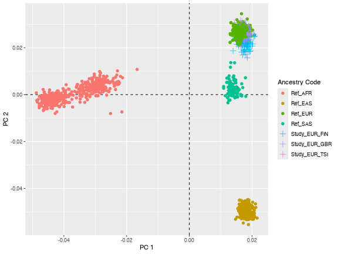

### `SexCheck()`


``` r
DataDir <- GXwasR:::GXwasR_data()
ResultDir <- tempdir()
finput <- "GXwasR_example"
LD <- TRUE
LD_window_size <- 50
LD_step_size <- 5
LD_r2_threshold <- 0.02
fmax_F <- 0.2
mmin_F <- 0.8
impute_sex <- FALSE
compute_freq <- FALSE

x <- SexCheck(
    DataDir = DataDir, ResultDir = ResultDir, finput = finput, impute_sex = impute_sex,
    compute_freq = compute_freq, LD_window_size = LD_window_size, LD_step_size = LD_step_size,
    LD_r2_threshold = 0.02, fmax_F = 0.2, mmin_F = 0.8
)

# Checking if there is any wrong sex assignment
problematic_sex <- x[x$STATUS != "OK", ]
problematic_sex
```


|    |FID     |IID     | PEDSEX| SNPSEX|STATUS  |      F|
|:---|:-------|:-------|------:|------:|:-------|------:|
|78  |EUR_FIN |HG00361 |      2|      0|PROBLEM | 0.4890|
|183 |EUR_TSI |NA20506 |      2|      0|PROBLEM | 0.7969|
|203 |EUR_TSI |NA20530 |      2|      0|PROBLEM | 0.7478|
|206 |EUR_TSI |NA20533 |      2|      0|PROBLEM | 0.3285|

### `Xhwe()`


``` r
DataDir <- GXwasR:::GXwasR_data()
ResultDir <- tempdir()
finput <- "GXwasR_example"
foutput <- "Test_output"
x <- Xhwe(
    DataDir = DataDir, ResultDir = ResultDir,
    finput = finput, foutput = foutput, filterSNP = TRUE
)
#> ✔ Output PLINK files, prefixed as female, are in /var/folders/d6/gtwl3_017sj4pp14fbfcbqjh0000gp/T//RtmpcRh9ZZ
#> This test is running on a case-control dataset with female samples.
#> ℹ Failed SNPs are excluded from the output PLINK files prefixed as Test_output is in
#> /var/folders/d6/gtwl3_017sj4pp14fbfcbqjh0000gp/T//RtmpcRh9ZZ
x
#> [1] "rs56053951" "rs12353847" "rs5940058"
```

### `MAFdiffSexControl()`


``` r
DataDir <- GXwasR:::GXwasR_data()
ResultDir <- tempdir()
finput <- "GXwasR_example"
foutput <- "Test_output"
x <- MAFdiffSexControl(DataDir, ResultDir, finput, filterSNP = TRUE, foutput = foutput)
#> ℹ No SNP to be flagged or excluded.
x
#> NULL
```

### `FilterRegion()`


``` r
DataDir <- GXwasR:::GXwasR_data()
ResultDir <- tempdir()
finput <- "GXwasR_example"
foutput <- "PostimputeEX_QC1"
x <- FilterRegion(
    DataDir = DataDir, ResultDir = ResultDir,
    finput = finput, foutput = foutput, CHRX = TRUE, CHRY = FALSE,
    filterPAR = TRUE, filterXTR = TRUE, filterAmpliconic = TRUE,
    regionfile = FALSE, filterCHR = NULL, Hg = "38", exclude = TRUE
)
#> ℹ chrX
#> ✖ There is no PAR region in the input data. Argument filterPAR cannot set to be TRUE.
#> ℹ Changing filterPAR to FALSE
#> ✖ There is no XTR region in the input data. Argument filterXTR cannot set to be TRUE.
#> ℹ Changing filterXTR to FALSE
#> ℹ Ampliconic SNPs:9
#> ℹ 9 SNPs are discarded.
#> ✔ PLINK files with passed SNPs are in /var/folders/d6/gtwl3_017sj4pp14fbfcbqjh0000gp/T//RtmpcRh9ZZ prefixed as PostimputeEX_QC1
#> ✔ PLINK files with discarded SNPs are in /var/folders/d6/gtwl3_017sj4pp14fbfcbqjh0000gp/T//RtmpcRh9ZZ prefixed as PostimputeEX_QC1_snps_extracted
x
#> $PAR
#> NULL
#> 
#> $XTR
#> NULL
#> 
#> $Ampliconic
#>   CHR         SNP START       END A1 A2
#> 1  23  rs62602496     0  48349540  G  A
#> 2  23   rs6612314     0  55442087  A  C
#> 3  23 rs151231489     0  55445831  C  A
#> 4  23  rs73498395     0  71740842  T  C
#> 5  23      rs6527     0  73066891  A  C
#> 6  23   rs4907822     0 102264099  A  G
#> 7  23 rs142219143     0 102354248  G  A
#> 8  23   rs5987512     0 102483549  G  C
#> 9  23 rs139353379     0 103970756  G  A
```

### `GXwas()`


``` r
DataDir <- GXwasR:::GXwasR_data()
ResultDir <- tempdir()
finput <- "GXwasR_example"
standard_beta <- TRUE
xsex <- FALSE
sex <- TRUE
Inphenocov <- NULL
covartest <- NULL
interaction <- FALSE
MF.na.rm <- FALSE
B <- 10000
MF.zero.sub <- 0.00001
trait <- "binary"
xmodel <- "FMcombx02"
combtest <- "fisher.method"
snp_pval <- 1e-08
covarfile <- NULL
ncores <- 0
MF.mc.cores <- 1
ResultGXwas <- GXwas(
    DataDir = DataDir, ResultDir = ResultDir,
    finput = finput, xmodel = xmodel, trait = trait, covarfile = covarfile,
    sex = sex, xsex = xsex, combtest = combtest, MF.p.corr = "none",
    snp_pval = snp_pval, plot.jpeg = TRUE, suggestiveline = 5, genomewideline = 7.3,
    MF.mc.cores = 1, ncores = ncores
)
#> • Running FMcombx02 model
ResultGXwas %>% head()
```


| CHR|SNP         |     BP|A1 |TEST | NMISS|     BETA|     SE|     L95|    U95|    STAT|      P|
|---:|:-----------|------:|:--|:----|-----:|--------:|------:|-------:|------:|-------:|------:|
|   1|rs143773730 |  73841|T  |ADD  |   276|  0.11850| 0.1923| -0.2584| 0.4953|  0.6161| 0.5378|
|   1|rs143773730 |  73841|T  |SEX  |   276|  0.24120| 0.2483| -0.2456| 0.7279|  0.9711| 0.3315|
|   1|rs75530702  | 720797|G  |ADD  |   276|  0.43500| 1.4220| -2.3530| 3.2230|  0.3058| 0.7598|
|   1|rs75530702  | 720797|G  |SEX  |   276|  0.25010| 0.2477| -0.2355| 0.7357|  1.0100| 0.3127|
|   1|rs147281566 | 775125|T  |ADD  |   276| -0.05108| 0.7425| -1.5060| 1.4040| -0.0688| 0.9452|
|   1|rs147281566 | 775125|T  |SEX  |   276|  0.25020| 0.2478| -0.2355| 0.7358|  1.0100| 0.3127|

### `PvalComb()`


``` r
data("Mfile", package = "GXwasR")
data("Ffile", package = "GXwasR")
SumstatMale <- Mfile
colnames(SumstatMale)[3] <- "POS"
SumstatFemale <- Ffile
colnames(SumstatFemale)[3] <- "POS"
PvalComb_Result <- PvalComb(
    SumstatMale = SumstatMale, SumstatFemale = SumstatFemale,
    combtest = "fisher.method", MF.mc.cores = 1, snp_pval = 0.001, plot.jpeg = FALSE,
    suggestiveline = 3, genomewideline = 5.69897, ncores = 1
)
#> ℹ Saving plot to /var/folders/d6/gtwl3_017sj4pp14fbfcbqjh0000gp/T//RtmpcRh9ZZ/Stratified_GWAS.png
```

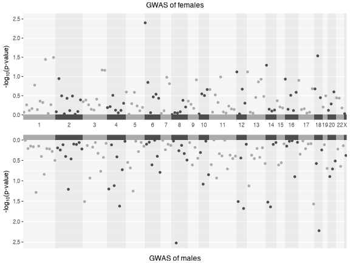

```
#> ℹ Saving plot to /var/folders/d6/gtwl3_017sj4pp14fbfcbqjh0000gp/T//RtmpcRh9ZZ/Stratified_XWAS.png
```

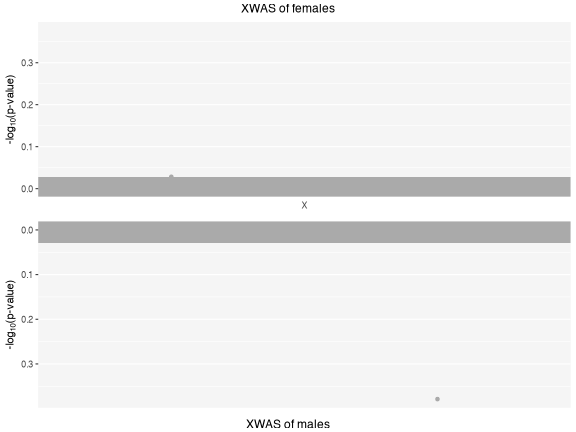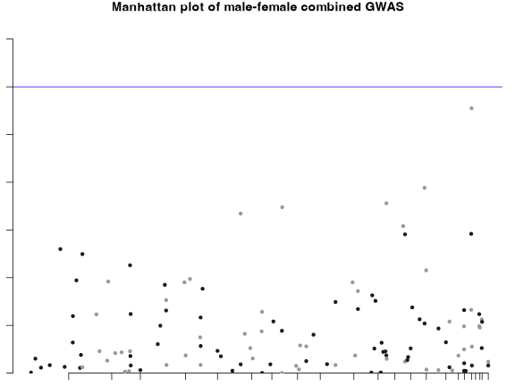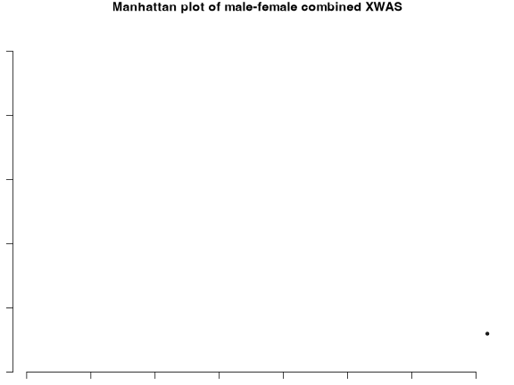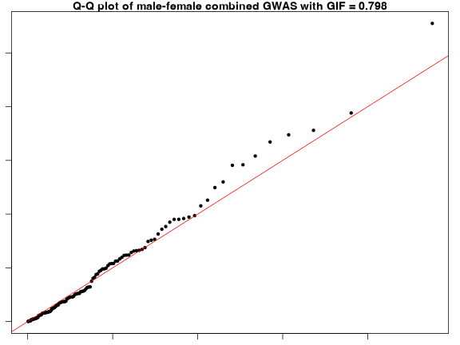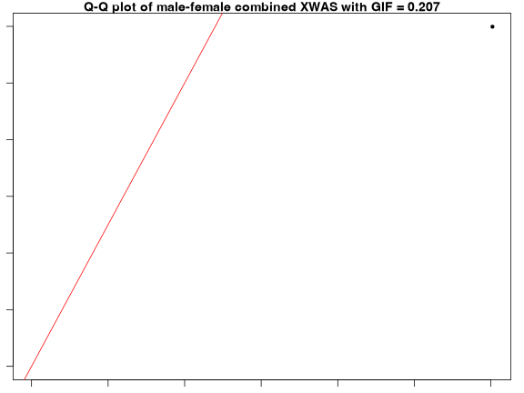

``` r
PvalComb_Result %>% head()
```


|SNP        | CHR|       POS|         P|
|:----------|---:|---------:|---------:|
|rs1015493  |   5|  11359627| 0.1305102|
|rs1028717  |  14|  85392037| 0.9297428|
|rs1030166  |   5| 140165657| 0.9436807|
|rs10416111 |  19|   8970692| 0.8329715|
|rs10494251 |   1| 145490518| 0.0501473|
|rs10518607 |   4| 133249707| 0.1032385|

### `SexDiff()`


``` r
data("Mfile", package = "GXwasR")
data("Ffile", package = "GXwasR")
Difftest <- SexDiff(Mfile, Ffile)
```

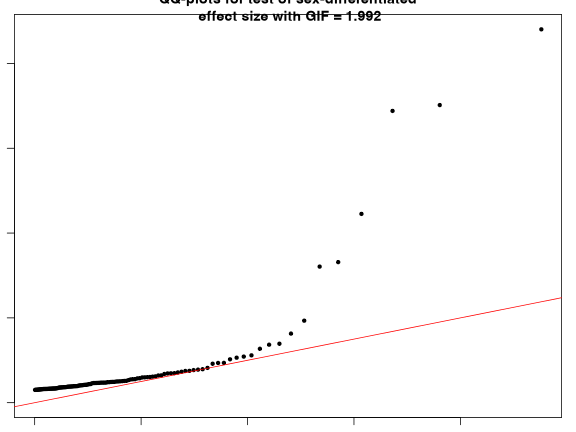

``` r
significant_snps <- Difftest[Difftest$adjP < 0.05, ]
significant_snps
```


|SNP        | CHR|        BP|A1 |    tstat|        P|      adjP|
|:----------|---:|---------:|:--|--------:|--------:|---------:|
|rs11073280 |  15|  35967595|C  | 6.156697| 0.00e+00| 0.0000002|
|rs12694063 |   2| 207445996|T  | 5.365174| 1.00e-07| 0.0000115|
|rs10894121 |  11| 129107457|A  | 5.300321| 1.00e-07| 0.0000158|
|rs11717371 |   3|  15077542|T  | 4.045074| 3.54e-05| 0.0042428|

### `SexDiffZscore()`


``` r
data("Example_h2data", package = "GXwasR")
inputdata <- Example_h2data
x <- SexDiffZscore(inputdata)
x
```


|ID   | Mstat|   Mse|  Fstat|   Fse|    Zscore|         p|      adjP|
|:----|-----:|-----:|------:|-----:|---------:|---------:|---------:|
|ADHD | 0.249| 0.021|  0.135| 0.028| 3.2571429| 0.0011254| 0.0090032|
|AFB  | 0.113| 0.010|  0.052| 0.004| 5.6637078| 0.0000000| 0.0000001|
|ALCC | 0.086| 0.010|  0.082| 0.011| 0.2690691| 0.7878765| 1.0000000|
|ALCD | 0.113| 0.031|  0.014| 0.052| 1.6353029| 0.1019856| 0.8158845|
|ANX  | 0.009| 0.003|  0.005| 0.002| 1.1094004| 0.2672575| 1.0000000|
|ASD  | 0.227| 0.019| -0.075| 0.034| 7.7537921| 0.0000000| 0.0000000|
|BD   | 0.364| 0.032|  0.339| 0.027| 0.5971027| 0.5504388| 1.0000000|
|CUE  | 0.076| 0.010|  0.067| 0.008| 0.7027819| 0.4821917| 1.0000000|

### `DiffZeroOne()`


``` r
data("Example_rgdata", package = "GXwasR")
inputdata <- Example_rgdata
colnames(inputdata) <- c("Trait", "Stat", "SE")
x <- DiffZeroOne(inputdata, FALSE, TRUE)
x
```


|Trait |  Stat|    SE|        p1|
|:-----|-----:|-----:|---------:|
|RTB   | 0.811| 0.041| 0.0000020|
|EA    | 0.919| 0.022| 0.0001158|
|BD    | 0.862| 0.057| 0.0077378|
|CUE   | 0.769| 0.091| 0.0055671|
|NEU   | 0.928| 0.029| 0.0065185|
|SCZ   | 0.923| 0.033| 0.0098153|
|AFB   | 0.886| 0.057| 0.0227501|
|SMKP  | 0.915| 0.044| 0.0266910|
|INS   | 0.786| 0.125| 0.0434483|
|ANX   | 0.678| 0.275| 0.1208177|
|ALCC  | 0.911| 0.090| 0.1613588|
|NEB   | 0.903| 0.097| 0.1586553|
|MDD   | 0.996| 0.305| 0.4947681|
|OCD   | 1.034| 0.564| 0.5240352|
|SMKC  | 1.022| 0.050| 0.6700314|
|ADHD  | 1.209| 0.127| 0.9500841|
### `TestXGene()`


``` r
data("XWAS_Summary_Example", package = "GXwasR")
DataDir <- GXwasR:::GXwasR_data()
ResultDir <- tempdir()
finput <- "GXwasR_example"
sumstat <- XWAS_Summary_Example
ref_data <- NULL
gene_file <- "Xlinkedgenes_hg19.txt"
gene_range <- 500000
max_gene <- 10
gene_approximation <- TRUE
beta_par <- c(1, 25)
weights_function <- NULL
geno_variance_weights <- "se.beta"
method <- "kuonen"
acc_devies <- 1e-8
lim_devies <- 1e+6
rho <- TRUE
skato_p_threshold <- 0.8
mac_threshold <- 3
sample_size <- 4000
reference_matrix_used <- FALSE
regularize_fun <- "LH"
pca_var_fraction <- 0.85
flm_basis_function <- "fourier"
flm_num_basis <- 25
flm_poly_order <- 4
flip_genotypes <- FALSE
omit_linear_variant <- FALSE
kernel_p_method <- "kuonen"
anno_type <- ""
GenetestResult <- TestXGene(DataDir, ResultDir, finput, sumstat, gene_file,
    gene_range, score_file, ref_data, max_gene, sample_size,
    genebasedTest = "SKAT",
    gene_approximation, beta_par, weights_function, geno_variance_weights,
    kernel_p_method, acc_devies, lim_devies, rho, skato_p_threshold, anno_type,
    mac_threshold, reference_matrix_used, regularize_fun, pca_var_fraction,
    flm_basis_function, flm_num_basis, flm_poly_order, flip_genotypes,
    omit_linear_variant
)
#> ℹ 80 of 80 variants found in reference
#> ℹ Effect sizes recoded for 0 variant(s)
#> ✔ Allele frequencies found and linked
#> ✔ File /private/var/folders/d6/gtwl3_017sj4pp14fbfcbqjh0000gp/T/RtmpcRh9ZZ/gene.test.score.file.vcf.gz has been created and indexed
#> ℹ 157 genes are having 321 SNPs
#> • SNP-SNP correlation matrices are being created...
#> ✔ SNP-SNP correlation matrices are done.
#> ! Warning: No variants to analyze in gene uc004cqy.3, skipped
#> ! Warning: No variants to analyze in gene uc004csf.3, skipped
#> ! Warning: No variants to analyze in gene uc004csr.3, skipped
#> ! Warning: No variants to analyze in gene uc004cst.2, skipped
#> ! Warning: No variants to analyze in gene uc004csu.1, skipped
#> ! Warning: No variants to analyze in gene uc004csx.4, skipped
#> ! Warning: No variants to analyze in gene uc004cuw.3, skipped
GenetestResult
```


|   |gene       | chrom|    start|      end| markers| filtered.markers| pvalue|
|:--|:----------|-----:|--------:|--------:|-------:|----------------:|------:|
|24 |uc004cqy.3 |    23|  2822010|  2847416|       0|                0|     NA|
|38 |uc004crr.3 |    23|  5808082|  6146706|       1|                1| 0.9365|
|49 |uc004csf.3 |    23|  8496914|  8700227|       0|                0|     NA|
|70 |uc004csr.3 |    23|  9433200|  9687780|       0|                0|     NA|
|71 |uc004cst.2 |    23|  9693452|  9734005|       0|                0|     NA|
|72 |uc004csu.1 |    23|  9754495|  9917481|       0|                0|     NA|
|74 |uc004csx.4 |    23|  9983794| 10112518|       0|                0|     NA|
|76 |uc004cti.4 |    23| 10413349| 10851809|       1|                1| 0.1846|
|82 |uc004cup.1 |    23| 11155662| 11683821|       1|                1| 0.9751|
|85 |uc004cuw.3 |    23| 11776277| 11793872|       0|                0|     NA|

### `MetaGWAS()`


``` r
data("Summary_Stat_Ex1", package = "GXwasR")
data("Summary_Stat_Ex2", package = "GXwasR")
DataDir <- GXwasR:::GXwasR_data()
ResultDir <- tempdir()
SummData <- list(Summary_Stat_Ex1, Summary_Stat_Ex2)
SNPfile <- "UniqueLoci"
useSNPposition <- FALSE
UseA1 <- TRUE
GCse <- TRUE
byCHR <- FALSE
pval_filter <- "R"
top_snp_pval <- 1e-08
max_top_snps <- 10
chosen_snps_file <- NULL
pval_threshold_manplot <- 1e-05
plotname <- "Meta_Analysis.plot"
x <- MetaGWAS(
    DataDir = DataDir, SummData = SummData, ResultDir = ResultDir,
    SNPfile = NULL, useSNPposition = TRUE, UseA1 = UseA1, GCse = GCse,
    plotname = "Meta_Analysis.plot", pval_filter, top_snp_pval, max_top_snps,
    chosen_snps_file = NULL, byCHR, pval_threshold_manplot
)
#> ℹ Processing file number 1
#> ℹ Processing file number 2
#> ℹ Applying study-specific genomic control.
#> ℹ Applying study-specific genomic control.
#> Processing chromosome
```

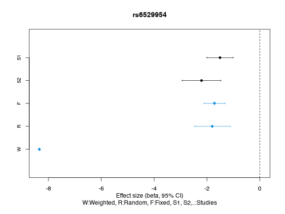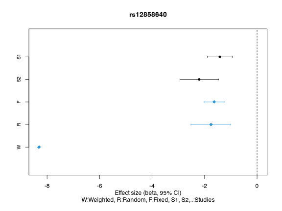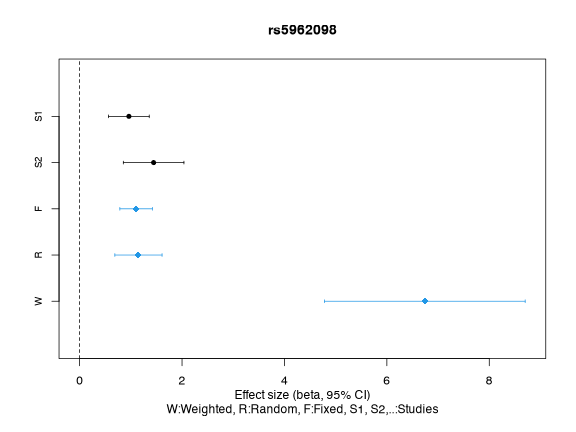

```
#> ✔ Forest plot files for Meta_Analysis.plot SNPs have been created.
#> ℹ You can find them in the directory: /var/folders/d6/gtwl3_017sj4pp14fbfcbqjh0000gp/T//RtmpcRh9ZZ
#> ✔ Forest plot files for Meta_Analysis.plot SNPs have been created.
#> ℹ You can find them in the directory: /var/folders/d6/gtwl3_017sj4pp14fbfcbqjh0000gp/T//RtmpcRh9ZZ
x$Resultfixed %>% head()
```


| CHR|      BP|SNP         |A1 |A2 |      Q|     I|         P|      ES|        SE|       CI_L|       CI_U|
|---:|-------:|:-----------|:--|:--|------:|-----:|---------:|-------:|---------:|----------:|----------:|
|   1|   73841|rs143773730 |T  |?  | 0.2588| 21.57| 0.5535000|  0.1108| 0.1869968| -0.2557137|  0.4773137|
|   1|  775125|rs147281566 |T  |?  | 0.7118|  0.00| 0.9414000| -0.0534| 0.7264282| -1.4771993|  1.3703993|
|   1|  863863|rs35854196  |A  |?  | 0.2820| 13.60| 0.5093000|  0.3621| 0.5486962| -0.7133445|  1.4375445|
|   1|  928969|rs115490086 |T  |?  |     NA|    NA| 0.6896000|  0.5649| 1.4143788| -2.2072824|  3.3370824|
|   1| 1109154|rs12041521  |A  |?  | 0.6258|  0.00| 0.0159200| -0.5550| 0.2302193| -1.0062299| -0.1037701|
|   1| 1127860|rs148527527 |G  |?  | 0.5778|  0.00| 0.0008237|  1.3978| 0.4179142|  0.5786881|  2.2169119|

``` r
x$ProblemSNP %>% head()
```


|File                                                                          |SNP        |Problem         |
|:-----------------------------------------------------------------------------|:----------|:---------------|
|/private/var/folders/d6/gtwl3_017sj4pp14fbfcbqjh0000gp/T/RtmpcRh9ZZ/SNPdata_2 |rs2803333  |ALLELE_MISMATCH |
|/private/var/folders/d6/gtwl3_017sj4pp14fbfcbqjh0000gp/T/RtmpcRh9ZZ/SNPdata_2 |rs672606   |ALLELE_MISMATCH |
|/private/var/folders/d6/gtwl3_017sj4pp14fbfcbqjh0000gp/T/RtmpcRh9ZZ/SNPdata_2 |rs7519955  |ALLELE_MISMATCH |
|/private/var/folders/d6/gtwl3_017sj4pp14fbfcbqjh0000gp/T/RtmpcRh9ZZ/SNPdata_2 |rs1538466  |ALLELE_MISMATCH |
|/private/var/folders/d6/gtwl3_017sj4pp14fbfcbqjh0000gp/T/RtmpcRh9ZZ/SNPdata_2 |rs61777960 |ALLELE_MISMATCH |
|/private/var/folders/d6/gtwl3_017sj4pp14fbfcbqjh0000gp/T/RtmpcRh9ZZ/SNPdata_2 |rs2865211  |ALLELE_MISMATCH |

### `ComputePRS()`


``` r
data("Summary_Stat_Ex1", package = "GXwasR")
data("Example_phenofile", package = "GXwasR")
data("Example_covarfile", package = "GXwasR")
data("Example_pthresoldfile", package = "GXwasR")
data("highLD_hg19", package = "GXwasR")
DataDir <- GXwasR:::GXwasR_data()
ResultDir <- tempdir()
finput <- "GXwasR_example"
summarystat <- Summary_Stat_Ex1[, c(2, 4, 7, 1, 3, 12)]
phenofile <- Example_phenofile # Cannot be NULL
# The interested phenotype column should be labeled as "Pheno1".
covarfile <- Example_covarfile
clump_p1 <- 0.0001
clump_p2 <- 0.0001
clump_kb <- 500
clump_r2 <- 0.5
byCHR <- TRUE
pthreshold <- Example_pthresoldfile$Threshold
ld_prunning <- TRUE
highLD_regions <- highLD_hg19
window_size <- 50
step_size <- 5
r2_threshold <- 0.02
nPC <- 6 # We can incorporate PCs into our PRS analysis to account for population stratification.
pheno_type <- "binary"

PRSresult <- ComputePRS(DataDir, ResultDir, finput, summarystat, phenofile, covarfile,
    effectsize = "BETA", LDreference = "GXwasR_example", ldclump = FALSE, clump_p1, clump_p2,
    clump_r2, clump_kb, byCHR = TRUE, pthreshold = pthreshold, highLD_regions = highLD_regions,
    ld_prunning = TRUE, window_size = 50, step_size = 5, r2_threshold = 0.02, nPC = 6,
    pheno_type = "binary"
)
#> Warning: cannot remove file '/private/var/folders/d6/gtwl3_017sj4pp14fbfcbqjh0000gp/T/RtmpcRh9ZZ/temp_libpath4e4d53c96c8f', reason 'Directory not empty'
#> ℹ 0.001
#> • Computing PRS for threshold 0.001
#> ℹ 0.05
#> • Computing PRS for threshold 0.05
#> ℹ 0.1
#> • Computing PRS for threshold 0.1
#> ℹ 0.2
#> • Computing PRS for threshold 0.2
#> ℹ 0.3
#> • Computing PRS for threshold 0.3
#> ℹ 0.4
#> • Computing PRS for threshold 0.4
#> ℹ 0.5
#> • Computing PRS for threshold 0.5
PRSresult$PRS %>% head()
```


|FID     |IID     | Pheno1| AGE| testcovar|       PC1|        PC2|        PC3|        PC4|        PC5|        PC6|     SCORE|
|:-------|:-------|------:|---:|---------:|---------:|----------:|----------:|----------:|----------:|----------:|---------:|
|EUR_FIN |HG00171 |      1|  36|         1| 0.0964618| -0.0382514|  0.0090380| -0.0895293| -0.0252291|  0.0146543| 0.0484212|
|EUR_FIN |HG00173 |      1|  81|         1| 0.0743932| -0.0567271|  0.0396994|  0.0205343|  0.0230410| -0.0360380| 0.0293742|
|EUR_FIN |HG00174 |      1|  83|         1| 0.0645349| -0.0561035| -0.0145786| -0.0264343| -0.0018095|  0.0144521| 0.0099674|
|EUR_FIN |HG00176 |      2|  75|         0| 0.0832472| -0.0560208|  0.0302654| -0.0011077| -0.0530371| -0.0335803| 0.1042060|
|EUR_FIN |HG00177 |      1|  88|         1| 0.0775687| -0.0094644|  0.0451785| -0.0373215| -0.0617431| -0.0719951| 0.0314303|
|EUR_FIN |HG00178 |      1|  24|         1| 0.0661714| -0.0504906|  0.0248539| -0.0828066|  0.0409418|  0.0055953| 0.0722689|

``` r
PRSresult$BestP
```


| Threshold|
|---------:|
|      0.05|

``` r
PRSresult$PRS_plot
#> Error in grid.Call.graphics(C_text, as.graphicsAnnot(x$label), x$x, x$y, : Metric information not available for this family/device
```

### `GeneticCorrBT()`


``` r
data("Example_phenofile", package = "GXwasR")
DataDir <- GXwasR:::GXwasR_data()
ResultDir <- tempdir()
finput <- "GXwasR_example"
byCHR <- TRUE
REMLalgo <- 0
nitr <- 3
ncores <- 3
phenofile <- Example_phenofile # Cannot be NULL
cat_covarfile <- NULL
quant_covarfile <- NULL
partGRM <- FALSE # Partition the GRM into m parts (by row),
autosome <- TRUE
Xsome <- TRUE
cripticut <- 0.025
minMAF <- 0.01 # if MAF filter apply
maxMAF <- 0.04
excludeResidual <- TRUE

genetic_correlation <- GeneticCorrBT(
    DataDir = DataDir, ResultDir = ResultDir, finput = finput, byCHR = byCHR,
    REMLalgo = 0, nitr = 10, phenofile = phenofile, cat_covarfile = NULL, quant_covarfile = NULL,
    partGRM = FALSE, autosome = TRUE, Xsome = TRUE, nGRM = 3,
    cripticut = 0.025, minMAF = NULL, maxMAF = NULL, excludeResidual = TRUE, ncores = ncores
)
#> Processing chromosome 1
#> Using GCTA version v1.94.4 Mac
#> ✖ Error: Log-likelihood not converged (stop after 10 iteractions). 
#> ℹ Note: to constrain the correlation being from -1 to 1, a genetic (or residual) variance-covariance matrix is bended to be positive definite. In this case, the SE is unreliable.
#> ✖ Convergence issue occurred, please:
#>   - set byCHR = TRUE
#>   - set different options
#>   - verify SNP partitioning or quality of the data
#> ℹ The result will be provided for the last iteration.
#> 
#> 
#> 
#> Processing chromosome 2
#> ✖ Error: Log-likelihood not converged (stop after 10 iteractions). 
#> ℹ Note: to constrain the correlation being from -1 to 1, a genetic (or residual) variance-covariance matrix is bended to be positive definite. In this case, the SE is unreliable.
#> ✖ Convergence issue occurred, please:
#>   - set byCHR = TRUE
#>   - set different options
#>   - verify SNP partitioning or quality of the data
#> ℹ The result will be provided for the last iteration.
#> 
#> 
#> 
#> Processing chromosome 3
#> ✖ Error: Log-likelihood not converged (stop after 10 iteractions). 
#> ✖ Convergence issue occurred, please:
#>   - set byCHR = TRUE
#>   - set different options
#>   - verify SNP partitioning or quality of the data
#> ℹ The result will be provided for the last iteration.
#> 
#> 
#> 
#> Processing chromosome 4
#> ✖ Error: Log-likelihood not converged (stop after 10 iteractions). 
#> ℹ Note: to constrain the correlation being from -1 to 1, a genetic (or residual) variance-covariance matrix is bended to be positive definite. In this case, the SE is unreliable.
#> ✖ Convergence issue occurred, please:
#>   - set byCHR = TRUE
#>   - set different options
#>   - verify SNP partitioning or quality of the data
#> ℹ The result will be provided for the last iteration.
#> 
#> 
#> 
#> Processing chromosome 5
#> ✖ Error: Log-likelihood not converged (stop after 10 iteractions). 
#> ℹ Note: to constrain the correlation being from -1 to 1, a genetic (or residual) variance-covariance matrix is bended to be positive definite. In this case, the SE is unreliable.
#> ✖ Convergence issue occurred, please:
#>   - set byCHR = TRUE
#>   - set different options
#>   - verify SNP partitioning or quality of the data
#> ℹ The result will be provided for the last iteration.
#> 
#> 
#> 
#> Processing chromosome 6
#> ✖ Error: Log-likelihood not converged (stop after 10 iteractions). 
#> ℹ Note: to constrain the correlation being from -1 to 1, a genetic (or residual) variance-covariance matrix is bended to be positive definite. In this case, the SE is unreliable.
#> ✖ Convergence issue occurred, please:
#>   - set byCHR = TRUE
#>   - set different options
#>   - verify SNP partitioning or quality of the data
#> ℹ The result will be provided for the last iteration.
#> 
#> 
#> 
#> Processing chromosome 7
#> ✖ Error: Log-likelihood not converged (stop after 10 iteractions). 
#> ℹ Note: to constrain the correlation being from -1 to 1, a genetic (or residual) variance-covariance matrix is bended to be positive definite. In this case, the SE is unreliable.
#> ✖ Convergence issue occurred, please:
#>   - set byCHR = TRUE
#>   - set different options
#>   - verify SNP partitioning or quality of the data
#> ℹ The result will be provided for the last iteration.
#> 
#> 
#> 
#> Processing chromosome 8
#> ✖ Error: Log-likelihood not converged (stop after 10 iteractions). 
#> ℹ Note: to constrain the correlation being from -1 to 1, a genetic (or residual) variance-covariance matrix is bended to be positive definite. In this case, the SE is unreliable.
#> ✖ Convergence issue occurred, please:
#>   - set byCHR = TRUE
#>   - set different options
#>   - verify SNP partitioning or quality of the data
#> ℹ The result will be provided for the last iteration.
#> 
#> 
#> 
#> Processing chromosome 9
#> ✖ Error: Log-likelihood not converged (stop after 10 iteractions). 
#> ℹ Note: to constrain the correlation being from -1 to 1, a genetic (or residual) variance-covariance matrix is bended to be positive definite. In this case, the SE is unreliable.
#> ✖ Convergence issue occurred, please:
#>   - set byCHR = TRUE
#>   - set different options
#>   - verify SNP partitioning or quality of the data
#> ℹ The result will be provided for the last iteration.
#> 
#> 
#> 
#> Processing chromosome 10
#> ✖ Error: Log-likelihood not converged (stop after 10 iteractions). 
#> ℹ Note: to constrain the correlation being from -1 to 1, a genetic (or residual) variance-covariance matrix is bended to be positive definite. In this case, the SE is unreliable.
#> ✖ Convergence issue occurred, please:
#>   - set byCHR = TRUE
#>   - set different options
#>   - verify SNP partitioning or quality of the data
#> ℹ The result will be provided for the last iteration.
#> 
#> 
#> 
#> Processing chromosome 23
#> ✔ GRM has been saved in the file [/var/folders/d6/gtwl3_017sj4pp14fbfcbqjh0000gp/T//RtmpcRh9ZZ/xGXwasR.grm.bin]
#> ℹ Number of SNPs in each pair of individuals has been saved in the file [/var/folders/d6/gtwl3_017sj4pp14fbfcbqjh0000gp/T//RtmpcRh9ZZ/xGXwasR.grm.N.bin]
#> 
#> 
#> 
#> Processing chromosome 24
#> ✖ Error: Log-likelihood not converged (stop after 10 iteractions). 
#> ℹ Note: to constrain the correlation being from -1 to 1, a genetic (or residual) variance-covariance matrix is bended to be positive definite. In this case, the SE is unreliable.
#> ✖ Convergence issue occurred, please:
#>   - set byCHR = TRUE
#>   - set different options
#>   - verify SNP partitioning or quality of the data
#> ℹ The result will be provided for the last iteration.
genetic_correlation %>% head()
```


| chromosome|Source    | Variance| SE|
|----------:|:---------|--------:|--:|
|          1|V.G._tr1  |  0.00000| NA|
|          1|V.G._tr2  |  0.00000| NA|
|          1|C.G._tr12 |  0.00000| NA|
|          1|V.e._tr1  |  0.23783| NA|
|          1|V.e._tr2  |  0.02517| NA|
|          1|X         |       NA| NA|

### `EstimateHerit()`


``` r
data("Summary_Stat_Ex1", package = "GXwasR")
data("highLD_hg19", package = "GXwasR")
DataDir <- GXwasR:::GXwasR_data()
ResultDir <- tempdir()
precomputedLD <- NULL
finput <- "GXwasR_example"
test.sumstats <- na.omit(Summary_Stat_Ex1[Summary_Stat_Ex1$TEST == "ADD", c(seq_len(4), 6:8)])
colnames(test.sumstats) <- c("chr", "rsid", "pos", "a1", "n_eff", "beta", "beta_se")
summarystat <- test.sumstats
ncores <- 3
model <- "GREML"
byCHR <- FALSE
r2_LD <- 0
LDSC_blocks <- 20
REMLalgo <- 0
nitr <- 3
cat_covarfile <- NULL
quant_covarfile <- NULL
prevalence <- 0.01
partGRM <- FALSE
autosome <- TRUE
Xsome <- TRUE
nGRM <- 3
cripticut <- 0.025
minMAF <- NULL
maxMAF <- NULL
hg <- "hg19"
PlotIndepSNP <- TRUE
IndepSNP_window_size <- 50
IndepSNP_step_size <- 5
IndepSNP_r2_threshold <- 0.02
highLD_regions <- highLD_hg19
H2 <- EstimateHerit(
    DataDir = DataDir, ResultDir = ResultDir, finput = finput,
    summarystat = NULL, ncores, model = "GREML", byCHR = TRUE, r2_LD = 0,
    LDSC_blocks = 20, REMLalgo = 0, nitr = 100, cat_covarfile = NULL, quant_covarfile = NULL,
    prevalence = 0.01, partGRM = FALSE, autosome = TRUE, Xsome = TRUE, nGRM = 3,
    cripticut = 0.025, minMAF = NULL, maxMAF = NULL, hg = "hg19", PlotIndepSNP = TRUE,
    IndepSNP_window_size = 50, IndepSNP_step_size = 5, IndepSNP_r2_threshold = 0.02,
    highLD_regions = highLD_hg19
)
#> Processing chromosome 1
#> Processing chromosome 2
#> Processing chromosome 3
#> Processing chromosome 4
#> Processing chromosome 5
#> Processing chromosome 6
#> Processing chromosome 7
#> Processing chromosome 8
#> Processing chromosome 9
#> Processing chromosome 10
#> Processing chromosome 23
#> ✔ GRM has been saved in the file [/var/folders/d6/gtwl3_017sj4pp14fbfcbqjh0000gp/T//RtmpcRh9ZZ/xGXwasR.grm.bin]
#> ℹ Number of SNPs in each pair of individuals has been saved in the file [/var/folders/d6/gtwl3_017sj4pp14fbfcbqjh0000gp/T//RtmpcRh9ZZ/xGXwasR.grm.N.bin]
#> 
#> 
#> 
#> Processing chromosome 24
#> ✔ Plots are saved in /var/folders/d6/gtwl3_017sj4pp14fbfcbqjh0000gp/T//RtmpcRh9ZZ with name Heritability_Plots.jpeg
#> ✔ All GRM related files are in /var/folders/d6/gtwl3_017sj4pp14fbfcbqjh0000gp/T//RtmpcRh9ZZ
H2 %>% head()
```


| Chromosome| SNP_proportion| No.of.genes| No.of.proteins|  Size_mb|Source    | Variance|       SE|
|----------:|--------------:|-----------:|--------------:|--------:|:---------|--------:|--------:|
|          1|      0.0277453|        2177|           1936| 249.2506|V(G)      | 0.000000| 0.054312|
|          1|      0.0277453|        2177|           1936| 249.2506|V(e)      | 0.239076| 0.058127|
|          1|      0.0277453|        2177|           1936| 249.2506|Vp        | 0.239076| 0.020390|
|          1|      0.0277453|        2177|           1936| 249.2506|V(G)/Vp   | 0.000001| 0.227173|
|          1|      0.0277453|        2177|           1936| 249.2506|V(G)/Vp_L | 0.000001| 0.131597|
|          2|      0.0275568|        1377|           1188| 243.1994|V(G)      | 0.000000| 0.050757|

### `SexRegress()`

``` r
data("Regression_Ex", package = "GXwasR")
fdata <- Regression_Ex
fdata$SEX <- as.factor(as.character(fdata$SEX))
response_index <- 1
regressor_index <- 2

x <- SexRegress(fdata, regressor_index, response_index)
x
#>    Estimate  Std. Error     t value    Pr(>|t|) 
#> 0.001305843 0.004337332 0.301070570 0.763594133
```

### `FilterPlinkSample()`


``` r
DataDir <- GXwasR:::GXwasR_data()
ResultDir <- tempdir()
finput <- "GXwasR_example"
foutput <- "casesPlink"
filter_sample <- "cases"
keep_remove_sample_file <- "samples_example"
keep <- FALSE

FilterPlinkSample(
    DataDir = DataDir, ResultDir = ResultDir,
    finput = finput, foutput = foutput, keep_remove_sample_file = keep_remove_sample_file,
    keep = keep
)
#> ✔ casesPlink PLINK files with desired samples are in /var/folders/d6/gtwl3_017sj4pp14fbfcbqjh0000gp/T//RtmpcRh9ZZ
#> NULL
```

### `ComputeGeneticPC()`

``` r
data("highLD_hg19", package = "GXwasR")
DataDir <- GXwasR:::GXwasR_data()
ResultDir <- tempdir()
finput <- "GXwasR_example"
highLD_regions <- highLD_hg19
ld_prunning <- "TRUE"
window_size <- 50
step_size <- 5
r2_threshold <- 0.02
countPC <- 20
## Genetic PC
GP <- ComputeGeneticPC(
    DataDir = DataDir, ResultDir = ResultDir,
    finput = finput, highLD_regions = highLD_hg19, countPC = 20
)
#> Warning: cannot remove file '/private/var/folders/d6/gtwl3_017sj4pp14fbfcbqjh0000gp/T/RtmpcRh9ZZ/temp_libpath4e4d53c96c8f', reason 'Directory not empty'
GP$PCs1 %>% head()
```


|V1      |V2      |        V3|         V4|         V5|         V6|         V7|         V8|         V9|        V10|        V11|        V12|        V13|        V14|        V15|        V16|        V17|        V18|        V19|        V20|        V21|        V22|
|:-------|:-------|---------:|----------:|----------:|----------:|----------:|----------:|----------:|----------:|----------:|----------:|----------:|----------:|----------:|----------:|----------:|----------:|----------:|----------:|----------:|----------:|
|EUR_FIN |HG00171 | 0.0964618| -0.0382514|  0.0090380| -0.0895293| -0.0252291|  0.0146543|  0.0153706| -0.0076534| -0.0055936|  0.0111945| -0.0292772|  0.0001423| -0.0344247| -0.0076093|  0.0160821| -0.1051830|  0.1415490| -0.0112478|  0.0171623| -0.0243035|
|EUR_FIN |HG00173 | 0.0743932| -0.0567271|  0.0396994|  0.0205343|  0.0230410| -0.0360380| -0.0422706| -0.0036093| -0.0133624|  0.0075615| -0.0808966| -0.0576625| -0.0426657| -0.0859803|  0.0511761| -0.0529104|  0.0896545|  0.0756350| -0.0112599| -0.0034034|
|EUR_FIN |HG00174 | 0.0645349| -0.0561035| -0.0145786| -0.0264343| -0.0018095|  0.0144521| -0.0223747|  0.0297751|  0.0460854|  0.0145766|  0.0413334| -0.0359086|  0.0016855|  0.1225740| -0.0197903| -0.0435513| -0.0530760| -0.0081402| -0.0208054| -0.0405354|
|EUR_FIN |HG00176 | 0.0832472| -0.0560208|  0.0302654| -0.0011077| -0.0530371| -0.0335803| -0.0772808|  0.0554254| -0.0124211| -0.0232910| -0.0896787| -0.0065826|  0.0044798|  0.0008519|  0.0037424|  0.0693772| -0.0460331| -0.0548226|  0.0251519|  0.0227838|
|EUR_FIN |HG00177 | 0.0775687| -0.0094644|  0.0451785| -0.0373215| -0.0617431| -0.0719951| -0.0718680| -0.0358363|  0.0750992|  0.0004759| -0.0146171| -0.0595273| -0.0020504| -0.0301174|  0.0271127|  0.0367063|  0.0220704|  0.0080734|  0.0021652| -0.0367468|
|EUR_FIN |HG00178 | 0.0661714| -0.0504906|  0.0248539| -0.0828066|  0.0409418|  0.0055953| -0.0220680| -0.0612912| -0.0328064| -0.0164471|  0.0347364| -0.0506891| -0.0068565|  0.1102030|  0.0692138|  0.0478395|  0.0104342|  0.0588439|  0.0424195| -0.0275438|

``` r
GP$plot
```

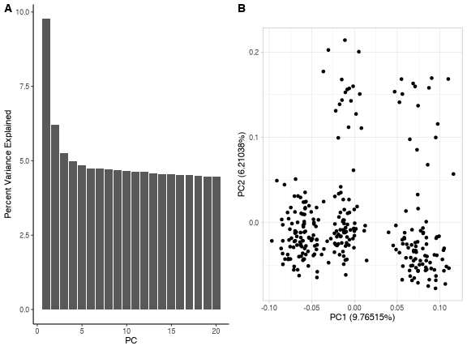

### `ClumpLD()`

``` r
data("Summary_Stat_Ex1", package = "GXwasR")
data("Summary_Stat_Ex2", package = "GXwasR")
DataDir <- GXwasR:::GXwasR_data()
ResultDir <- tempdir()
finput <- "GXwasR_example"
SNPdata <- list(Summary_Stat_Ex1, Summary_Stat_Ex2)
clump_p1 <- 0.0001
clump_p2 <- 0.001
clump_r2 <- 0.5
clump_kb <- 250
byCHR <- TRUE
clumpedResult <- ClumpLD(
    DataDir, finput, SNPdata, ResultDir, clump_p1,
    clump_p2, clump_r2, clump_kb, byCHR
)
#> • Processing summary statistics 1
#> • Processing summary statistics 2
#> • Running LD clumping for chromosome 1
#> ℹ No significant clump results for chromosome 1
#> • Running LD clumping for chromosome 2
#> ℹ No significant clump results for chromosome 2
#> • Running LD clumping for chromosome 3
#> ℹ No significant clump results for chromosome 3
#> • Running LD clumping for chromosome 4
#> ℹ No significant clump results for chromosome 4
#> • Running LD clumping for chromosome 5
#> ℹ No significant clump results for chromosome 5
#> • Running LD clumping for chromosome 6
#> ℹ No significant clump results for chromosome 6
#> • Running LD clumping for chromosome 7
#> ℹ No significant clump results for chromosome 7
#> • Running LD clumping for chromosome 8
#> ℹ No significant clump results for chromosome 8
#> • Running LD clumping for chromosome 9
#> ℹ No significant clump results for chromosome 9
#> • Running LD clumping for chromosome 10
#> ℹ No significant clump results for chromosome 10
#> • Running LD clumping for chromosome 23
#> • Running LD clumping for chromosome 24
#> ℹ No significant clump results for chromosome 24
clumpedResult
#> $BestClump
#>         INDEX       PSNP    RSQ     KB        P ALLELES      F    CHR
#>        <char>     <char> <char> <char>   <char>  <char> <char> <char>
#> 1:  rs6529954  rs6529954      *      0 4.41e-09   AA/GG      2     23
#> 2: rs12858640 rs12858640      *      0 3.89e-09   CC/TT      2     23
#> 3:  rs5962098  rs5962098      *      0 1.71e-06   AA/GG      2     23
#> 
#> $AllClump
#>      INDEX_SNP        SNP DISTANCE   RSQ  ALLELES     F        P   CHR
#>         <char>     <char>    <num> <num>   <char> <num>    <num> <int>
#>  1:  rs6529954  rs6529954      0.0 1.000  2.8e-09    NA       NA    23
#>  2:  rs6529954  rs5962098    -47.2 0.702    AG/GA     1 1.96e-06    23
#>  3:  rs6529954  rs5962098    -47.2 0.702    AG/GA     2 1.71e-06    23
#>  4:  rs6529954  rs6529954      0.0 1.000    AA/GG     2 4.41e-09    23
#>  5:  rs6529954 rs12858640     30.5 0.981    AC/GT     1 4.37e-09    23
#>  6:  rs6529954 rs12858640     30.5 0.981    AC/GT     2 3.89e-09    23
#>  7: rs12858640 rs12858640      0.0 1.000 4.37e-09    NA       NA    23
#>  8: rs12858640  rs5962098    -77.7 0.716    CG/TA     1 1.96e-06    23
#>  9: rs12858640  rs5962098    -77.7 0.716    CG/TA     2 1.71e-06    23
#> 10: rs12858640  rs6529954    -30.5 0.981    CA/TG     1 2.80e-09    23
#> 11: rs12858640  rs6529954    -30.5 0.981    CA/TG     2 4.41e-09    23
#> 12: rs12858640 rs12858640      0.0 1.000    CC/TT     2 3.89e-09    23
#> 13:  rs5962098  rs5962098      0.0 1.000 1.96e-06    NA       NA    23
#> 14:  rs5962098  rs5962098      0.0 1.000    AA/GG     2 1.71e-06    23
#> 15:  rs5962098  rs6529954     47.2 0.702    AG/GA     1 2.80e-09    23
#> 16:  rs5962098  rs6529954     47.2 0.702    AG/GA     2 4.41e-09    23
#> 17:  rs5962098 rs12858640     77.7 0.716    AT/GC     1 4.37e-09    23
#> 18:  rs5962098 rs12858640     77.7 0.716    AT/GC     2 3.89e-09    23
```

### `GetMFPlink()`

``` r
DataDir <- GXwasR:::GXwasR_data()
ResultDir <- tempdir()
finput <- "GXwasR_example"
foutput <- "Test_output"
sex <- "females"
x <- GetMFPlink(
    DataDir = DataDir, ResultDir = ResultDir,
    finput = finput, foutput = foutput, sex = sex,
    xplink = FALSE, autoplink = FALSE
)
#> ✔ Output PLINK files, prefixed as Test_output, are in /var/folders/d6/gtwl3_017sj4pp14fbfcbqjh0000gp/T//RtmpcRh9ZZ
x
#> NULL
```

### `plinkVCF()`


``` r
finput <- "GXwasR_example" # Plink file
foutput <- "GXwasR_example1"
DataDir <- GXwasR:::GXwasR_data()
ResultDir <- tempdir()
PtoV <- TRUE
VtoP <- FALSE
Famfile <- NULL
PVbyCHR <- FALSE
plinkVCF(DataDir, ResultDir, finput, foutput, VtoP, PtoV, Famfile, PVbyCHR)
#> ✔ Output files created in ResultDir: /var/folders/d6/gtwl3_017sj4pp14fbfcbqjh0000gp/T//RtmpcRh9ZZ
```

### `MergeRegion()`


``` r
DataDir <- GXwasR:::GXwasR_data()
ResultDir <- tempdir()
finput1 <- "GXwasR_example"
finput2 <- "GXwasR_example_imputed"
foutput <- "Test_output"
y <- MergeRegion(DataDir, ResultDir, finput1, finput2, foutput, use_common_snps = TRUE)
#> ✔ Merging is done using the common SNPs between the input genotype files.
#> ✔ Plink files with merged regions are in /var/folders/d6/gtwl3_017sj4pp14fbfcbqjh0000gp/T//RtmpcRh9ZZ prefixed as Test_output
y
#> NULL
```

### `FilterAllele()`


``` r
DataDir <- GXwasR:::GXwasR_data()
ResultDir <- tempdir()
finput <- "GXwasR_example"
foutput <- "Filter_Test"
x <- FilterAllele(DataDir, ResultDir, finput, foutput)
#> ℹ There is no multi-allelic SNP present in the input dataset.
x
#> NULL
```

### `PlinkSummary()`


``` r
DataDir <- GXwasR:::GXwasR_data()
ResultDir <- tempdir()
finput <- "GXwasR_example"
x <- PlinkSummary(DataDir, ResultDir, finput)
#> ℹ Dataset: GXwasR_example
#> ℹ Number of missing phenotypes: 0
#> ℹ Number of males: 125
#> ℹ Number of females: 151
#> ℹ This is case-control data
#> ℹ Number of cases: 108
#> ℹ Number of controls: 168
#> ℹ Number of cases in males: 53
#> ℹ Number of controls in males: 72
#> ℹ Number of cases in females: 55
#> ℹ Number of controls in females: 96
#> ℹ Number of chromosomes: 12
#>   - Chr: 1
#>   - Chr: 2
#>   - Chr: 3
#>   - Chr: 4
#>   - Chr: 5
#>   - Chr: 6
#>   - Chr: 7
#>   - Chr: 8
#>   - Chr: 9
#>   - Chr: 10
#>   - Chr: 23
#>   - Chr: 24
#> ℹ Total number of SNPs: 26527
#> ℹ Total number of samples: 276
x
#> NULL
```

### FilterSNP


``` r
DataDir <- GXwasR:::GXwasR_data()
ResultDir <- tempdir()
SNPvec <- c("rs6529954", "rs12858640", "rs5962098")
finput <- "GXwasR_example"
foutput <- "Filter_Test"
FilterSNP(DataDir, ResultDir, finput, foutput, SNPvec = SNPvec, extract = TRUE)
#> ℹ 3 SNPs are extracted
#> ✔ Plink files with extracted SNPs are in /var/folders/d6/gtwl3_017sj4pp14fbfcbqjh0000gp/T//RtmpcRh9ZZ prefixed as Filter_Test
#> NULL
```

### `DummyCovar()`


``` r
DataDir <- GXwasR:::GXwasR_data()
ResultDir <- tempdir()
bfile <- "GXwasR_example"
incovar <- "covarfile_w_pc_age.txt"
outcovar <- "dummycovarfile"
dummy_covars <- DummyCovar(
    DataDir = DataDir, ResultDir = ResultDir,
    bfile = bfile, incovar = incovar,
    outcovar = outcovar
)
#> ℹ Covariate file: dummycovarfile.cov is in /var/folders/d6/gtwl3_017sj4pp14fbfcbqjh0000gp/T//RtmpcRh9ZZ
dummy_covars %>% head()
```


|FID     |IID     | Categorical|
|:-------|:-------|-----------:|
|EUR_FIN |HG00171 |          -9|
|EUR_FIN |HG00173 |          -9|
|EUR_FIN |HG00174 |          -9|
|EUR_FIN |HG00176 |          -9|
|EUR_FIN |HG00177 |          -9|
|EUR_FIN |HG00178 |          -9|

### `GXWASmiami()`


``` r
data("Ffile", package = "GXwasR")
data("Mfile", package = "GXwasR")
FemaleWAS <- na.omit(Ffile[, c("SNP", "CHR", "BP", "P")])
colnames(FemaleWAS) <- c("SNP", "CHR", "POS", "pvalue")
MaleWAS <- na.omit(Mfile[, c("SNP", "CHR", "BP", "P")])
colnames(MaleWAS) <- c("SNP", "CHR", "POS", "pvalue")

GXWASmiami(FemaleWAS = FemaleWAS, MaleWAS = MaleWAS, snp_pval = 0.05)
#> • Generating Miami plots for stratified test.
#> ℹ Saving plot to /var/folders/d6/gtwl3_017sj4pp14fbfcbqjh0000gp/T//RtmpcRh9ZZ/Stratified_GWAS.png
```

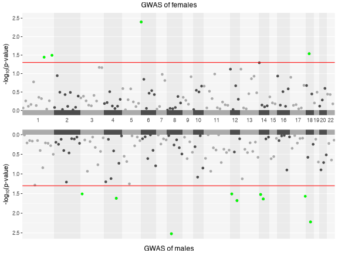

```
#> ✔ Miami plot of stratified GWAS is saved in /var/folders/d6/gtwl3_017sj4pp14fbfcbqjh0000gp/T//RtmpcRh9ZZ
```

### `SumstatGenCorr()`

``` r
sumstat1 <- GXwasR:::simulateSumstats()
sumstat2 <- GXwasR:::simulateSumstats()
if (nzchar(Sys.getenv("UKB_IMPUTED_HAPMAP2_PATH"))) {
    res <- SumstatGenCorr(
        ResultDir = tempdir(),
        referenceLD = "UKB_imputed_hapmap2_SVD_eigen99_extraction",
        sumstat1 = sumstat1,
        sumstat2 = sumstat2,
        parallel = TRUE
    )
    res
}
#> Analysis starts on Fri Aug  8 09:34:41 2025
#> ℹ 9321 out of 769306 (1.21%) SNPs in reference panel are available in GWAS 1.
#> ℹ 9356 out of 769306 (1.22%) SNPs in reference panel are available in GWAS 2.
#> ! Warning: More than 1% SNPs in reference panel are missed in GWAS 1. This may generate bias in estimation. Please make sure that you are using the correct reference panel.
#> ! Warning: More than 1% SNPs in reference panel are missed in GWAS 2. This may generate bias in estimation. Please make sure that you are using the correct reference panel.
#> 
  |                                                                                                                    
  |                                                                                                              |   0%
  |                                                                                                                    
  |==                                                                                                            |   2%
  |                                                                                                                    
  |====                                                                                                          |   3%
  |                                                                                                                    
  |=====                                                                                                         |   5%
  |                                                                                                                    
  |=======                                                                                                       |   6%
  |                                                                                                                    
  |=========                                                                                                     |   8%
  |                                                                                                                    
  |===========                                                                                                   |  10%
  |                                                                                                                    
  |============                                                                                                  |  11%
  |                                                                                                                    
  |==============                                                                                                |  13%
  |                                                                                                                    
  |================                                                                                              |  15%
  |                                                                                                                    
  |==================                                                                                            |  16%
  |                                                                                                                    
  |====================                                                                                          |  18%
  |                                                                                                                    
  |=====================                                                                                         |  19%
  |                                                                                                                    
  |=======================                                                                                       |  21%
  |                                                                                                                    
  |=========================                                                                                     |  23%
  |                                                                                                                    
  |===========================                                                                                   |  24%
  |                                                                                                                    
  |============================                                                                                  |  26%
  |                                                                                                                    
  |==============================                                                                                |  27%
  |                                                                                                                    
  |================================                                                                              |  29%
  |                                                                                                                    
  |==================================                                                                            |  31%
  |                                                                                                                    
  |===================================                                                                           |  32%
  |                                                                                                                    
  |=====================================                                                                         |  34%
  |                                                                                                                    
  |=======================================                                                                       |  35%
  |                                                                                                                    
  |=========================================                                                                     |  37%
  |                                                                                                                    
  |===========================================                                                                   |  39%
  |                                                                                                                    
  |============================================                                                                  |  40%
  |                                                                                                                    
  |==============================================                                                                |  42%
  |                                                                                                                    
  |================================================                                                              |  44%
  |                                                                                                                    
  |==================================================                                                            |  45%
  |                                                                                                                    
  |===================================================                                                           |  47%
  |                                                                                                                    
  |=====================================================                                                         |  48%
  |                                                                                                                    
  |=======================================================                                                       |  50%
  |                                                                                                                    
  |=========================================================                                                     |  52%
  |                                                                                                                    
  |===========================================================                                                   |  53%
  |                                                                                                                    
  |============================================================                                                  |  55%
  |                                                                                                                    
  |==============================================================                                                |  56%
  |                                                                                                                    
  |================================================================                                              |  58%
  |                                                                                                                    
  |==================================================================                                            |  60%
  |                                                                                                                    
  |===================================================================                                           |  61%
  |                                                                                                                    
  |=====================================================================                                         |  63%
  |                                                                                                                    
  |=======================================================================                                       |  65%
  |                                                                                                                    
  |=========================================================================                                     |  66%
  |                                                                                                                    
  |===========================================================================                                   |  68%
  |                                                                                                                    
  |============================================================================                                  |  69%
  |                                                                                                                    
  |==============================================================================                                |  71%
  |                                                                                                                    
  |================================================================================                              |  73%
  |                                                                                                                    
  |==================================================================================                            |  74%
  |                                                                                                                    
  |===================================================================================                           |  76%
  |                                                                                                                    
  |=====================================================================================                         |  77%
  |                                                                                                                    
  |=======================================================================================                       |  79%
  |                                                                                                                    
  |=========================================================================================                     |  81%
  |                                                                                                                    
  |==========================================================================================                    |  82%
  |                                                                                                                    
  |============================================================================================                  |  84%
  |                                                                                                                    
  |==============================================================================================                |  85%
  |                                                                                                                    
  |================================================================================================              |  87%
  |                                                                                                                    
  |==================================================================================================            |  89%
  |                                                                                                                    
  |===================================================================================================           |  90%
  |                                                                                                                    
  |=====================================================================================================         |  92%
  |                                                                                                                    
  |=======================================================================================================       |  94%
  |                                                                                                                    
  |=========================================================================================================     |  95%
  |                                                                                                                    
  |==========================================================================================================    |  97%
  |                                                                                                                    
  |============================================================================================================  |  98%
  |                                                                                                                    
  |==============================================================================================================| 100%
#> 
#> 
#> 
#> 
#> Integrating piecewise resultsPoint estimates:• Heritability of phenotype 1:  2.62e-10
#> • Heritability of phenotype 2:  4.26e-09
#> • Genetic Covariance:  -5.60e-05
#> • Genetic Correlation:  -52946.2415ℹ Continuing computing standard error with jackknife
#> 
  |                                                                                                                    
  |                                                                                                              |   0%
  |                                                                                                                    
  |==                                                                                                            |   2%
#> 
#> 
#> • Heritability of phenotype 1: 2.62e-10 ( 0.00e+00 )
#> • Heritability of phenotype 2: 4.26e-09 ( 0.00e+00 )
#> • Genetic Covariance: -5.60e-05 ( 0.00e+00 )
#> • Genetic Correlation: -52946.2415 ( 0.00e+00 )
#> • P: 0.00e+00
#> 
#> Analysis finished at Fri Aug  8 09:35:19 2025
#> $rg
#>           
#> -52946.24 
#> 
#> $rg.se
#> [1] 0
#> 
#> $P
#>   
#> 0 
#> 
#> $estimates.df
#>                          Estimate se
#> Heritability_1       2.623944e-10  0
#> Heritability_2       4.257231e-09  0
#> Genetic_Covariance  -5.595978e-05  0
#> Genetic_Correlation -5.294624e+04  0
#> 
#> $eigen.use
#> [1] 0.95
```

### `LDPrune()`


``` r
DataDir <- GXwasR:::GXwasR_data()
ResultDir <- tempdir()
finput <- "GXwasR_example"
prunedSNPs <- LDPrune(DataDir, finput, ResultDir, 50, 5, 0.2)
prunedSNPs %>% head()
#> [1] "rs143773730" "rs75530702"  "rs147281566" "rs35854196"  "rs115490086" "rs12041521"
```

### `executePlinkMAF()`


``` r
DataDir <- GXwasR:::GXwasR_data()
ResultDir <- tempdir()
finput <- "GXwasR_example"
maf_data <- executePlinkMAF(DataDir, ResultDir, finput)
maf_data %>% head()
```


| CHR|SNP         |A1 |A2 |      MAF| NCHROBS|
|---:|:-----------|:--|:--|--------:|-------:|
|   1|rs143773730 |T  |C  | 0.233700|     552|
|   1|rs75530702  |G  |A  | 0.003623|     552|
|   1|rs147281566 |T  |C  | 0.014490|     552|
|   1|rs35854196  |A  |G  | 0.027170|     552|
|   1|rs115490086 |T  |C  | 0.007246|     552|
|   1|rs12041521  |A  |G  | 0.202900|     552|

### `ComputeLD()`


``` r
snpld <- ComputeLD(
    DataDir = GXwasR:::GXwasR_data(), ResultDir = tempdir(),
    finput = "GXwasR_example", ByCHR = TRUE, CHRnum = 1, r2_LD = 0.2
)
snpld %>% head()
```


| CHR_A|    BP_A|SNP_A       | CHR_B|    BP_B|SNP_B       |       R2|
|-----:|-------:|:-----------|-----:|-------:|:-----------|--------:|
|     1| 1617443|rs112033089 |     1| 1711414|rs867207    | 0.247273|
|     1| 1821625|rs6603805   |     1| 1875530|rs2803333   | 0.220796|
|     1| 2793754|rs113572417 |     1| 2806390|rs112163476 | 1.000000|
|     1| 2838513|rs78083445  |     1| 2845752|rs10797367  | 0.476771|
|     1| 4520285|rs6426412   |     1| 4549482|rs667500    | 0.228998|
|     1| 4558972|rs13374152  |     1| 4580135|rs13375764  | 0.249483|

# Citing `GXwasR`

We hope that *[GXwasR](https://bioconductor.org/packages/3.21/GXwasR)* will be useful for your research. Please use the following information to cite the package and the overall approach. Thank you!


``` r
## Citation info
citation("GXwasR")
#> To cite package 'GXwasR' in publications use:
#> 
#>   Bose B, Blostein F, Kim J, Winters J, Actkins KV, Mayer D, Congivaram H, Niarchou M, Edwards DV, Davis
#>   LK, Stranger BE (2025). "GXwasR: A Toolkit for Investigating Sex-Differentiated Genetic Effects on
#>   Complex Traits." _medRxiv 2025.06.10.25329327_. doi:10.1101/2025.06.10.25329327
#>   <https://doi.org/10.1101/2025.06.10.25329327>.
#> 
#> A BibTeX entry for LaTeX users is
#> 
#>   @Article{,
#>     title = {GXwasR: A Toolkit for Investigating Sex-Differentiated Genetic Effects on Complex Traits},
#>     author = {Banabithi Bose and Freida Blostein and Jeewoo Kim and Jessica Winters and Ky’Era V. Actkins and David Mayer and Harrsha Congivaram and Maria Niarchou and Digna Velez Edwards and Lea K. Davis and Barbara E. Stranger},
#>     journal = {medRxiv 2025.06.10.25329327},
#>     year = {2025},
#>     doi = {10.1101/2025.06.10.25329327},
#>   }
```

# Reproducibility

The *[GXwasR](https://bioconductor.org/packages/3.21/GXwasR)* package (Bose, Blostein, Kim et al., 2025) was made possible thanks to:

* R (R Core Team, 2025)
* *[BiocStyle](https://bioconductor.org/packages/3.21/BiocStyle)* (Oleś, 2025)
* *[knitr](https://CRAN.R-project.org/package=knitr)* (Xie, 2025)
* *[RefManageR](https://CRAN.R-project.org/package=RefManageR)* (McLean, 2017)
* *[rmarkdown](https://CRAN.R-project.org/package=rmarkdown)* (Allaire, Xie, Dervieux et al., 2024)
* *[sessioninfo](https://CRAN.R-project.org/package=sessioninfo)* (Wickham, Chang, Flight et al., 2025)
* *[testthat](https://CRAN.R-project.org/package=testthat)* (Wickham, 2011)

`R` session information.


```
#> ─ Session info ───────────────────────────────────────────────────────────────────────────────────────────────────────
#>  setting  value
#>  version  R version 4.5.1 (2025-06-13)
#>  os       macOS Sequoia 15.6
#>  system   aarch64, darwin24.4.0
#>  ui       unknown
#>  language (EN)
#>  collate  en_US.UTF-8
#>  ctype    en_US.UTF-8
#>  tz       America/New_York
#>  date     2025-08-08
#>  pandoc   3.6.3 @ /Applications/Positron.app/Contents/Resources/app/quarto/bin/tools/aarch64/ (via rmarkdown)
#>  quarto   1.7.33 @ /usr/local/bin/quarto
#> 
#> ─ Packages ───────────────────────────────────────────────────────────────────────────────────────────────────────────
#>  package              * version    date (UTC) lib source
#>  abind                  1.4-8      2024-09-12 [2] CRAN (R 4.5.0)
#>  backports              1.5.0      2024-05-23 [2] CRAN (R 4.5.1)
#>  bibtex                 0.5.1      2023-01-26 [2] CRAN (R 4.5.0)
#>  bigassertr             0.1.7      2025-06-27 [2] CRAN (R 4.5.1)
#>  bigparallelr           0.3.2      2021-10-02 [2] CRAN (R 4.5.0)
#>  bigsnpr                1.12.18    2024-11-26 [2] CRAN (R 4.5.1)
#>  bigsparser             0.7.3      2024-09-06 [2] CRAN (R 4.5.1)
#>  bigstatsr              1.6.2      2025-07-29 [2] CRAN (R 4.5.1)
#>  Biobase                2.68.0     2025-04-15 [2] Bioconduc~
#>  BiocGenerics           0.54.0     2025-04-15 [2] Bioconduc~
#>  BiocIO                 1.18.0     2025-04-15 [2] Bioconduc~
#>  BiocManager            1.30.26    2025-06-05 [2] CRAN (R 4.5.0)
#>  BiocParallel           1.42.1     2025-06-01 [2] Bioconductor 3.21 (R 4.5.0)
#>  BiocStyle              2.36.0     2025-04-15 [2] Bioconduc~
#>  Biostrings             2.76.0     2025-04-15 [2] Bioconduc~
#>  bit                    4.6.0      2025-03-06 [2] CRAN (R 4.5.1)
#>  bit64                  4.6.0-1    2025-01-16 [2] CRAN (R 4.5.1)
#>  bitops                 1.0-9      2024-10-03 [2] CRAN (R 4.5.0)
#>  brio                   1.1.5      2024-04-24 [2] CRAN (R 4.5.1)
#>  broom                  1.0.9      2025-07-28 [2] CRAN (R 4.5.1)
#>  BSgenome               1.76.0     2025-04-15 [2] Bioconduc~
#>  cachem                 1.1.0      2024-05-16 [2] CRAN (R 4.5.0)
#>  calibrate              1.7.7      2020-06-19 [2] CRAN (R 4.5.0)
#>  callr                  3.7.6      2024-03-25 [2] CRAN (R 4.5.0)
#>  car                    3.1-3      2024-09-27 [2] CRAN (R 4.5.0)
#>  carData                3.0-5      2022-01-06 [2] CRAN (R 4.5.0)
#>  cli                    3.6.5      2025-04-23 [2] CRAN (R 4.5.0)
#>  codetools              0.2-20     2024-03-31 [4] CRAN (R 4.5.1)
#>  cowplot                1.2.0      2025-07-07 [2] CRAN (R 4.5.1)
#>  crayon                 1.5.3      2024-06-20 [2] CRAN (R 4.5.0)
#>  curl                   6.4.0      2025-06-22 [2] CRAN (R 4.5.1)
#>  data.table             1.17.8     2025-07-10 [2] CRAN (R 4.5.1)
#>  DelayedArray           0.34.1     2025-04-17 [2] Bioconduc~
#>  devtools             * 2.4.5      2022-10-11 [3] CRAN (R 4.5.0)
#>  digest                 0.6.37     2024-08-19 [2] CRAN (R 4.5.0)
#>  doParallel             1.0.17     2022-02-07 [2] CRAN (R 4.5.0)
#>  doRNG                  1.8.6.2    2025-04-02 [2] CRAN (R 4.5.0)
#>  doSNOW                 1.0.20     2022-02-04 [2] CRAN (R 4.5.0)
#>  dplyr                  1.1.4      2023-11-17 [2] CRAN (R 4.5.0)
#>  ellipsis               0.3.2      2021-04-29 [3] CRAN (R 4.5.0)
#>  evaluate               1.0.4      2025-06-18 [2] CRAN (R 4.5.1)
#>  farver                 2.1.2      2024-05-13 [2] CRAN (R 4.5.0)
#>  fastmap                1.2.0      2024-05-15 [2] CRAN (R 4.5.0)
#>  flock                  0.7        2016-11-12 [2] CRAN (R 4.5.1)
#>  foreach                1.5.2      2022-02-02 [2] CRAN (R 4.5.0)
#>  Formula                1.2-5      2023-02-24 [2] CRAN (R 4.5.0)
#>  fs                     1.6.6      2025-04-12 [2] CRAN (R 4.5.0)
#>  gdsfmt                 1.44.1     2025-07-09 [2] Bioconduc~
#>  generics               0.1.4      2025-05-09 [2] CRAN (R 4.5.0)
#>  GenomeInfoDb           1.44.1     2025-07-23 [2] Bioconduc~
#>  GenomeInfoDbData       1.2.14     2025-04-21 [2] Bioconductor
#>  GenomicAlignments      1.44.0     2025-04-15 [2] Bioconduc~
#>  GenomicRanges          1.60.0     2025-04-15 [2] Bioconduc~
#>  ggplot2                3.5.2      2025-04-09 [2] CRAN (R 4.5.0)
#>  ggpubr                 0.6.1      2025-06-27 [2] CRAN (R 4.5.1)
#>  ggrepel                0.9.6      2024-09-07 [2] CRAN (R 4.5.1)
#>  ggsignif               0.6.4      2022-10-13 [2] CRAN (R 4.5.0)
#>  glue                   1.8.0      2024-09-30 [2] CRAN (R 4.5.0)
#>  gridExtra              2.3        2017-09-09 [2] CRAN (R 4.5.0)
#>  gtable                 0.3.6      2024-10-25 [2] CRAN (R 4.5.0)
#>  GXwasR               * 0.99.0     2025-08-08 [1] Bioconductor
#>  hms                    1.1.3      2023-03-21 [2] CRAN (R 4.5.0)
#>  htmltools              0.5.8.1    2024-04-04 [2] CRAN (R 4.5.0)
#>  htmlwidgets            1.6.4      2023-12-06 [2] CRAN (R 4.5.0)
#>  httpuv                 1.6.16     2025-04-16 [2] CRAN (R 4.5.1)
#>  httr                   1.4.7      2023-08-15 [2] CRAN (R 4.5.0)
#>  IRanges                2.42.0     2025-04-15 [2] Bioconduc~
#>  iterators              1.0.14     2022-02-05 [2] CRAN (R 4.5.0)
#>  jsonlite               2.0.0      2025-03-27 [2] CRAN (R 4.5.0)
#>  knitr                  1.50       2025-03-16 [2] CRAN (R 4.5.0)
#>  labeling               0.4.3      2023-08-29 [2] CRAN (R 4.5.0)
#>  later                  1.4.2      2025-04-08 [2] CRAN (R 4.5.1)
#>  lattice                0.22-7     2025-04-02 [4] CRAN (R 4.5.1)
#>  lifecycle              1.0.4      2023-11-07 [2] CRAN (R 4.5.0)
#>  lubridate              1.9.4      2024-12-08 [2] CRAN (R 4.5.1)
#>  magrittr             * 2.0.3      2022-03-30 [2] CRAN (R 4.5.0)
#>  MASS                   7.3-65     2025-02-28 [4] CRAN (R 4.5.1)
#>  mathjaxr               1.8-0      2025-04-30 [2] CRAN (R 4.5.1)
#>  Matrix                 1.7-3      2025-03-11 [4] CRAN (R 4.5.1)
#>  MatrixGenerics         1.20.0     2025-04-15 [2] Bioconduc~
#>  matrixStats            1.5.0      2025-01-07 [2] CRAN (R 4.5.0)
#>  memoise                2.0.1      2021-11-26 [2] CRAN (R 4.5.0)
#>  mgcv                   1.9-3      2025-04-04 [4] CRAN (R 4.5.1)
#>  mime                   0.13       2025-03-17 [2] CRAN (R 4.5.0)
#>  miniUI                 0.1.2      2025-04-17 [3] CRAN (R 4.5.0)
#>  nlme                   3.1-168    2025-03-31 [4] CRAN (R 4.5.1)
#>  pillar                 1.11.0     2025-07-04 [2] CRAN (R 4.5.1)
#>  pkgbuild               1.4.8      2025-05-26 [2] CRAN (R 4.5.0)
#>  pkgconfig              2.0.3      2019-09-22 [2] CRAN (R 4.5.0)
#>  pkgdev                 0.1.0.9060 2025-08-04 [2] Github (dieghernan/pkgdev@e56f2a8)
#>  pkgload                1.4.0      2024-06-28 [2] CRAN (R 4.5.0)
#>  plyr                   1.8.9      2023-10-02 [2] CRAN (R 4.5.1)
#>  plyranges              1.28.0     2025-04-15 [2] Bioconduc~
#>  polynom                1.4-1      2022-04-11 [2] CRAN (R 4.5.0)
#>  poolr                  1.2-0      2025-05-07 [2] CRAN (R 4.5.0)
#>  prettyunits            1.2.0      2023-09-24 [2] CRAN (R 4.5.0)
#>  printr               * 0.3        2023-03-08 [2] CRAN (R 4.5.0)
#>  processx               3.8.6      2025-02-21 [2] CRAN (R 4.5.1)
#>  profvis                0.4.0      2024-09-20 [3] CRAN (R 4.5.0)
#>  progress               1.2.3      2023-12-06 [2] CRAN (R 4.5.0)
#>  promises               1.3.3      2025-05-29 [2] CRAN (R 4.5.0)
#>  ps                     1.9.1      2025-04-12 [2] CRAN (R 4.5.1)
#>  purrr                  1.1.0      2025-07-10 [2] CRAN (R 4.5.1)
#>  qqman                  0.1.9      2023-08-23 [2] CRAN (R 4.5.0)
#>  R.methodsS3            1.8.2      2022-06-13 [2] CRAN (R 4.5.0)
#>  R.oo                   1.27.1     2025-05-02 [2] CRAN (R 4.5.0)
#>  R.utils                2.13.0     2025-02-24 [2] CRAN (R 4.5.0)
#>  R6                     2.6.1      2025-02-15 [2] CRAN (R 4.5.0)
#>  ragg                   1.4.0      2025-04-10 [3] CRAN (R 4.5.0)
#>  rbibutils              2.3        2024-10-04 [2] CRAN (R 4.5.1)
#>  RColorBrewer           1.1-3      2022-04-03 [2] CRAN (R 4.5.0)
#>  Rcpp                   1.1.0      2025-07-02 [2] CRAN (R 4.5.1)
#>  RCurl                  1.98-1.17  2025-03-22 [2] CRAN (R 4.5.0)
#>  Rdpack                 2.6.4      2025-04-09 [2] CRAN (R 4.5.0)
#>  RefManageR           * 1.4.0      2022-09-30 [2] CRAN (R 4.5.1)
#>  regioneR               1.40.1     2025-06-01 [2] Bioconductor 3.21 (R 4.5.0)
#>  remotes                2.5.0      2024-03-17 [2] CRAN (R 4.5.0)
#>  restfulr               0.0.16     2025-06-27 [2] CRAN (R 4.5.1)
#>  rjson                  0.2.23     2024-09-16 [2] CRAN (R 4.5.0)
#>  rlang                  1.1.6      2025-04-11 [2] CRAN (R 4.5.0)
#>  rmarkdown            * 2.29       2024-11-04 [2] CRAN (R 4.5.0)
#>  rmio                   0.4.0      2022-02-17 [2] CRAN (R 4.5.0)
#>  rngtools               1.5.2      2021-09-20 [2] CRAN (R 4.5.0)
#>  rprojroot              2.1.0      2025-07-12 [2] CRAN (R 4.5.1)
#>  Rsamtools              2.24.0     2025-04-15 [2] Bioconduc~
#>  rstatix                0.7.2      2023-02-01 [2] CRAN (R 4.5.0)
#>  rtracklayer            1.68.0     2025-04-15 [2] Bioconduc~
#>  S4Arrays               1.8.1      2025-06-01 [2] Bioconductor 3.21 (R 4.5.0)
#>  S4Vectors              0.46.0     2025-04-15 [2] Bioconduc~
#>  scales                 1.4.0      2025-04-24 [2] CRAN (R 4.5.0)
#>  seqminer               9.7        2024-10-02 [2] CRAN (R 4.5.1)
#>  sessioninfo          * 1.2.3      2025-02-05 [2] CRAN (R 4.5.1)
#>  shiny                  1.11.1     2025-07-03 [2] CRAN (R 4.5.1)
#>  snow                   0.4-4      2021-10-27 [2] CRAN (R 4.5.0)
#>  SNPRelate              1.42.0     2025-04-15 [2] Bioconduc~
#>  SparseArray            1.8.1      2025-07-23 [2] Bioconduc~
#>  stringi                1.8.7      2025-03-27 [2] CRAN (R 4.5.0)
#>  stringr                1.5.1      2023-11-14 [2] CRAN (R 4.5.0)
#>  sumFREGAT              1.2.5      2022-06-07 [2] CRAN (R 4.5.1)
#>  SummarizedExperiment   1.38.1     2025-04-30 [2] Bioconductor 3.21 (R 4.5.0)
#>  sys                    3.4.3      2024-10-04 [2] CRAN (R 4.5.0)
#>  systemfonts            1.2.3      2025-04-30 [2] CRAN (R 4.5.0)
#>  testthat             * 3.2.3      2025-01-13 [2] CRAN (R 4.5.1)
#>  textshaping            1.0.1      2025-05-01 [3] CRAN (R 4.5.0)
#>  tibble                 3.3.0      2025-06-08 [2] CRAN (R 4.5.0)
#>  tidyr                  1.3.1      2024-01-24 [2] CRAN (R 4.5.1)
#>  tidyselect             1.2.1      2024-03-11 [2] CRAN (R 4.5.0)
#>  timechange             0.3.0      2024-01-18 [2] CRAN (R 4.5.1)
#>  tzdb                   0.5.0      2025-03-15 [2] CRAN (R 4.5.1)
#>  UCSC.utils             1.4.0      2025-04-15 [2] Bioconduc~
#>  urlchecker             1.0.1      2021-11-30 [3] CRAN (R 4.5.0)
#>  usethis              * 3.1.0      2024-11-26 [2] CRAN (R 4.5.0)
#>  vctrs                  0.6.5      2023-12-01 [2] CRAN (R 4.5.0)
#>  vroom                  1.6.5      2023-12-05 [2] CRAN (R 4.5.1)
#>  withr                  3.0.2      2024-10-28 [2] CRAN (R 4.5.0)
#>  xfun                   0.52       2025-04-02 [2] CRAN (R 4.5.0)
#>  XML                    3.99-0.18  2025-01-01 [2] CRAN (R 4.5.0)
#>  xml2                   1.3.8      2025-03-14 [2] CRAN (R 4.5.1)
#>  xtable                 1.8-4      2019-04-21 [2] CRAN (R 4.5.0)
#>  XVector                0.48.0     2025-04-15 [2] Bioconduc~
#>  yaml                   2.3.10     2024-07-26 [2] CRAN (R 4.5.0)
#> 
#>  [1] /private/var/folders/d6/gtwl3_017sj4pp14fbfcbqjh0000gp/T/RtmpcRh9ZZ/temp_libpath4e4d53c96c8f
#>  [2] /Users/mayerdav/Library/R/arm64/4.5/library
#>  [3] /opt/homebrew/lib/R/4.5/site-library
#>  [4] /opt/homebrew/Cellar/r/4.5.1/lib/R/library
#>  * ── Packages attached to the search path.
#> 
#> ──────────────────────────────────────────────────────────────────────────────────────────────────────────────────────
```

# Bibliography

This vignette was generated using *[BiocStyle](https://bioconductor.org/packages/3.21/BiocStyle)* (Oleś, 2025)
with *[knitr](https://CRAN.R-project.org/package=knitr)* (Xie, 2025) and *[rmarkdown](https://CRAN.R-project.org/package=rmarkdown)* (Allaire, Xie, Dervieux et al., 2024) running behind the scenes.

Citations made with *[RefManageR](https://CRAN.R-project.org/package=RefManageR)* (McLean, 2017).

<p><a id='bib-allaire2024rmarkdown'></a><a href="#cite-allaire2024rmarkdown">[1]</a><cite>
J. Allaire, Y. Xie, C. Dervieux, et al.
<em>rmarkdown: Dynamic Documents for R</em>.
R package version 2.29.
2024.
URL: <a href="https://github.com/rstudio/rmarkdown">https://github.com/rstudio/rmarkdown</a>.</cite></p>

<p><a id='bib-bose2025gxwasr'></a><a href="#cite-bose2025gxwasr">[2]</a><cite>
B. Bose, F. Blostein, J. Kim, et al.
&ldquo;GXwasR: A Toolkit for Investigating Sex-Differentiated Genetic Effects on Complex Traits&rdquo;.
In: <em>medRxiv 2025.06.10.25329327</em> (2025).
DOI: <a href="https://doi.org/10.1101/2025.06.10.25329327">10.1101/2025.06.10.25329327</a>.</cite></p>

<p><a id='bib-mclean2017refmanager'></a><a href="#cite-mclean2017refmanager">[3]</a><cite>
M. W. McLean.
&ldquo;RefManageR: Import and Manage BibTeX and BibLaTeX References in R&rdquo;.
In: <em>The Journal of Open Source Software</em> (2017).
DOI: <a href="https://doi.org/10.21105/joss.00338">10.21105/joss.00338</a>.</cite></p>

<p><a id='bib-ole2025biocstyle'></a><a href="#cite-ole2025biocstyle">[4]</a><cite>
A. Oleś.
<em>BiocStyle: Standard styles for vignettes and other Bioconductor documents</em>.
R package version 2.36.0.
2025.
DOI: <a href="https://doi.org/10.18129/B9.bioc.BiocStyle">10.18129/B9.bioc.BiocStyle</a>.
URL: <a href="https://bioconductor.org/packages/BiocStyle">https://bioconductor.org/packages/BiocStyle</a>.</cite></p>

<p><a id='bib-2025language'></a><a href="#cite-2025language">[5]</a><cite>
R Core Team.
<em>R: A Language and Environment for Statistical Computing</em>.
R Foundation for Statistical Computing.
Vienna, Austria, 2025.
URL: <a href="https://www.R-project.org/">https://www.R-project.org/</a>.</cite></p>

<p><a id='bib-wickham2011testthat'></a><a href="#cite-wickham2011testthat">[6]</a><cite>
H. Wickham.
&ldquo;testthat: Get Started with Testing&rdquo;.
In: <em>The R Journal</em> 3 (2011), pp. 5&ndash;10.
URL: <a href="https://journal.r-project.org/archive/2011-1/RJournal_2011-1_Wickham.pdf">https://journal.r-project.org/archive/2011-1/RJournal_2011-1_Wickham.pdf</a>.</cite></p>

<p><a id='bib-wickham2025sessioninfo'></a><a href="#cite-wickham2025sessioninfo">[7]</a><cite>
H. Wickham, W. Chang, R. Flight, et al.
<em>sessioninfo: R Session Information</em>.
R package version 1.2.3.
2025.
DOI: <a href="https://doi.org/10.32614/CRAN.package.sessioninfo">10.32614/CRAN.package.sessioninfo</a>.
URL: <a href="https://CRAN.R-project.org/package=sessioninfo">https://CRAN.R-project.org/package=sessioninfo</a>.</cite></p>

<p><a id='bib-xie2025knitr'></a><a href="#cite-xie2025knitr">[8]</a><cite>
Y. Xie.
<em>knitr: A General-Purpose Package for Dynamic Report Generation in R</em>.
R package version 1.50.
2025.
URL: <a href="https://yihui.org/knitr/">https://yihui.org/knitr/</a>.</cite></p>
