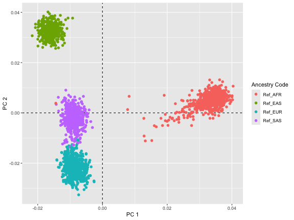

# Introduction

The pursuit of ancestral origins using genetic data has become increasingly accessible and sophisticated with the advent of genomics technology. Our R package GXwasR enables the identification of individuals of divergent ancestry through genotype datasets. This vignette provides an in-depth look at how GXwasR facilitates ancestry estimation, particularly focusing on its `AncestryCheck`() function.

# Identifying Divergent Ancestry
The core of ancestry estimation lies in combining the genotypes of a study population with those from a reference dataset, such as the HapMap or 1000 Genomes studies. This integration allows for the detection of population structure down to the level of the reference dataset, revealing continental-scale ancestry differences.

# Accessing GXwasR and Simulated Genotype Datasets
GXwasR is readily available on Bioconductor and can be installed using BiocManager::install("GXwasR"). The package includes a simulated genotype dataset prefixed as **GXwasR_example** as plink bed files (i.e., .bed, .fam, and .bim), ideal for users to experiment with. This simulated dataset consists of genotypes from 276 individuals across 26,527 genetic markers, providing a realistic scenario for testing the functionality.

Let's see more details of this genotype dataset that we will call 'Study data'.

``` r
library(GXwasR)
DataDir <- GXwasR:::GXwasR_data()
ResultDir <- tempdir()
finput <- "GXwasR_example"
x <- PlinkSummary(DataDir, ResultDir, finput)
#> ℹ Dataset: GXwasR_example
#> ℹ Number of missing phenotypes: 0
#> ℹ Number of males: 125
#> ℹ Number of females: 151
#> ℹ This is case-control data
#> ℹ Number of cases: 108
#> ℹ Number of controls: 168
#> ℹ Number of cases in males: 53
#> ℹ Number of controls in males: 72
#> ℹ Number of cases in females: 55
#> ℹ Number of controls in females: 96
#> ℹ Number of chromosomes: 12
#>   - Chr: 1
#>   - Chr: 2
#>   - Chr: 3
#>   - Chr: 4
#>   - Chr: 5
#>   - Chr: 6
#>   - Chr: 7
#>   - Chr: 8
#>   - Chr: 9
#>   - Chr: 10
#>   - Chr: 23
#>   - Chr: 24
#> ℹ Total number of SNPs: 26527
#> ℹ Total number of samples: 276
```

# AncestryCheck Function Overview
  
`AncestryCheck` is a comprehensive R function designed for comprehensive ancestry analysis in genetic studies. By leveraging plink software via R platform,it seamlessly integrates several critical steps: SNP filtering for data integrity, linkage disequilibrium (LD) pruning to reduce data complexity, correction of chromosome mismatches, and checking for allele flips to ensure data accuracy. Additionally, it adeptly merges study and reference datasets, conducts Principal Component Analysis (PCA) to unravel population structures, and incorporates outlier detection and visualization. This function is pivotal in comparing study samples' self-reported ancestry against reference populations, enabling a detailed analysis of population structure and the identification of divergent ancestries.
  
# Implemented workflow of ancestry estimation in AncestryCheck
The `AncestryCheck`() function in the GXwasR package is a sophisticated tool designed for ancestry analysis in genetic studies. It provides a comprehensive approach, from data preparation to advanced statistical analysis, for estimating ancestral backgrounds. Let's delve into the technical aspects and workflow of this function:

## Data Preparation:
1. **Directories and initial quality check:** The '`AncestryCheck`' function requires specific directories for inputting PLINK binary files and for saving output files. At this stage, the input genotype dataset, i.e., the study dataset, should have already undergone thorough quality control. GXwasR offers a range of functions to facilitate this preliminary quality check (QC) of genotype datasets, essential for accurate ancestry estimation. This QC process typically includes filtering out multi-allelic variants, selecting SNPs based on genotype call rate, filtering for specific chromosomes, SNP filtering grounded in minor allele frequency, adherence to Hardy-Weinberg equilibrium, and sample selection based on criteria like call rate, low missing rate, and heterozygosity thresholds. It's important to apply these filters in the appropriate sequence for optimal dataset preparation. For a more detailed understanding of this QC pipeline, users can refer to the comprehensive guide available at [https://boseb.github.io/GXwasR/articles/preimputationQC.html](https://boseb.github.io/GXwasR/articles/preimputationQC.html).

2. **Genomic Build and X-Chromosome Compatibility:** Users of the `AncestryCheck` function must ensure that both their study and reference datasets are aligned on the same genomic build, with consistent chromosome coding across the entire genome. This alignment is crucial, particularly since sex chromosomes (X and Y) often have different encoding conventions in genomic datasets. The `AncestryCheck` function is equipped to implicitly handle variations in sex chromosome encoding. However, users are advised to employ tools like Liftover or CrossMap for verifying and aligning genomic builds and chromosome codes between their study and reference datasets, thus ensuring compatibility and accuracy in the ancestry estimation process.

2. **Reference Dataset Selection:** The function offers users the flexibility to select from two established reference populations, such as, **HapMap phase III**[2] or the **1000 Genomes phase 3**[3] Projects. It is specifically designed to work seamlessly with the preprocessed genotype datasets of these reference panels. For users seeking to download and process these datasets, a comprehensive guidance was provided through a dedicated vignette. This detailed resource, which can be accessed at [https://boseb.github.io/Processing_1000Genome/tutorial.html](https://boseb.github.io/Processing_1000Genome/tutorial.html), offers step-by-step instructions on how to effectively prepare these reference datasets for use in ancestry analysis, ensuring users can make the most out of their genetic studies with the selected reference populations.

## SNP Filtering: 
The function incorporates a crucial step of SNP filtering for both study and reference datasets. This filtering process is particularly focused on excluding SNPs that do not conform to A-T or G-C base pairings. By implementing this filtering, `AncestryCheck` ensures the overall quality and reliability of the genetic data from both study and reference datasets. This step is vital in maintaining the integrity of the analysis, as it helps in eliminating potentially problematic SNPs that could skew the ancestry estimation results.

## LD Pruning: 
The function includes a critical step of LD-based filtering for both the study and reference datasets, which is essential in simplifying the genetic data by removing variants in high linkage disequilibrium. This process is especially significant for conducting accurate PCA on the study dataset SNPs. The default setting targets variants in LD with an `r2` value greater than 0.2 within a 50kb window. However, `AncestryCheck` offers users the flexibility to adjust these parameters according to their specific research needs. Users can choose whether or not to apply LD-based filtering and can modify parameters like the `r2` threshold and the `window size`. This adaptability ensures that the function can be tailored to a variety of study designs and research objectives, making it a versatile tool for ancestry analysis.

The '`AncestryCheck` then utilizes the list of pruned variants from the study data to proportionately adjust the reference dataset, aligning it to the scale of the study data. This harmonization is crucial for accurate comparative analysis and ensures consistency in the ancestral estimation process.

## Filter for known high-LD structure.
The '`AncestryCheck`' provides an additional layer of refinement by offering the option to filter out genomic ranges characterized by high-LD [4]. This feature is particularly beneficial for genomic builds hg19 and hg38, as it targets and removes regions within these builds that are known for their high-LD structures. These specific high-LD region files are already incorporated into the GXwasR package, readily accessible for use in `AncestryCheck`. This targeted filtering is crucial in further enhancing the quality and accuracy of the genetic data being analyzed, ensuring that the resulting ancestry estimation is as precise and reliable as possible.

## Genotype Data Processing for Merge:
The function includes a meticulous process to prepare genotype data for merging, addressing key issues that could otherwise compromise the accuracy of the analysis:

**Correcting Mismatches:** The function systematically corrects mismatches in chromosome IDs, positions, and allele annotations. This step is essential to ensure that the study and reference data align accurately, providing a reliable basis for subsequent analysis. By rectifying these discrepancies, `AncestryCheck` safeguards against potential errors that could arise from inconsistencies in the datasets.

**Handling Allele Flips:** Allele flips are a frequent complication in genotype data, where alleles may be reported in reverse order. The function is adept at identifying and rectifying these flips, thereby preserving the integrity of the genetic information. Given the importance of accurately matching SNPs, the ability to correct allele flips is crucial for error-free dataset merging.

**Dealing with Sex Chromosomes:** The encoding of sex chromosomes often differs from autosomal chromosomes, which can introduce additional complexity in matching study and reference datasets. `AncestryCheck` is designed to handle these variations effectively.

**Removing Mismatches Post-Flipping:** After the allele flipping process, the function performs a thorough check to identify any remaining mismatches. Any alleles that are still not aligned correctly after the flipping process are identified and removed from the reference dataset. This final step ensures that only perfectly matched SNPs are retained for the merged dataset, thereby enhancing the accuracy of the ancestral analysis.

Through these comprehensive steps, `AncestryCheck` ensures that the genotype datasets are optimally prepared for merging, laying a solid foundation for accurate and reliable ancestry estimation.

## Principal Component Analysis (PCA):
**Merging Datasets:** After preprocessing, the study and reference datasets are merged.

**Executing PCA:** PCA is then performed on the combined dataset, providing insights into the genetic variance and ancestral components. 

By implementing PCA on the harmonized genetic data, `AncestryCheck` effectively translates the nuanced genetic variations into interpretable patterns, facilitating a deeper understanding of the ancestral backgrounds inherent in the study population. This step is fundamental in transforming raw genetic data into meaningful insights about human ancestry and genetic diversity.

## Reference Populations:

**HapMap:** 
We combined and used HapMap data for the following populations:
AFR = ASW (African Ancestry in SW USA), LWK (Luhya in Webuye, Kenya), MKK (Maasai in Kinyawa, Kenya), and YRI (Yoruba in Ibadan, Nigeria).
EAS = CHB (Han Chinese in Beijing, China), CHD (Chinese in Metropolitan Denver, CO, USA), and JPT (Japanese in Tokyo, Japan).
EUR = CEU (CEPH/Utah Collection) and TSI (Toscani in Italia).
SAS = GIH (Gujarati Indians in Houston, Texas, USA).

**1000Genomes:** 
We used 1000Genomes data for the following super populations: 
AFR = ASW (African Ancestry in Southwest US), ACB (African Caribbean in Barbados), ESN (Esan in Nigeria), GWD (Gambian in Western Division, The Gambia), LWK (Luhya in Webuye, Kenya), MSL (Mende in Sierra Leone), and YRI (Yoruba in Ibadan, Nigeria).
EAS = CDX (Chinese Dai in Xishuangbanna, China), CHB (Han Chinese in Bejing, China), JPT (Japanese in Tokyo, Japan), KHV (Kinh in Ho Chi Minh City, Vietnam), and CHS (Southern Han Chinese, China).
EUR = GBR (British in England and Scotland), FIN (Finnish in Finland), IBS (Iberian populations in Spain), TSI (Toscani in Italy), and CEU (Utah residents with Northern and Western European ancestry).
SAS = BEB (Bengali in Bangladesh), GIH (Gujarati Indian in Houston,TX), ITU (Indian Telugu in the UK), PJL (Punjabi in Lahore,Pakistan), and STU (Sri Lankan Tamil in the UK).

More information can be found here: http://ftp.1000genomes.ebi.ac.uk/vol1/ftp/phase3/20131219.populations.tsv

## Outlier Detection and Ancestry Assignment Analysis:
**Flexibility in Reference Population Selection:** A key feature of the function is its versatility in handling various reference populations. Users have the freedom to select a specific reference population against which the study samples' ancestry labels are compared. For instance, setting the parameter `outlierOf` to EUR (i.e., `Ref_EUR`) enables the identification of non-European outliers in a European context. Other reference populations like AFR (African), EAS (East Asian), and SAS (South Asian) can also be used, allowing for a wide range of comparative ancestral analyses. This flexibility ensures that `AncestryCheck` can cater to diverse research needs and objectives.

**Setting Outlier/Prediction Thresholds:** The function allows users to define specific thresholds for outlier detection/ancestry assignement, adding a layer of customization to the analysis. It employs a methodical approach by calculating PC1 and PC2 Z-scores for each subject in relation to mean and standard deviation of PC1 and PC2 for each reference population. Samples with PC1 and PC2 Z-scores within the user-defined threshold are predicted as having the same ancestry as that reference population. For example, in the case of European reference samples, the function computes the mean and standard deviation of the first two principal components (`mean(PC1 of Ref_EUR)`, `sd(PC1 of Ref_EUR`), `mean(PC2 of Ref_EUR)`, `sd(PC2 of Ref_EUR)`). It then calculates Z-scores for PC1 and PC2 (`Z-score PC1 of Ref_EUR <- (PC1 - mean(PC1 of Ref_EUR))/sd(PC1 of Ref_EUR)`, `Z-score PC2 of Ref_EUR <- (PC2 - mean(PC2 of Ref_EUR))/sd(PC2 of Ref_EUR)` ) for the samples in relation to the European Reference. Any study sample whose PC1 and PC2 Z-score is considered an outlier of the European population. This approach is particularly effective in pinpointing samples with ancestral backgrounds that significantly deviate from the selected reference population, providing a clear and quantifiable method to identify and analyze outliers.

## Visualization and Reporting:
**PCA Plot Visualization:** One of the most insightful aspects of `AncestryCheck` is its ability to visually present the results of the PCA. This is done through a color-coded scatter plot that displays the first two principal components. This graphical representation is instrumental in highlighting the genetic similarities and differences among the analyzed populations. By plotting individuals on this scatter plot, researchers can easily discern the underlying genetic structure and observe how study samples cluster with or diverge from various reference populations.

**Resultant Dataframe:** Following the PCA and outlier analysis, `AncestryCheck` generates a dataframe that lists the identified outlier samples. This output is particularly useful for researchers, as it provides a clear and organized view of the samples that significantly differ genetically from the chosen reference population. This information is crucial for further detailed investigations and interpretations of genetic ancestry.

**Comprehensive Reporting:** In addition to the visual and tabular outputs, the function also produces detailed reports covering various aspects of the analysis. These reports include information on allele flips and a thorough breakdown of the outlier analysis. Such comprehensive reporting enhances the overall understanding of the genetic structure and ancestry estimations, providing a multi-dimensional view of the results. This feature of `AncestryCheck` is particularly valuable for researchers who require in-depth documentation and interpretation of their genetic data. 

# `AncestryCheck` parameters in brief
The ``AncestryCheck`` function takes several arguments to customize its operations:

- `DataDir`: Directory containing input PLINK files.
- `ResultDir`: Directory for storing output files; defaults to a temporary directory.
- `finput`: Prefix of PLINK binary files for study samples.
- `reference`: Choice of reference population data, either 'HapMapIII_NCBI36' or 'ThousandGenome'.
- `filterSNP`: Flag to enable or disable SNP filtering.
- `studyLD and referLD`: Flags for applying LD-based filtering on study and reference data, respectively.
- `studyLD_window_size`, `studyLD_step_size`, `studyLD_r2_threshold`, `referLD_window_size`, `referLD_step_size`, `referLD_r2_threshold`: Parameters for LD pruning.
- `highLD_regions`: Dataframe of known high LD regions.
- `study_pop`: Dataframe containing sample IDs and ancestry labels for study samples.
- `outlier`: Flag to enable or disable outlier detection.
- `outlierOf`: Reference ancestry name for detecting outlier samples.
- `outlier_threshold`: Numeric threshold for outlier detection.

# Detailed parameter description
Before exploring the practical application of the `AncestryCheck` function, it is essential to understand the details of the above arguments and their implications:

- `DataDir`: This parameter requires a character string specifying the file path for the input PLINK binary files. It is essential for indicating where the study's genetic data is stored.
- `ResultDir` (default = tempdir()): This argument is a character string for the file path where all output files will be stored. If not specified, it defaults to R's temporary directory.
- `finput`: This parameter specifies the prefix of the input PLINK binary files for the study samples.
- `reference` (default = c("HapMapIII_NCBI36", "ThousandGenome")): A vector indicating the choice of reference population. The options include HapMap Phase 3 and 1000 Genomes Phase III.
- `filterSNP` (default = TRUE): Indicates whether to filter out SNPs. It's set to TRUE by default but can be changed to FALSE if direct joining of study and reference samples is possible.
- `studyLD` (default = TRUE): This Boolean value determines whether LD-based filtering is applied to study genotype data.
- `studyLD_window_size` (default = 50): An integer defining the window size in variant count or kilobase for LD-based filtering of the variants for the study data.
- `studyLD_step_size` (default = 5): Specifies the variant count to shift the window at the end of each step for LD filtering of the study data.
- `studyLD_r2_threshold` (default = 0.02): A numeric value between 0 and 1 setting the pairwise r2 threshold for LD-based filtering of the study data.
- `referLD` (default = FALSE): Determines whether LD-based filtering is applied to reference genotype data.
- `referLD_window_size` (default = 50), referLD_step_size (default = 5), referLD_r2_threshold (default = 0.02): These parameters define the window size, step size, and r2 threshold for LD filtering of the reference data, similar to the study data settings.
- `highLD_regions`: This parameter requires a dataframe containing known high LD regions. A dataframe from Anderson et. al.[4], 'highLD_hg19' from hg19 genome built is provided in the package.
- `study_pop`: A dataframe containing two columns for the study: sample ID (IID) and the ancestry label. An example dataframe prefixed as 'example_data_study_sample_ancestry' for 'GXwasR_example' data.
- `outlier` (default = FALSE): A Boolean value specifying whether outlier detection will be performed.
- `outlierOf` (default = "EUR"): This parameter specifies the reference ancestry name for detecting outlier samples.
- `outlier_threshold` (default = 3): Specifies the numeric threshold for outlier detection. This threshold is multiplied with the Euclidean distance from the center of the PC1 and PC2 to the maximum Euclidean distance of the reference samples to determine outliers.

These parameters and their default values allow for a significant degree of customization in the `AncestryCheck` function, enabling users to tailor the analysis to their specific research needs.


# AncestryCheck Usage using HapMapIII Reference

The function can be used in the following manner with our study data and reference data as HapMapIII:


``` r
# Define parameters
library(GXwasR)
data("highLD_hg19", package = "GXwasR")
data("example_data_study_sample_ancestry", package = "GXwasR")

# Call the AncestryCheck function
hapmap_results <- AncestryCheck(
    DataDir = GXwasR:::GXwasR_data(),
    ResultDir = tempdir(),
    finput = "GXwasR_example",
    reference = "HapMapIII_NCBI36",
    filterSNP = TRUE,
    studyLD = TRUE,
    studyLD_window_size = 50,
    studyLD_step_size = 5,
    studyLD_r2_threshold = 0.02,
    referLD = FALSE,
    referLD_window_size = 50,
    referLD_step_size = 5,
    referLD_r2_threshold = 0.02,
    highLD_regions = highLD_hg19,
    study_pop = example_data_study_sample_ancestry,
    outlier = TRUE,
    outlierOf = "EUR",
    outlier_threshold = 3
)
#> 4214 ambiguous SNPs removed from study data.
#> 111854 ambiguous SNPs removed from reference data.
#> ! LD pruning is recommended for reference dataset. Set referLD = TRUE.
#> ✔ LD pruning was performed for study dataset.
#> 
#> ℹ Number of overlapping SNPs between study and reference data using rsID: 1096
```


```
#> ℹ No allele flips between study and reference data.
#> ℹ 9 samples are outliers of selected reference population.
#> ℹ 179 samples are NOT outliers of selected reference population.

Samples_with_predicted_ancestry <- hapmap_results[["Samples_with_predicted_ancestry"]]

outlier <- hapmap_results[["Outlier_samples"]]
outlier
```


|FID     |IID     |
|:-------|:-------|
|EUR_FIN |HG00189 |
|EUR_FIN |HG00280 |
|EUR_FIN |HG00315 |
|EUR_FIN |HG00332 |
|EUR_FIN |HG00349 |
|EUR_FIN |HG00350 |
|EUR_FIN |HG00377 |
|EUR_FIN |HG00383 |
|EUR_TSI |NA20537 |

``` r

Samples_with_predicted_ancestry[seq_len(5), ]
```


|FID     |IID     |Predicted Ancestry |
|:-------|:-------|:------------------|
|EUR_GBR |HG00096 |EUR                |
|EUR_GBR |HG00097 |EUR                |
|EUR_GBR |HG00099 |EUR                |
|EUR_GBR |HG00100 |EUR                |
|EUR_GBR |HG00101 |EUR                |

The plot shows the distribution of individual genetic samples along the first two principal components (PC1 and PC2). Each point represents a genetic sample, and they are color-coded based on reference populations (`Ref_ASIAN`, `Ref_CEU`, and `Ref_YRI`) and study populations (`Study_EUR_FIN`, `Study_EUR_GBR`, and `Study_EUR_TSI`).

The points are spread across the PCA plot, with each cluster likely representing genetic similarity within a group and differences between the groups. The reference populations, `Ref_AFR`, `Ref_EAS`, `Ref_EUR`, and `Ref_SAS` clustered distinctively, suggesting clear genetic differentiation between these populations. The study populations overlap with the `Ref_EUR` (`Euoprean`) reference population, indicating European ancestry, with each study subgroup (`FIN, GBR, TSI`) forming subclusters, suggesting finer-scale differences in ancestry within Europe. 

Since the study dataset was simulated from CEU 1000 Genome dataset, it is not surprising that we do see some outlier samples. Specifically, TSI population is not highly similar to CEU. 

# AncestryCheck Using ThousandGenome Reference

The function can be used in the following manner with our study data and reference data as ThousandGenome:


``` r
# Define parameters
data("highLD_hg19", package = "GXwasR")
data("example_data_study_sample_ancestry", package = "GXwasR")

thousandgenome_results <- AncestryCheck(
  DataDir = GXwasR:::GXwasR_data(), 
  ResultDir = tempdir(), 
  finput = "GXwasR_example", 
  reference = "ThousandGenome", 
  highLD_regions = highLD_hg19, 
  study_pop = example_data_study_sample_ancestry, 
  studyLD = TRUE, 
  referLD = TRUE, 
  outlierOf = "EUR", 
  outlier = TRUE, 
  outlier_threshold = 5
  )
#> 4214 ambiguous SNPs removed from study data.
#> No A-T or G-C SNPs found in reference data.
#> ✔ LD pruning was performed for reference dataset.
#> ✔ LD pruning was performed for study dataset.
#> 
#> ℹ Number of overlapping SNPs between study and reference data using rsID: 1005
```



```
#> ℹ No allele flips between study and reference data.
#> ✖ There is no outlier sample.
#> ✖ There are no non-outlier samples.

Samples_with_predicted_ancestry <- thousandgenome_results[["Samples_with_predicted_ancestry"]]

outlier <- thousandgenome_results[["Outlier_samples"]]
outlier
```


|FID |IID |
|:---|:---|

``` r

Samples_with_predicted_ancestry[seq_len(5), ]
```


|     |FID |IID |Predicted Ancestry |
|:----|:---|:---|:------------------|
|NA   |NA  |NA  |NA                 |
|NA.1 |NA  |NA  |NA                 |
|NA.2 |NA  |NA  |NA                 |
|NA.3 |NA  |NA  |NA                 |
|NA.4 |NA  |NA  |NA                 |

The lack of outlier samples—those that would be significantly distanced from the reference group—suggests homogeneity in the ancestry of the study population. Given that our study data was simulated based on the EUR population from the 1000 Genomes project data, the absence of outliers aligns with expectations.

The precise clustering and absence of outliers not only reaffirm the simulation parameters but also shows the reliability of the ancestry estimation methods employed. Such accuracy is crucial in genetic studies, as it reinforces confidence in the PCA's ability to discern and delineate ancestry with precision.

# Conclusion

The combination of genotype datasets from study populations with comprehensive reference datasets, followed by PCA, provides a nuanced view of ancestry. The GXwasR package simplifies this process, offering researchers and enthusiasts a robust tool for ancestry estimation. This efficient approach not only enhances our understanding of genetic diversity but also strengthens our connection to our ancestral past.

# References
(1) Purcell et. al.,(2007). PLINK: A Tool Set for Whole-Genome Association and Population-Based Linkage Analyses. The American Journal of Human Genetics, 81(3), 559-575. https://doi.org/10.1086/519795.

(2) The International HapMap 3 Consortium. Integrating common and rare genetic variation in diverse human populations. Nature 467, 52–58 (2010). https://doi.org/10.1038/nature09298

(3) The 1000 Genomes Project Consortium. A global reference for human genetic variation. Nature 526, 68–74 (2015). https://doi.org/10.1038/nature15393

(4) Anderson CA, Pettersson FH, Clarke GM, Cardon LR, Morris AP, Zondervan KT. Data quality control in genetic case-control association studies. Nat Protoc. 2010 Sep;5(9):1564-73. doi: 10.1038/nprot.2010.116. Epub 2010 Aug 26. PMID: 21085122; PMCID: PMC3025522.

# Citing `GXwasR`

We hope that *[GXwasR](https://bioconductor.org/packages/3.21/GXwasR)* will be useful for your research. Please use the following information to cite the package and the overall approach. Thank you!


``` r
## Citation info
citation("GXwasR")
#> To cite package 'GXwasR' in publications use:
#> 
#>   Bose B, Blostein F, Kim J, Winters J, Actkins KV, Mayer D, Congivaram H, Niarchou M, Edwards DV, Davis LK, Stranger BE (2025). "GXwasR: A Toolkit for Investigating
#>   Sex-Differentiated Genetic Effects on Complex Traits." _medRxiv 2025.06.10.25329327_. doi:10.1101/2025.06.10.25329327 <https://doi.org/10.1101/2025.06.10.25329327>.
#> 
#> A BibTeX entry for LaTeX users is
#> 
#>   @Article{,
#>     title = {GXwasR: A Toolkit for Investigating Sex-Differentiated Genetic Effects on Complex Traits},
#>     author = {Banabithi Bose and Freida Blostein and Jeewoo Kim and Jessica Winters and Ky’Era V. Actkins and David Mayer and Harrsha Congivaram and Maria Niarchou and Digna Velez Edwards and Lea K. Davis and Barbara E. Stranger},
#>     journal = {medRxiv 2025.06.10.25329327},
#>     year = {2025},
#>     doi = {10.1101/2025.06.10.25329327},
#>   }
```

# Reproducibility

The *[GXwasR](https://bioconductor.org/packages/3.21/GXwasR)* package (Bose, Blostein, Kim et al., 2025) was made possible thanks to:

* R (R Core Team, 2025)
* *[BiocStyle](https://bioconductor.org/packages/3.21/BiocStyle)* (Oleś, 2025)
* *[knitr](https://CRAN.R-project.org/package=knitr)* (Xie, 2025)
* *[RefManageR](https://CRAN.R-project.org/package=RefManageR)* (McLean, 2017)
* *[rmarkdown](https://CRAN.R-project.org/package=rmarkdown)* (Allaire, Xie, Dervieux et al., 2024)
* *[sessioninfo](https://CRAN.R-project.org/package=sessioninfo)* (Wickham, Chang, Flight et al., 2025)
* *[testthat](https://CRAN.R-project.org/package=testthat)* (Wickham, 2011)

This package was developed using *[biocthis](https://bioconductor.org/packages/3.21/biocthis)*.

`R` session information.


```
#> ─ Session info ───────────────────────────────────────────────────────────────────────────────────────────────────────
#>  setting  value
#>  version  R version 4.5.1 (2025-06-13)
#>  os       macOS Sequoia 15.5
#>  system   aarch64, darwin24.4.0
#>  ui       unknown
#>  language (EN)
#>  collate  en_US.UTF-8
#>  ctype    en_US.UTF-8
#>  tz       America/New_York
#>  date     2025-08-05
#>  pandoc   3.6.3 @ /Applications/Positron.app/Contents/Resources/app/quarto/bin/tools/aarch64/ (via rmarkdown)
#>  quarto   1.7.32 @ /usr/local/bin/quarto
#> 
#> ─ Packages ───────────────────────────────────────────────────────────────────────────────────────────────────────────
#>  ! package              * version    date (UTC) lib source
#>    abind                  1.4-8      2024-09-12 [2] CRAN (R 4.5.0)
#>    backports              1.5.0      2024-05-23 [2] CRAN (R 4.5.1)
#>    bibtex                 0.5.1      2023-01-26 [2] CRAN (R 4.5.0)
#>    bigassertr             0.1.7      2025-06-27 [2] CRAN (R 4.5.1)
#>    bigparallelr           0.3.2      2021-10-02 [2] CRAN (R 4.5.0)
#>    bigsnpr                1.12.18    2024-11-26 [2] CRAN (R 4.5.1)
#>    bigsparser             0.7.3      2024-09-06 [2] CRAN (R 4.5.1)
#>    bigstatsr              1.6.2      2025-07-29 [2] CRAN (R 4.5.1)
#>    Biobase                2.68.0     2025-04-15 [2] Bioconduc~
#>    BiocGenerics           0.54.0     2025-04-15 [2] Bioconduc~
#>    BiocIO                 1.18.0     2025-04-15 [2] Bioconduc~
#>    BiocManager            1.30.26    2025-06-05 [2] CRAN (R 4.5.0)
#>    BiocParallel           1.42.1     2025-06-01 [2] Bioconductor 3.21 (R 4.5.0)
#>    BiocStyle              2.36.0     2025-04-15 [2] Bioconduc~
#>    Biostrings             2.76.0     2025-04-15 [2] Bioconduc~
#>    bit                    4.6.0      2025-03-06 [2] CRAN (R 4.5.1)
#>    bit64                  4.6.0-1    2025-01-16 [2] CRAN (R 4.5.1)
#>    bitops                 1.0-9      2024-10-03 [2] CRAN (R 4.5.0)
#>    brio                   1.1.5      2024-04-24 [2] CRAN (R 4.5.1)
#>    broom                  1.0.9      2025-07-28 [2] CRAN (R 4.5.1)
#>    BSgenome               1.76.0     2025-04-15 [2] Bioconduc~
#>    cachem                 1.1.0      2024-05-16 [2] CRAN (R 4.5.0)
#>    calibrate              1.7.7      2020-06-19 [2] CRAN (R 4.5.0)
#>    callr                  3.7.6      2024-03-25 [2] CRAN (R 4.5.0)
#>    car                    3.1-3      2024-09-27 [2] CRAN (R 4.5.0)
#>    carData                3.0-5      2022-01-06 [2] CRAN (R 4.5.0)
#>    cli                    3.6.5      2025-04-23 [2] CRAN (R 4.5.0)
#>    codetools              0.2-20     2024-03-31 [4] CRAN (R 4.5.1)
#>    commonmark             2.0.0      2025-07-07 [2] CRAN (R 4.5.1)
#>    cowplot                1.2.0      2025-07-07 [2] CRAN (R 4.5.1)
#>    crayon                 1.5.3      2024-06-20 [2] CRAN (R 4.5.0)
#>    curl                   6.4.0      2025-06-22 [2] CRAN (R 4.5.1)
#>    data.table             1.17.8     2025-07-10 [2] CRAN (R 4.5.1)
#>    DelayedArray           0.34.1     2025-04-17 [2] Bioconduc~
#>    desc                   1.4.3      2023-12-10 [2] CRAN (R 4.5.0)
#>    devtools             * 2.4.5      2022-10-11 [3] CRAN (R 4.5.0)
#>    digest                 0.6.37     2024-08-19 [2] CRAN (R 4.5.0)
#>    doParallel             1.0.17     2022-02-07 [2] CRAN (R 4.5.0)
#>    doRNG                  1.8.6.2    2025-04-02 [2] CRAN (R 4.5.0)
#>    dplyr                  1.1.4      2023-11-17 [2] CRAN (R 4.5.0)
#>    ellipsis               0.3.2      2021-04-29 [3] CRAN (R 4.5.0)
#>    evaluate               1.0.4      2025-06-18 [2] CRAN (R 4.5.1)
#>    farver                 2.1.2      2024-05-13 [2] CRAN (R 4.5.0)
#>    fastmap                1.2.0      2024-05-15 [2] CRAN (R 4.5.0)
#>    flock                  0.7        2016-11-12 [2] CRAN (R 4.5.1)
#>    foreach                1.5.2      2022-02-02 [2] CRAN (R 4.5.0)
#>    Formula                1.2-5      2023-02-24 [2] CRAN (R 4.5.0)
#>    fs                     1.6.6      2025-04-12 [2] CRAN (R 4.5.0)
#>    gdsfmt                 1.44.1     2025-07-09 [2] Bioconduc~
#>    generics               0.1.4      2025-05-09 [2] CRAN (R 4.5.0)
#>    GenomeInfoDb           1.44.1     2025-07-23 [2] Bioconduc~
#>    GenomeInfoDbData       1.2.14     2025-04-21 [2] Bioconductor
#>    GenomicAlignments      1.44.0     2025-04-15 [2] Bioconduc~
#>    GenomicRanges          1.60.0     2025-04-15 [2] Bioconduc~
#>    ggplot2                3.5.2      2025-04-09 [2] CRAN (R 4.5.0)
#>    ggpubr                 0.6.1      2025-06-27 [2] CRAN (R 4.5.1)
#>    ggrepel                0.9.6      2024-09-07 [2] CRAN (R 4.5.1)
#>    ggsignif               0.6.4      2022-10-13 [2] CRAN (R 4.5.0)
#>    glue                   1.8.0      2024-09-30 [2] CRAN (R 4.5.0)
#>    gridExtra              2.3        2017-09-09 [2] CRAN (R 4.5.0)
#>    gtable                 0.3.6      2024-10-25 [2] CRAN (R 4.5.0)
#>  P GXwasR               * 0.99.0     2025-08-05 [?] Bioconductor
#>    hms                    1.1.3      2023-03-21 [2] CRAN (R 4.5.0)
#>    htmltools              0.5.8.1    2024-04-04 [2] CRAN (R 4.5.0)
#>    htmlwidgets            1.6.4      2023-12-06 [2] CRAN (R 4.5.0)
#>    httpuv                 1.6.16     2025-04-16 [2] CRAN (R 4.5.1)
#>    httr                   1.4.7      2023-08-15 [2] CRAN (R 4.5.0)
#>    hunspell               3.0.6      2025-03-22 [2] CRAN (R 4.5.1)
#>    IRanges                2.42.0     2025-04-15 [2] Bioconduc~
#>    iterators              1.0.14     2022-02-05 [2] CRAN (R 4.5.0)
#>    jsonlite               2.0.0      2025-03-27 [2] CRAN (R 4.5.0)
#>    knitr                  1.50       2025-03-16 [2] CRAN (R 4.5.0)
#>    labeling               0.4.3      2023-08-29 [2] CRAN (R 4.5.0)
#>    later                  1.4.2      2025-04-08 [2] CRAN (R 4.5.1)
#>    lattice                0.22-7     2025-04-02 [4] CRAN (R 4.5.1)
#>    lifecycle              1.0.4      2023-11-07 [2] CRAN (R 4.5.0)
#>    lubridate              1.9.4      2024-12-08 [2] CRAN (R 4.5.1)
#>    magrittr               2.0.3      2022-03-30 [2] CRAN (R 4.5.0)
#>    MASS                   7.3-65     2025-02-28 [4] CRAN (R 4.5.1)
#>    mathjaxr               1.8-0      2025-04-30 [2] CRAN (R 4.5.1)
#>    Matrix                 1.7-3      2025-03-11 [4] CRAN (R 4.5.1)
#>    MatrixGenerics         1.20.0     2025-04-15 [2] Bioconduc~
#>    matrixStats            1.5.0      2025-01-07 [2] CRAN (R 4.5.0)
#>    memoise                2.0.1      2021-11-26 [2] CRAN (R 4.5.0)
#>    mime                   0.13       2025-03-17 [2] CRAN (R 4.5.0)
#>    miniUI                 0.1.2      2025-04-17 [3] CRAN (R 4.5.0)
#>    pillar                 1.11.0     2025-07-04 [2] CRAN (R 4.5.1)
#>    pkgbuild               1.4.8      2025-05-26 [2] CRAN (R 4.5.0)
#>    pkgconfig              2.0.3      2019-09-22 [2] CRAN (R 4.5.0)
#>    pkgdev                 0.1.0.9060 2025-08-04 [2] Github (dieghernan/pkgdev@e56f2a8)
#>    pkgload                1.4.0      2024-06-28 [2] CRAN (R 4.5.0)
#>    plyr                   1.8.9      2023-10-02 [2] CRAN (R 4.5.1)
#>    plyranges              1.28.0     2025-04-15 [2] Bioconduc~
#>    poolr                  1.2-0      2025-05-07 [2] CRAN (R 4.5.0)
#>    prettyunits            1.2.0      2023-09-24 [2] CRAN (R 4.5.0)
#>    printr               * 0.3        2023-03-08 [2] CRAN (R 4.5.0)
#>    processx               3.8.6      2025-02-21 [2] CRAN (R 4.5.1)
#>    profvis                0.4.0      2024-09-20 [3] CRAN (R 4.5.0)
#>    progress               1.2.3      2023-12-06 [2] CRAN (R 4.5.0)
#>    promises               1.3.3      2025-05-29 [2] CRAN (R 4.5.0)
#>    ps                     1.9.1      2025-04-12 [2] CRAN (R 4.5.1)
#>    purrr                  1.1.0      2025-07-10 [2] CRAN (R 4.5.1)
#>    qqman                  0.1.9      2023-08-23 [2] CRAN (R 4.5.0)
#>    R.methodsS3            1.8.2      2022-06-13 [2] CRAN (R 4.5.0)
#>    R.oo                   1.27.1     2025-05-02 [2] CRAN (R 4.5.0)
#>    R.utils                2.13.0     2025-02-24 [2] CRAN (R 4.5.0)
#>    R6                     2.6.1      2025-02-15 [2] CRAN (R 4.5.0)
#>    ragg                   1.4.0      2025-04-10 [3] CRAN (R 4.5.0)
#>    rbibutils              2.3        2024-10-04 [2] CRAN (R 4.5.1)
#>    rcmdcheck              1.4.0      2021-09-27 [3] CRAN (R 4.5.0)
#>    RColorBrewer           1.1-3      2022-04-03 [2] CRAN (R 4.5.0)
#>    Rcpp                   1.1.0      2025-07-02 [2] CRAN (R 4.5.1)
#>    RCurl                  1.98-1.17  2025-03-22 [2] CRAN (R 4.5.0)
#>    Rdpack                 2.6.4      2025-04-09 [2] CRAN (R 4.5.0)
#>    RefManageR           * 1.4.0      2022-09-30 [2] CRAN (R 4.5.1)
#>    regioneR               1.40.1     2025-06-01 [2] Bioconductor 3.21 (R 4.5.0)
#>    remotes                2.5.0      2024-03-17 [2] CRAN (R 4.5.0)
#>    restfulr               0.0.16     2025-06-27 [2] CRAN (R 4.5.1)
#>    rjson                  0.2.23     2024-09-16 [2] CRAN (R 4.5.0)
#>    rlang                  1.1.6      2025-04-11 [2] CRAN (R 4.5.0)
#>    rmarkdown            * 2.29       2024-11-04 [2] CRAN (R 4.5.0)
#>    rmio                   0.4.0      2022-02-17 [2] CRAN (R 4.5.0)
#>    rngtools               1.5.2      2021-09-20 [2] CRAN (R 4.5.0)
#>    roxygen2               7.3.2      2024-06-28 [2] CRAN (R 4.5.0)
#>    rprojroot              2.1.0      2025-07-12 [2] CRAN (R 4.5.1)
#>    Rsamtools              2.24.0     2025-04-15 [2] Bioconduc~
#>    rstatix                0.7.2      2023-02-01 [2] CRAN (R 4.5.0)
#>    rstudioapi             0.17.1     2024-10-22 [2] CRAN (R 4.5.0)
#>    rtracklayer            1.68.0     2025-04-15 [2] Bioconduc~
#>    S4Arrays               1.8.1      2025-06-01 [2] Bioconductor 3.21 (R 4.5.0)
#>    S4Vectors              0.46.0     2025-04-15 [2] Bioconduc~
#>    scales                 1.4.0      2025-04-24 [2] CRAN (R 4.5.0)
#>    sessioninfo          * 1.2.3      2025-02-05 [2] CRAN (R 4.5.1)
#>    shiny                  1.11.1     2025-07-03 [2] CRAN (R 4.5.1)
#>    SNPRelate              1.42.0     2025-04-15 [2] Bioconduc~
#>    SparseArray            1.8.1      2025-07-23 [2] Bioconduc~
#>    spelling               2.3.1      2024-10-04 [2] CRAN (R 4.5.0)
#>    stringi                1.8.7      2025-03-27 [2] CRAN (R 4.5.0)
#>    stringr                1.5.1      2023-11-14 [2] CRAN (R 4.5.0)
#>    sumFREGAT              1.2.5      2022-06-07 [2] CRAN (R 4.5.1)
#>    SummarizedExperiment   1.38.1     2025-04-30 [2] Bioconductor 3.21 (R 4.5.0)
#>    sys                    3.4.3      2024-10-04 [2] CRAN (R 4.5.0)
#>    systemfonts            1.2.3      2025-04-30 [2] CRAN (R 4.5.0)
#>    testthat             * 3.2.3      2025-01-13 [2] CRAN (R 4.5.1)
#>    textshaping            1.0.1      2025-05-01 [3] CRAN (R 4.5.0)
#>    tibble                 3.3.0      2025-06-08 [2] CRAN (R 4.5.0)
#>    tidyr                  1.3.1      2024-01-24 [2] CRAN (R 4.5.1)
#>    tidyselect             1.2.1      2024-03-11 [2] CRAN (R 4.5.0)
#>    timechange             0.3.0      2024-01-18 [2] CRAN (R 4.5.1)
#>    tzdb                   0.5.0      2025-03-15 [2] CRAN (R 4.5.1)
#>    UCSC.utils             1.4.0      2025-04-15 [2] Bioconduc~
#>    urlchecker             1.0.1      2021-11-30 [3] CRAN (R 4.5.0)
#>    usethis              * 3.1.0      2024-11-26 [2] CRAN (R 4.5.0)
#>    vctrs                  0.6.5      2023-12-01 [2] CRAN (R 4.5.0)
#>    vroom                  1.6.5      2023-12-05 [2] CRAN (R 4.5.1)
#>    withr                  3.0.2      2024-10-28 [2] CRAN (R 4.5.0)
#>    xfun                   0.52       2025-04-02 [2] CRAN (R 4.5.0)
#>    XML                    3.99-0.18  2025-01-01 [2] CRAN (R 4.5.0)
#>    xml2                   1.3.8      2025-03-14 [2] CRAN (R 4.5.1)
#>    xopen                  1.0.1      2024-04-25 [3] CRAN (R 4.5.0)
#>    xtable                 1.8-4      2019-04-21 [2] CRAN (R 4.5.0)
#>    XVector                0.48.0     2025-04-15 [2] Bioconduc~
#>    yaml                   2.3.10     2024-07-26 [2] CRAN (R 4.5.0)
#> 
#>  [1] /private/var/folders/d6/gtwl3_017sj4pp14fbfcbqjh0000gp/T/RtmpdyNNez/temp_libpath548171db3e3e
#>  [2] /Users/mayerdav/Library/R/arm64/4.5/library
#>  [3] /opt/homebrew/lib/R/4.5/site-library
#>  [4] /opt/homebrew/Cellar/r/4.5.1/lib/R/library
#> 
#>  * ── Packages attached to the search path.
#>  P ── Loaded and on-disk path mismatch.
#> 
#> ──────────────────────────────────────────────────────────────────────────────────────────────────────────────────────
```


## Bibliography

This vignette was generated using *[BiocStyle](https://bioconductor.org/packages/3.21/BiocStyle)* (Oleś, 2025)
with *[knitr](https://CRAN.R-project.org/package=knitr)* (Xie, 2025) and *[rmarkdown](https://CRAN.R-project.org/package=rmarkdown)* (Allaire, Xie, Dervieux et al., 2024) running behind the scenes.

Citations made with *[RefManageR](https://CRAN.R-project.org/package=RefManageR)* (McLean, 2017).

<p><a id='bib-allaire2024rmarkdown'></a><a href="#cite-allaire2024rmarkdown">[1]</a><cite>
J. Allaire, Y. Xie, C. Dervieux, et al.
<em>rmarkdown: Dynamic Documents for R</em>.
R package version 2.29.
2024.
URL: <a href="https://github.com/rstudio/rmarkdown">https://github.com/rstudio/rmarkdown</a>.</cite></p>

<p><a id='bib-bose2025gxwasr'></a><a href="#cite-bose2025gxwasr">[2]</a><cite>
B. Bose, F. Blostein, J. Kim, et al.
&ldquo;GXwasR: A Toolkit for Investigating Sex-Differentiated Genetic Effects on Complex Traits&rdquo;.
In: <em>medRxiv 2025.06.10.25329327</em> (2025).
DOI: <a href="https://doi.org/10.1101/2025.06.10.25329327">10.1101/2025.06.10.25329327</a>.</cite></p>

<p><a id='bib-mclean2017refmanager'></a><a href="#cite-mclean2017refmanager">[3]</a><cite>
M. W. McLean.
&ldquo;RefManageR: Import and Manage BibTeX and BibLaTeX References in R&rdquo;.
In: <em>The Journal of Open Source Software</em> (2017).
DOI: <a href="https://doi.org/10.21105/joss.00338">10.21105/joss.00338</a>.</cite></p>

<p><a id='bib-ole2025biocstyle'></a><a href="#cite-ole2025biocstyle">[4]</a><cite>
A. Oleś.
<em>BiocStyle: Standard styles for vignettes and other Bioconductor documents</em>.
R package version 2.36.0.
2025.
DOI: <a href="https://doi.org/10.18129/B9.bioc.BiocStyle">10.18129/B9.bioc.BiocStyle</a>.
URL: <a href="https://bioconductor.org/packages/BiocStyle">https://bioconductor.org/packages/BiocStyle</a>.</cite></p>

<p><a id='bib-2025language'></a><a href="#cite-2025language">[5]</a><cite>
R Core Team.
<em>R: A Language and Environment for Statistical Computing</em>.
R Foundation for Statistical Computing.
Vienna, Austria, 2025.
URL: <a href="https://www.R-project.org/">https://www.R-project.org/</a>.</cite></p>

<p><a id='bib-wickham2011testthat'></a><a href="#cite-wickham2011testthat">[6]</a><cite>
H. Wickham.
&ldquo;testthat: Get Started with Testing&rdquo;.
In: <em>The R Journal</em> 3 (2011), pp. 5&ndash;10.
URL: <a href="https://journal.r-project.org/archive/2011-1/RJournal_2011-1_Wickham.pdf">https://journal.r-project.org/archive/2011-1/RJournal_2011-1_Wickham.pdf</a>.</cite></p>

<p><a id='bib-wickham2025sessioninfo'></a><a href="#cite-wickham2025sessioninfo">[7]</a><cite>
H. Wickham, W. Chang, R. Flight, et al.
<em>sessioninfo: R Session Information</em>.
R package version 1.2.3.
2025.
DOI: <a href="https://doi.org/10.32614/CRAN.package.sessioninfo">10.32614/CRAN.package.sessioninfo</a>.
URL: <a href="https://CRAN.R-project.org/package=sessioninfo">https://CRAN.R-project.org/package=sessioninfo</a>.</cite></p>

<p><a id='bib-xie2025knitr'></a><a href="#cite-xie2025knitr">[8]</a><cite>
Y. Xie.
<em>knitr: A General-Purpose Package for Dynamic Report Generation in R</em>.
R package version 1.50.
2025.
URL: <a href="https://yihui.org/knitr/">https://yihui.org/knitr/</a>.</cite></p>
