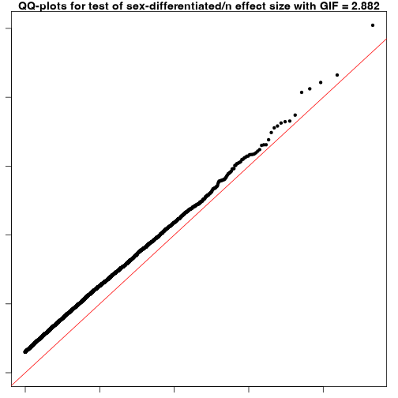

# Introduction
This document contains an example of running a GWAS with XWAS model and Sex-differential tests. 

Users must perform pre-imputation and post-imputation quality control (QC) on genotype dataset and then proceed with this tutorial in actual scenario. Please follow the detailed QC-ed steps provided in: [GXwasR_Preimputation](https://boseb.github.io/GXwasR/articles/preimputationQC.html) and [GXwasR_Postimputation](https://boseb.github.io/GXwasR/articles/postimputationQC.html).


# Example Datasets

The PLINK bed, bim, and fam files are the three mandatory files representing a genotype dataset to run this tutorial. To know about these file extensions, please check https://www.cog-genomics.org/plink/1.9/formats.

**GXwasR_example:**

- GXwasR_example.bed

- GXwasR_example.bim

- GXwasR_example.fam

These plink files contain genotypes for 276 individuals (males and females) simulated from 1000Genome from European decent with 26515 variants across twelve chromosomes (1-10,23,24). This dataset contains 125 males, 151 females, 108 cases and 168 controls. We will utilize this set of plink files as proxy of pre-imputated genotype data.

# Loading the GXwasR library


``` r
## Call some libraries
library(GXwasR)
library(printr)
library(rmarkdown)
```

# Learn about all the GXwasR functions


``` r
browseVignettes("GXwasR")
```

# Example Dataset Summary

**Dataset: GXwasR_example**


``` r
DataDir <- GXwasR:::GXwasR_data()
ResultDir <- tempdir()
finput <- "GXwasR_example"
x <- PlinkSummary(DataDir, ResultDir, finput)
#> ℹ Dataset: GXwasR_example
#> ℹ Number of missing phenotypes: 0
#> ℹ Number of males: 125
#> ℹ Number of females: 151
#> ℹ This is case-control data
#> ℹ Number of cases: 108
#> ℹ Number of controls: 168
#> ℹ Number of cases in males: 53
#> ℹ Number of controls in males: 72
#> ℹ Number of cases in females: 55
#> ℹ Number of controls in females: 96
#> ℹ Number of chromosomes: 12
#>   - Chr: 1
#>   - Chr: 2
#>   - Chr: 3
#>   - Chr: 4
#>   - Chr: 5
#>   - Chr: 6
#>   - Chr: 7
#>   - Chr: 8
#>   - Chr: 9
#>   - Chr: 10
#>   - Chr: 23
#>   - Chr: 24
#> ℹ Total number of SNPs: 26527
#> ℹ Total number of samples: 276
```

# Sex-combined and sex-stratified GWAS with XWAS

## Function: GXwas()


``` r
help(GXwas, package = GXwasR)
#> ℹ Rendering development documentation for "GXwas"
```

## <a id = "Running GXwas"> </a> Running GXwas


``` r
## Running
DataDir <- GXwasR:::GXwasR_data()
ResultDir <- tempdir()
finput <- "GXwasR_example"
standard_beta <- TRUE
xsex <- FALSE
sex <- TRUE
Inphenocov <- NULL
covartest <- NULL
interaction <- FALSE
MF.na.rm <- FALSE
B <- 10000
MF.zero.sub <- 0.00001
trait <- "binary"
xmodel <- "FMstratified"
combtest <- "fisher.method"
snp_pval <- 1e-08
covarfile <- NULL
ncores <- 0
plot.jpeg <- FALSE
MF.mc.cores <- 1
genomewideline <- 7.3
suggestiveline <- 5
plotname <- "GXwas.plot"
annotateTopSnp <- FALSE
MF.na.rm <- FALSE
B <- 10000
MF.zero.sub <- 0.00001
MF.p.corr <- "none"
plotname <- "GXwas.plot"
ResultGXwas <- GXwas(DataDir = DataDir, ResultDir = ResultDir, finput = finput, xmodel = xmodel, trait = trait, covarfile = covarfile, sex = sex, xsex = xsex, combtest = combtest, MF.p.corr = "none", snp_pval = snp_pval, plot.jpeg = plot.jpeg, suggestiveline = 5, genomewideline = 7.3, MF.mc.cores = 1, ncores = ncores)
#> • Running FMstratified model
#> • Stratified test is running for females
#> • Stratified test is running for males
#> ℹ Plots are initiated.
#> ℹ Saving plot to /var/folders/d6/gtwl3_017sj4pp14fbfcbqjh0000gp/T//Rtmp0uzDD3/Stratified_GWAS.png
#> ℹ Saving plot to /var/folders/d6/gtwl3_017sj4pp14fbfcbqjh0000gp/T//Rtmp0uzDD3/Stratified_XWAS.png
#> Three data frames have been created and saved:
#> • CombinedWAS
#> • MaleWAS
#> • FemaleWAS
#> ℹ You can find them in the directory: /var/folders/d6/gtwl3_017sj4pp14fbfcbqjh0000gp/T//Rtmp0uzDD3
```


``` r
# Outputs
knitr::kable(ResultGXwas$CombinedWAS[1:5, ], caption = "Dataframe containing the result of stratified model")
```


Table: Dataframe containing the result of stratified model

|SNP        | CHR|        BP|         P|
|:----------|---:|---------:|---------:|
|rs10000405 |   4|  47716881| 0.9768464|
|rs10000452 |   4|  63234460| 0.6969710|
|rs10000465 |   4| 120835814| 0.5378310|
|rs10000605 |   4|  13875675| 0.7221672|
|rs10000675 |   4| 121520624| 0.8246220|


``` r
knitr::kable(ResultGXwas$MaleWAS[1:5, ], caption = "Stratified GWAS result with male cohort.")
```


Table: Stratified GWAS result with male cohort.

| CHR|SNP         |      BP|A1 |TEST | NMISS|    BETA|     SE|     L95|    U95|    STAT|       P|
|---:|:-----------|-------:|:--|:----|-----:|-------:|------:|-------:|------:|-------:|-------:|
|   1|rs143773730 |   73841|T  |ADD  |   125| -0.0789| 0.2643| -0.5968| 0.4390| -0.2986| 0.76530|
|   1|rs147281566 |  775125|T  |ADD  |   125| -0.3959| 1.2380| -2.8230| 2.0310| -0.3197| 0.74920|
|   1|rs35854196  |  863863|A  |ADD  |   125|  1.0500| 0.8858| -0.6864| 2.7860|  1.1850| 0.23600|
|   1|rs12041521  | 1109154|A  |ADD  |   125| -0.4451| 0.3387| -1.1090| 0.2188| -1.3140| 0.18890|
|   1|rs148527527 | 1127860|G  |ADD  |   125|  1.6770| 0.6864|  0.3317| 3.0220|  2.4430| 0.01456|


``` r
knitr::kable(ResultGXwas$FemaleWAS[1:5, ], caption = "Stratified GWAS result with female cohort.")
```


Table: Stratified GWAS result with female cohort.

| CHR|SNP         |      BP|A1 |TEST | NMISS|    BETA|     SE|     L95|      U95|    STAT|       P|
|---:|:-----------|-------:|:--|:----|-----:|-------:|------:|-------:|--------:|-------:|-------:|
|   1|rs143773730 |   73841|T  |ADD  |   151|  0.3459| 0.2818| -0.2064|  0.89820|  1.2270| 0.21970|
|   1|rs147281566 |  775125|T  |ADD  |   151|  0.1568| 0.9290| -1.6640|  1.97800|  0.1688| 0.86590|
|   1|rs35854196  |  863863|A  |ADD  |   151| -0.1446| 0.7282| -1.5720|  1.28300| -0.1985| 0.84260|
|   1|rs115490086 |  928969|T  |ADD  |   151|  0.5649| 1.4240| -2.2270|  3.35700|  0.3966| 0.69170|
|   1|rs12041521  | 1109154|A  |ADD  |   151| -0.6697| 0.3314| -1.3190| -0.02008| -2.0210| 0.04332|


``` r
## Top ten associations in female-specific study:
load("FemaleWAS.Rda")
x1 <- FemaleWAS
x2 <- x1[x1$TEST == "ADD", ]
x3 <- x2[order(x2$P), ]
x <- x3[1:10, -c(5:6)]
```


``` r
## Top ten associations in male-specific study:
load("MaleWAS.Rda")
x1 <- MaleWAS
x2 <- x1[x1$TEST == "ADD", ]
x3 <- x2[order(x2$P), ]
x <- x3[1:10, -c(5:6)]
```


``` r
## Top ten associations in FM02comb model:
load("CombinedWAS.Rda")
x1 <- CombinedWAS
x2 <- x1[order(x1$P), ]
x <- x2[1:10, ]
```

To know more about the function GXwas() to run different GWAS and XWAS models with different arguments, please follow this tutorial: [https://boseb.github.io/GXwasR/articles/GXwasR_overview.html](https://boseb.github.io/GXwasR/articles/GXwasR_overview.html)

# Performing sex-differential test

Now, we will perform a sex-differential test:

## Function: SexDiff()


``` r
help(SexDiff, package = GXwasR)
#> ℹ Rendering development documentation for "SexDiff"
```

## Running SexDiff


``` r
## Running
## Running the function
x1 <- MaleWAS
x1 <- x1[x1$TEST == "ADD", ]
x1 <- x1[, c(1:4, 7:8)]
colnames(x1) <- c("CHR", "SNP", "BP", "A1", "BETA_M", "SE_M")
x2 <- FemaleWAS
x2 <- x2[x2$TEST == "ADD", ]
x2 <- x2[, c(1:4, 7:8)]
colnames(x2) <- c("CHR", "SNP", "BP", "A1", "BETA_F", "SE_F")
Difftest <- SexDiff(Mfile = x1, Ffile = x2)
```




``` r
## Significant SNPs with sex-differential effect
sig.snps <- Difftest[Difftest$adjP < 0.05, ]
colnames(sig.snps) <- c("SNP", "CHR", "BP", "A1", "T_statistic", "Pvalue", "Adjusted_Pvalue")
knitr::kable(sig.snps, caption = "SNPs with significant sex-differential effect.")
```


Table: SNPs with significant sex-differential effect.

|SNP | CHR| BP|A1 | T_statistic| Pvalue| Adjusted_Pvalue|
|:---|---:|--:|:--|-----------:|------:|---------------:|


# Citing `GXwasR`

We hope that *[GXwasR](https://bioconductor.org/packages/3.21/GXwasR)* will be useful for your research. Please use the following information to cite the package and the overall approach. Thank you!


``` r
## Citation info
citation("GXwasR")
#> To cite package 'GXwasR' in publications use:
#> 
#>   Bose B, Blostein F, Kim J, Winters J, Actkins KV, Mayer D, Congivaram H, Niarchou M, Edwards DV, Davis
#>   LK, Stranger BE (2025). "GXwasR: A Toolkit for Investigating Sex-Differentiated Genetic Effects on
#>   Complex Traits." _medRxiv 2025.06.10.25329327_. doi:10.1101/2025.06.10.25329327
#>   <https://doi.org/10.1101/2025.06.10.25329327>.
#> 
#> A BibTeX entry for LaTeX users is
#> 
#>   @Article{,
#>     title = {GXwasR: A Toolkit for Investigating Sex-Differentiated Genetic Effects on Complex Traits},
#>     author = {Banabithi Bose and Freida Blostein and Jeewoo Kim and Jessica Winters and Ky’Era V. Actkins and David Mayer and Harrsha Congivaram and Maria Niarchou and Digna Velez Edwards and Lea K. Davis and Barbara E. Stranger},
#>     journal = {medRxiv 2025.06.10.25329327},
#>     year = {2025},
#>     doi = {10.1101/2025.06.10.25329327},
#>   }
```

# Reproducibility

The *[GXwasR](https://bioconductor.org/packages/3.21/GXwasR)* package (Bose, Blostein, Kim et al., 2025) was made possible thanks to:

* R (R Core Team, 2025)
* *[BiocStyle](https://bioconductor.org/packages/3.21/BiocStyle)* (Oleś, 2025)
* *[knitr](https://CRAN.R-project.org/package=knitr)* (Xie, 2025)
* *[RefManageR](https://CRAN.R-project.org/package=RefManageR)* (McLean, 2017)
* *[rmarkdown](https://CRAN.R-project.org/package=rmarkdown)* (Allaire, Xie, Dervieux et al., 2024)
* *[sessioninfo](https://CRAN.R-project.org/package=sessioninfo)* (Wickham, Chang, Flight et al., 2025)
* *[testthat](https://CRAN.R-project.org/package=testthat)* (Wickham, 2011)

This package was developed using *[biocthis](https://bioconductor.org/packages/3.21/biocthis)*.

`R` session information.


```
#> ─ Session info ───────────────────────────────────────────────────────────────────────────────────────────────────────
#>  setting  value
#>  version  R version 4.5.1 (2025-06-13)
#>  os       macOS Sequoia 15.5
#>  system   aarch64, darwin24.4.0
#>  ui       unknown
#>  language (EN)
#>  collate  en_US.UTF-8
#>  ctype    en_US.UTF-8
#>  tz       America/New_York
#>  date     2025-08-04
#>  pandoc   3.6.3 @ /Applications/Positron.app/Contents/Resources/app/quarto/bin/tools/aarch64/ (via rmarkdown)
#>  quarto   1.7.32 @ /usr/local/bin/quarto
#> 
#> ─ Packages ───────────────────────────────────────────────────────────────────────────────────────────────────────────
#>  ! package              * version    date (UTC) lib source
#>    abind                  1.4-8      2024-09-12 [2] CRAN (R 4.5.0)
#>    askpass                1.2.1      2024-10-04 [2] CRAN (R 4.5.0)
#>    backports              1.5.0      2024-05-23 [2] CRAN (R 4.5.1)
#>    bibtex                 0.5.1      2023-01-26 [2] CRAN (R 4.5.0)
#>    bigassertr             0.1.7      2025-06-27 [2] CRAN (R 4.5.1)
#>    bigparallelr           0.3.2      2021-10-02 [2] CRAN (R 4.5.0)
#>    bigsnpr                1.12.18    2024-11-26 [2] CRAN (R 4.5.1)
#>    bigsparser             0.7.3      2024-09-06 [2] CRAN (R 4.5.1)
#>    bigstatsr              1.6.2      2025-07-29 [2] CRAN (R 4.5.1)
#>    Biobase                2.68.0     2025-04-15 [2] Bioconduc~
#>    BiocGenerics           0.54.0     2025-04-15 [2] Bioconduc~
#>    BiocIO                 1.18.0     2025-04-15 [2] Bioconduc~
#>    BiocManager            1.30.26    2025-06-05 [2] CRAN (R 4.5.0)
#>    BiocParallel           1.42.1     2025-06-01 [2] Bioconductor 3.21 (R 4.5.0)
#>    BiocStyle              2.36.0     2025-04-15 [2] Bioconduc~
#>    biocthis               1.18.0     2025-04-15 [2] Bioconduc~
#>    Biostrings             2.76.0     2025-04-15 [2] Bioconduc~
#>    bit                    4.6.0      2025-03-06 [2] CRAN (R 4.5.1)
#>    bit64                  4.6.0-1    2025-01-16 [2] CRAN (R 4.5.1)
#>    bitops                 1.0-9      2024-10-03 [2] CRAN (R 4.5.0)
#>    brio                   1.1.5      2024-04-24 [2] CRAN (R 4.5.1)
#>    broom                  1.0.9      2025-07-28 [2] CRAN (R 4.5.1)
#>    BSgenome               1.76.0     2025-04-15 [2] Bioconduc~
#>    cachem                 1.1.0      2024-05-16 [2] CRAN (R 4.5.0)
#>    calibrate              1.7.7      2020-06-19 [2] CRAN (R 4.5.0)
#>    callr                  3.7.6      2024-03-25 [2] CRAN (R 4.5.0)
#>    car                    3.1-3      2024-09-27 [2] CRAN (R 4.5.0)
#>    carData                3.0-5      2022-01-06 [2] CRAN (R 4.5.0)
#>    cli                    3.6.5      2025-04-23 [2] CRAN (R 4.5.0)
#>    codetools              0.2-20     2024-03-31 [4] CRAN (R 4.5.1)
#>    commonmark             2.0.0      2025-07-07 [2] CRAN (R 4.5.1)
#>    cowplot                1.2.0      2025-07-07 [2] CRAN (R 4.5.1)
#>    crayon                 1.5.3      2024-06-20 [2] CRAN (R 4.5.0)
#>    credentials            2.0.2      2024-10-04 [2] CRAN (R 4.5.0)
#>    curl                   6.4.0      2025-06-22 [2] CRAN (R 4.5.1)
#>    data.table             1.17.8     2025-07-10 [2] CRAN (R 4.5.1)
#>    DelayedArray           0.34.1     2025-04-17 [2] Bioconduc~
#>    desc                   1.4.3      2023-12-10 [2] CRAN (R 4.5.0)
#>    devtools             * 2.4.5      2022-10-11 [3] CRAN (R 4.5.0)
#>    digest                 0.6.37     2024-08-19 [2] CRAN (R 4.5.0)
#>    doParallel             1.0.17     2022-02-07 [2] CRAN (R 4.5.0)
#>    doRNG                  1.8.6.2    2025-04-02 [2] CRAN (R 4.5.0)
#>    dplyr                  1.1.4      2023-11-17 [2] CRAN (R 4.5.0)
#>    ellipsis               0.3.2      2021-04-29 [3] CRAN (R 4.5.0)
#>    evaluate               1.0.4      2025-06-18 [2] CRAN (R 4.5.1)
#>    farver                 2.1.2      2024-05-13 [2] CRAN (R 4.5.0)
#>    fastmap                1.2.0      2024-05-15 [2] CRAN (R 4.5.0)
#>    flock                  0.7        2016-11-12 [2] CRAN (R 4.5.1)
#>    foreach                1.5.2      2022-02-02 [2] CRAN (R 4.5.0)
#>    Formula                1.2-5      2023-02-24 [2] CRAN (R 4.5.0)
#>    fs                     1.6.6      2025-04-12 [2] CRAN (R 4.5.0)
#>    gdsfmt                 1.44.1     2025-07-09 [2] Bioconduc~
#>    generics               0.1.4      2025-05-09 [2] CRAN (R 4.5.0)
#>    GenomeInfoDb           1.44.1     2025-07-23 [2] Bioconduc~
#>    GenomeInfoDbData       1.2.14     2025-04-21 [2] Bioconductor
#>    GenomicAlignments      1.44.0     2025-04-15 [2] Bioconduc~
#>    GenomicRanges          1.60.0     2025-04-15 [2] Bioconduc~
#>    gert                   2.1.5      2025-03-25 [2] CRAN (R 4.5.1)
#>    ggplot2                3.5.2      2025-04-09 [2] CRAN (R 4.5.0)
#>    ggpubr                 0.6.1      2025-06-27 [2] CRAN (R 4.5.1)
#>    ggrepel                0.9.6      2024-09-07 [2] CRAN (R 4.5.1)
#>    ggsignif               0.6.4      2022-10-13 [2] CRAN (R 4.5.0)
#>    gh                     1.5.0      2025-05-26 [2] CRAN (R 4.5.0)
#>    gitcreds               0.1.2      2022-09-08 [2] CRAN (R 4.5.0)
#>    glue                   1.8.0      2024-09-30 [2] CRAN (R 4.5.0)
#>    gridExtra              2.3        2017-09-09 [2] CRAN (R 4.5.0)
#>    gtable                 0.3.6      2024-10-25 [2] CRAN (R 4.5.0)
#>  P GXwasR               * 0.99.0     2025-08-05 [?] Bioconductor
#>    hms                    1.1.3      2023-03-21 [2] CRAN (R 4.5.0)
#>    htmltools              0.5.8.1    2024-04-04 [2] CRAN (R 4.5.0)
#>    htmlwidgets            1.6.4      2023-12-06 [2] CRAN (R 4.5.0)
#>    httpuv                 1.6.16     2025-04-16 [2] CRAN (R 4.5.1)
#>    httr                   1.4.7      2023-08-15 [2] CRAN (R 4.5.0)
#>    httr2                  1.2.1      2025-07-22 [2] CRAN (R 4.5.1)
#>    hunspell               3.0.6      2025-03-22 [2] CRAN (R 4.5.1)
#>    IRanges                2.42.0     2025-04-15 [2] Bioconduc~
#>    iterators              1.0.14     2022-02-05 [2] CRAN (R 4.5.0)
#>    jsonlite               2.0.0      2025-03-27 [2] CRAN (R 4.5.0)
#>    knitr                  1.50       2025-03-16 [2] CRAN (R 4.5.0)
#>    labeling               0.4.3      2023-08-29 [2] CRAN (R 4.5.0)
#>    later                  1.4.2      2025-04-08 [2] CRAN (R 4.5.1)
#>    lattice                0.22-7     2025-04-02 [4] CRAN (R 4.5.1)
#>    lifecycle              1.0.4      2023-11-07 [2] CRAN (R 4.5.0)
#>    lubridate              1.9.4      2024-12-08 [2] CRAN (R 4.5.1)
#>    magrittr               2.0.3      2022-03-30 [2] CRAN (R 4.5.0)
#>    MASS                   7.3-65     2025-02-28 [4] CRAN (R 4.5.1)
#>    mathjaxr               1.8-0      2025-04-30 [2] CRAN (R 4.5.1)
#>    Matrix                 1.7-3      2025-03-11 [4] CRAN (R 4.5.1)
#>    MatrixGenerics         1.20.0     2025-04-15 [2] Bioconduc~
#>    matrixStats            1.5.0      2025-01-07 [2] CRAN (R 4.5.0)
#>    memoise                2.0.1      2021-11-26 [2] CRAN (R 4.5.0)
#>    mime                   0.13       2025-03-17 [2] CRAN (R 4.5.0)
#>    miniUI                 0.1.2      2025-04-17 [3] CRAN (R 4.5.0)
#>    openssl                2.3.3      2025-05-26 [2] CRAN (R 4.5.0)
#>    pillar                 1.11.0     2025-07-04 [2] CRAN (R 4.5.1)
#>    pkgbuild               1.4.8      2025-05-26 [2] CRAN (R 4.5.0)
#>    pkgconfig              2.0.3      2019-09-22 [2] CRAN (R 4.5.0)
#>    pkgdev                 0.1.0.9060 2025-08-04 [2] Github (dieghernan/pkgdev@e56f2a8)
#>    pkgload                1.4.0      2024-06-28 [2] CRAN (R 4.5.0)
#>    plyr                   1.8.9      2023-10-02 [2] CRAN (R 4.5.1)
#>    plyranges              1.28.0     2025-04-15 [2] Bioconduc~
#>    poolr                  1.2-0      2025-05-07 [2] CRAN (R 4.5.0)
#>    prettyunits            1.2.0      2023-09-24 [2] CRAN (R 4.5.0)
#>    printr               * 0.3        2023-03-08 [2] CRAN (R 4.5.0)
#>    processx               3.8.6      2025-02-21 [2] CRAN (R 4.5.1)
#>    profvis                0.4.0      2024-09-20 [3] CRAN (R 4.5.0)
#>    progress               1.2.3      2023-12-06 [2] CRAN (R 4.5.0)
#>    promises               1.3.3      2025-05-29 [2] CRAN (R 4.5.0)
#>    ps                     1.9.1      2025-04-12 [2] CRAN (R 4.5.1)
#>    purrr                  1.1.0      2025-07-10 [2] CRAN (R 4.5.1)
#>    qqman                  0.1.9      2023-08-23 [2] CRAN (R 4.5.0)
#>    R.cache                0.17.0     2025-05-02 [2] CRAN (R 4.5.0)
#>    R.methodsS3            1.8.2      2022-06-13 [2] CRAN (R 4.5.0)
#>    R.oo                   1.27.1     2025-05-02 [2] CRAN (R 4.5.0)
#>    R.utils                2.13.0     2025-02-24 [2] CRAN (R 4.5.0)
#>    R6                     2.6.1      2025-02-15 [2] CRAN (R 4.5.0)
#>    ragg                   1.4.0      2025-04-10 [3] CRAN (R 4.5.0)
#>    rappdirs               0.3.3      2021-01-31 [2] CRAN (R 4.5.0)
#>    rbibutils              2.3        2024-10-04 [2] CRAN (R 4.5.1)
#>    rcmdcheck              1.4.0      2021-09-27 [3] CRAN (R 4.5.0)
#>    RColorBrewer           1.1-3      2022-04-03 [2] CRAN (R 4.5.0)
#>    Rcpp                   1.1.0      2025-07-02 [2] CRAN (R 4.5.1)
#>    RCurl                  1.98-1.17  2025-03-22 [2] CRAN (R 4.5.0)
#>    Rdpack                 2.6.4      2025-04-09 [2] CRAN (R 4.5.0)
#>    RefManageR           * 1.4.0      2022-09-30 [2] CRAN (R 4.5.1)
#>    regioneR               1.40.1     2025-06-01 [2] Bioconductor 3.21 (R 4.5.0)
#>    remotes                2.5.0      2024-03-17 [2] CRAN (R 4.5.0)
#>    restfulr               0.0.16     2025-06-27 [2] CRAN (R 4.5.1)
#>    rjson                  0.2.23     2024-09-16 [2] CRAN (R 4.5.0)
#>    rlang                  1.1.6      2025-04-11 [2] CRAN (R 4.5.0)
#>    rmarkdown            * 2.29       2024-11-04 [2] CRAN (R 4.5.0)
#>    rmio                   0.4.0      2022-02-17 [2] CRAN (R 4.5.0)
#>    rngtools               1.5.2      2021-09-20 [2] CRAN (R 4.5.0)
#>    roxygen2               7.3.2      2024-06-28 [2] CRAN (R 4.5.0)
#>    rprojroot              2.1.0      2025-07-12 [2] CRAN (R 4.5.1)
#>    Rsamtools              2.24.0     2025-04-15 [2] Bioconduc~
#>    rstatix                0.7.2      2023-02-01 [2] CRAN (R 4.5.0)
#>    rstudioapi             0.17.1     2024-10-22 [2] CRAN (R 4.5.0)
#>    rtracklayer            1.68.0     2025-04-15 [2] Bioconduc~
#>    S4Arrays               1.8.1      2025-06-01 [2] Bioconductor 3.21 (R 4.5.0)
#>    S4Vectors              0.46.0     2025-04-15 [2] Bioconduc~
#>    scales                 1.4.0      2025-04-24 [2] CRAN (R 4.5.0)
#>    sessioninfo          * 1.2.3      2025-02-05 [2] CRAN (R 4.5.1)
#>    shiny                  1.11.1     2025-07-03 [2] CRAN (R 4.5.1)
#>    SNPRelate              1.42.0     2025-04-15 [2] Bioconduc~
#>    SparseArray            1.8.1      2025-07-23 [2] Bioconduc~
#>    spelling               2.3.1      2024-10-04 [2] CRAN (R 4.5.0)
#>    stringi                1.8.7      2025-03-27 [2] CRAN (R 4.5.0)
#>    stringr                1.5.1      2023-11-14 [2] CRAN (R 4.5.0)
#>    styler                 1.10.3     2024-04-07 [2] CRAN (R 4.5.0)
#>    sumFREGAT              1.2.5      2022-06-07 [2] CRAN (R 4.5.1)
#>    SummarizedExperiment   1.38.1     2025-04-30 [2] Bioconductor 3.21 (R 4.5.0)
#>    sys                    3.4.3      2024-10-04 [2] CRAN (R 4.5.0)
#>    systemfonts            1.2.3      2025-04-30 [2] CRAN (R 4.5.0)
#>    testthat             * 3.2.3      2025-01-13 [2] CRAN (R 4.5.1)
#>    textshaping            1.0.1      2025-05-01 [3] CRAN (R 4.5.0)
#>    tibble                 3.3.0      2025-06-08 [2] CRAN (R 4.5.0)
#>    tidyr                  1.3.1      2024-01-24 [2] CRAN (R 4.5.1)
#>    tidyselect             1.2.1      2024-03-11 [2] CRAN (R 4.5.0)
#>    timechange             0.3.0      2024-01-18 [2] CRAN (R 4.5.1)
#>    tzdb                   0.5.0      2025-03-15 [2] CRAN (R 4.5.1)
#>    UCSC.utils             1.4.0      2025-04-15 [2] Bioconduc~
#>    urlchecker             1.0.1      2021-11-30 [3] CRAN (R 4.5.0)
#>    usethis              * 3.1.0      2024-11-26 [2] CRAN (R 4.5.0)
#>    vctrs                  0.6.5      2023-12-01 [2] CRAN (R 4.5.0)
#>    vroom                  1.6.5      2023-12-05 [2] CRAN (R 4.5.1)
#>    whisker                0.4.1      2022-12-05 [2] CRAN (R 4.5.0)
#>    withr                  3.0.2      2024-10-28 [2] CRAN (R 4.5.0)
#>    xfun                   0.52       2025-04-02 [2] CRAN (R 4.5.0)
#>    XML                    3.99-0.18  2025-01-01 [2] CRAN (R 4.5.0)
#>    xml2                   1.3.8      2025-03-14 [2] CRAN (R 4.5.1)
#>    xopen                  1.0.1      2024-04-25 [3] CRAN (R 4.5.0)
#>    xtable                 1.8-4      2019-04-21 [2] CRAN (R 4.5.0)
#>    XVector                0.48.0     2025-04-15 [2] Bioconduc~
#>    yaml                   2.3.10     2024-07-26 [2] CRAN (R 4.5.0)
#> 
#>  [1] /private/var/folders/d6/gtwl3_017sj4pp14fbfcbqjh0000gp/T/Rtmp0uzDD3/temp_libpathfc4116ff9158
#>  [2] /Users/mayerdav/Library/R/arm64/4.5/library
#>  [3] /opt/homebrew/lib/R/4.5/site-library
#>  [4] /opt/homebrew/Cellar/r/4.5.1/lib/R/library
#> 
#>  * ── Packages attached to the search path.
#>  P ── Loaded and on-disk path mismatch.
#> 
#> ──────────────────────────────────────────────────────────────────────────────────────────────────────────────────────
```

# Bibliography

This vignette was generated using *[BiocStyle](https://bioconductor.org/packages/3.21/BiocStyle)* (Oleś, 2025)
with *[knitr](https://CRAN.R-project.org/package=knitr)* (Xie, 2025) and *[rmarkdown](https://CRAN.R-project.org/package=rmarkdown)* (Allaire, Xie, Dervieux et al., 2024) running behind the scenes.

Citations made with *[RefManageR](https://CRAN.R-project.org/package=RefManageR)* (McLean, 2017).

<p><a id='bib-allaire2024rmarkdown'></a><a href="#cite-allaire2024rmarkdown">[1]</a><cite>
J. Allaire, Y. Xie, C. Dervieux, et al.
<em>rmarkdown: Dynamic Documents for R</em>.
R package version 2.29.
2024.
URL: <a href="https://github.com/rstudio/rmarkdown">https://github.com/rstudio/rmarkdown</a>.</cite></p>

<p><a id='bib-bose2025gxwasr'></a><a href="#cite-bose2025gxwasr">[2]</a><cite>
B. Bose, F. Blostein, J. Kim, et al.
&ldquo;GXwasR: A Toolkit for Investigating Sex-Differentiated Genetic Effects on Complex Traits&rdquo;.
In: <em>medRxiv 2025.06.10.25329327</em> (2025).
DOI: <a href="https://doi.org/10.1101/2025.06.10.25329327">10.1101/2025.06.10.25329327</a>.</cite></p>

<p><a id='bib-mclean2017refmanager'></a><a href="#cite-mclean2017refmanager">[3]</a><cite>
M. W. McLean.
&ldquo;RefManageR: Import and Manage BibTeX and BibLaTeX References in R&rdquo;.
In: <em>The Journal of Open Source Software</em> (2017).
DOI: <a href="https://doi.org/10.21105/joss.00338">10.21105/joss.00338</a>.</cite></p>

<p><a id='bib-ole2025biocstyle'></a><a href="#cite-ole2025biocstyle">[4]</a><cite>
A. Oleś.
<em>BiocStyle: Standard styles for vignettes and other Bioconductor documents</em>.
R package version 2.36.0.
2025.
DOI: <a href="https://doi.org/10.18129/B9.bioc.BiocStyle">10.18129/B9.bioc.BiocStyle</a>.
URL: <a href="https://bioconductor.org/packages/BiocStyle">https://bioconductor.org/packages/BiocStyle</a>.</cite></p>

<p><a id='bib-2025language'></a><a href="#cite-2025language">[5]</a><cite>
R Core Team.
<em>R: A Language and Environment for Statistical Computing</em>.
R Foundation for Statistical Computing.
Vienna, Austria, 2025.
URL: <a href="https://www.R-project.org/">https://www.R-project.org/</a>.</cite></p>

<p><a id='bib-wickham2011testthat'></a><a href="#cite-wickham2011testthat">[6]</a><cite>
H. Wickham.
&ldquo;testthat: Get Started with Testing&rdquo;.
In: <em>The R Journal</em> 3 (2011), pp. 5&ndash;10.
URL: <a href="https://journal.r-project.org/archive/2011-1/RJournal_2011-1_Wickham.pdf">https://journal.r-project.org/archive/2011-1/RJournal_2011-1_Wickham.pdf</a>.</cite></p>

<p><a id='bib-wickham2025sessioninfo'></a><a href="#cite-wickham2025sessioninfo">[7]</a><cite>
H. Wickham, W. Chang, R. Flight, et al.
<em>sessioninfo: R Session Information</em>.
R package version 1.2.3.
2025.
DOI: <a href="https://doi.org/10.32614/CRAN.package.sessioninfo">10.32614/CRAN.package.sessioninfo</a>.
URL: <a href="https://CRAN.R-project.org/package=sessioninfo">https://CRAN.R-project.org/package=sessioninfo</a>.</cite></p>

<p><a id='bib-xie2025knitr'></a><a href="#cite-xie2025knitr">[8]</a><cite>
Y. Xie.
<em>knitr: A General-Purpose Package for Dynamic Report Generation in R</em>.
R package version 1.50.
2025.
URL: <a href="https://yihui.org/knitr/">https://yihui.org/knitr/</a>.</cite></p>
