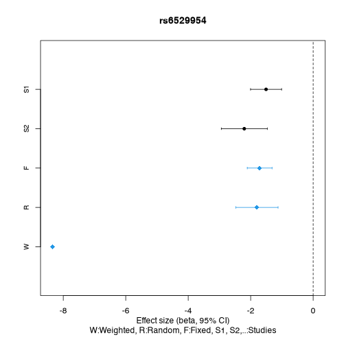
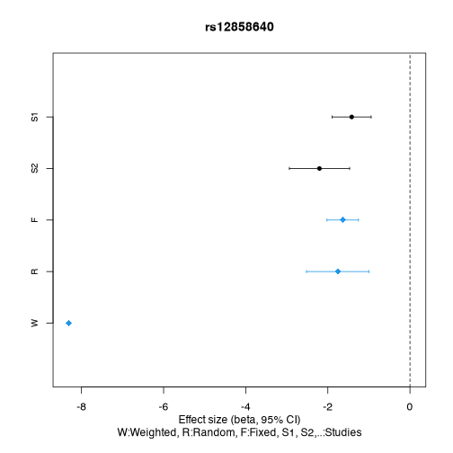
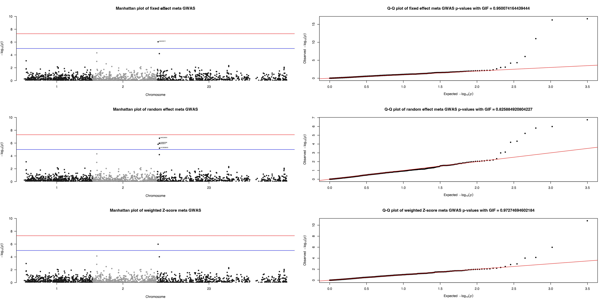
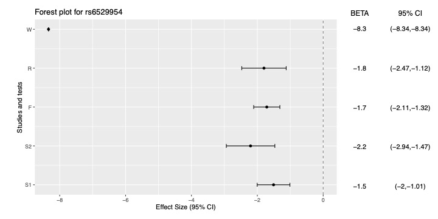
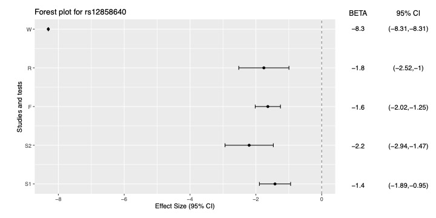
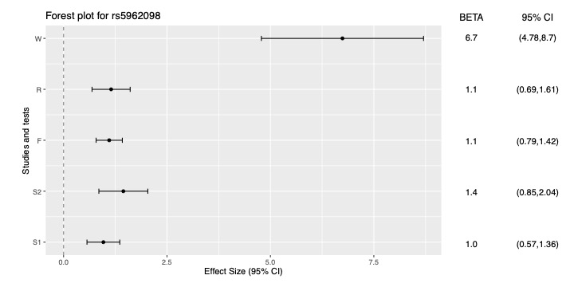

# Meta analysis using GXwasR

Here we will present a tutorial showing how to perform meta analysis utilizing the R package GXwasR.

The example data sets for performing the tutorial can be accessed from "data" folder of the package.

# Example Datasets

Example datasets are provided with the package and can be accessed by calling the `data()` function.

Load the example datasets to perform this tutorial.


``` r
## Load library
library(GXwasR)
```
(1) Two sets of summary GWAS summary statistics in .Rda files will be required to perform this tutorial. 

- **Summary_Stat_Ex1.Rda**
- **Summary_Stat_Ex2.Rda**
  
Check one of the summary statistics data


``` r
data(Summary_Stat_Ex1)
## Visualize three rows and all the columns
Summary_Stat_Ex1[1:3, ]
```


|   | CHR|SNP         |     BP|A1 |TEST | NMISS|    BETA|     SE|     L95|   U95|    STAT|      P|
|:--|---:|:-----------|------:|:--|:----|-----:|-------:|------:|-------:|-----:|-------:|------:|
|1  |   1|rs143773730 |  73841|T  |ADD  |   125| -0.0789| 0.2643| -0.5968| 0.439| -0.2986| 0.7653|
|4  |   1|rs147281566 | 775125|T  |ADD  |   125| -0.3959| 1.2380| -2.8230| 2.031| -0.3197| 0.7492|
|6  |   1|rs35854196  | 863863|A  |ADD  |   125|  1.0500| 0.8858| -0.6864| 2.786|  1.1850| 0.2360|

Among these 12 columns, some columns are mandatory for this tutorial, such as: ‘SNP’ (i.e., SNP identifier), ‘BETA’ (i.e., effect-size or logarithm of odds ratio), ‘SE’ (i.e., standard error of BETA), ‘P’ (i.e., p-values) and 'NMISS' (i.e., effective sample size). The other columns are, 'CHR' (i.e., chromosome code), 'BP' (i.e., base pair position), A1 (i.e., disease allele), TEST (i.e., association test type), L95 (i.e., lower limit of 95 percentile confidence interval), U95 (i.e., upper limit of 95 percentile confidence interval) and STAT (i.e., test statistic).

(2) **UniqueLoci.Rda:** .Rda file with a single column containing SNP names. These could be LD clumped SNPs or any other list of chosen SNPs for Meta analysis.

(3) **SNPsPlot.Rda:** .Rda file with a single column containing SNP names for the forest plots.


``` r
## Call some other libraries for this vignette
library(printr)
library(rmarkdown)
```

# The function for meta analysis:
**MetaGWAS()**

``` r
help(MetaGWAS, package = GXwasR)
#> ℹ Rendering development documentation for "MetaGWAS"
```

# Running MetaGWAS


``` r
data(Summary_Stat_Ex1)
data(Summary_Stat_Ex2)
DataDir <- GXwasR:::GXwasR_data()
ResultDir <- tempdir()
SummData <- list(Summary_Stat_Ex1, Summary_Stat_Ex2)
SNPfile <- "UniqueLoci"
useSNPposition <- FALSE
UseA1 <- TRUE
GCse <- TRUE
byCHR <- FALSE
pval_filter <- "R"
top_snp_pval <- 1e-08
max_top_snps <- 10
chosen_snps_file <- NULL
pval_threshold_manplot <- 1e-05
plotname <- "Meta_Analysis.plot"

x <- MetaGWAS(DataDir = DataDir, SummData = SummData, ResultDir = ResultDir, SNPfile = NULL, useSNPposition = TRUE, UseA1 = UseA1, GCse = GCse, plotname = "Meta_Analysis.plot", pval_filter, top_snp_pval, max_top_snps, chosen_snps_file = NULL, byCHR, pval_threshold_manplot)
#> ℹ Processing file number 1
#> ℹ Processing file number 2
#> ℹ Applying study-specific genomic control.
#> ℹ Applying study-specific genomic control.
#> Processing chromosome
```



```
#> ✔ Forest plot files for Meta_Analysis.plot SNPs have been created.
#> ℹ You can find them in the directory: /var/folders/d6/gtwl3_017sj4pp14fbfcbqjh0000gp/T//Rtmp0uzDD3
#> ✔ Forest plot files for Meta_Analysis.plot SNPs have been created.
#> ℹ You can find them in the directory: /var/folders/d6/gtwl3_017sj4pp14fbfcbqjh0000gp/T//Rtmp0uzDD3
```

# Random effect result


``` r
# Dataframe with the fixed effect result
x1 <- x$Resultrandom
x2 <- x1[order(x1$P), ]
knitr::kable(x2[1:10, ], caption = "Top ten associations from random effect model.")
```


Table: Top ten associations from random effect model.

|     | CHR|       BP|SNP         |A1 |A2 |      Q|     I|         P|      ES|        SE|       CI_L|       CI_U|
|:----|---:|--------:|:-----------|:--|:--|------:|-----:|---------:|-------:|---------:|----------:|----------:|
|1054 |  23|  4184349|rs6529954   |A  |?  | 0.1162| 59.48| 0.0000002| -1.7980| 0.3441459| -2.4725260| -1.1234740|
|1053 |  23|  4137114|rs5962098   |A  |?  | 0.1753| 45.56| 0.0000010|  1.1488| 0.2351018|  0.6880004|  1.6095996|
|1043 |  23|  3376304|rs6420571   |A  |?  | 0.3068|  4.26| 0.0000015| -1.1667| 0.2426946| -1.6423814| -0.6910186|
|1055 |  23|  4214861|rs12858640  |C  |?  | 0.0725| 69.00| 0.0000062| -1.7572| 0.3887229| -2.5190968| -0.9953032|
|559  |   2|  2579014|rs10186455  |G  |?  | 0.4490|  0.00| 0.0000476|  1.2694| 0.3121061|  0.6576721|  1.8811279|
|1052 |  23|  4119808|rs10521557  |A  |?  | 0.8021|  0.00| 0.0000631|  1.4884| 0.3720121|  0.7592563|  2.2175437|
|6    |   1|  1127860|rs148527527 |G  |?  | 0.5778|  0.00| 0.0008237|  1.3978| 0.4179142|  0.5786881|  2.2169119|
|558  |   2|  2535670|rs13430614  |C  |?  | 0.6681|  0.00| 0.0010230|  0.6358| 0.1935981|  0.2563478|  1.0152522|
|1382 |  23| 45563626|rs1207312   |T  |?  | 0.5388|  0.00| 0.0046670|  0.6138| 0.2169547|  0.1885689|  1.0390311|
|1383 |  23| 45565805|rs1780835   |A  |?  | 0.5206|  0.00| 0.0064620|  0.5404| 0.1984308|  0.1514757|  0.9293243|


# Fixed effect result


``` r
# Dataframe with the fixed effect result
x1 <- x$Resultfixed
x2 <- x1[order(x1$P), ]
knitr::kable(x2[1:10, ], caption = "Top ten associations from fixed effect model.")
```


Table: Top ten associations from fixed effect model.

|     | CHR|       BP|SNP         |A1 |A2 |      Q|     I|         P|      ES|        SE|       CI_L|       CI_U|
|:----|---:|--------:|:-----------|:--|:--|------:|-----:|---------:|-------:|---------:|----------:|----------:|
|1054 |  23|  4184349|rs6529954   |A  |?  | 0.1162| 59.48| 0.0000000| -1.7127| 0.2025697| -2.1097365| -1.3156635|
|1055 |  23|  4214861|rs12858640  |C  |?  | 0.0725| 69.00| 0.0000000| -1.6364| 0.1955735| -2.0197240| -1.2530760|
|1053 |  23|  4137114|rs5962098   |A  |?  | 0.1753| 45.56| 0.0000000|  1.1030| 0.1618941|  0.7856876|  1.4203124|
|1043 |  23|  3376304|rs6420571   |A  |?  | 0.3068|  4.26| 0.0000009| -1.1647| 0.2371161| -1.6294476| -0.6999524|
|559  |   2|  2579014|rs10186455  |G  |?  | 0.4490|  0.00| 0.0000476|  1.2694| 0.3121061|  0.6576721|  1.8811279|
|1052 |  23|  4119808|rs10521557  |A  |?  | 0.8021|  0.00| 0.0000631|  1.4884| 0.3720121|  0.7592563|  2.2175437|
|6    |   1|  1127860|rs148527527 |G  |?  | 0.5778|  0.00| 0.0008237|  1.3978| 0.4179142|  0.5786881|  2.2169119|
|558  |   2|  2535670|rs13430614  |C  |?  | 0.6681|  0.00| 0.0010230|  0.6358| 0.1935981|  0.2563478|  1.0152522|
|638  |   2|  8181194|rs7370955   |A  |?  | 0.2403| 27.48| 0.0024130|  0.7752| 0.2555007|  0.2744187|  1.2759813|
|1382 |  23| 45563626|rs1207312   |T  |?  | 0.5388|  0.00| 0.0046670|  0.6138| 0.2169547|  0.1885689|  1.0390311|


# Weighted effect result


``` r
# Dataframe with the fixed effect result
x1 <- x$Resultweighted
x2 <- x1[order(x1$P), ]
knitr::kable(x2[1:10, ], caption = "Top ten associations from weighted effect model.")
```


Table: Top ten associations from weighted effect model.

|     | CHR|       BP|SNP         |A1 |A2 |      Q|     I|         P|     ES|        SE|       CI_L|      CI_U|
|:----|---:|--------:|:-----------|:--|:--|------:|-----:|---------:|------:|---------:|----------:|---------:|
|1054 |  23|  4184349|rs6529954   |A  |?  | 0.1162| 59.48| 0.0000000| -8.340| 0.0000000| -8.3400000| -8.340000|
|1055 |  23|  4214861|rs12858640  |C  |?  | 0.0725| 69.00| 0.0000000| -8.306| 0.0000000| -8.3060000| -8.306000|
|1053 |  23|  4137114|rs5962098   |A  |?  | 0.1753| 45.56| 0.0000000|  6.741| 1.0000820|  4.7808392|  8.701161|
|1043 |  23|  3376304|rs6420571   |A  |?  | 0.3068|  4.26| 0.0000010| -4.883| 1.0000062| -6.8430122| -2.922988|
|559  |   2|  2579014|rs10186455  |G  |?  | 0.4490|  0.00| 0.0000723|  3.969| 1.0000874|  2.0088287|  5.929171|
|1052 |  23|  4119808|rs10521557  |A  |?  | 0.8021|  0.00| 0.0000955|  3.902| 1.0000837|  1.9418359|  5.862164|
|6    |   1|  1127860|rs148527527 |G  |?  | 0.5778|  0.00| 0.0010750|  3.270| 0.9999618|  1.3100749|  5.229925|
|558  |   2|  2535670|rs13430614  |C  |?  | 0.6681|  0.00| 0.0014260|  3.189| 0.9998946|  1.2292065|  5.148794|
|638  |   2|  8181194|rs7370955   |A  |?  | 0.2403| 27.48| 0.0032420|  2.944| 1.0000649|  0.9838728|  4.904127|
|1382 |  23| 45563626|rs1207312   |T  |?  | 0.5388|  0.00| 0.0048350|  2.818| 1.0000617|  0.8578790|  4.778121|


# Metadata of the meta analysis


``` r
# Dataframe with the metadata
x1 <- x$Metadata
x2 <- x1[order(x1$Q), ]
knitr::kable(x2[1:10, ], caption = "Metadata of the top ten associations based on Cochrane’s Q statistics.")
```


Table: Metadata of the top ten associations based on Cochrane’s Q statistics.

|     | CHR|       BP|SNP        |A1 |A2 |  N|      Q|     I|      F0|      F1|
|:----|---:|--------:|:----------|:--|:--|--:|------:|-----:|-------:|-------:|
|812  |   2| 21385538|rs575905   |T  |?  |  2| 0.0010| 90.73| -0.5218|  0.6472|
|1110 |  23|  9277424|rs2214279  |G  |?  |  2| 0.0015| 90.09|  0.5001| -0.5365|
|655  |   2|  9913645|rs1106144  |A  |?  |  2| 0.0020| 89.48|  0.5909| -0.8972|
|663  |   2| 10210922|rs11678624 |T  |?  |  2| 0.0021| 89.45| -0.3659|  0.7374|
|1207 |  23| 23909933|rs2428144  |A  |?  |  2| 0.0031| 88.55|  0.5344| -0.4081|
|1253 |  23| 29189630|rs225456   |C  |?  |  2| 0.0031| 88.56|  0.3208| -1.1170|
|1248 |  23| 28763567|rs12008039 |G  |?  |  2| 0.0032| 88.48| -0.3187|  0.5565|
|810  |   2| 21275825|rs12468735 |A  |?  |  2| 0.0036| 88.19| -0.5095|  0.5175|
|664  |   2| 10343419|rs759347   |C  |?  |  2| 0.0041| 87.88|  0.9790| -0.3894|
|1251 |  23| 29104124|rs16988439 |C  |?  |  2| 0.0042| 87.81|  0.3208| -1.0730|


# Problematic SNPs


``` r
# Dataframe with the problematic SNPs
x1 <- x$ProblemSNP
knitr::kable(x1[1:10, ], caption = "Top ten probematic SNPs.")
```


Table: Top ten probematic SNPs.

|File                                                                          |SNP        |Problem         |
|:-----------------------------------------------------------------------------|:----------|:---------------|
|/private/var/folders/d6/gtwl3_017sj4pp14fbfcbqjh0000gp/T/Rtmp0uzDD3/SNPdata_2 |rs2803333  |ALLELE_MISMATCH |
|/private/var/folders/d6/gtwl3_017sj4pp14fbfcbqjh0000gp/T/Rtmp0uzDD3/SNPdata_2 |rs672606   |ALLELE_MISMATCH |
|/private/var/folders/d6/gtwl3_017sj4pp14fbfcbqjh0000gp/T/Rtmp0uzDD3/SNPdata_2 |rs7519955  |ALLELE_MISMATCH |
|/private/var/folders/d6/gtwl3_017sj4pp14fbfcbqjh0000gp/T/Rtmp0uzDD3/SNPdata_2 |rs1538466  |ALLELE_MISMATCH |
|/private/var/folders/d6/gtwl3_017sj4pp14fbfcbqjh0000gp/T/Rtmp0uzDD3/SNPdata_2 |rs61777960 |ALLELE_MISMATCH |
|/private/var/folders/d6/gtwl3_017sj4pp14fbfcbqjh0000gp/T/Rtmp0uzDD3/SNPdata_2 |rs2865211  |ALLELE_MISMATCH |
|/private/var/folders/d6/gtwl3_017sj4pp14fbfcbqjh0000gp/T/Rtmp0uzDD3/SNPdata_2 |rs10917217 |ALLELE_MISMATCH |
|/private/var/folders/d6/gtwl3_017sj4pp14fbfcbqjh0000gp/T/Rtmp0uzDD3/SNPdata_2 |rs196402   |ALLELE_MISMATCH |
|/private/var/folders/d6/gtwl3_017sj4pp14fbfcbqjh0000gp/T/Rtmp0uzDD3/SNPdata_2 |rs6662038  |ALLELE_MISMATCH |
|/private/var/folders/d6/gtwl3_017sj4pp14fbfcbqjh0000gp/T/Rtmp0uzDD3/SNPdata_2 |rs3845484  |ALLELE_MISMATCH |


# Including Plots

## Manhattan Plots and QQ plots:

<div class="figure">

<p class="caption">plot of chunk unnamed-chunk-11</p>
</div>

## All Forest plots
Now, let's see all the Forest plots.

<div class="figure">

<p class="caption">plot of chunk unnamed-chunk-12</p>
</div>

<div class="figure">

<p class="caption">plot of chunk unnamed-chunk-13</p>
</div>

<div class="figure">

<p class="caption">plot of chunk unnamed-chunk-14</p>
</div>

# Reproducibility

The *[GXwasR](https://bioconductor.org/packages/3.21/GXwasR)* package (Bose, Blostein, Kim et al., 2025) was made possible thanks to:

* R (R Core Team, 2025)
* *[BiocStyle](https://bioconductor.org/packages/3.21/BiocStyle)* (Oleś, 2025)
* *[knitr](https://CRAN.R-project.org/package=knitr)* (Xie, 2025)
* *[RefManageR](https://CRAN.R-project.org/package=RefManageR)* (McLean, 2017)
* *[rmarkdown](https://CRAN.R-project.org/package=rmarkdown)* (Allaire, Xie, Dervieux et al., 2024)
* *[sessioninfo](https://CRAN.R-project.org/package=sessioninfo)* (Wickham, Chang, Flight et al., 2025)
* *[testthat](https://CRAN.R-project.org/package=testthat)* (Wickham, 2011)

This package was developed using *[biocthis](https://bioconductor.org/packages/3.21/biocthis)*.

`R` session information.


```
#> ─ Session info ───────────────────────────────────────────────────────────────────────────────────────────────────────
#>  setting  value
#>  version  R version 4.5.1 (2025-06-13)
#>  os       macOS Sequoia 15.5
#>  system   aarch64, darwin24.4.0
#>  ui       unknown
#>  language (EN)
#>  collate  en_US.UTF-8
#>  ctype    en_US.UTF-8
#>  tz       America/New_York
#>  date     2025-08-04
#>  pandoc   3.6.3 @ /Applications/Positron.app/Contents/Resources/app/quarto/bin/tools/aarch64/ (via rmarkdown)
#>  quarto   1.7.32 @ /usr/local/bin/quarto
#> 
#> ─ Packages ───────────────────────────────────────────────────────────────────────────────────────────────────────────
#>  ! package              * version    date (UTC) lib source
#>    abind                  1.4-8      2024-09-12 [2] CRAN (R 4.5.0)
#>    askpass                1.2.1      2024-10-04 [2] CRAN (R 4.5.0)
#>    backports              1.5.0      2024-05-23 [2] CRAN (R 4.5.1)
#>    bibtex                 0.5.1      2023-01-26 [2] CRAN (R 4.5.0)
#>    bigassertr             0.1.7      2025-06-27 [2] CRAN (R 4.5.1)
#>    bigparallelr           0.3.2      2021-10-02 [2] CRAN (R 4.5.0)
#>    bigsnpr                1.12.18    2024-11-26 [2] CRAN (R 4.5.1)
#>    bigsparser             0.7.3      2024-09-06 [2] CRAN (R 4.5.1)
#>    bigstatsr              1.6.2      2025-07-29 [2] CRAN (R 4.5.1)
#>    Biobase                2.68.0     2025-04-15 [2] Bioconduc~
#>    BiocGenerics           0.54.0     2025-04-15 [2] Bioconduc~
#>    BiocIO                 1.18.0     2025-04-15 [2] Bioconduc~
#>    BiocManager            1.30.26    2025-06-05 [2] CRAN (R 4.5.0)
#>    BiocParallel           1.42.1     2025-06-01 [2] Bioconductor 3.21 (R 4.5.0)
#>    BiocStyle              2.36.0     2025-04-15 [2] Bioconduc~
#>    biocthis               1.18.0     2025-04-15 [2] Bioconduc~
#>    Biostrings             2.76.0     2025-04-15 [2] Bioconduc~
#>    bit                    4.6.0      2025-03-06 [2] CRAN (R 4.5.1)
#>    bit64                  4.6.0-1    2025-01-16 [2] CRAN (R 4.5.1)
#>    bitops                 1.0-9      2024-10-03 [2] CRAN (R 4.5.0)
#>    brio                   1.1.5      2024-04-24 [2] CRAN (R 4.5.1)
#>    broom                  1.0.9      2025-07-28 [2] CRAN (R 4.5.1)
#>    BSgenome               1.76.0     2025-04-15 [2] Bioconduc~
#>    cachem                 1.1.0      2024-05-16 [2] CRAN (R 4.5.0)
#>    calibrate              1.7.7      2020-06-19 [2] CRAN (R 4.5.0)
#>    callr                  3.7.6      2024-03-25 [2] CRAN (R 4.5.0)
#>    car                    3.1-3      2024-09-27 [2] CRAN (R 4.5.0)
#>    carData                3.0-5      2022-01-06 [2] CRAN (R 4.5.0)
#>    cli                    3.6.5      2025-04-23 [2] CRAN (R 4.5.0)
#>    codetools              0.2-20     2024-03-31 [4] CRAN (R 4.5.1)
#>    commonmark             2.0.0      2025-07-07 [2] CRAN (R 4.5.1)
#>    cowplot                1.2.0      2025-07-07 [2] CRAN (R 4.5.1)
#>    crayon                 1.5.3      2024-06-20 [2] CRAN (R 4.5.0)
#>    credentials            2.0.2      2024-10-04 [2] CRAN (R 4.5.0)
#>    curl                   6.4.0      2025-06-22 [2] CRAN (R 4.5.1)
#>    data.table             1.17.8     2025-07-10 [2] CRAN (R 4.5.1)
#>    DelayedArray           0.34.1     2025-04-17 [2] Bioconduc~
#>    desc                   1.4.3      2023-12-10 [2] CRAN (R 4.5.0)
#>    devtools             * 2.4.5      2022-10-11 [3] CRAN (R 4.5.0)
#>    digest                 0.6.37     2024-08-19 [2] CRAN (R 4.5.0)
#>    doParallel             1.0.17     2022-02-07 [2] CRAN (R 4.5.0)
#>    doRNG                  1.8.6.2    2025-04-02 [2] CRAN (R 4.5.0)
#>    dplyr                  1.1.4      2023-11-17 [2] CRAN (R 4.5.0)
#>    ellipsis               0.3.2      2021-04-29 [3] CRAN (R 4.5.0)
#>    evaluate               1.0.4      2025-06-18 [2] CRAN (R 4.5.1)
#>    farver                 2.1.2      2024-05-13 [2] CRAN (R 4.5.0)
#>    fastmap                1.2.0      2024-05-15 [2] CRAN (R 4.5.0)
#>    flock                  0.7        2016-11-12 [2] CRAN (R 4.5.1)
#>    foreach                1.5.2      2022-02-02 [2] CRAN (R 4.5.0)
#>    Formula                1.2-5      2023-02-24 [2] CRAN (R 4.5.0)
#>    fs                     1.6.6      2025-04-12 [2] CRAN (R 4.5.0)
#>    gdsfmt                 1.44.1     2025-07-09 [2] Bioconduc~
#>    generics               0.1.4      2025-05-09 [2] CRAN (R 4.5.0)
#>    GenomeInfoDb           1.44.1     2025-07-23 [2] Bioconduc~
#>    GenomeInfoDbData       1.2.14     2025-04-21 [2] Bioconductor
#>    GenomicAlignments      1.44.0     2025-04-15 [2] Bioconduc~
#>    GenomicRanges          1.60.0     2025-04-15 [2] Bioconduc~
#>    gert                   2.1.5      2025-03-25 [2] CRAN (R 4.5.1)
#>    ggplot2                3.5.2      2025-04-09 [2] CRAN (R 4.5.0)
#>    ggpubr                 0.6.1      2025-06-27 [2] CRAN (R 4.5.1)
#>    ggrepel                0.9.6      2024-09-07 [2] CRAN (R 4.5.1)
#>    ggsignif               0.6.4      2022-10-13 [2] CRAN (R 4.5.0)
#>    gh                     1.5.0      2025-05-26 [2] CRAN (R 4.5.0)
#>    gitcreds               0.1.2      2022-09-08 [2] CRAN (R 4.5.0)
#>    glue                   1.8.0      2024-09-30 [2] CRAN (R 4.5.0)
#>    gridExtra              2.3        2017-09-09 [2] CRAN (R 4.5.0)
#>    gtable                 0.3.6      2024-10-25 [2] CRAN (R 4.5.0)
#>  P GXwasR               * 0.99.0     2025-08-05 [?] Bioconductor
#>    hms                    1.1.3      2023-03-21 [2] CRAN (R 4.5.0)
#>    htmltools              0.5.8.1    2024-04-04 [2] CRAN (R 4.5.0)
#>    htmlwidgets            1.6.4      2023-12-06 [2] CRAN (R 4.5.0)
#>    httpuv                 1.6.16     2025-04-16 [2] CRAN (R 4.5.1)
#>    httr                   1.4.7      2023-08-15 [2] CRAN (R 4.5.0)
#>    httr2                  1.2.1      2025-07-22 [2] CRAN (R 4.5.1)
#>    hunspell               3.0.6      2025-03-22 [2] CRAN (R 4.5.1)
#>    IRanges                2.42.0     2025-04-15 [2] Bioconduc~
#>    iterators              1.0.14     2022-02-05 [2] CRAN (R 4.5.0)
#>    jsonlite               2.0.0      2025-03-27 [2] CRAN (R 4.5.0)
#>    knitr                  1.50       2025-03-16 [2] CRAN (R 4.5.0)
#>    labeling               0.4.3      2023-08-29 [2] CRAN (R 4.5.0)
#>    later                  1.4.2      2025-04-08 [2] CRAN (R 4.5.1)
#>    lattice                0.22-7     2025-04-02 [4] CRAN (R 4.5.1)
#>    lifecycle              1.0.4      2023-11-07 [2] CRAN (R 4.5.0)
#>    lubridate              1.9.4      2024-12-08 [2] CRAN (R 4.5.1)
#>    magrittr               2.0.3      2022-03-30 [2] CRAN (R 4.5.0)
#>    MASS                   7.3-65     2025-02-28 [4] CRAN (R 4.5.1)
#>    mathjaxr               1.8-0      2025-04-30 [2] CRAN (R 4.5.1)
#>    Matrix                 1.7-3      2025-03-11 [4] CRAN (R 4.5.1)
#>    MatrixGenerics         1.20.0     2025-04-15 [2] Bioconduc~
#>    matrixStats            1.5.0      2025-01-07 [2] CRAN (R 4.5.0)
#>    memoise                2.0.1      2021-11-26 [2] CRAN (R 4.5.0)
#>    mime                   0.13       2025-03-17 [2] CRAN (R 4.5.0)
#>    miniUI                 0.1.2      2025-04-17 [3] CRAN (R 4.5.0)
#>    openssl                2.3.3      2025-05-26 [2] CRAN (R 4.5.0)
#>    pillar                 1.11.0     2025-07-04 [2] CRAN (R 4.5.1)
#>    pkgbuild               1.4.8      2025-05-26 [2] CRAN (R 4.5.0)
#>    pkgconfig              2.0.3      2019-09-22 [2] CRAN (R 4.5.0)
#>    pkgdev                 0.1.0.9060 2025-08-04 [2] Github (dieghernan/pkgdev@e56f2a8)
#>    pkgload                1.4.0      2024-06-28 [2] CRAN (R 4.5.0)
#>    plyr                   1.8.9      2023-10-02 [2] CRAN (R 4.5.1)
#>    plyranges              1.28.0     2025-04-15 [2] Bioconduc~
#>    poolr                  1.2-0      2025-05-07 [2] CRAN (R 4.5.0)
#>    prettyunits            1.2.0      2023-09-24 [2] CRAN (R 4.5.0)
#>    printr               * 0.3        2023-03-08 [2] CRAN (R 4.5.0)
#>    processx               3.8.6      2025-02-21 [2] CRAN (R 4.5.1)
#>    profvis                0.4.0      2024-09-20 [3] CRAN (R 4.5.0)
#>    progress               1.2.3      2023-12-06 [2] CRAN (R 4.5.0)
#>    promises               1.3.3      2025-05-29 [2] CRAN (R 4.5.0)
#>    ps                     1.9.1      2025-04-12 [2] CRAN (R 4.5.1)
#>    purrr                  1.1.0      2025-07-10 [2] CRAN (R 4.5.1)
#>    qqman                  0.1.9      2023-08-23 [2] CRAN (R 4.5.0)
#>    R.cache                0.17.0     2025-05-02 [2] CRAN (R 4.5.0)
#>    R.methodsS3            1.8.2      2022-06-13 [2] CRAN (R 4.5.0)
#>    R.oo                   1.27.1     2025-05-02 [2] CRAN (R 4.5.0)
#>    R.utils                2.13.0     2025-02-24 [2] CRAN (R 4.5.0)
#>    R6                     2.6.1      2025-02-15 [2] CRAN (R 4.5.0)
#>    ragg                   1.4.0      2025-04-10 [3] CRAN (R 4.5.0)
#>    rappdirs               0.3.3      2021-01-31 [2] CRAN (R 4.5.0)
#>    rbibutils              2.3        2024-10-04 [2] CRAN (R 4.5.1)
#>    rcmdcheck              1.4.0      2021-09-27 [3] CRAN (R 4.5.0)
#>    RColorBrewer           1.1-3      2022-04-03 [2] CRAN (R 4.5.0)
#>    Rcpp                   1.1.0      2025-07-02 [2] CRAN (R 4.5.1)
#>    RCurl                  1.98-1.17  2025-03-22 [2] CRAN (R 4.5.0)
#>    Rdpack                 2.6.4      2025-04-09 [2] CRAN (R 4.5.0)
#>    RefManageR           * 1.4.0      2022-09-30 [2] CRAN (R 4.5.1)
#>    regioneR               1.40.1     2025-06-01 [2] Bioconductor 3.21 (R 4.5.0)
#>    remotes                2.5.0      2024-03-17 [2] CRAN (R 4.5.0)
#>    restfulr               0.0.16     2025-06-27 [2] CRAN (R 4.5.1)
#>    rjson                  0.2.23     2024-09-16 [2] CRAN (R 4.5.0)
#>    rlang                  1.1.6      2025-04-11 [2] CRAN (R 4.5.0)
#>    rmarkdown            * 2.29       2024-11-04 [2] CRAN (R 4.5.0)
#>    rmio                   0.4.0      2022-02-17 [2] CRAN (R 4.5.0)
#>    rngtools               1.5.2      2021-09-20 [2] CRAN (R 4.5.0)
#>    roxygen2               7.3.2      2024-06-28 [2] CRAN (R 4.5.0)
#>    rprojroot              2.1.0      2025-07-12 [2] CRAN (R 4.5.1)
#>    Rsamtools              2.24.0     2025-04-15 [2] Bioconduc~
#>    rstatix                0.7.2      2023-02-01 [2] CRAN (R 4.5.0)
#>    rstudioapi             0.17.1     2024-10-22 [2] CRAN (R 4.5.0)
#>    rtracklayer            1.68.0     2025-04-15 [2] Bioconduc~
#>    S4Arrays               1.8.1      2025-06-01 [2] Bioconductor 3.21 (R 4.5.0)
#>    S4Vectors              0.46.0     2025-04-15 [2] Bioconduc~
#>    scales                 1.4.0      2025-04-24 [2] CRAN (R 4.5.0)
#>    sessioninfo          * 1.2.3      2025-02-05 [2] CRAN (R 4.5.1)
#>    shiny                  1.11.1     2025-07-03 [2] CRAN (R 4.5.1)
#>    SNPRelate              1.42.0     2025-04-15 [2] Bioconduc~
#>    SparseArray            1.8.1      2025-07-23 [2] Bioconduc~
#>    spelling               2.3.1      2024-10-04 [2] CRAN (R 4.5.0)
#>    stringi                1.8.7      2025-03-27 [2] CRAN (R 4.5.0)
#>    stringr                1.5.1      2023-11-14 [2] CRAN (R 4.5.0)
#>    styler                 1.10.3     2024-04-07 [2] CRAN (R 4.5.0)
#>    sumFREGAT              1.2.5      2022-06-07 [2] CRAN (R 4.5.1)
#>    SummarizedExperiment   1.38.1     2025-04-30 [2] Bioconductor 3.21 (R 4.5.0)
#>    sys                    3.4.3      2024-10-04 [2] CRAN (R 4.5.0)
#>    systemfonts            1.2.3      2025-04-30 [2] CRAN (R 4.5.0)
#>    testthat             * 3.2.3      2025-01-13 [2] CRAN (R 4.5.1)
#>    textshaping            1.0.1      2025-05-01 [3] CRAN (R 4.5.0)
#>    tibble                 3.3.0      2025-06-08 [2] CRAN (R 4.5.0)
#>    tidyr                  1.3.1      2024-01-24 [2] CRAN (R 4.5.1)
#>    tidyselect             1.2.1      2024-03-11 [2] CRAN (R 4.5.0)
#>    timechange             0.3.0      2024-01-18 [2] CRAN (R 4.5.1)
#>    tzdb                   0.5.0      2025-03-15 [2] CRAN (R 4.5.1)
#>    UCSC.utils             1.4.0      2025-04-15 [2] Bioconduc~
#>    urlchecker             1.0.1      2021-11-30 [3] CRAN (R 4.5.0)
#>    usethis              * 3.1.0      2024-11-26 [2] CRAN (R 4.5.0)
#>    vctrs                  0.6.5      2023-12-01 [2] CRAN (R 4.5.0)
#>    vroom                  1.6.5      2023-12-05 [2] CRAN (R 4.5.1)
#>    whisker                0.4.1      2022-12-05 [2] CRAN (R 4.5.0)
#>    withr                  3.0.2      2024-10-28 [2] CRAN (R 4.5.0)
#>    xfun                   0.52       2025-04-02 [2] CRAN (R 4.5.0)
#>    XML                    3.99-0.18  2025-01-01 [2] CRAN (R 4.5.0)
#>    xml2                   1.3.8      2025-03-14 [2] CRAN (R 4.5.1)
#>    xopen                  1.0.1      2024-04-25 [3] CRAN (R 4.5.0)
#>    xtable                 1.8-4      2019-04-21 [2] CRAN (R 4.5.0)
#>    XVector                0.48.0     2025-04-15 [2] Bioconduc~
#>    yaml                   2.3.10     2024-07-26 [2] CRAN (R 4.5.0)
#> 
#>  [1] /private/var/folders/d6/gtwl3_017sj4pp14fbfcbqjh0000gp/T/Rtmp0uzDD3/temp_libpathfc413d99b05c
#>  [2] /Users/mayerdav/Library/R/arm64/4.5/library
#>  [3] /opt/homebrew/lib/R/4.5/site-library
#>  [4] /opt/homebrew/Cellar/r/4.5.1/lib/R/library
#> 
#>  * ── Packages attached to the search path.
#>  P ── Loaded and on-disk path mismatch.
#> 
#> ──────────────────────────────────────────────────────────────────────────────────────────────────────────────────────
```

# Bibliography

This vignette was generated using *[BiocStyle](https://bioconductor.org/packages/3.21/BiocStyle)* (Oleś, 2025)
with *[knitr](https://CRAN.R-project.org/package=knitr)* (Xie, 2025) and *[rmarkdown](https://CRAN.R-project.org/package=rmarkdown)* (Allaire, Xie, Dervieux et al., 2024) running behind the scenes.

Citations made with *[RefManageR](https://CRAN.R-project.org/package=RefManageR)* (McLean, 2017).

<p><a id='bib-allaire2024rmarkdown'></a><a href="#cite-allaire2024rmarkdown">[1]</a><cite>
J. Allaire, Y. Xie, C. Dervieux, et al.
<em>rmarkdown: Dynamic Documents for R</em>.
R package version 2.29.
2024.
URL: <a href="https://github.com/rstudio/rmarkdown">https://github.com/rstudio/rmarkdown</a>.</cite></p>

<p><a id='bib-bose2025gxwasr'></a><a href="#cite-bose2025gxwasr">[2]</a><cite>
B. Bose, F. Blostein, J. Kim, et al.
&ldquo;GXwasR: A Toolkit for Investigating Sex-Differentiated Genetic Effects on Complex Traits&rdquo;.
In: <em>medRxiv 2025.06.10.25329327</em> (2025).
DOI: <a href="https://doi.org/10.1101/2025.06.10.25329327">10.1101/2025.06.10.25329327</a>.</cite></p>

<p><a id='bib-mclean2017refmanager'></a><a href="#cite-mclean2017refmanager">[3]</a><cite>
M. W. McLean.
&ldquo;RefManageR: Import and Manage BibTeX and BibLaTeX References in R&rdquo;.
In: <em>The Journal of Open Source Software</em> (2017).
DOI: <a href="https://doi.org/10.21105/joss.00338">10.21105/joss.00338</a>.</cite></p>

<p><a id='bib-ole2025biocstyle'></a><a href="#cite-ole2025biocstyle">[4]</a><cite>
A. Oleś.
<em>BiocStyle: Standard styles for vignettes and other Bioconductor documents</em>.
R package version 2.36.0.
2025.
DOI: <a href="https://doi.org/10.18129/B9.bioc.BiocStyle">10.18129/B9.bioc.BiocStyle</a>.
URL: <a href="https://bioconductor.org/packages/BiocStyle">https://bioconductor.org/packages/BiocStyle</a>.</cite></p>

<p><a id='bib-2025language'></a><a href="#cite-2025language">[5]</a><cite>
R Core Team.
<em>R: A Language and Environment for Statistical Computing</em>.
R Foundation for Statistical Computing.
Vienna, Austria, 2025.
URL: <a href="https://www.R-project.org/">https://www.R-project.org/</a>.</cite></p>

<p><a id='bib-wickham2011testthat'></a><a href="#cite-wickham2011testthat">[6]</a><cite>
H. Wickham.
&ldquo;testthat: Get Started with Testing&rdquo;.
In: <em>The R Journal</em> 3 (2011), pp. 5&ndash;10.
URL: <a href="https://journal.r-project.org/archive/2011-1/RJournal_2011-1_Wickham.pdf">https://journal.r-project.org/archive/2011-1/RJournal_2011-1_Wickham.pdf</a>.</cite></p>

<p><a id='bib-wickham2025sessioninfo'></a><a href="#cite-wickham2025sessioninfo">[7]</a><cite>
H. Wickham, W. Chang, R. Flight, et al.
<em>sessioninfo: R Session Information</em>.
R package version 1.2.3.
2025.
DOI: <a href="https://doi.org/10.32614/CRAN.package.sessioninfo">10.32614/CRAN.package.sessioninfo</a>.
URL: <a href="https://CRAN.R-project.org/package=sessioninfo">https://CRAN.R-project.org/package=sessioninfo</a>.</cite></p>

<p><a id='bib-xie2025knitr'></a><a href="#cite-xie2025knitr">[8]</a><cite>
Y. Xie.
<em>knitr: A General-Purpose Package for Dynamic Report Generation in R</em>.
R package version 1.50.
2025.
URL: <a href="https://yihui.org/knitr/">https://yihui.org/knitr/</a>.</cite></p>
